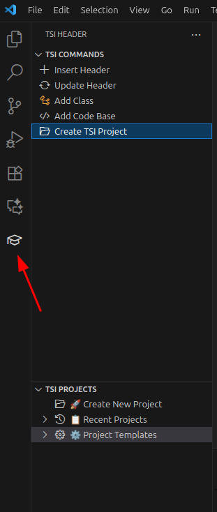
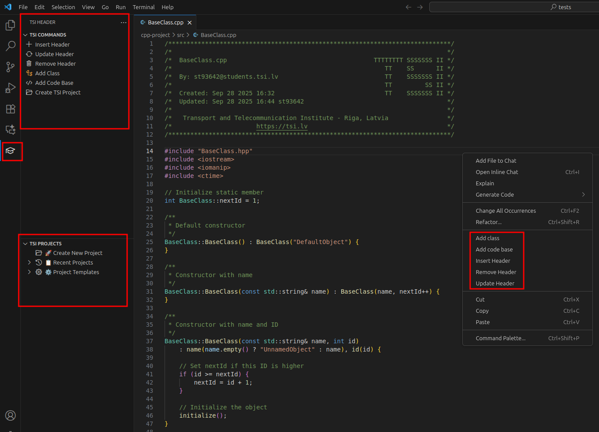
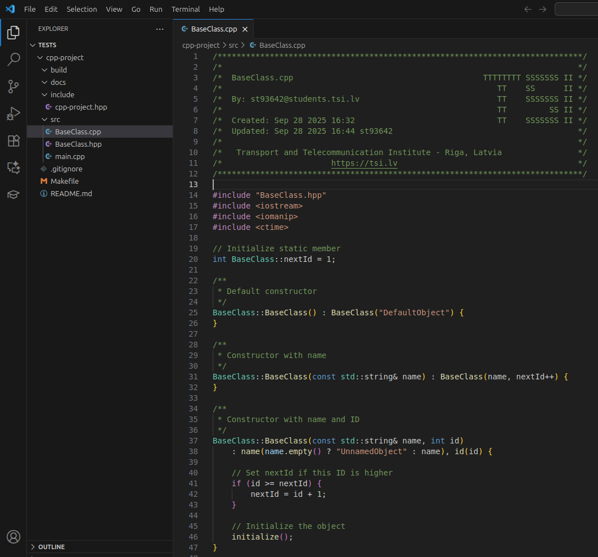

# TSI Header Extension

## Description

Visual Studio Code extension for code header management and project scaffolding, supporting 147+ programming languages with 100% VS Code language coverage and institutional branding.

## Functionality

### Core Features

#### Header Management

- **Insert Headers**: Generate standardized TSI-branded headers for 147+ programming languages
- **Update Headers**: Automatically update existing headers with current timestamps and author information
- **Remove Headers**: Clean removal of TSI headers from files
- **Language-Specific Formatting**: Proper comment delimiters and formatting for each supported language
- **Institutional Branding**: TSI contact information

#### Code Generation

- **Class Generation**: Create class templates for 13 object-oriented languages (Java, C++, C#, Python, JavaScript, Kotlin, PHP, TypeScript, Ruby, Go, Swift, Dart, Scala)
- **Code Base Generation**: Generate boilerplate code with language-specific syntax and conventions for 147+ languages
- **Project Scaffolding**: Complete project creation for 7 major languages (C, C++, Java, Python, Ruby, Rust, PHP)

#### User Interface

- **Activity Bar Integration**: Dedicated TSI Header panel with mortar board icon (🎓)
- **TSI Commands View**: Header insertion, updates, and code generation tools
- **TSI Projects View**: Direct project creation for 7 languages (C, C++, Java, Python, Ruby, Rust, PHP) with streamlined workflow
- **Context-Aware Menus**: Commands available based on file type and language

### Technical Architecture

#### Multi-Language Backend

- **Ruby CLI Engine**: Core header generation supporting 147+ languages with proper delimiters
- **JavaScript VS Code Integration**: Modern extension interface with command registration
- **Modular Generator System**: Language-specific code generation with extensible architecture

#### Supported Languages

**Header Generation (147+ languages)**:

- **Mainstream**: C, C++, Java, Python, JavaScript, TypeScript, Ruby, Go, Rust, PHP, Swift, Kotlin, Dart, Scala
- **Specialized**: Assembly, COBOL, Fortran, Haskell, Lisp, Prolog, R, MATLAB, Verilog, VHDL, and many more
- **Scripting**: Bash, PowerShell, Perl, Lua, Tcl, Awk, Sed
- **Web**: HTML, CSS, SCSS, Vue, React, Angular
- **Data**: JSON, YAML, XML, SQL, Markdown
- **Legacy**: BASIC, Pascal, Delphi, Ada, COBOL

**Class Generation (13 languages)**:
Java, C++, C#, Python, JavaScript, Kotlin, PHP, TypeScript, Ruby, Go, Swift, Dart, Scala

**Project Creation (7 languages)**:
C, C++, Java, Python, Ruby, Rust, PHP (with build systems, documentation, and starter code)

### Quality Assurance

- **100% VS Code Language Coverage**: Complete support for all 68 VS Code languages
- **100% Test Coverage**: Comprehensive automated testing across all supported languages (319 tests)
- **Syntax Validation**: Generated code verified for correctness and language compliance
- **Cross-Platform Support**: Linux, macOS, Windows compatibility

## Set Up

### Prerequisites

- **Visual Studio Code**: Version 1.74.0 or higher
- **Ruby**: Version 2.7+ (required for header generation)
- **Node.js**: Version 14+ (for running tests)
- **Git**: Optional, for automatic user configuration

### Installation

#### Option 1: VS Code Marketplace (Recommended)

1. Open VS Code
2. Press `Ctrl+Shift+X` to open Extensions
3. Search for "TSI Header"
4. Find "TSI Header - st93642" and click Install

#### Option 2: Local Installation

1. Download the `.vsix` file from the [releases page](https://github.com/st93642/TSI_Header/releases)
2. Open VS Code
3. Press `Ctrl+Shift+P` to open Command Palette
4. Type "Extensions: Install from VSIX" and select the downloaded file

### Configuration

#### Automatic Setup (Recommended)

The extension automatically detects user information in this order:

1. VS Code settings (`tsiheader.username`, `tsiheader.email`)
2. Git configuration (`git config user.name`, `git config user.email`)
3. Environment variables

#### Manual Configuration

1. Open VS Code Settings (`Ctrl+,`)
2. Search for "TSI Header"
3. Configure the following settings:
   - `tsiheader.username`: Your full name
   - `tsiheader.email`: Your email address
   - `tsiheader.autoUpdate`: Enable automatic header updates on file save (default: false)

#### Git Configuration (Alternative)

```bash
git config --global user.name "Your Full Name"
git config --global user.email "your.email@domain.com"
```

### Usage

#### Accessing the Extension

The TSI Header extension provides multiple ways to access its functionality:

**Activity Bar Panel**:

1. Look for the mortar board icon (🎓) in the Activity Bar (left sidebar)
2. Click to open the TSI Header panel
3. Use "TSI Commands" for header management and code generation
4. Use "TSI Projects" for project creation

**Context Menus**:

- Right-click on files for header operations and code generation
- Right-click on folders for project creation



TSI Header extension menu with available commands



TSI Projects panel showing language-specific project creation options

#### Context Menu Access

All TSI Header commands are also available through right-click context menus:

**File Context Menu** (right-click on any file in the Explorer):

- Insert Header
- Update Header
- Remove Header
- Add Class (for supported languages)
- Add Code Base

**Folder Context Menu** (right-click on any folder in the Explorer):

- Create C Project
- Create C++ Project
- Create Java Project
- Create Python Project
- Create Ruby Project
- Create Rust Project
- Create PHP Project

#### Using Header Management

**Insert Header**:

- Open any source file
- Click "Insert Header" in TSI Commands view

**Update Header**:

- Open a file with an existing TSI header
- Click "Update Header" in TSI Commands view

**Remove Header**:

- Open a file with an existing TSI header
- Click "Remove Header" in TSI Commands view

#### Using Code Generation

**Add Class** (13 languages supported):

- Open a source file in a supported language
- Click "Add class" in TSI Commands view
- Enter the class name when prompted

**Add Code Base** (147+ languages supported):

- Open a source file in a supported language
- Click "Add code base" in TSI Commands view
- Generates language-specific boilerplate code

#### Using Project Creation

**Create TSI Project** (7 languages supported):

- Click any language template in TSI Projects view
- Enter project name directly (no language selection needed)
- Generates complete project structure with:
  - Build files (Makefile, Maven/Gradle, etc.)
  - Documentation (README.md)
  - Starter code and proper directory structure



C++ project creation interface with build system selection

### Troubleshooting

#### Common Issues

**"Ruby not found" Error**:

- Ensure Ruby 2.7+ is installed and in your PATH
- On Windows: Install from [rubyinstaller.org](https://rubyinstaller.org/)
- On macOS: `brew install ruby`
- On Linux: `sudo apt install ruby` or `sudo dnf install ruby`

**Headers not generating**:

- Check that the file has a supported extension
- Verify user configuration (name/email) is set
- Try manual configuration in VS Code settings

**Extension not appearing**:

- Restart VS Code after installation
- Check that the mortar board icon is visible in the Activity Bar
- Try reloading the window (`Ctrl+Shift+P` → "Developer: Reload Window")

#### Debug Information

To get debug information:

1. Open Command Palette (`Ctrl+Shift+P`)
2. Type "Developer: Toggle Developer Tools"
3. Check the Console tab for extension-related messages

*Developed for students with institutional branding and comprehensive language support. Now featuring 100% VS Code language coverage with 147+ programming languages.*
