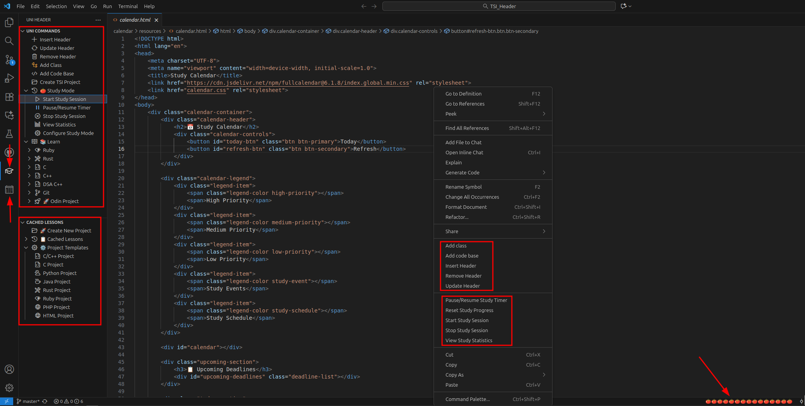

# Uni Header Extension



## Features

- Insert university branded headers and boilerplates across **147+ languages**.
- Scaffold production-ready projects for **C / C++ / Java / Python / Ruby / Rust / PHP / HTML**.
- Teach and practice with in-editor **Learn Mode** lessons and exercises for **C, C++, Ruby, and comprehensive Rust curriculum**.
- Stay focused via the **Study Mode** Pomodoro timer with persistent analytics.
- **🆕 Study Calendar** with deadline tracking, custom events, daily schedules, and **SMTP email notifications**.

## Requirements

- **Visual Studio Code**: Version 1.74.0 or later.
- **Node.js**: Version 16 or later (for development and testing).
- **Ruby**: Version 2.7 or later (for CLI operations and compilation).
- **Git**: For user identity resolution and project scaffolding.
- **Supported Languages**: C, C++, Java, Python, Ruby, Rust, PHP, HTML, and 140+ others for header insertion.
- **Learn Mode**: Interactive curriculum for C, C++, Ruby, and **comprehensive Rust programming** (21 core chapters + 12 advanced web development chapters).
- **Email Notifications**: SMTP for calendar reminders.

## Configuration quick hints

- User identity resolves in this order: VS Code settings → Git config → `TSI_USERNAME` / `TSI_EMAIL` env vars.
- Calendar notifications: Configure SMTP settings for email reminders.

## Getting started in VS Code

1. Clone or open the repo, run `npm install` (installs only dev typings).
2. `npm run compile` to mirror the active `core/src/extension.js` into `out/`.
3. Launch the extension (F5) or package with `npx vsce package`.
4. Configure `tsiheader.username` / `tsiheader.email` or rely on Git settings.
5. Use Activity Bar panels:

- **Uni Commands** for headers, classes, code bases.
- **Uni Projects** for language scaffolds.
- **📚 Learn** (Ruby, C, C++, **Rust**) and **Study Mode** commands for curriculum + Pomodoro.
- **📅 Study Calendar** for scheduling deadlines, events, and automated email notifications.

## Calendar Features

### Event Management

- **Deadlines**: Track assignment due dates with priority levels
- **Custom Events**: Schedule study sessions, meetings, or personal events
- **Daily Schedules**: Set recurring time blocks for consistent study routines
- **Import/Export**: Support for iCalendar (.ics) files and URL imports

### Email Notifications

Configure notifications in VS Code settings (`tsiheader.notifications.*`):

- **SMTP**: Direct email server support with STARTTLS encryption

Example SMTP configuration:

```json
{
  "tsiheader.notifications.enableEmail": true,
  "tsiheader.notifications.emailService": "smtp",
  "tsiheader.notifications.smtpHost": "smtp.gmail.com",
  "tsiheader.notifications.smtpPort": 587,
  "tsiheader.notifications.smtpUser": "your-email@gmail.com",
  "tsiheader.notifications.smtpPassword": "your-app-password",
  "tsiheader.notifications.emailAddress": "recipient@example.com",
  "tsiheader.notifications.advanceNotice": 24
}
```

## Troubleshooting

### Common Issues

- **Extension not activating**: Ensure VS Code is version 1.74.0+. Reload the window (Ctrl+Shift+P > "Developer: Reload Window").
- **Headers not inserting**: Check user settings (`tsiheader.username`, `tsiheader.email`) or Git config. Run `git config --global user.name` to verify.
- **SMTP connection errors**: Verify server settings and credentials. Use port 587 for STARTTLS or 465 for direct TLS. Check firewall settings.
- **Email notifications not working**: Test with "Uni Header: Test Email Notification" command. Check VS Code output panel for detailed SMTP logs.
- **C/C++ compilation errors on Windows**: Learn Mode automatically probes `g++`, `gcc`, and `clang++` in your PATH plus common MinGW/MSYS2/LLVM install folders. If you still see a "g++ not found" error, follow these steps:
  1. **Install MSYS2 (recommended)**
     - Download the installer from [msys2.org](https://www.msys2.org/) and complete the setup.
     - Open the *MSYS2 MinGW 64-bit* terminal and run:

       ```bash
       pacman -Syu
       pacman -S mingw-w64-x86_64-toolchain
       ```

     - Add `C:\msys64\mingw64\bin` to your Windows `Path` environment variable if it is not added automatically.
  2. **Alternative: Stand-alone MinGW-w64**
     - Download a build from [winlibs.com](https://winlibs.com/) or the official MinGW-w64 project.
     - Extract it to a folder such as `C:\MinGW` and add `C:\MinGW\bin` to `Path`.
  3. **Optional: LLVM/Clang**
     - Install LLVM from [llvm.org](https://releases.llvm.org/download.html) and add `C:\Program Files\LLVM\bin` to `Path` so the runner can find `clang++`.
  4. **Restart VS Code** to ensure the updated environment variables are picked up.
  5. **Verify the compiler** by running:

     ```bash
     g++ --version
     ```

     If you prefer Clang, run `clang++ --version` instead.
  6. **Re-run the Learn exercise**; the runner should automatically pick up the installed compiler. The error message lists every location it checks—use it to confirm your PATH settings if the issue persists.
- **Compilation errors**: For C/C++ projects, ensure a compatible compiler (GCC/Clang) is installed and in PATH. Test with `g++ --version`.
- **Learn Mode exercises failing**: Verify Node.js and Ruby are installed. Run `ruby TEST_Suite/test_learn_module.rb` to check curriculum integrity.
- **Study Mode not persisting**: Data is stored in VS Code's global state; try resetting with "Uni Header: Reset Study Progress".
- **Calendar events not showing**: Check that the calendar view is enabled and refresh the view. Events are stored locally in VS Code's workspace state.

### Getting Help

- Check the [GitHub Issues](https://github.com/st93642/TSI_Header/issues) for known problems.
- Run `ruby TEST_Suite/full_test_suite.rb` for comprehensive diagnostics.
- For Learn Mode, ensure `learn_exercises/` is empty (files are generated dynamically).
- For calendar issues, check the VS Code output panel for detailed error messages.

## Contributing

Contributions welcome!

## License

MIT License - see [LICENSE](LICENSE) for details.
