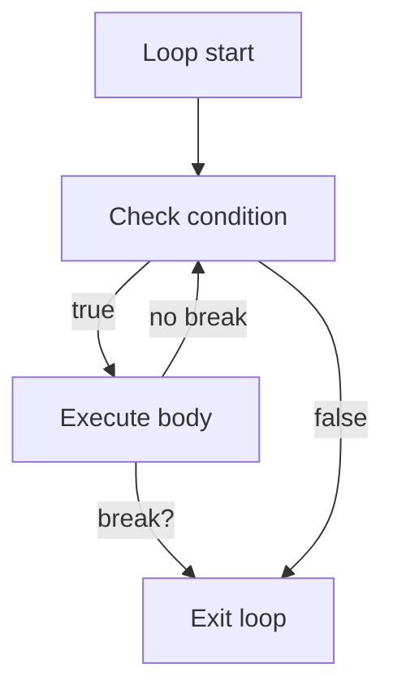

# Lesson 2.4: Break and Continue

Loops become more expressive once you can selectively skip work or exit early. `break` and `continue` let you respond to special cases without restructuring the entire loop. Used carefully, they keep iteration code clear and intentional.

## What You'll Learn

- When to exit a loop immediately with `break`
- How `continue` skips the remainder of the current iteration
- Typical patterns for filtering data and sentinel-driven loops
- Guardrails that prevent confusing control flow
- C vs. modern C++ nuances when working with loop control statements

## 1. `break`: Exit Now

```cpp
for (int attempt = 1; attempt <= 3; ++attempt) {
    if (login()) {
        std::cout << "Welcome back!" << std::endl;
        break; // stop looping once we succeed
    }
}
```

- `break` exits the nearest syntactic loop (or `switch`).
- Everything after the `break` inside the loop body is skipped.
- Common uses: stop on success, bail out on error, terminate sentinel loops when a special value arrives.

### Visual Queue



Seeing the control flow drawn out makes it easier to justify a `break` when reviewing your code offline.

## 2. `continue`: Skip This Round

```cpp
for (int value : readings) {
    if (value < 0) {
        continue; // ignore sensor noise
    }
    process(value);
}
```

- `continue` jumps to the next iteration.
- In `for` loops, the increment expression runs before the next condition check.
- Use it for “skip and carry on” logic—e.g., ignore invalid inputs while keeping the loop running.

### C-Style Example

```c
for (int i = 0; i < 10; ++i) {
    if (i % 2 != 0) {
        continue; // skip odd values
    }
    printf("Even: %d\n", i);
}
```

The structure mirrors the C++ example; the main difference is printing with `printf`.

## 3. Combining `break` and `continue`

```cpp
int total = 0;

while (true) {
    int value = 0;
    std::cin >> value;

    if (value == -1) {
        break;               // sentinel stops the loop
    }
    if (value == 0) {
        continue;            // ignore zeros
    }

    total += value;
    std::cout << "Running total: " << total << std::endl;
}
```

This sentinel-and-skip pattern is common in real systems: read until a sentinel (`-1`) breaks the loop, while `continue` filters out data you do not want to process.

### Algorithmic Alternatives

- `std::find_if` returns an iterator to the first matching element—no manual `break` needed.
- `std::copy_if` filters values without `continue`.
- `std::ranges::find` / `std::ranges::copy_if` (C++20) provide similar semantics with range support.

Use loops when you need fine-grained control, but remember these algorithms when you want declarative intent.

## 4. Guardrails

- **Make the exit obvious**: comment why you break or continue; future readers appreciate the breadcrumb.
- **Prefer single exit per loop** when possible; multiple breaks can make logic harder to trace. Group them to avoid surprises.
- **Avoid deep nesting**: if you need to break out of multiple levels, consider helper functions or state flags.
- **Coordinate with resource management**: RAII objects (e.g., `std::ofstream`) release resources automatically even when you break early.

### Simulating Multi-Level Breaks

If you must exit multiple nested loops, extract the inner loop into a helper function that returns a status, or use a flag:

```cpp
bool found = false;
for (int row = 0; row < rows && !found; ++row) {
    for (int col = 0; col < cols; ++col) {
        if (grid[row][col] == target) {
            found = true;
            break;
        }
    }
}
```

This pattern avoids `goto` while keeping exits explicit.

## 5. C vs. Modern C++ Notes

| Topic | C Approach | Preferred C++ Approach |
|-------|------------|------------------------|
| Sentinel loops | `while(1) { ... if (sentinel) break; }` | `while (true)` with clear comments and strong types |
| Skipping values | continue with ints | Same, but prefer `bool` flags and Standard Library containers |
| Structured alternatives | manual state machines | consider algorithms like `std::find_if`, `std::copy_if` when appropriate |

C++ inherits the syntax from C, but modern code often favors expressing the same intent with STL algorithms when they improve readability. Wherever you choose loops, keep exit paths obvious and contiguous so readers can reason about the control flow quickly.

### Sentinel Loop in C

```c
int total = 0;
int value = 0;

while (scanf("%d", &value) == 1) {
    if (value == -1) {
        break;
    }
    if (value % 2 == 0) {
        continue;
    }
    total += value;
}

printf("Odd total: %d\n", total);
```

Check the return value of `scanf` to make the loop robust when input ends unexpectedly.

## 6. Common Pitfalls

- **Hidden break conditions**: scattering breaks inside nested branches can lead to missed cases.
- **Forgetting loop invariants**: even if you `continue`, ensure the loop’s assumptions stay valid (e.g., do not skip incrementing a manual counter).
- **Using `break` instead of `return`**: inside functions, returning immediately is often clearer than breaking and relying on later code.
- **Skipping updates**: if the loop maintains manual counters or timestamps, make sure those updates still run when you `continue`.
- **Hidden cleanup**: if cleanup code lives after the loop, a `break` might bypass it. Move cleanup into a helper or RAII type.

## Practice Ideas

1. Read integers until `-1` and compute their sum while skipping multiples of 5 with `continue`.
2. Iterate over a vector of words and stop printing once you encounter "STOP".
3. Scan a grid (nested loop) and break both loops when a target value is found—try refactoring into a helper function for clarity.

When you are ready, start the practice exercise. You will process a bounded set of scores, skipping invalid entries, and stop when a sentinel appears. Focus on:

- Guarding your loop with a maximum iteration count
- Using `continue` to skip invalid values while keeping the loop alive
- Employing `break` to exit immediately when a sentinel value is read
- Matching the output format exactly (spacing, capitalization, punctuation)

### Build & Test Locally

```bash
g++ -std=c++17 -Wall -Wextra break_continue_demo.cpp -o break_continue_demo
./break_continue_demo <<EOF
12
0
15
-1
EOF
```

Feeding sample data via a here-document lets you rehearse scenarios without typing each value manually.

## References

- cppreference.com: [`break` statement](https://en.cppreference.com/w/cpp/language/break), [`continue` statement](https://en.cppreference.com/w/cpp/language/continue)
- ISO C++ Core Guidelines: Loop control (ES.79, ES.82)
