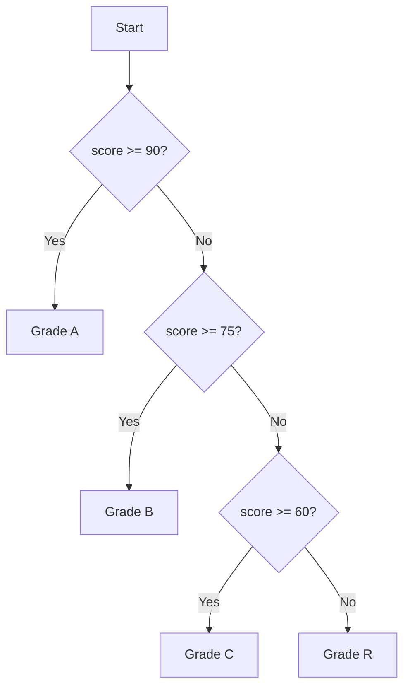

# Lesson 2.1: If Statements and Conditionals

With variables, literals, and console input under your belt, it is time to tell your C++ programs which paths to take. Decisions are the heart of interactive software, and modern C++ gives you expressive tools to compare values, branch execution, and combine multiple checks cleanly.

## What You'll Learn

- How to compare values with relational operators
- Writing basic `if` statements and `if/else` combinations
- Building readable decision trees with `else if`
- Combining conditions with logical operators
- C++17 niceties such as `if` with initializers
- How idiomatic C differs from modern C++ when handling conditionals

## 1. Comparing Values

Before you branch, you need a boolean expression—something that evaluates to either `true` or `false`.

```cpp
int score = 72;
bool passed = score >= 60;   // true because 72 is greater than or equal to 60
bool perfect = score == 100; // false because 72 is not equal to 100
```

Relational operators you will use constantly:

| Operator | Meaning                  |
|----------|--------------------------|
| `==`     | equal to                 |
| `!=`     | not equal to             |
| `<`      | less than                |
| `>`      | greater than             |
| `<=`     | less than or equal to    |
| `>=`     | greater than or equal to |

All of these yield a `bool`. In modern C++, booleans are first-class citizens, and `true`/`false` are literal values.

### Truth Tables for Logical Operators

| A | B | `A && B` | `A || B` | `!A` |
|---|---|----------|----------|------|
| `false` | `false` | `false` | `false` | `true` |
| `false` | `true`  | `false` | `true`  | `true` |
| `true`  | `false` | `false` | `true`  | `false`|
| `true`  | `true`  | `true`  | `true`  | `false`|

Memorizing these tables helps you reason about nested expressions quickly when debugging without an IDE or internet connection.

## 2. The Basic `if`

```cpp
int temperature = 5;

if (temperature < 0) {
    std::cout << "Bundle up, it's freezing!" << std::endl;
}
```

- Parentheses must surround the condition.
- Curly braces `{}` define the block that executes when the condition is `true`. Even for one-liners, braces keep refactors safe.

## 3. Adding `else`

```cpp
if (temperature < 0) {
    std::cout << "Bundle up, it's freezing!" << std::endl;
} else {
    std::cout << "No frost today." << std::endl;
}
```

When the `if` condition is false, control flows into the `else` block. Think of `if/else` pairs as mutually exclusive cases.

## 4. Chaining Decisions with `else if`

```cpp
int score = 88;

if (score >= 90) {
    std::cout << "Grade: A" << std::endl;
} else if (score >= 75) {
    std::cout << "Grade: B" << std::endl;
} else if (score >= 60) {
    std::cout << "Grade: C" << std::endl;
} else {
    std::cout << "Grade: R" << std::endl;
}
```

Conditions are evaluated from top to bottom until one succeeds. Once a branch runs, the remaining clauses are skipped. Always order your checks from most specific to least specific so that earlier branches catch higher-priority cases.

## 5. Combining Conditions with Logical Operators

Logical operators let you combine multiple boolean expressions:

- `&&` (logical AND) requires both sides to be `true`.
- `||` (logical OR) requires at least one side to be `true`.
- `!` (logical NOT) inverts a boolean value.

```cpp
int score = 82;
bool submittedFinalProject = true;

if (score >= 60 && submittedFinalProject) {
    std::cout << "You passed the course." << std::endl;
}

if (score < 60 || !submittedFinalProject) {
    std::cout << "Requirements not met." << std::endl;
}
```

C++ performs *short-circuit evaluation*: in `A && B`, `B` is only evaluated if `A` is `true`; in `A || B`, `B` runs only when `A` is `false`. Use parentheses whenever an expression might be ambiguous.

### Visualizing Branching Logic



Diagrams like this make it easier to spot missing branches before you start coding.

## 6. Scoped Initializers (`if` with Initializers)

C++17 introduced a convenient pattern: initialize a helper variable directly in the `if` header.

```cpp
if (int attempts = readAttempts(); attempts > 3) {
    std::cout << attempts << " attempts is above the limit." << std::endl;
} else {
    std::cout << "Attempts used: " << attempts << std::endl;
}
```

The variable `attempts` exists only inside the `if`/`else` blocks. This keeps temporary values scoped tightly and avoids accidental reuse. C does not support this syntax; it is a modern C++ feature.

## 7. How C Differs

Traditional C uses `int` to simulate booleans (`0` for false, nonzero for true). Modern C++ has a dedicated `bool` type and the literals `true`/`false`.

```c
/* C version */
int temperature = read_temperature();

if (temperature < 0) {
    printf("Bundle up, it's freezing!\n");
} else {
    printf("No frost today.\n");
}
```

Key takeaways:

- Prefer `bool` and the `<compare>` operators in C++.
- Use `std::cin`/`std::cout` and the `<iostream>` header for type-safe I/O.
- Reserve `using namespace std;` for small snippets—fully qualifying (`std::cout`) scales better in real projects.

### Mapping `if` Logic Between C and C++

| Task | C++ Approach | C Approach |
|------|--------------|------------|
| Basic comparison | `if (a > b)` | `if (a > b)` |
| Boolean values | `bool passed = true;` | `int passed = 1;` (`#include <stdbool.h>` for `bool`) |
| Scoped initializer | `if (int x = read(); x > 0)` | Not supported; declare `int x = read(); if (x > 0)` |
| Strings | `std::string name; if (name == "TSI")` | Use `strcmp(name, "TSI") == 0` |

## 8. Common Mistakes to Avoid

- **Assignment vs. comparison**: Writing `if (score = 90)` assigns instead of compares. Always double-check you used `==` for equality.
- **Dangling `else`**: Braces prevent `else` clauses from pairing with the wrong `if` when conditions are nested.
- **Forgetting coverage**: Make sure your final `else` branch handles unexpected data so you can surface errors gracefully.
- **Output drift**: Tests expect *exact* spacing, capitalization, and punctuation. Keep a comment blueprint handy.
- **Unreachable branches**: When multiple conditions overlap, the first matching branch hides later ones. Order from most specific to least specific to avoid dead code.
- **Floating-point comparisons**: Comparing doubles with `==` can fail due to rounding. Use a tolerance (`std::abs(a - b) < 1e-9`) when comparing measured data.

## Practice

1. Read user input with `std::cin` and classify it with `if`/`else if` branches.
2. Log different messages when logical combinations (`&&`, `||`, `!`) change the outcome.
3. Consider how you would rewrite the decision tree with a `switch` (topic of Lesson 2.2).

### Command-Line Practice Workflow

```bash
g++ -std=c++17 -Wall -Wextra -pedantic conditionals_demo.cpp -o conditionals_demo
./conditionals_demo
```

Compile with warnings enabled so the compiler flags suspicious branches. Repeat the build after each experiment to strengthen the habit.

When you are ready, launch the practice exercise to classify exam scores using conditionals. Focus on:

- Evaluating integer comparisons correctly
- Ordering your branches from most specific to least specific
- Matching the required output format exactly

## References

- C++ reference: [cppreference.com](https://en.cppreference.com/w/cpp/language/if) – details on `if` statements and scoped initializers
