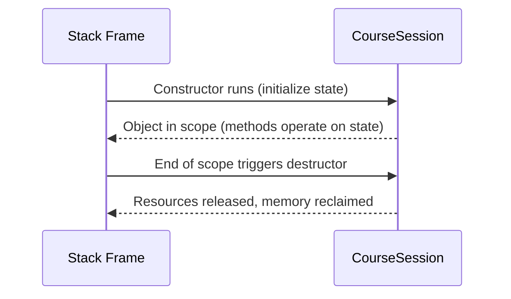

# Lesson 5.2: Constructors and Destructors

Constructors and destructors define the lifetime of C++ objects. This offline tutorial walks through initialization strategies, resource management patterns, and diagnostic techniques so you can structure object lifecycles confidently—even without network access.

## Learning Goals

- Differentiate default, parameterized, delegating, and copy constructors.
- Use member initializer lists to construct members efficiently.
- Understand destructor responsibilities and the RAII (Resource Acquisition Is Initialization) pattern.
- Control object lifetime and scope to guarantee cleanup.
- Compile, run, and troubleshoot constructor/destructor behavior from the command line.

## 1. Object Lifetime Timeline



Every automatic object (created on the stack) follows this timeline: constructor runs immediately, the object serves requests while in scope, and the destructor executes when the scope ends (even if an exception is thrown).

## 2. Default and Parameterized Constructors

```cpp
class LabRoom {
public:
    LabRoom() = default; // compiler-generated default constructor

    LabRoom(std::string name, int seats)
        : name_(std::move(name)), seats_(seats) {}

private:
    std::string name_ {"General Lab"};
    int seats_ {0};
};
```

- `= default` asks the compiler to generate the default constructor automatically.
- The parameterized constructor uses a **member initializer list** to initialize `name_` and `seats_` directly, avoiding redundant assignments inside the body.

## 3. Member Initializer Lists vs. Assignment

```cpp
class Recording {
public:
    Recording(std::string title, int bitrate)
        : title_(std::move(title)), bitrate_(bitrate) {} // preferred

private:
    std::string title_;
    int bitrate_;
};
```

Members are initialized in the order they are declared, not the order listed in the initializer list. Keep declarations sorted to avoid confusion. Use initializer lists especially for:

- `const` members
- Reference members
- Members of types without default constructors

## 4. Delegating Constructors

You can forward work to another constructor in the same class to avoid duplication:

```cpp
class SessionReport {
public:
    SessionReport() : SessionReport("Untitled", 0) {}

    SessionReport(std::string title, int attendees)
        : title_(std::move(title)), attendees_(attendees) {}

private:
    std::string title_;
    int attendees_{};
};
```

## 5. Destructors

A destructor cleans up resources and runs automatically at the end of scope:

```cpp
class ScopedTimer {
public:
    explicit ScopedTimer(std::string label)
        : label_(std::move(label)), start_(std::chrono::steady_clock::now()) {}

    ~ScopedTimer() {
        const auto end = std::chrono::steady_clock::now();
        const auto ms = std::chrono::duration_cast<std::chrono::milliseconds>(end - start_).count();
        std::cout << label_ << " took " << ms << " ms\n";
    }

private:
    std::string label_;
    std::chrono::steady_clock::time_point start_;
};
```

Even if an exception propagates, the destructor still runs, ensuring cleanup happens reliably.

## 6. RAII in Practice

Resource Acquisition Is Initialization binds a resource’s lifetime to an object. Acquire the resource inside the constructor, release it in the destructor, and use scope to control lifetime.

| Resource | Constructor Responsibility | Destructor Responsibility |
|----------|---------------------------|---------------------------|
| File handle | `std::fopen` | `std::fclose` |
| Mutex lock | `mutex.lock()` | `mutex.unlock()` |
| Database connection | `connect()` | `disconnect()` |

Prefer RAII wrappers (`std::lock_guard`, `std::unique_ptr`) over manual `new`/`delete` whenever possible.

## 7. Order of Construction and Destruction

When objects are composed of other objects:

- Members are constructed in the order of declaration.
- Destruction happens in reverse order.

```cpp
class CourseSession {
public:
    CourseSession()
        : calendar_("Autumn"), roster_(30) {}

private:
    Calendar calendar_; // constructed first
    Roster roster_;     // constructed second
}; // roster_ destroyed first, calendar_ second
```

Understanding this order helps you design safe initializers and destructors.

## 8. Copy and Move Control (Preview)

Constructors also include the copy constructor (`Class(const Class&)`) and move constructor (`Class(Class&&)`). Unless you need custom behavior, rely on the compiler-generated versions (Rule of Zero). Later lessons revisit copying and moving in more depth.

## 9. Debugging Constructors and Destructors Offline

- Insert diagnostic prints to watch constructor/destructor order.
- Use `-fsanitize=address` (if available) to detect use-after-free errors.
- Beware of throwing exceptions inside destructors—prefer `noexcept` destructors so stack unwinding remains predictable.

## 10. Building and Running Offline

```bash
# Build an example with constructors and destructors
 g++ -std=c++17 -Wall -Wextra constructors_demo.cpp -o constructors_demo
# Execute and observe the order of messages
 ./constructors_demo
```

To test destruction timing, introduce additional scopes or braces to force earlier cleanup.

## 11. Troubleshooting Checklist

- **Member not initialized**: Ensure it appears in the member initializer list (especially if it lacks a default constructor).
- **Destructor never runs**: Are you using `new` without `delete`? Prefer automatic storage duration or smart pointers.
- **Order surprises**: Reorder member declarations to match dependencies; the compiler warns when initializer order differs from declaration order.
- **Double-delete**: Let smart pointers (`std::unique_ptr`) own dynamic memory to avoid manual `delete` calls.

## 12. Practice Ideas

1. Create a `ScopedFile` class that opens a file in the constructor and closes it in the destructor while exposing `write_line()`.
2. Implement a `DatabaseSession` class that tracks connection time; the destructor logs the total duration.
3. Build a `TemporaryDirectory` helper that creates a folder in the constructor and removes it in the destructor.

The accompanying exercise asks you to design a lab session helper that configures itself via constructors, validates resources, and prints diagnostics before the destructor automatically closes the session—mirroring real-world RAII patterns.
