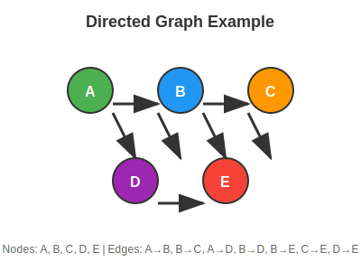
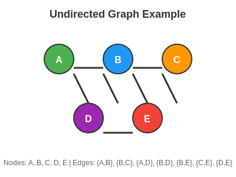
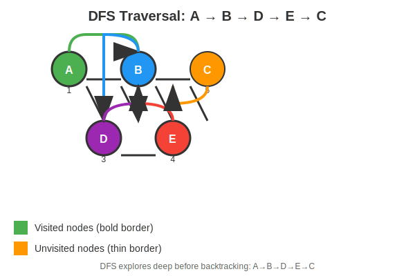
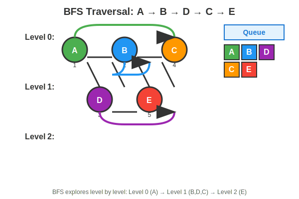
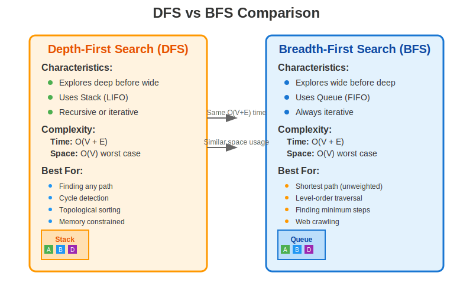

# Lesson 11.3: Graph Traversal with DFS and BFS

## Why Graph Traversal Matters

Graphs are fundamental data structures that model relationships between entities in the real world. From social networks connecting friends to transportation systems linking cities, graphs represent connections and dependencies. Traversing graphs—systematically visiting each node—is essential for solving complex problems in computer science, data analysis, and system design.

In this comprehensive lesson, we'll master two cornerstone algorithms: **Depth-First Search (DFS)** and **Breadth-First Search (BFS)**. These techniques form the backbone of graph algorithms and are crucial for advanced problem-solving in competitive programming, artificial intelligence, network analysis, and distributed systems.

### Real-World Applications

- **Social Networks**: Finding friend recommendations, community detection
- **GPS Navigation**: Finding shortest routes, traffic optimization
- **Web Crawling**: Discovering all pages on a website
- **Dependency Resolution**: Installing software packages in correct order
- **Circuit Design**: Analyzing electronic circuit connectivity
- **Artificial Intelligence**: Pathfinding in games, state space search

## Understanding Graphs: The Foundation

Before diving into traversal algorithms, let's establish a solid understanding of graph concepts and representations.

### Graph Terminology

- **Vertex/Node**: A fundamental unit in a graph (e.g., a person in a social network)
- **Edge**: A connection between two vertices (e.g., friendship between people)
- **Directed Graph**: Edges have direction (one-way relationships)
- **Undirected Graph**: Edges are bidirectional (mutual relationships)
- **Weighted Graph**: Edges have associated costs or weights
- **Unweighted Graph**: All edges are equal
- **Degree**: Number of edges connected to a vertex
- **Path**: Sequence of vertices connected by edges
- **Cycle**: A path that starts and ends at the same vertex

### Visual Examples



*Figure 1: A directed graph where edges have direction (A→B means A connects to B, but not necessarily vice versa)*



*Figure 2: An undirected graph where edges are bidirectional (relationships are mutual)*

## Graph Representations in Memory

The choice of representation significantly impacts algorithm efficiency and implementation complexity. Let's explore the most common approaches.

### Adjacency List: The Standard Choice

The adjacency list is the most memory-efficient and commonly used representation for sparse graphs:

```cpp
#include <vector>
#include <list>
#include <iostream>

class GraphAdjList {
private:
    int vertices;
    std::vector<std::list<int>> adjList;

public:
    GraphAdjList(int v) : vertices(v), adjList(v) {}

    void addEdge(int u, int v, bool directed = false) {
        adjList[u].push_back(v);
        if (!directed) {
            adjList[v].push_back(u); // Undirected edge
        }
    }

    void printGraph() {
        for (int i = 0; i < vertices; ++i) {
            std::cout << "Vertex " << i << ":";
            for (int neighbor : adjList[i]) {
                std::cout << " → " << neighbor;
            }
            std::cout << std::endl;
        }
    }

    const std::list<int>& getNeighbors(int vertex) const {
        return adjList[vertex];
    }

    int getVertexCount() const { return vertices; }
};
```

**Key Characteristics:**

- **Space Complexity**: O(V + E) - optimal for sparse graphs
- **Time Complexity**: O(degree(v)) to find neighbors of vertex v
- **Advantages**:
  - Memory efficient for sparse graphs
  - Easy to iterate through neighbors
  - Natural representation of most real-world graphs
- **Disadvantages**:
  - Slower edge existence checks (O(degree(v)))
  - Less intuitive for dense graphs

### Adjacency Matrix: Fast Edge Checks

For dense graphs or when you need O(1) edge existence queries:

```cpp
#include <vector>
#include <iostream>

class GraphAdjMatrix {
private:
    int vertices;
    std::vector<std::vector<bool>> adjMatrix;

public:
    GraphAdjMatrix(int v) : vertices(v), adjMatrix(v, std::vector<bool>(v, false)) {}

    void addEdge(int u, int v, bool directed = false) {
        adjMatrix[u][v] = true;
        if (!directed) {
            adjMatrix[v][u] = true; // Undirected edge
        }
    }

    bool hasEdge(int u, int v) const {
        return adjMatrix[u][v];
    }

    void printGraph() {
        for (int i = 0; i < vertices; ++i) {
            std::cout << "Vertex " << i << ":";
            for (int j = 0; j < vertices; ++j) {
                if (adjMatrix[i][j]) {
                    std::cout << " → " << j;
                }
            }
            std::cout << std::endl;
        }
    }

    int getVertexCount() const { return vertices; }
};
```

**Key Characteristics:**

- **Space Complexity**: O(V²) - can be wasteful for sparse graphs
- **Time Complexity**: O(1) for edge existence checks
- **Advantages**:
  - Constant-time edge queries
  - Simple matrix operations
  - Easy to implement and understand
- **Disadvantages**:
  - High memory usage for sparse graphs
  - O(V²) space even with few edges

### Choosing the Right Representation

**Graph Representation Comparison:**

- **Sparse Graph (E ≪ V²)**: Adjacency List is Excellent, Adjacency Matrix is Wasteful
- **Dense Graph (E ≈ V²)**: Adjacency List is Acceptable, Adjacency Matrix is Excellent
- **Edge Existence Queries**: Adjacency List uses O(degree(v)), Adjacency Matrix uses O(1)
- **Memory Usage**: Adjacency List uses O(V + E), Adjacency Matrix uses O(V²)
- **Neighbor Iteration**: Adjacency List is Fast, Adjacency Matrix uses O(V)
- **Real-world Usage**: Adjacency List is Most common, Adjacency Matrix is for Specialized cases

## Depth-First Search (DFS): Exploring Deep First

DFS explores as far as possible along each branch before backtracking. Think of it as traversing a maze by always going forward until you hit a dead end, then retracing your steps to try different paths.

### The DFS Algorithm Concept

1. **Start** at a source vertex
2. **Mark** the current vertex as visited
3. **Explore** all unvisited neighbors recursively
4. **Backtrack** when no unvisited neighbors remain
5. **Repeat** for any unvisited vertices (disconnected components)

### Recursive DFS Implementation

```cpp
#include <vector>
#include <iostream>
#include <list>

class GraphDFS {
private:
    int vertices;
    std::vector<std::list<int>> adjList;
    std::vector<bool> visited;

    void DFSUtil(int vertex) {
        // Mark current vertex as visited
        visited[vertex] = true;
        std::cout << vertex << " ";

        // Recursively visit all unvisited neighbors
        for (int neighbor : adjList[vertex]) {
            if (!visited[neighbor]) {
                DFSUtil(neighbor);
            }
        }
    }

public:
    GraphDFS(int v) : vertices(v), adjList(v), visited(v, false) {}

    void addEdge(int u, int v) {
        adjList[u].push_back(v);
        adjList[v].push_back(u); // Undirected graph
    }

    void DFS(int startVertex) {
        // Reset visited array
        std::fill(visited.begin(), visited.end(), false);

        std::cout << "DFS Traversal starting from vertex " << startVertex << ": ";
        DFSUtil(startVertex);
        std::cout << std::endl;
    }

    void DFSComplete() {
        std::fill(visited.begin(), visited.end(), false);

        std::cout << "Complete DFS Traversal: ";
        for (int i = 0; i < vertices; ++i) {
            if (!visited[i]) {
                DFSUtil(i);
            }
        }
        std::cout << std::endl;
    }
};
```

### Step-by-Step DFS Execution

Let's trace through DFS on our example graph (A-B-C-D-E):

1. **Start at A**: Mark A visited, print "A", explore neighbors [B, D]
2. **Visit B**: Mark B visited, print "B", explore neighbors [A, C, D, E]
   - A already visited, skip
   - C not visited, go to C
3. **Visit C**: Mark C visited, print "C", explore neighbors [B]
   - B already visited, backtrack to B
4. **Back at B**: Continue with remaining neighbors [D, E]
   - D not visited, go to D
5. **Visit D**: Mark D visited, print "D", explore neighbors [A, B, E]
   - A and B visited, E not visited, go to E
6. **Visit E**: Mark E visited, print "E", explore neighbors [B, C, D]
   - All visited, backtrack to D
7. **Back at D**: No more neighbors, backtrack to B
8. **Back at B**: Continue with E (already visited), done with B
9. **Back at A**: Continue with D (already visited), done

**Result**: A B C D E

### Iterative DFS with Explicit Stack

For environments with limited recursion depth or to avoid stack overflow with deep graphs:

```cpp
#include <stack>
#include <vector>

void DFSIterative(const GraphAdjList& graph, int startVertex) {
    std::vector<bool> visited(graph.getVertexCount(), false);
    std::stack<int> stk;

    stk.push(startVertex);
    visited[startVertex] = true;

    std::cout << "Iterative DFS: ";

    while (!stk.empty()) {
        int current = stk.top();
        stk.pop();

        std::cout << current << " ";

        // Push unvisited neighbors in reverse order to maintain DFS behavior
        std::vector<int> neighbors(graph.getNeighbors(current).rbegin(),
                                   graph.getNeighbors(current).rend());

        for (int neighbor : neighbors) {
            if (!visited[neighbor]) {
                visited[neighbor] = true;
                stk.push(neighbor);
            }
        }
    }
    std::cout << std::endl;
}
```



*Figure 3: DFS explores deeply before backtracking, visiting nodes in the order: A→B→D→E→C*

## Breadth-First Search (BFS): Exploring Level by Level

BFS explores nodes level by level, visiting all neighbors before moving to the next depth level. It's ideal for finding shortest paths in unweighted graphs and understanding graph structure.

### The BFS Algorithm Concept

1. **Start** with a queue containing the source vertex
2. **Mark** the source as visited
3. **While** queue is not empty:
   - **Dequeue** the front vertex
   - **Process** the vertex (print, analyze, etc.)
   - **Enqueue** all unvisited neighbors
   - **Mark** neighbors as visited

### BFS Implementation

```cpp
#include <queue>
#include <vector>
#include <iostream>

class GraphBFS {
private:
    int vertices;
    std::vector<std::list<int>> adjList;

public:
    GraphBFS(int v) : vertices(v), adjList(v) {}

    void addEdge(int u, int v) {
        adjList[u].push_back(v);
        adjList[v].push_back(u); // Undirected graph
    }

    void BFS(int startVertex) {
        std::vector<bool> visited(vertices, false);
        std::queue<int> q;

        visited[startVertex] = true;
        q.push(startVertex);

        std::cout << "BFS Traversal starting from " << startVertex << ": ";

        while (!q.empty()) {
            int current = q.front();
            q.pop();

            std::cout << current << " ";

            // Enqueue all unvisited neighbors
            for (int neighbor : adjList[current]) {
                if (!visited[neighbor]) {
                    visited[neighbor] = true;
                    q.push(neighbor);
                }
            }
        }
        std::cout << std::endl;
    }

    void BFSLevels(int startVertex) {
        std::vector<bool> visited(vertices, false);
        std::vector<int> level(vertices, -1);
        std::queue<int> q;

        visited[startVertex] = true;
        q.push(startVertex);
        level[startVertex] = 0;

        std::cout << "BFS Levels from " << startVertex << ":" << std::endl;

        while (!q.empty()) {
            int current = q.front();
            q.pop();

            std::cout << "Level " << level[current] << ": " << current << std::endl;

            for (int neighbor : adjList[current]) {
                if (!visited[neighbor]) {
                    visited[neighbor] = true;
                    q.push(neighbor);
                    level[neighbor] = level[current] + 1;
                }
            }
        }
    }
};
```

### Step-by-Step BFS Execution

Let's trace through BFS on our example graph:

**Initial State**: Queue = [A], Visited = {A}

1. **Dequeue A**: Print "A", enqueue unvisited neighbors [B, D]
   - Queue = [B, D], Visited = {A, B, D}

2. **Dequeue B**: Print "B", enqueue unvisited neighbors [C, E]
   - Queue = [D, C, E], Visited = {A, B, D, C, E}

3. **Dequeue D**: Print "D", no new unvisited neighbors
   - Queue = [C, E]

4. **Dequeue C**: Print "C", no new unvisited neighbors
   - Queue = [E]

5. **Dequeue E**: Print "E", no new unvisited neighbors
   - Queue = []

**Result**: A B D C E



*Figure 4: BFS explores level by level, visiting nodes in the order: A→B→D→C→E*

## Advanced Applications and Techniques

### Finding Connected Components

```cpp
int countConnectedComponents(const GraphAdjList& graph) {
    int vertices = graph.getVertexCount();
    std::vector<bool> visited(vertices, false);
    int components = 0;

    for (int i = 0; i < vertices; ++i) {
        if (!visited[i]) {
            // Each DFS/BFS call discovers one component
            DFSUtil(graph, i, visited); // or BFS
            components++;
        }
    }

    return components;
}
```

### Shortest Path in Unweighted Graphs

BFS guarantees finding shortest paths in unweighted graphs:

```cpp
#include <vector>
#include <queue>
#include <algorithm>

std::vector<int> shortestPathUnweighted(const GraphAdjList& graph, int start, int target) {
    int vertices = graph.getVertexCount();
    std::vector<bool> visited(vertices, false);
    std::vector<int> parent(vertices, -1);
    std::vector<int> distance(vertices, -1);
    std::queue<int> q;

    visited[start] = true;
    q.push(start);
    distance[start] = 0;

    while (!q.empty()) {
        int current = q.front();
        q.pop();

        if (current == target) break;

        for (int neighbor : graph.getNeighbors(current)) {
            if (!visited[neighbor]) {
                visited[neighbor] = true;
                parent[neighbor] = current;
                distance[neighbor] = distance[current] + 1;
                q.push(neighbor);
            }
        }
    }

    // Reconstruct path
    std::vector<int> path;
    if (distance[target] != -1) {
        for (int at = target; at != -1; at = parent[at]) {
            path.push_back(at);
        }
        std::reverse(path.begin(), path.end());
    }

    return path;
}
```

### Cycle Detection in Undirected Graphs

```cpp
bool hasCycleDFS(const GraphAdjList& graph, int vertex, int parent, std::vector<bool>& visited) {
    visited[vertex] = true;

    for (int neighbor : graph.getNeighbors(vertex)) {
        if (!visited[neighbor]) {
            if (hasCycleDFS(graph, neighbor, vertex, visited)) {
                return true;
            }
        } else if (neighbor != parent) {
            // Found back edge to ancestor
            return true;
        }
    }

    return false;
}

bool detectCycleUndirected(const GraphAdjList& graph) {
    int vertices = graph.getVertexCount();
    std::vector<bool> visited(vertices, false);

    for (int i = 0; i < vertices; ++i) {
        if (!visited[i]) {
            if (hasCycleDFS(graph, i, -1, visited)) {
                return true;
            }
        }
    }

    return false;
}
```

### Topological Sorting (for Directed Acyclic Graphs)

```cpp
#include <stack>

void topologicalSortDFS(const GraphAdjList& graph, int vertex,
                        std::vector<bool>& visited, std::stack<int>& stk) {
    visited[vertex] = true;

    for (int neighbor : graph.getNeighbors(vertex)) {
        if (!visited[neighbor]) {
            topologicalSortDFS(graph, neighbor, visited, stk);
        }
    }

    // Push vertex after all dependencies are processed
    stk.push(vertex);
}

std::vector<int> topologicalSort(const GraphAdjList& graph) {
    int vertices = graph.getVertexCount();
    std::vector<bool> visited(vertices, false);
    std::stack<int> stk;

    for (int i = 0; i < vertices; ++i) {
        if (!visited[i]) {
            topologicalSortDFS(graph, i, visited, stk);
        }
    }

    std::vector<int> result;
    while (!stk.empty()) {
        result.push_back(stk.top());
        stk.pop();
    }

    return result;
}
```

### Time and Space Complexity

**Algorithm Performance Analysis:**

- **DFS**: Time O(V + E), Space O(V) worst case - Linear in graph size
- **BFS**: Time O(V + E), Space O(V) worst case - Linear in graph size
- **DFS (Recursive)**: Time O(V + E), Space O(V) call stack - May cause stack overflow
- **DFS (Iterative)**: Time O(V + E), Space O(V) explicit stack - Safer for deep graphs

### When to Use DFS vs BFS



*Figure 5: Comprehensive comparison of DFS and BFS algorithms*

**Choose DFS when:**

- You need to explore deep paths first
- Memory is limited (uses less space in practice)
- You're detecting cycles in directed graphs
- You need topological sorting
- You're solving maze problems
- You want to find any path (not necessarily shortest)

**Choose BFS when:**

- You need shortest paths in unweighted graphs
- You're doing level-order processing
- Memory allows wider exploration
- You're implementing web crawlers
- You need to find minimum steps in a problem
- You want to explore neighbors before descendants

### Optimization Techniques

1. **Early Termination**: Stop traversal when target is found
2. **Bidirectional Search**: Search from both start and end simultaneously
3. **Iterative Deepening**: Combine DFS space efficiency with BFS optimality
4. **A* Algorithm**: Use heuristics for weighted graphs

## Common Pitfalls and Best Practices

### Critical Mistakes to Avoid

1. **Forgetting to Mark Nodes Visited**

   ```cpp
   // WRONG: Will cause infinite loops
   void buggyDFS(int vertex) {
       std::cout << vertex << " ";
       for (int neighbor : adjList[vertex]) {
           buggyDFS(neighbor); // No visited check!
       }
   }
   ```

2. **Incorrect Edge Addition for Directed Graphs**

   ```cpp
   // WRONG: Adding both directions for directed graph
   void addDirectedEdge(int u, int v) {
       adjList[u].push_back(v);
       adjList[v].push_back(u); // Don't do this for directed!
   }
   ```

3. **Not Handling Disconnected Components**

   ```cpp
   // WRONG: Misses disconnected parts
   void incompleteTraversal(int start) {
       DFS(start); // Only traverses connected component
   }
   ```

4. **Recursion Depth Limits**

   ```cpp
   // BETTER: Use iterative for large graphs
   void safeDFS(int start) {
       // Iterative implementation prevents stack overflow
   }
   ```

### Best Practices

1. **Always Reset Visited Array**: For multiple traversals
2. **Choose Appropriate Representation**: List for sparse, matrix for dense
3. **Handle Both Directed and Undirected**: Correctly add edges
4. **Consider Memory Constraints**: Iterative vs recursive
5. **Validate Input**: Check vertex bounds and graph connectivity

## Real-World Problem Solving

### Problem 1: Web Crawler (BFS Application)

```cpp
#include <queue>
#include <unordered_set>
#include <string>

class WebCrawler {
private:
    std::unordered_set<std::string> visited;
    std::queue<std::string> toVisit;

public:
    void crawl(const std::string& startUrl, int maxPages = 100) {
        toVisit.push(startUrl);
        visited.insert(startUrl);

        while (!toVisit.empty() && visited.size() < maxPages) {
            std::string currentUrl = toVisit.front();
            toVisit.pop();

            // Process page (download, index, etc.)
            processPage(currentUrl);

            // Get links from current page
            std::vector<std::string> links = extractLinks(currentUrl);

            for (const std::string& link : links) {
                if (visited.find(link) == visited.end()) {
                    visited.insert(link);
                    toVisit.push(link);
                }
            }
        }
    }
};
```

### Problem 2: Course Prerequisites (Topological Sort)

```cpp
#include <vector>
#include <stack>

class CourseScheduler {
public:
    std::vector<int> findOrder(int numCourses, std::vector<std::vector<int>>& prerequisites) {
        // Build adjacency list
        std::vector<std::list<int>> adjList(numCourses);
        for (const auto& prereq : prerequisites) {
            adjList[prereq[1]].push_back(prereq[0]);
        }

        // Perform topological sort
        return topologicalSort(adjList, numCourses);
    }

private:
    std::vector<int> topologicalSort(const std::vector<std::list<int>>& graph, int vertices) {
        std::vector<bool> visited(vertices, false);
        std::vector<bool> inPath(vertices, false);
        std::stack<int> stk;

        for (int i = 0; i < vertices; ++i) {
            if (!visited[i]) {
                if (hasCycle(graph, i, visited, inPath, stk)) {
                    return {}; // Cycle detected
                }
            }
        }

        std::vector<int> result;
        while (!stk.empty()) {
            result.push_back(stk.top());
            stk.pop();
        }

        return result;
    }

    bool hasCycle(const std::vector<std::list<int>>& graph, int vertex,
                  std::vector<bool>& visited, std::vector<bool>& inPath, std::stack<int>& stk) {
        visited[vertex] = true;
        inPath[vertex] = true;

        for (int neighbor : graph[vertex]) {
            if (!visited[neighbor]) {
                if (hasCycle(graph, neighbor, visited, inPath, stk)) {
                    return true;
                }
            } else if (inPath[neighbor]) {
                return true; // Cycle detected
            }
        }

        inPath[vertex] = false;
        stk.push(vertex);
        return false;
    }
};
```

## Self-Check Questions

1. What is the fundamental difference between DFS and BFS traversal orders?
2. Why does BFS guarantee shortest paths in unweighted graphs?
3. How does DFS detect cycles in undirected graphs?
4. What are the space complexity implications of recursive DFS?
5. When would you choose an adjacency matrix over an adjacency list?
6. How does topological sorting work and when is it applicable?
7. What happens if you forget to mark nodes as visited during traversal?
8. How can you modify BFS to find all nodes at a specific distance from the start?

## Practice Time

Complete the following quiz to reinforce your understanding of graph traversal algorithms.

The quiz will test your knowledge of DFS, BFS, their implementations, applications, and performance characteristics.
