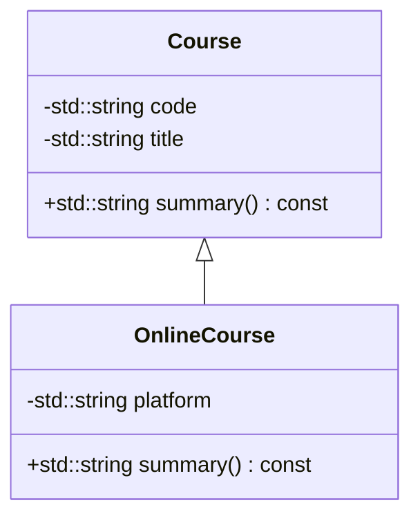

# Lesson 5.3: Inheritance

Inheritance lets you build hierarchies of related classes, reusing code and modeling real-world relationships. This offline lesson shows you how base and derived classes interact, how constructor and destructor order works, and how to structure your headers to keep dependencies manageable.

## Learning Goals

- Explain when inheritance is appropriate and when composition is better.
- Declare base classes with shared state and behavior.
- Derive new classes that extend or customize base functionality.
- Use initializer lists to invoke base-class constructors.
- Understand access control (`public`, `protected`, `private`) in inheritance.

## 1. When to Use Inheritance

Use inheritance to express an **is-a** relationship. If every `OnlineCourse` is a `Course`, the relationship fits. If the relationship is **has-a** (e.g., `Course` has a `Schedule`), prefer composition.



## 2. Declaring Base Classes

```cpp
class Person {
public:
    Person(std::string name, std::string email)
        : name_(std::move(name)), email_(std::move(email)) {}

    const std::string& name() const { return name_; }
    const std::string& email() const { return email_; }
    std::string summary() const;

protected:
    void appendContact(std::ostringstream& out) const;

private:
    std::string name_;
    std::string email_;
};
```

- `public` interface is available to all users.
- `protected` members are accessible to derived classes, but not to outside callers.
- `private` data remains encapsulated; derived classes interact through public/protected methods.

## 3. Deriving a Class

```cpp
class Instructor : public Person {
public:
    Instructor(std::string name, std::string email, std::string office)
        : Person(std::move(name), std::move(email)), office_(std::move(office)) {}

    std::string summary() const;

private:
    std::string office_;
};
```

Key rules:

- Specify inheritance type (`public`, `protected`, `private`). Use `public` for most is-a relationships so the base-class interface remains accessible.
- The derived constructor uses an initializer list to call the base constructor.
- Derived classes can override virtual functions (covered in Lesson 5.4).

## 4. Access Control in Hierarchies

| Base member declared as | Visible to base? | Visible to derived? | Visible to outside? |
|-------------------------|------------------|----------------------|----------------------|
| `public` | ✔ | ✔ | ✔ |
| `protected` | ✔ | ✔ | ✖ |
| `private` | ✔ | ✖ | ✖ |

Use `protected` sparingly—it exposes implementation details to subclasses. Favor private data with protected helper functions when you must share functionality.

## 5. Constructor and Destructor Order

```cpp
class Course {
public:
    Course() { std::cout << "Course base\n"; }
    ~Course() { std::cout << "~Course\n"; }
};

class OnlineCourse : public Course {
public:
    OnlineCourse() { std::cout << "OnlineCourse derived\n"; }
    ~OnlineCourse() { std::cout << "~OnlineCourse\n"; }
};
```

Creating `OnlineCourse` outputs:

```
Course base
OnlineCourse derived
~OnlineCourse
~Course
```

Base constructors run first; destructors run in reverse order. Remember to declare a virtual destructor in polymorphic base classes so derived destructors run correctly (see Lesson 5.4).

## 6. Overriding vs. Hiding

If a derived class defines a function with the same signature as the base, it **overrides** (when declared `virtual`) or **hides** (when not virtual) the base implementation. Mark overrides explicitly with `override` once virtual functions enter the design.

## 7. Inheritance and Header Organization

- Forward-declare classes when possible to reduce coupling.
- Place base-class declarations in their own headers to avoid circular dependencies.
- Include the base header from derived headers.

```text
include/
    person.hpp        // declares Person
    student.hpp       // includes person.hpp, declares Student : public Person
    instructor.hpp    // includes person.hpp, declares Instructor : public Person
```

## 8. Composition Alternatives

Before committing to inheritance, ask whether composition is clearer:

| Requirement | Inheritance | Composition |
|-------------|-------------|-------------|
| Share interface and behavior | ✅ | Requires delegation |
| Reuse implementation but change behavior drastically | ❌ (likely composition) | ✅ |
| Combine multiple behaviors | Multiple inheritance risks complexity | Compose multiple member objects |

Favor composition unless an `is-a` relationship is obvious.

## 9. Building and Running Offline

```bash
# Build a demo showing base/derived interactions
 g++ -std=c++17 -Wall -Wextra inheritance_demo.cpp -o inheritance_demo
# Run the executable
 ./inheritance_demo
```

Use diagnostic prints inside constructors/destructors to trace initialization order while offline.

## 10. Troubleshooting Checklist

- **Base constructor not called**: Ensure the derived constructor’s initializer list invokes it.
- **Access denied errors**: Verify the inheritance mode (`public` vs `private`) and member access specifier (`public`/`protected`).
- **Duplicate member names**: Use `ClassName::member` qualifiers to refer to base-class functions when necessary.
- **Ambiguous base classes**: In multiple inheritance scenarios, refer to base functions with qualified names.

## 11. Practice Ideas

1. Build a `Person` hierarchy with `Student` and `Instructor` classes, each extending the base summary.
2. Extend `Course` into `OnlineCourse` and `OnsiteCourse` with distinct scheduling logic.
3. Model a `Device` base with derived `Laptop`, `Tablet`, and `Phone` classes that expose additional capabilities.

The corresponding exercise guides you through implementing a mentorship pairing system that shares attributes in a base `Person` class while allowing `Student` and `Instructor` to extend their profiles cleanly.
