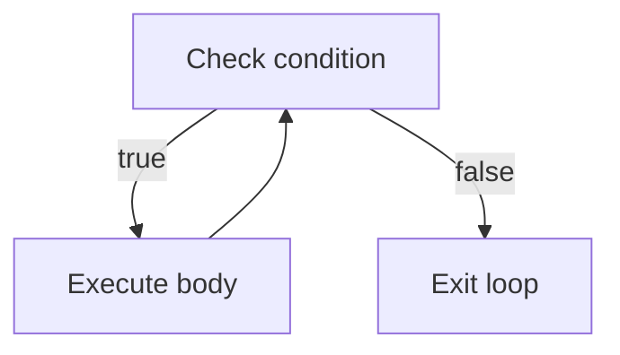

# Lesson 2.3: Loops (for, while, do-while)

Control flow often means repeating work until a condition changes. C++ offers several loop constructs, each with a distinct rhythm. This lesson shows when to pick `for`, `while`, and `do-while`, plus modern conveniences such as range-based `for` loops.

## What You'll Learn

- Anatomy and use cases for `while`, `do-while`, and `for`
- How to manage loop counters and termination conditions safely
- Combining loops with `break`/`continue`
- Range-based `for` loops over arrays and containers
- Practical guidelines that distinguish C and C++ idioms

## 1. `while` Loops

Use `while` when you do not know how many iterations you need ahead of time.

```cpp
int remaining = getRemainingTasks();

while (remaining > 0) {
    processNextTask();
    --remaining;
}
```

The condition is checked *before* each iteration. If it is already false, the loop body never runs.

### Mental Model



Draw simple diagrams like this in your notes to reason about where the loop starts and ends, especially when debugging logic on paper.

## 2. `do-while` Loops

A `do-while` guarantees at least one execution.

```cpp
int option = 0;

do {
    showMenu();
    std::cin >> option;
} while (option != 0);
```

Use this when you must perform an action before checking whether you should continue (e.g., interactive menus).

## 3. `for` Loops

`for` brings initialization, condition, and increment together.

```cpp
for (int i = 0; i < 10; ++i) {
    std::cout << i << ' ';
}
```

Pattern:

```text
for (init; condition; update) {
    // loop body
}
```

- `init` runs once.
- `condition` is checked before each iteration.
- `update` executes after each iteration.

Prefer pre-increment (`++i`) for iterators and scalar counters; it avoids unnecessary temporaries.

### Loop Checklist

| Step | Question |
|------|----------|
| Initialization | Did I set the counter to a sensible starting value? |
| Condition | Will the condition eventually become false? |
| Update | Does the update move toward the exit condition? |
| Body | Are side effects localized and easy to understand? |
| Post-loop | Do I need cleanup after the loop finishes? |

## 4. Range-Based `for`

Iterating over collections is more expressive with range-based `for`.

```cpp
std::vector<int> scores{92, 87, 78};

for (int score : scores) {
    std::cout << score << std::endl;
}
```

Add `const` and references to avoid copies:

```cpp
for (const std::string& name : attendeeNames) {
    std::cout << name << '\n';
}
```

To obtain indices as well, pair the loop with a manual counter or `std::size_t` and increment inside the loop:

```cpp
std::size_t index = 0;
for (const auto& attendee : attendeeNames) {
    std::cout << ++index << ". " << attendee << '\n';
}
```

## 5. `break` and `continue`

- `break` exits the loop immediately.
- `continue` skips to the next iteration.

```cpp
for (int value : numbers) {
    if (value < 0) {
        continue; // skip negative values
    }
    if (value == 0) {
        break;    // stop entirely
    }
    process(value);
}
```

Use these sparingly; often a well-structured condition or helper function is clearer.

### Nested Loops and Early Exit

When searching a 2D structure, extract the search into a helper that returns immediately when the value is found:

```cpp
auto findValue = [](const auto& grid, int target) -> std::optional<std::pair<int,int>> {
    for (std::size_t row = 0; row < grid.size(); ++row) {
        for (std::size_t col = 0; col < grid[row].size(); ++col) {
            if (grid[row][col] == target) {
                return {{static_cast<int>(row), static_cast<int>(col)}};
            }
        }
    }
    return std::nullopt;
};
```

This approach avoids complicated `break` logic while keeping the calling code expressive.

## 6. Loop Guardrails

- Ensure your loop variable changes so the loop terminates.
- Avoid modifying a container while iterating unless you know the iterator rules (see Lesson 4.1).
- Prefer meaningful variable names (`index`, `count`) over single letters in public-facing code.
- Keep loop bodies focused—extract helper functions when work becomes non-trivial.

### Choosing the Right Loop Construct

| Scenario | Recommended Construct |
|----------|----------------------|
| Unknown number of iterations, sentinel value controls exit | `while` |
| Prompt, process, ask again (menu) | `do-while` |
| Counting a fixed number of steps | `for` |
| Iterating over STL container | Range-based `for` |
| Applying an algorithm to each element | `std::for_each`, `std::transform` |

## 7. C vs. Modern C++ Notes

| Topic | C Approach | Preferred C++ Approach |
|-------|------------|------------------------|
| Loop counters | `int i = 0; i < n; ++i` | Same, but consider `std::size_t` for container sizes |
| Boolean flags | integers (`0`, non-zero) | `bool` values with `true`/`false` |
| Containers | raw arrays | `std::array`, `std::vector`, range-based `for` |
| Infinite loops | `while(1)` | `while (true)` or `for(;;)` with intention-comments |

Modern C++ code is clearer when it uses the Standard Library and type-safe booleans.

### Looping Over C-Style Arrays in C

```c
int numbers[] = {1, 2, 3, 4, 5};
size_t length = sizeof numbers / sizeof numbers[0];

for (size_t i = 0; i < length; ++i) {
    printf("%zu: %d\n", i, numbers[i]);
}
```

Remember that `size_t` is unsigned—be careful when subtracting indices to avoid wrapping around.

## 8. Common Pitfalls

- **Off-by-one errors**: double-check inclusive vs. exclusive limits.
- **Infinite loops**: verify that loop variables change each iteration.
- **Shadowed variables**: declare loop counters inside the loop header when possible to limit scope.
- **Accumulation precision**: choose the right type (`long long`, `double`) when sums can grow.
- **Iterator invalidation**: erasing elements from a `std::vector` inside a range-based loop invalidates iterators. Use `std::erase_if` (C++20) or manual index loops.
- **Resource leaks**: when a loop creates resources (files, sockets), prefer RAII objects so cleanup still happens if you `break` early.

## Practice Ideas

1. Sum the first `n` positive integers with a `for` loop.
2. Keep reading user commands until `quit` is entered (use `while`).
3. Use a range-based `for` to print every element in a vector with its index (hint: `std::size_t index = 0;`).

When you finish exploring, begin the practice exercise. You will read a limit, build a simple number series with a loop, and calculate the total. Focus on:

- Selecting the correct loop type for the task
- Updating your accumulator correctly
- Producing output that matches the required format exactly (spacing, capitalization, punctuation)

### Build, Run, and Inspect

```bash
g++ -std=c++17 -Wall -Wextra -pedantic loops_demo.cpp -o loops_demo
./loops_demo
```

Use `std::cout <<` statements or a debugger to inspect loop counters when results are unexpected. Keeping a small scratch file for experiments helps when you are offline.

## References

- cppreference.com: [`while`](https://en.cppreference.com/w/cpp/language/while), [`do-while`](https://en.cppreference.com/w/cpp/language/do), [`for`](https://en.cppreference.com/w/cpp/language/for)
- ISO C++ Core Guidelines: Loop safety and clarity (ES.74, ES.78, ES.87)
