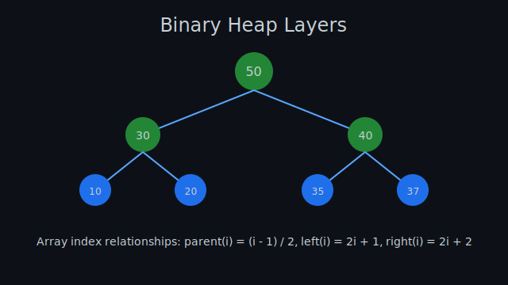
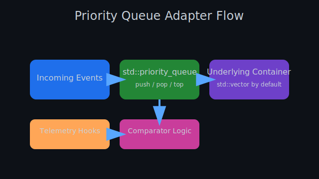

# Lesson 11.0: Launching Advanced Data Structures

> “Every sophisticated system rests on a handful of primitives. Master the primitives, and the rest is composition.”

## Orientation

Welcome to the launch pad for Module 11. This lesson gives you the narrative and technical scaffolding required before wrestling with specialised structures such as heaps, indexed priority queues, and event-driven schedulers. You will revisit the mental models built in earlier modules, tighten them with rigorous invariants, and prepare a toolkit that you will expand in the subsequent lessons.

The lesson stays entirely self-contained: all diagrams, heuristics, and step-by-step workflows appear below so that you can study offline without relying on external references.

### Learning objectives

By the end of this lesson you will be able to:

1. Describe the journey from arrays and vectors to advanced queueing structures in C++.
2. Explain the invariants that make heaps a natural fit for scheduling and ranking problems.
3. Build a reusable debugging checklist that surfaces heap violations early.
4. Convert real-world narratives (incident response, ride-share dispatching, CPU scheduling) into heap-shaped data flows.
5. Evaluate trade-offs between candidate containers using time and space budgets.

## 1. Story of the tools you already possess

Before introducing new constructs, consolidate the foundation:

- **Arrays** give you contiguous storage, predictable caching, and pointer arithmetic. They lack elasticity.
- **`std::vector`** adds growth, automatic memory management, and algorithm interoperability.
- **`std::deque`** keeps stable references during pushes/pops but sacrifices contiguous storage.
- **`std::list`** provides O(1) insertion anywhere at the cost of cache locality.

These containers deliver the memory story; Module 11 focuses on how to orchestrate *priority* stories atop this memory foundation.

### Capability snapshot — what you can already deploy

- **Bulk iteration** — Container: `std::vector`; Strength: cache-friendly sequential scans; Weakness: costly middle insertion
- **Stable front/back growth** — Container: `std::deque`; Strength: constant-time push/pop at both ends; Weakness: elements split across blocks
- **Quick middle insertion** — Container: `std::list`; Strength: stable iterators regardless of reallocation; Weakness: poor locality, extra pointers
- **Sorted search** — Container: `std::set`; Strength: automatically ordered keys; Weakness: node-based overhead

> **Reminder**: Choosing a container is a negotiation between memory layout, iterator stability, and algorithmic cost. Keep this trade-off lens in mind while reading the remainder of the lesson.

## 2. Why priority structures matter

Consider three scenarios you will implement during this module:

1. **Incident response**: the most critical ticket must surface instantly while lower-severity tickets lurk below.
2. **Streaming analytics**: maintain the top-k trending keywords without re-sorting the entire history.
3. **CPU scheduling**: the shortest remaining job pre-empts others as soon as it arrives.

Each situation demands a structure that:

- Delivers the *most important* element in constant time.
- Adjusts its ordering quickly after an insertion or removal.
- Works with large streams without complete resorting.

This is the promise of heaps and their adapters.

### Diagram 1 — Heap layers at a glance



The diagram demonstrates how a complete binary tree lives inside a flat array. Index relationships ensure that each node knows where to find its children without storing extra pointers.

### 2.1 Recalling the index arithmetic

Create a scratch file called `heap_index_demo.cpp` and type the following snippet:

```cpp
#include <iostream>
#include <vector>

void show_heap_indices(const std::vector<int>& heap) {
    for (std::size_t index = 0; index < heap.size(); ++index) {
        std::size_t parent = index == 0 ? 0 : (index - 1) / 2;
        std::size_t left = 2 * index + 1;
        std::size_t right = 2 * index + 2;
        std::cout << "node " << index << " => value " << heap[index]
                  << " | parent " << parent
                  << " | left " << (left < heap.size() ? std::to_string(left) : "(none)")
                  << " | right " << (right < heap.size() ? std::to_string(right) : "(none)")
                  << '\n';
    }
}

int main() {
    std::vector<int> heap { 50, 30, 40, 10, 20, 35, 37 };
    show_heap_indices(heap);
}
```

Compile and run:

```bash
g++ -std=c++20 heap_index_demo.cpp -o heap_index_demo
./heap_index_demo
```

Walk through the output with a pen and confirm:

- Parent index formula `(i - 1) / 2` holds for every node beyond the root.
- Child indices `2 * i + 1` and `2 * i + 2` stay within array bounds unless the node is a leaf.

### 2.2 Structural invariant

A binary heap must satisfy two properties simultaneously:

1. **Completeness**: The tree is perfectly filled except possibly the last level, which populates from left to right.
2. **Heap-order property**: Every parent dominates its children according to the selected comparator.

Break either property and the data structure ceases to be a heap. The completeness property ensures that the tree’s height is `⌊log₂ n⌋`, which underpins the logarithmic complexity you rely on.

### 2.3 Invariants in diagnostic form

Whenever you push or pop, ask the following diagnostic questions:

- Did I insert at the next free slot at the end of the array?
- Did I continuously swap upward until the newly placed element respected the comparator with its parent?
- After popping, did I move the last element to the root and sift downward until both children respected the order?

Write the responses in a notebook while experimenting; the discipline reduces debugging time.

## 3. From vectors to priority queues

`std::priority_queue` is a wrapper that gives you heap semantics without forcing you to micromanage array slots yourself. It wraps an underlying container (default `std::vector`) and exposes an interface trimmed to priority operations.

### Diagram 2 — Adapter stacking



The diagram shows the flow from incoming events to underlying container to popped priority winners. Notice the discipline: the adaptor only exposes the controlling interface (`push`, `top`, `pop`), ensuring a minimal surface area for misuse.

### 3.1 Anatomy of the adaptor

```cpp
#include <queue>
#include <vector>
#include <functional>

int main() {
    std::priority_queue<int> max_heap; // uses std::less<int>
    std::priority_queue<int, std::vector<int>, std::greater<int>> min_heap;

    for (int value : {42, 17, 73, 5, 99}) {
        max_heap.push(value);
        min_heap.push(value);
    }

    std::cout << "max top: " << max_heap.top() << '\n';
    std::cout << "min top: " << min_heap.top() << '\n';
}
```

Compile and observe that the default comparator exposes the largest element, while the alternate comparator exposes the smallest.

### 3.2 What the adaptor hides

`std::priority_queue` deliberately forbids iteration and random modification. That may frustrate you until you realise it prevents you from accidentally breaking the heap invariant. The adaptor expects you to interact through disciplined operations.

### 3.3 When raw heap algorithms still shine

C++ offers the `<algorithm>` trio `std::make_heap`, `std::push_heap`, `std::pop_heap`. Use them when you need fine control over the storage or when you want to recycle an existing vector without copying. The adaptor is convenient; the algorithms are explicit.

## 4. Transitioning mindset: three checkpoints

### 4.1 Checkpoint A — Translating business priority into comparators

1. Identify the primary ranking key (severity, distance, score).
2. Identify tie-breakers (timestamp, unique identifier).
3. Encode them in a comparator structure or lambda.
4. Test the comparator with multiple permutations to ensure it respects strict weak ordering.

```cpp
struct Ticket {
    int severity;        // higher means more urgent
    std::uint64_t id;    // unique sequence number
    std::uint64_t created_at;
};

struct TicketComparator {
    bool operator()(const Ticket& lhs, const Ticket& rhs) const {
        if (lhs.severity != rhs.severity) {
            return lhs.severity < rhs.severity; // max-heap on severity
        }
        return lhs.created_at > rhs.created_at; // earlier tickets win ties
    }
};
```

### 4.2 Checkpoint B — Auditing complexity budgets

Use the following list to verify that heaps fit your performance envelope:

- **Largest element query**: constant time (root lookup).
- **Insertion**: logarithmic time (height of the tree).
- **Bulk build**: linear time via `std::make_heap`.
- **Decrease-key simulation**: insert duplicates and ignore stale entries.
- **Iteration**: full traversal requires O(n log n) if you repeatedly pop; plan accordingly.

### 4.3 Checkpoint C — Observability hooks

High-reliability systems embed telemetry at every step. When experimenting, sprinkle logs around operations:

```cpp
#include <queue>
#include <iostream>

void log_state(std::priority_queue<int> heap) {
    std::cout << "Snapshot:";
    while (!heap.empty()) {
        std::cout << ' ' << heap.top();
        heap.pop();
    }
    std::cout << '\n';
}
```

Copy-by-value is acceptable here because the heap adaptor intentionally duplicates the underlying container, letting you peek without mutating the original.

## 5. Guided practice

### 5.1 Warm-up routine

1. Create a file `priority_intro_practice.cpp`.
2. Add these headers to the top of the file:

    ```cpp
    #include <queue>
    #include <vector>
    #include <string>
    #include <iostream>
    #include <functional>
    ```

3. Implement a task scheduler where each task carries a priority and a description.
4. Push at least five tasks with varying priority.
5. Pop them while printing to ensure correct order.

### 5.2 Practice script outline

```cpp
#include <queue>
#include <string>
#include <iostream>

struct Task {
    int priority;
    std::string description;
};

struct TaskCompare {
    bool operator()(const Task& a, const Task& b) const {
        if (a.priority != b.priority) {
            return a.priority < b.priority; // max-heap
        }
        return a.description > b.description; // lexical tie-breaker
    }
};

int main() {
    std::priority_queue<Task, std::vector<Task>, TaskCompare> dispatcher;
    dispatcher.push({5, "Infra escalation"});
    dispatcher.push({3, "Analytics batch"});
    dispatcher.push({7, "Customer outage"});
    dispatcher.push({5, "Security patch"});
    dispatcher.push({1, "Low priority cleanup"});

    while (!dispatcher.empty()) {
        const Task& next = dispatcher.top();
        std::cout << next.priority << " :: " << next.description << '\n';
        dispatcher.pop();
    }
}
```

Compile and test, then deliberately mutate the comparator to break ties incorrectly and note how the output changes. This exercise trains your internal alarm when comparators drift from expectations.

### 5.3 Debugging journal template

Use this checklist while running experiments. Write the answers in a notebook so you can spot patterns over time.

- **Stale entries**  
    **Observation cue**: logs show outdated distances resurfacing.  
    **Action**: add guard `if (dist > best) continue;`.
- **Inconsistent scaling**  
    **Observation cue**: mixed units (seconds vs. milliseconds).  
    **Action**: normalize inputs before pushing.
- **Comparator asymmetry**  
    **Observation cue**: missing tie-breaker or unstable ordering.  
    **Action**: introduce a deterministic fallback field.
- **Missing heap snapshots**  
    **Observation cue**: no logs after key operations.  
    **Action**: add `log_state` snapshots after push/pop transitions.

Copy these prompts into your journal and fill them as you test; the habit turns vague confusion into concrete adjustments.

## 6. Applied scenario walkthroughs

### 6.1 Ride-share dispatch

- **Goal**: match riders to drivers by pickup ETA while considering surge pricing.
- **Priority key**: earliest arrival time, secondary key by driver rating.
- **Algorithm**: push each driver’s ETA and rating into a min-heap.
- **Validation**: after each assignment, verify the heap’s root still carries the lowest ETA.

### 6.2 Streaming leaderboard

- **Goal**: maintain the top 10 high scores in a multiplayer match.
- **Approach**: maintain a min-heap of size 10; evict the root when a new score exceeds it.
- **Analysis**: each insertion is `O(log 10)` == `O(1)` in practice; memory stays bounded.

### 6.3 Real-time incident command

- **Goal**: ensure P0 incidents pre-empt P1, P2, etc.
- **Comparator**: severity descending, timestamp ascending.
- **Fail-safe**: log every pop to confirm highest severity is always served first.

## 7. Self-check quizzes (non-graded)

1. Why does a heap never need explicit pointers to children?
2. What causes stale entries in a priority queue and how do you defend against them?
3. Which allocator behaviour influences the performance of `std::priority_queue` when you switch the underlying container?
4. How would you instrument a dispatcher to detect starvation?
5. What is the complexity of building a heap from an existing vector of 1,000,000 elements?

Write answers in your notebook and cross-reference them with the explanations in this lesson. If any answer relies on intuition more than proof, revisit the relevant section.

## 8. Mini project starter

Build a “mission control” simulator with the following components:

- **Input stream**: fake mission events containing `priority`, `category`, and `timestamp`.
- **Priority queue**: tailored comparator favouring higher priority and earlier timestamps.
- **Dashboard**: textual output that prints the next event, logs the backlog depth, and announces when the backlog shrinks below a threshold.
- **Telemetry**: log the number of comparisons performed (wrap the comparator to increment a counter).

Stretch goals:

- Add a throttling rule that defers low-priority events when the queue exceeds a size limit.
- Record average wait time between insertion and processing.
- Feed the metrics into a simple ASCII histogram (no external libraries required).

## 9. Review and forward pointer

You now possess a detailed mental map of why heaps exist, how they operate, and where their invariants originate. The next lesson dives into implementation-level depth, teaching you the internal algorithms that realise the behaviours introduced here.

Prepare by ensuring you can:

- Recreate the diagrams in this lesson from memory (or at least narrate them).
- Explain the difference between the adaptor interface and raw heap algorithms.
- Translate a textual problem statement into comparator logic.

## 10. Reflection checklist

- [ ] I can articulate the two heap invariants without referencing external material.
- [ ] I can map between array indices and tree positions quickly.
- [ ] I can justify the complexity claims for `push`, `pop`, and `make_heap`.
- [ ] I know when to prefer raw heap algorithms over the adaptor interface.
- [ ] I have drafted a debugging checklist for heap-based systems.

## 11. Lesson summary

1. Heaps live comfortably in contiguous storage and exploit index arithmetic to avoid pointers.
2. Priority queues expose the essence of heaps while intentionally hiding footguns.
3. Comparator design is the lever that translates business logic into ordering.
4. Telemetry and disciplined checklists keep heaps correct under pressure.
5. The incoming lessons build on this foundation to implement and optimise heaps in production scenarios.

Keep your notes nearby as you proceed; the upcoming exercises expect you to reverse-engineer these patterns into working code.
