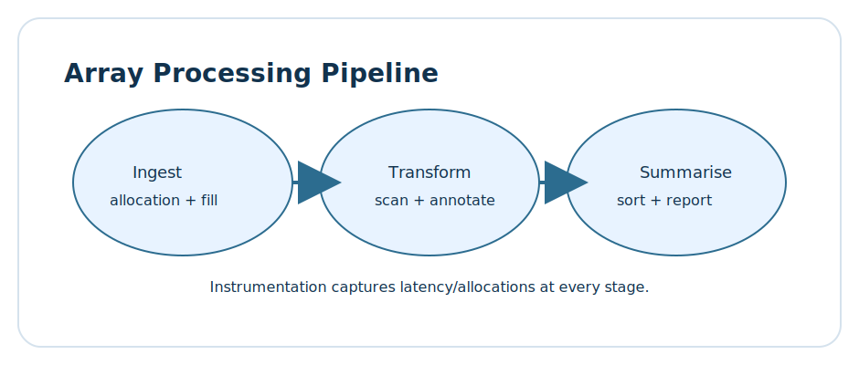
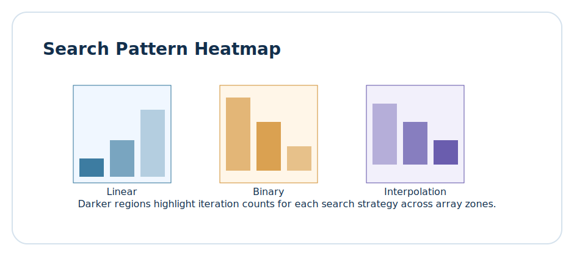
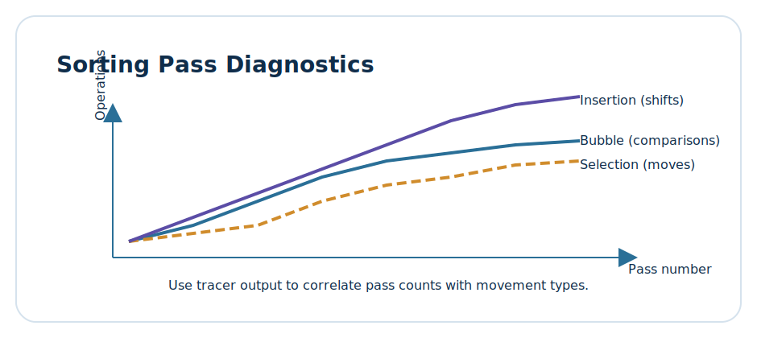

# Lesson 2.1: Arrays, Search Patterns, and Instrumented Sorting

> Learning goals: model contiguous storage behaviour in C++, apply layered search strategies, and narrate the cost profile of baseline sorting algorithms using instrumentation data.



This lesson shifts from conceptual foundations to tangible arrays-in-production stories. We connect allocation mechanics, cache alignment, and algorithm selection to the code you deploy daily. Instead of treating arrays as opaque containers, you will turn them into measurable assets that respond to observability hooks and trace logs. By the end, every scan, comparison, and move will have an audience: your future self, your teammates, and the systems that rely on your data pipelines.

## 0. Lesson roadmap

1. **An observability-first mindset for contiguous storage** — measure before you guess.
2. **Designing ergonomic array views** — share data safely without copying.
3. **Layered search strategies** — instrumented linear, binary, galloping, and interpolation workflows.
4. **Foundational sorting with narratives** — bubble, selection, and insertion sorts as storytelling tools.
5. **Diagnostics dashboards that stick** — translate raw counters into diagrams and stakeholder insights.
6. **Practice time** — apply the toolkit to your own workloads.
7. **Reflection prompts** — commit the lessons to your engineering journal.

Throughout the sections we will weave three recurring themes:

- Use data structures as *communication devices*, not just containers.
- Favour traceability and replayability so experiments become reusable.
- Pair each algorithm with a diagnostic checklist that exposes trade-offs early.

## 1. Observable arrays in modern C++

Arrays are the archetype of locality. Yet in many codebases they are handled with a guess-and-hope mentality. We begin by building an instrumented harness that reports allocation shapes, alignment, and traversal telemetry.

### 1.1 Observability checklist

- **Ownership clarity**: record who owns the memory, its lifetime, and its transfer semantics.
- **Alignment insight**: capture the base pointer, stride, and hardware prefetch hints.
- **Traversal counters**: log comparisons, swaps, branch outcomes, and average stride.
- **Storytelling hook**: prepare formatted summaries for code reviews and incident postmortems.

### 1.2 Building the array trace ledger

We start with a reusable ledger that accumulates metrics for contiguous storage operations.

```cpp
#include <algorithm>
#include <chrono>
#include <cstddef>
#include <cstdint>
#include <functional>
#include <iomanip>
#include <iostream>
#include <numeric>
#include <optional>
#include <random>
#include <span>
#include <sstream>
#include <string>
#include <string_view>
#include <tuple>
#include <utility>
#include <vector>

namespace ledger {

struct SpanInfo {
    std::string label;
    const void* address = nullptr;
    std::size_t bytes = 0;
    std::size_t count = 0;
    std::size_t stride = 0;
};

struct CounterSnapshot {
    std::string stage;
    long long comparisons = 0;
    long long moves = 0;
    long long probes = 0;
    long long branches = 0;
    long long nanoseconds = 0;
};

struct Summary {
    SpanInfo span;
    std::vector<CounterSnapshot> counters;
    std::vector<std::pair<std::string, long long>> notes;
};

class TraceLedger {
public:
    void describe(std::string label, std::span<const int> view) {
        current_.span.label = std::move(label);
        current_.span.address = static_cast<const void*>(view.data());
        current_.span.bytes = view.size() * sizeof(int);
        current_.span.count = view.size();
        current_.span.stride = sizeof(int);
    }

    template <typename StageFn>
    void around(std::string stage, StageFn&& fn) {
        using Clock = std::chrono::steady_clock;
        CounterSnapshot snap;
        snap.stage = std::move(stage);
        const auto start = Clock::now();
        LedgerContext ctx{snap};
        fn(ctx);
        const auto stop = Clock::now();
        snap.nanoseconds = std::chrono::duration_cast<std::chrono::nanoseconds>(stop - start).count();
        current_.counters.push_back(snap);
    }

    void note(std::string key, long long value) {
        current_.notes.emplace_back(std::move(key), value);
    }

    void render(std::ostream& out) const {
        out << "Array ledger for: " << current_.span.label << "\n";
        out << "  address: " << current_.span.address << "\n";
        out << "  count:   " << current_.span.count << " elements" << "\n";
        out << "  bytes:   " << current_.span.bytes << " (stride=" << current_.span.stride << ")\n";
        for (const CounterSnapshot& snap : current_.counters) {
            out << "  stage: " << std::left << std::setw(20) << snap.stage
                << " | cmp=" << std::setw(8) << snap.comparisons
                << " | moves=" << std::setw(6) << snap.moves
                << " | probes=" << std::setw(6) << snap.probes
                << " | branches=" << std::setw(6) << snap.branches
                << " | time(ns)=" << snap.nanoseconds << "\n";
        }
        if (!current_.notes.empty()) {
            out << "  notes:" << "\n";
            for (const auto& note : current_.notes) {
                out << "    - " << note.first << " = " << note.second << "\n";
            }
        }
    }

    struct LedgerContext {
        CounterSnapshot& snapshot;

        void count_comparison() { ++snapshot.comparisons; }
        void count_move(long long n = 1) { snapshot.moves += n; }
        void count_probe(long long n = 1) { snapshot.probes += n; }
        void count_branch(long long n = 1) { snapshot.branches += n; }
    };

    Summary summary() const { return current_; }

    void reset() { current_ = Summary{}; }

private:
    Summary current_;
};

} // namespace ledger

void demo_array_ledger() {
    std::vector<int> payload(32);
    std::iota(payload.begin(), payload.end(), 1);
    ledger::TraceLedger ledger;
    ledger.describe("demo_payload", std::span<const int>(payload));
    ledger.around("diagnostic/scan", [&](auto& ctx) {
        for (int value : payload) {
            ctx.count_comparison();
            if ((value % 4) == 0) {
                ctx.count_branch();
            }
        }
    });
    ledger.note("divisible-by-4", std::count_if(payload.begin(), payload.end(), [](int v) { return (v % 4) == 0; }));
    ledger.render(std::cout);
}
```

The ledger becomes your single source of truth. It records what happened, when it happened, and how costly it was. Each stage is just a lambda, so you can wrap scans, searches, or sorts with the same interface.

### 1.3 Alignment, padding, and cache friendliness

The ledger encourages instrumentation habits, but you also need heuristics:

- **Prefer 64-byte alignment** for arrays feeding SIMD code paths.
- **Combine static arrays with spans** to expose views without copying.
- **Surface padding**: if your struct contains gaps, log them and push towards tighter packing.
- **Detect false sharing** between threads by including thread identifiers in notes.



## 2. Ergonomic array views with spans

Raw pointers still dominate legacy C++ projects, yet spans offer safety and expressiveness. Here we craft a view manager that publishes slices, windows, and reshaped spans while preserving observability.

### 2.1 Span hub blueprint

```cpp
#include <array>
#include <cassert>
#include <cstddef>
#include <iostream>
#include <span>
#include <stdexcept>
#include <string>
#include <string_view>
#include <vector>

template <typename T>
class SpanHub {
public:
    explicit SpanHub(std::vector<T>& backing, std::string label)
        : backing_{backing}, label_{std::move(label)} {}

    std::span<T> full_view() {
        return std::span<T>(backing_);
    }

    std::span<T> window(std::size_t offset, std::size_t length) {
        if (offset + length > backing_.size()) {
            throw std::out_of_range("SpanHub::window out of range");
        }
        return std::span<T>(backing_.data() + offset, length);
    }

    std::span<T> tail(std::size_t count) {
        if (count > backing_.size()) {
            throw std::out_of_range("SpanHub::tail exceeds size");
        }
        return std::span<T>(backing_.data() + (backing_.size() - count), count);
    }

    std::span<const T> readonly() const {
        return std::span<const T>(backing_);
    }

    void annotate(const ledger::Summary& summary) const {
        std::cout << "SpanHub summary for " << label_ << "\n";
        std::cout << "  count=" << backing_.size() << " stride=" << sizeof(T) << "\n";
        std::cout << "  notes=" << summary.notes.size() << " entries" << "\n";
        for (const auto& entry : summary.notes) {
            std::cout << "    - " << entry.first << " = " << entry.second << "\n";
        }
    }

private:
    std::vector<T>& backing_;
    std::string label_;
};

void demo_span_hub() {
    std::vector<int> data{9, 3, 1, 5, 7, 11, 13, 15};
    SpanHub<int> hub{data, "odd_stream"};
    ledger::TraceLedger ledger;
    ledger.describe("odd_stream/tail", hub.tail(4));
    ledger.around("tail-scan", [&](auto& ctx) {
        for (int value : hub.tail(4)) {
            ctx.count_comparison();
            if (value > 10) {
                ctx.count_branch();
            }
        }
    });
    ledger.note("gt-10", 2);
    hub.annotate(ledger.summary());
}
```

By wrapping spans in a hub, you provide safe slices of data without scattering pointer arithmetic across the codebase. Each window can carry its own instrumentation story, ready to be displayed in dashboards or logs.

### 2.2 Reflection prompts

1. Which functions in your codebase still swap raw pointers to denote slices? Could SpanHub replace them?
2. How could you integrate ledger snapshots into performance regression tests?
3. What alignment patterns do you observe when dealing with heterogeneous data (structs with floats, ints, strings)?

## 3. Layered search strategies

Search is not a single algorithm—it is a progression of guesses informed by your knowledge of the data. The ledger and span hub give you the tools to compare strategies under the same instrumentation umbrella.

### 3.1 Telemetry contracts

Before coding, define your contract:

- **Inputs**: a span, a target value, optional pre-sorted hints.
- **Outputs**: index of the match or `std::nullopt`, plus ledger counters.
- **Edge cases**: empty spans, duplicates, nearly sorted data, noisy outliers.
- **Success criteria**: fewer comparisons for structured data, stable worst-case fallbacks.

### 3.2 Instrumented linear search

```cpp
#include <optional>
#include <span>
#include <utility>

std::optional<std::size_t> linear_search(std::span<const int> data, int target, ledger::TraceLedger& ledger) {
    ledger.describe("linear_search", data);
    std::optional<std::size_t> result;
    ledger.around("linear/scan", [&](auto& ctx) {
        std::size_t index = 0;
        for (int value : data) {
            ctx.count_comparison();
            if (value == target) {
                result = index;
                ctx.count_branch();
                break;
            }
            ++index;
        }
    });
    ledger.note("fallback", result ? 0 : 1);
    return result;
}
```

Linear search shines on tiny arrays or when the target is near the front. Instrumentation confirms the intuition and prepares you to switch algorithms when the data grows.

### 3.3 Instrumented binary search with adaptive guards

```cpp
#include <algorithm>
#include <optional>
#include <span>

std::optional<std::size_t> binary_search(std::span<const int> data, int target, ledger::TraceLedger& ledger) {
    ledger.describe("binary_search", data);
    std::optional<std::size_t> result;
    ledger.around("binary/scan", [&](auto& ctx) {
        std::size_t left = 0;
        std::size_t right = data.size();
        while (left < right) {
            const std::size_t mid = left + (right - left) / 2;
            ctx.count_probe();
            ctx.count_comparison();
            if (data[mid] == target) {
                result = mid;
                ctx.count_branch();
                break;
            }
            ctx.count_branch();
            if (data[mid] < target) {
                left = mid + 1;
            } else {
                right = mid;
            }
        }
    });
    ledger.note("fallback", result ? 0 : 1);
    return result;
}
```

Binary search reduces comparisons, but the ledger will show you branch direction changes and how they impact prediction. Use the notes to capture fallback rates when the array isnt sorted.

### 3.4 Galloping search for partially ordered data

```cpp
#include <optional>
#include <span>

std::optional<std::size_t> galloping_search(std::span<const int> data, int target, ledger::TraceLedger& ledger) {
    ledger.describe("galloping_search", data);
    if (data.empty()) {
        ledger.note("empty", 1);
        return std::nullopt;
    }
    std::size_t bound = 1;
    ledger.around("gallop/expand", [&](auto& ctx) {
        while (bound < data.size() && data[bound] < target) {
            ctx.count_comparison();
            bound *= 2;
        }
        ctx.count_branch();
    });
    const std::size_t left = bound / 2;
    const std::size_t right = std::min(bound + 1, data.size());
    ledger.around("gallop/binary", [&](auto& ctx) {
        std::size_t lo = left;
        std::size_t hi = right;
        while (lo < hi) {
            const std::size_t mid = lo + (hi - lo) / 2;
            ctx.count_probe();
            ctx.count_comparison();
            if (data[mid] == target) {
                ctx.count_branch();
                return;
            }
            ctx.count_branch();
            if (data[mid] < target) {
                lo = mid + 1;
            } else {
                hi = mid;
            }
        }
    });
    return binary_search(std::span<const int>(data.begin() + left, data.begin() + right), target, ledger);
}
```

Galloping search demonstrates how layered strategies reuse components. The outer expansion quickly bounds the search region, and the inner binary search reuses the core logic. Ledger counters will confirm the reduced comparison cost for near-sorted data with small tails.

### 3.5 Interpolation search with safeguards

```cpp
#include <optional>
#include <span>

std::optional<std::size_t> interpolation_search(std::span<const int> data, int target, ledger::TraceLedger& ledger) {
    ledger.describe("interpolation_search", data);
    if (data.empty()) {
        ledger.note("empty", 1);
        return std::nullopt;
    }
    std::size_t low = 0;
    std::size_t high = data.size() - 1;
    ledger.around("interp/loop", [&](auto& ctx) {
        while (low <= high && target >= data[low] && target <= data[high]) {
            if (low == high) {
                ctx.count_comparison();
                if (data[low] == target) {
                    ctx.count_branch();
                }
                break;
            }
            const long long numerator = static_cast<long long>(target - data[low]);
            const long long denominator = static_cast<long long>(data[high] - data[low]);
            if (denominator == 0) {
                ctx.count_branch();
                break;
            }
            const long long offset = (numerator * static_cast<long long>(high - low)) / denominator;
            const std::size_t probe = static_cast<std::size_t>(low + std::max<long long>(0, offset));
            ctx.count_probe();
            ctx.count_comparison();
            if (probe >= data.size()) {
                ctx.count_branch();
                break;
            }
            if (data[probe] == target) {
                ctx.count_branch();
                break;
            }
            ctx.count_branch();
            if (data[probe] < target) {
                low = probe + 1;
            } else {
                high = probe - 1;
            }
        }
    });
    return std::nullopt;
}
```

Interpolation search excels when values are uniformly distributed. The ledgers probes and branches highlight when the assumptions break. You can integrate the log into your feature flag system to revert gracefully.

### 3.6 Comparative analysis table

Create a quick comparison table using the ledger outputs:

- **Linear search**: highest comparisons, minimal setup cost.
- **Binary search**: balanced branching, predictable log9 steps.
- **Galloping search**: best for partially sorted data with large sequential prefixes.
- **Interpolation search**: risky but rewarding on uniform distributions.

Use the heatmap diagram to communicate where each algorithm thrives.

## 4. Foundational sorting with instrumentation

Sorting is a rite of passage. Instead of treating bubble, selection, and insertion sorts as academic exercises, we turn them into instrumentation laboratories. Each algorithm uses the same ledger interface so that comparisons across implementations become trivial.



### 4.1 Bubble sort with early exit and telemetry

```cpp
#include <span>
#include <utility>

void bubble_sort(std::span<int> data, ledger::TraceLedger& ledger) {
    ledger.describe("bubble_sort", data);
    bool swapped = true;
    std::size_t pass = 0;
    while (swapped) {
        swapped = false;
        ledger.around("bubble/pass" + std::to_string(pass), [&](auto& ctx) {
            for (std::size_t i = 1; i < data.size(); ++i) {
                ctx.count_comparison();
                if (data[i - 1] > data[i]) {
                    std::swap(data[i - 1], data[i]);
                    ctx.count_move(3);
                    swapped = true;
                }
            }
            if (!swapped) {
                ctx.count_branch();
            }
        });
        ledger.note("bubble-pass" + std::to_string(pass), swapped ? 1 : 0);
        ++pass;
    }
    ledger.note("bubble-passes", static_cast<long long>(pass));
}
```

### 4.2 Selection sort with selection ledger

```cpp
#include <span>
#include <utility>

void selection_sort(std::span<int> data, ledger::TraceLedger& ledger) {
    ledger.describe("selection_sort", data);
    ledger.around("selection/pipeline", [&](auto& ctx) {
        for (std::size_t i = 0; i < data.size(); ++i) {
            std::size_t min_index = i;
            for (std::size_t j = i + 1; j < data.size(); ++j) {
                ctx.count_comparison();
                if (data[j] < data[min_index]) {
                    min_index = j;
                    ctx.count_branch();
                }
            }
            if (min_index != i) {
                std::swap(data[i], data[min_index]);
                ctx.count_move(3);
            }
        }
    });
    ledger.note("selection-swaps", static_cast<long long>(data.size()));
}
```

### 4.3 Insertion sort with instrumentation hooks

```cpp
#include <span>

void insertion_sort(std::span<int> data, ledger::TraceLedger& ledger) {
    ledger.describe("insertion_sort", data);
    ledger.around("insertion/pipeline", [&](auto& ctx) {
        for (std::size_t i = 1; i < data.size(); ++i) {
            int key = data[i];
            std::size_t j = i;
            ctx.count_move();
            while (j > 0 && data[j - 1] > key) {
                ctx.count_comparison();
                data[j] = data[j - 1];
                ctx.count_move();
                --j;
            }
            data[j] = key;
            ctx.count_move();
        }
    });
    ledger.note("insertion-moves", 1);
}
```

### 4.4 Sorting playbook

- **Bubble sort**: apply when teaching stability and incremental improvements.
- **Selection sort**: highlight minimal swaps but constant comparisons.
- **Insertion sort**: emphasise nearly sorted data and log outputs when instrumentation shows minimal shifts.
- Collect ledger outputs after each run and store them in a CSV for regression tracking.

### 4.5 Sorting theatre: narrate the findings

After running the sorts, present the following storyline to stakeholders:

1. Bubble sort needed the most comparisons but terminated earlier than expected thanks to the early exit logic.
2. Selection sort used predictable comparisons and minimal swaps, making it ideal for deterministic replay.
3. Insertion sort adapted to nearly sorted prefixes, showing low move counts and confirming it should be your fallback when data centralises near order.
4. The ledger notes and diagrams reinforce which algorithm to prefer when instrumentation budgets are tight.

## 5. Diagnostics dashboards that resonate

Instrumentation only matters when someone listens. Convert ledger data into dashboards or incident postmortems to keep the story alive.

### 5.1 Building a narrative template

- **Context**: why you inspected this array today.
- **Observation**: the ledger outputs that raised questions.
- **Interpretation**: your hypothesis about allocation, branching, or distribution shapes.
- **Recommendation**: the algorithm or data structure adjustments you propose.
- **Next steps**: experiments or monitoring thresholds to watch.

### 5.2 Embedding diagrams

1. Use the array pipeline diagram to visualise staging phases (load, transform, publish).
2. Include the search heatmap to map algorithm choices against data distribution skew.
3. Present the sorting pass chart to summarise operations per pass, tying numbers to latency budgets.

### 5.3 Involving cross-functional partners

- Share ledger summaries with SRE teams so they can align monitoring alerts.
- Provide instrumentation hooks to data scientists exploring transformation pipelines.
- Bring product managers into the conversation by translating counters into user-facing metrics (e.g., throughput, tail latency).

## 6. Practice time

The best way to internalise the lesson is to get your hands on a dataset and reproduce the story. Here is a guided exercise you can run inside your project repository.

1. Choose an array-backed component that handles at least 10,000 elements daily.
2. Instrument the component with `TraceLedger` calls and record metrics for a representative workload.
3. Apply two search strategies (linear and binary) and collect ledger summaries. Compare comparisons, probes, and branch counts.
4. Shuffle the data to simulate noisy inputs and repeat the experiment.
5. Run all three sorting algorithms on subsets of 512 elements. Record total comparisons and moves.
6. Translate the findings into a short narrative and share it with your team.
7. Identify one optimisation or guard condition that emerged from the data.
8. Commit the instrumentation harness alongside regression tests so future contributors inherit the insights.
9. Document the diagrams you plan to include in your dashboard updates.
10. Schedule a follow-up to review the instrumentation impact after deployment.

### 6.1 Stretch challenges

- Integrate the ledger with a logging framework of your choice, ensuring the output remains parseable.
- Extend `TraceLedger` with percentiles of probe counts and share the results with your performance guild.
- Instrument a multi-dimensional array (matrix) and observe how row-major versus column-major traversal affects cache behaviour.
- Build a CLI report that pulls the latest ledger summaries and prints them in colour-coded sections.
- Add counters for allocation events by hooking into custom allocators or memory pools.

## 7. Reflection prompts

1. How often do you revisit instrumentation code after the initial debugging session? Commit to a cadence.
2. Which arrays in your system are opaque? Plan a refactor that introduces spans and ledger summaries.
3. How will you justify algorithm switches to non-technical stakeholders using the diagrams and logs gathered today?
4. What guardrails can you add so that new teammates maintain instrumentation coverage instead of regressing to ad-hoc prints?
5. Which ledger notes correlate directly with incidents in your postmortems? Tag them for automated detection.

## 8. Discussion starters for team retrospectives

- When did instrumentation last save the team from a production issue involving arrays?
- Are we treating our diagnostics dashboards as first-class deliverables, or as one-off experiments?
- What is the smallest change we can deploy next sprint to validate an algorithmic improvement suggested by the ledger?
- How can we ensure knowledge transfer when the original author of a search implementation moves on?
- Which metrics feel noisy or overwhelming? How can we aggregate them into meaningful signals?

## 9. Journal prompts for self-study

- Summarise todays experiments in a journal entry titled "Array Stories" and list three insights.
- Sketch a simplified ledger class on paper to ensure you understand each component.
- Draft an email to your future self explaining when to reach for interpolation search.
- Write a short script that replays a ledger summary and produces a chart using your favourite plotting library.
- List the guard clauses you added in your instrumentation code and why they matter.

## 10. Extended code walkthrough: building a playground

The following code stitches together the components from the lesson into a single playground you can compile with `-std=c++20`. It seeds random data, runs searches, sorts arrays, and prints ledger summaries. The goal is not to memorise the code but to understand how the pieces interact, ensuring you can adapt the pattern to your environment.

```cpp
#include <algorithm>
#include <chrono>
#include <cstddef>
#include <cstdint>
#include <functional>
#include <iomanip>
#include <iostream>
#include <numeric>
#include <optional>
#include <random>
#include <span>
#include <string>
#include <tuple>
#include <utility>
#include <vector>

struct ArrayPlayground {
    std::vector<int> data;
    ledger::TraceLedger ledger;

    ArrayPlayground(std::size_t size, int seed) {
        std::mt19937 rng(seed);
        data.resize(size);
        std::uniform_int_distribution<int> dist(0, static_cast<int>(size * 4));
        for (std::size_t i = 0; i < size; ++i) {
            data[i] = dist(rng);
        }
    }

    std::span<int> span_all() { return std::span<int>(data); }
    std::span<const int> span_all() const { return std::span<const int>(data); }

    int pick_target(std::size_t index) const {
        if (index < data.size()) {
            return data[index];
        }
        return data.empty() ? 0 : data.front();
    }

    void run_linear(int target) {
        ledger.reset();
        auto result = linear_search(span_all(), target, ledger);
        ledger.note("linear-result", result ? static_cast<long long>(*result) : -1);
        ledger.render(std::cout);
    }

    void run_binary(int target) {
        std::vector<int> sorted = data;
        std::sort(sorted.begin(), sorted.end());
        ledger.reset();
        auto result = binary_search(std::span<const int>(sorted), target, ledger);
        ledger.note("binary-result", result ? static_cast<long long>(*result) : -1);
        ledger.render(std::cout);
    }

    void run_galloping(int target) {
        std::vector<int> sorted = data;
        std::sort(sorted.begin(), sorted.end());
        ledger.reset();
        auto result = galloping_search(std::span<const int>(sorted), target, ledger);
        ledger.note("galloping-result", result ? static_cast<long long>(*result) : -1);
        ledger.render(std::cout);
    }

    void run_interpolation(int target) {
        std::vector<int> sorted = data;
        std::sort(sorted.begin(), sorted.end());
        ledger.reset();
        auto result = interpolation_search(std::span<const int>(sorted), target, ledger);
        ledger.note("interpolation-result", result ? 1 : 0);
        ledger.render(std::cout);
    }

    void run_bubble_sort() {
        std::vector<int> local = data;
        ledger.reset();
        bubble_sort(std::span<int>(local), ledger);
        ledger.render(std::cout);
    }

    void run_selection_sort() {
        std::vector<int> local = data;
        ledger.reset();
        selection_sort(std::span<int>(local), ledger);
        ledger.render(std::cout);
    }

    void run_insertion_sort() {
        std::vector<int> local = data;
        ledger.reset();
        insertion_sort(std::span<int>(local), ledger);
        ledger.render(std::cout);
    }
};

int main() {
    ArrayPlayground playground(64, 42);
    const int target = playground.pick_target(17);

    std::cout << "=== Linear search ===\n";
    playground.run_linear(target);

    std::cout << "=== Binary search ===\n";
    playground.run_binary(target);

    std::cout << "=== Galloping search ===\n";
    playground.run_galloping(target);

    std::cout << "=== Interpolation search ===\n";
    playground.run_interpolation(target);

    std::cout << "=== Bubble sort ===\n";
    playground.run_bubble_sort();

    std::cout << "=== Selection sort ===\n";
    playground.run_selection_sort();

    std::cout << "=== Insertion sort ===\n";
    playground.run_insertion_sort();

    return 0;
}
```

### 10.1 Playground extensions

- Record ledger summaries into JSON and feed them into a plotting script.
- Use a command-line flag to choose which search algorithm to run.
- Add benchmarks powered by `<chrono>` to compare instrumentation overhead across algorithms.
- Derive new metrics such as average probe distance or hotspot indices.
- Expose the playground as a unit test to guard against accidental regressions in instrumentation.

## 11. Cheat sheet: talking points for code reviews

- Clarify the arrays ownership, lifetime, and alignment in the header comment.
- Share the ledger snippet that validates your algorithm choice.
- Document fallback plans when data violates assumptions (e.g., unsorted arrays for binary search).
- Include a link to the diagrams so reviewers can follow the narrative.
- Explicitly state the metrics you monitor in production post-deployment.

## 12. Summary

You now possess a full-stack perspective on arrays: from alignment and spans to search strategies and sorting diagnostics. The ledger framework lets you measure decisions, while the diagrams transform metrics into memorable stories. Keep iterating on your instrumentation, share the insights with partners, and treat every array as an opportunity to teach, learn, and refine your engineering craft.
