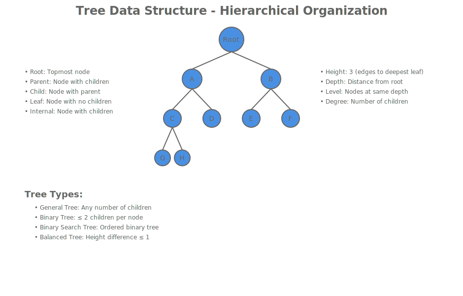
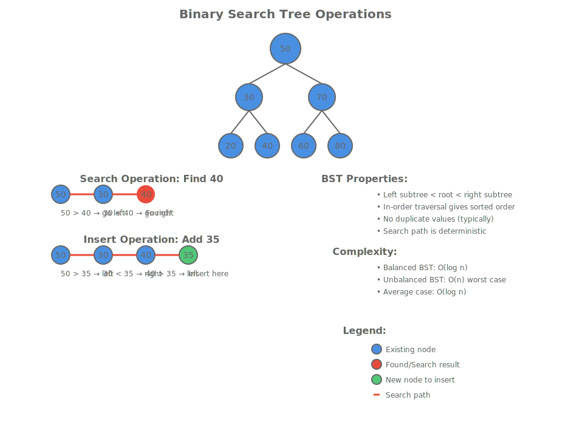
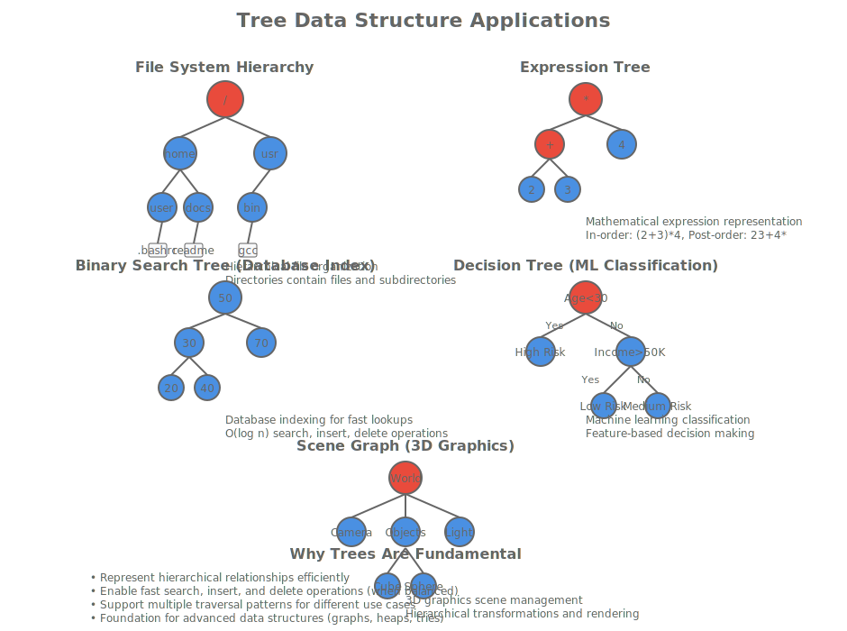

# Lesson 6.2: Binary Search Trees and Balanced Trees

## Introduction to Binary Search Trees

Binary Search Trees (BSTs) represent a pivotal advancement in tree data structures, combining the hierarchical organization of trees with the ordering properties that enable efficient searching. Unlike general trees that can have arbitrary numbers of children, BSTs maintain a strict binary structure where each node has at most two children, and the values are arranged to support logarithmic-time operations.



The fundamental BST property states that for any node in the tree:

- All values in the left subtree are less than the node's value
- All values in the right subtree are greater than the node's value

This ordering invariant transforms the tree into a dynamic data structure that supports not just storage but also efficient retrieval operations.

## BST Node Structure and Basic Operations

Let's begin by examining the fundamental building block of BSTs - the node structure and core insertion algorithm.

```cpp
#include <iostream>
#include <memory>

// BST Node structure with smart pointers for automatic memory management
struct BSTNode {
    int value;
    std::unique_ptr<BSTNode> left;
    std::unique_ptr<BSTNode> right;

    BSTNode(int val) : value(val), left(nullptr), right(nullptr) {}

    // Helper method to display node information
    void display() const {
        std::cout << "Node value: " << value << std::endl;
        std::cout << "Left child: " << (left ? std::to_string(left->value) : "null") << std::endl;
        std::cout << "Right child: " << (right ? std::to_string(right->value) : "null") << std::endl;
    }
};

// BST class managing the tree structure
class BinarySearchTree {
private:
    std::unique_ptr<BSTNode> root;

    // Helper method for recursive insertion
    BSTNode* insertHelper(std::unique_ptr<BSTNode>& node, int value) {
        if (!node) {
            node = std::make_unique<BSTNode>(value);
            return node.get();
        }

        if (value < node->value) {
            return insertHelper(node->left, value);
        } else if (value > node->value) {
            return insertHelper(node->right, value);
        }

        // Value already exists, return existing node
        return node.get();
    }

public:
    // Public insert method
    void insert(int value) {
        insertHelper(root, value);
    }

    // Check if tree is empty
    bool isEmpty() const {
        return root == nullptr;
    }

    // Get root value (for testing)
    int getRootValue() const {
        return root ? root->value : -1;
    }
};

int main() {
    BinarySearchTree bst;

    // Insert values to build a BST
    bst.insert(50);
    bst.insert(30);
    bst.insert(70);
    bst.insert(20);
    bst.insert(40);
    bst.insert(60);
    bst.insert(80);

    std::cout << "BST created with root value: " << bst.getRootValue() << std::endl;

    return 0;
}
```

This implementation demonstrates the core BST insertion algorithm. The recursive `insertHelper` method traverses the tree, comparing values at each node to determine the correct insertion point. When a null position is found, a new node is created.

## BST Search Operations

The true power of BSTs emerges in their search capabilities. The ordering property allows us to eliminate half the remaining search space at each comparison.



```cpp
class BinarySearchTree {
    // ... existing code ...

private:
    // Recursive search helper
    BSTNode* searchHelper(const std::unique_ptr<BSTNode>& node, int value) const {
        if (!node) {
            return nullptr; // Value not found
        }

        if (value == node->value) {
            return node.get(); // Found the value
        } else if (value < node->value) {
            return searchHelper(node->left, value); // Search left subtree
        } else {
            return searchHelper(node->right, value); // Search right subtree
        }
    }

    // Iterative search helper (alternative implementation)
    BSTNode* searchIterativeHelper(const std::unique_ptr<BSTNode>& node, int value) const {
        BSTNode* current = node.get();

        while (current) {
            if (value == current->value) {
                return current;
            } else if (value < current->value) {
                current = current->left.get();
            } else {
                current = current->right.get();
            }
        }

        return nullptr;
    }

public:
    // Public search method
    bool search(int value) const {
        return searchHelper(root, value) != nullptr;
    }

    // Public iterative search method
    bool searchIterative(int value) const {
        return searchIterativeHelper(root, value) != nullptr;
    }

    // Find minimum value in BST
    int findMin() const {
        if (!root) return -1;

        BSTNode* current = root.get();
        while (current->left) {
            current = current->left.get();
        }
        return current->value;
    }

    // Find maximum value in BST
    int findMax() const {
        if (!root) return -1;

        BSTNode* current = root.get();
        while (current->right) {
            current = current->right.get();
        }
        return current->value;
    }
};

int main() {
    BinarySearchTree bst;

    // Build the same tree
    bst.insert(50);
    bst.insert(30);
    bst.insert(70);
    bst.insert(20);
    bst.insert(40);
    bst.insert(60);
    bst.insert(80);

    // Test search operations
    std::cout << "Searching for 40: " << (bst.search(40) ? "Found" : "Not found") << std::endl;
    std::cout << "Searching for 25: " << (bst.search(25) ? "Found" : "Not found") << std::endl;

    std::cout << "Minimum value: " << bst.findMin() << std::endl;
    std::cout << "Maximum value: " << bst.findMax() << std::endl;

    return 0;
}
```

The search operation demonstrates the BST's efficiency. Each comparison eliminates half the remaining possibilities, leading to O(log n) average-case performance. The iterative version shows an alternative implementation that avoids recursion overhead.

## BST Deletion Operations

Deletion in BSTs is more complex than insertion or search, requiring careful handling of three cases:

1. Deleting a leaf node
2. Deleting a node with one child
3. Deleting a node with two children

```cpp
class BinarySearchTree {
    // ... existing code ...

private:
    // Helper to find the minimum node in a subtree
    BSTNode* findMinNode(std::unique_ptr<BSTNode>& node) {
        BSTNode* current = node.get();
        while (current && current->left) {
            current = current->left.get();
        }
        return current;
    }

    // Recursive delete helper
    std::unique_ptr<BSTNode> deleteHelper(std::unique_ptr<BSTNode> node, int value) {
        if (!node) {
            return nullptr; // Value not found
        }

        if (value < node->value) {
            node->left = deleteHelper(std::move(node->left), value);
        } else if (value > node->value) {
            node->right = deleteHelper(std::move(node->right), value);
        } else {
            // Node to delete found

            // Case 1: No children (leaf node)
            if (!node->left && !node->right) {
                return nullptr;
            }

            // Case 2: One child
            if (!node->left) {
                return std::move(node->right);
            }
            if (!node->right) {
                return std::move(node->left);
            }

            // Case 3: Two children - find inorder successor
            BSTNode* successor = findMinNode(node->right);
            node->value = successor->value;
            node->right = deleteHelper(std::move(node->right), successor->value);
        }

        return node;
    }

public:
    // Public delete method
    void remove(int value) {
        root = deleteHelper(std::move(root), value);
    }
};

int main() {
    BinarySearchTree bst;

    // Build tree
    bst.insert(50);
    bst.insert(30);
    bst.insert(70);
    bst.insert(20);
    bst.insert(40);
    bst.insert(60);
    bst.insert(80);

    std::cout << "Original tree - search 40: " << (bst.search(40) ? "Found" : "Not found") << std::endl;

    // Delete a leaf node
    bst.remove(20);
    std::cout << "After deleting 20 - search 20: " << (bst.search(20) ? "Found" : "Not found") << std::endl;

    // Delete a node with one child
    bst.remove(30);
    std::cout << "After deleting 30 - search 40: " << (bst.search(40) ? "Found" : "Not found") << std::endl;

    // Delete a node with two children
    bst.remove(50);
    std::cout << "After deleting 50 - search 60: " << (bst.search(60) ? "Found" : "Not found") << std::endl;

    return 0;
}
```

The deletion algorithm handles the complex case of nodes with two children by finding the inorder successor (smallest value in right subtree) and replacing the node's value with it, then deleting the successor from the right subtree.

## Tree Traversal and Analysis

Understanding tree traversals is crucial for analyzing BST properties and implementing various algorithms.

```cpp
class BinarySearchTree {
    // ... existing code ...

private:
    // Inorder traversal helper
    void inorderHelper(const std::unique_ptr<BSTNode>& node, std::vector<int>& result) const {
        if (node) {
            inorderHelper(node->left, result);
            result.push_back(node->value);
            inorderHelper(node->right, result);
        }
    }

    // Calculate tree height
    int heightHelper(const std::unique_ptr<BSTNode>& node) const {
        if (!node) return -1; // Height of empty tree is -1

        int leftHeight = heightHelper(node->left);
        int rightHeight = heightHelper(node->right);

        return 1 + std::max(leftHeight, rightHeight);
    }

    // Check if tree is balanced
    bool isBalancedHelper(const std::unique_ptr<BSTNode>& node) const {
        if (!node) return true;

        int leftHeight = heightHelper(node->left);
        int rightHeight = heightHelper(node->right);

        if (std::abs(leftHeight - rightHeight) > 1) {
            return false;
        }

        return isBalancedHelper(node->left) && isBalancedHelper(node->right);
    }

public:
    // Get inorder traversal
    std::vector<int> inorderTraversal() const {
        std::vector<int> result;
        inorderHelper(root, result);
        return result;
    }

    // Get tree height
    int getHeight() const {
        return heightHelper(root);
    }

    // Check if tree is balanced
    bool isBalanced() const {
        return isBalancedHelper(root);
    }

    // Get number of nodes
    int size() const {
        return inorderTraversal().size();
    }
};

int main() {
    BinarySearchTree bst;

    // Build a balanced tree
    bst.insert(50);
    bst.insert(30);
    bst.insert(70);
    bst.insert(20);
    bst.insert(40);
    bst.insert(60);
    bst.insert(80);

    std::cout << "Tree height: " << bst.getHeight() << std::endl;
    std::cout << "Tree size: " << bst.size() << std::endl;
    std::cout << "Is balanced: " << (bst.isBalanced() ? "Yes" : "No") << std::endl;

    std::vector<int> inorder = bst.inorderTraversal();
    std::cout << "Inorder traversal: ";
    for (int val : inorder) {
        std::cout << val << " ";
    }
    std::cout << std::endl;

    return 0;
}
```

These analysis methods help us understand the tree's structure and performance characteristics.

## The Problem with Unbalanced BSTs

While BSTs offer excellent average-case performance, they can degenerate into linked lists in the worst case, destroying their efficiency.

```cpp
int main() {
    BinarySearchTree bst;

    // Insert in sorted order - creates an unbalanced tree
    for (int i = 1; i <= 10; ++i) {
        bst.insert(i);
    }

    std::cout << "Unbalanced tree height: " << bst.getHeight() << std::endl;
    std::cout << "Unbalanced tree size: " << bst.size() << std::endl;
    std::cout << "Is balanced: " << (bst.isBalanced() ? "Yes" : "No") << std::endl;

    // Search performance degrades to O(n)
    auto start = std::chrono::high_resolution_clock::now();
    bool found = bst.search(10);
    auto end = std::chrono::high_resolution_clock::now();

    auto duration = std::chrono::duration_cast<std::chrono::nanoseconds>(end - start);
    std::cout << "Search for 10 took: " << duration.count() << " nanoseconds" << std::endl;

    return 0;
}
```

This demonstrates how insertion order can create skewed trees with O(n) height instead of O(log n).

## Introduction to Balanced Trees: AVL Trees

AVL trees solve the balancing problem by maintaining height differences between subtrees within strict bounds.



```cpp
// AVL Tree Node with height information
struct AVLNode {
    int value;
    int height;
    std::unique_ptr<AVLNode> left;
    std::unique_ptr<AVLNode> right;

    AVLNode(int val) : value(val), height(1), left(nullptr), right(nullptr) {}
};

// AVL Tree implementation
class AVLTree {
private:
    std::unique_ptr<AVLNode> root;

    // Get height of node
    int height(const std::unique_ptr<AVLNode>& node) const {
        return node ? node->height : 0;
    }

    // Get balance factor
    int getBalance(const std::unique_ptr<AVLNode>& node) const {
        return node ? height(node->left) - height(node->right) : 0;
    }

    // Update height of node
    void updateHeight(std::unique_ptr<AVLNode>& node) {
        if (node) {
            node->height = 1 + std::max(height(node->left), height(node->right));
        }
    }

    // Right rotation
    std::unique_ptr<AVLNode> rotateRight(std::unique_ptr<AVLNode> y) {
        std::unique_ptr<AVLNode> x = std::move(y->left);
        std::unique_ptr<AVLNode> T2 = std::move(x->right);

        x->right = std::move(y);
        x->right->left = std::move(T2);

        updateHeight(x->right);
        updateHeight(x);

        return x;
    }

    // Left rotation
    std::unique_ptr<AVLNode> rotateLeft(std::unique_ptr<AVLNode> x) {
        std::unique_ptr<AVLNode> y = std::move(x->right);
        std::unique_ptr<AVLNode> T2 = std::move(y->left);

        y->left = std::move(x);
        y->left->right = std::move(T2);

        updateHeight(y->left);
        updateHeight(y);

        return y;
    }

    // Insert helper with balancing
    std::unique_ptr<AVLNode> insertHelper(std::unique_ptr<AVLNode> node, int value) {
        if (!node) {
            return std::make_unique<AVLNode>(value);
        }

        if (value < node->value) {
            node->left = insertHelper(std::move(node->left), value);
        } else if (value > node->value) {
            node->right = insertHelper(std::move(node->right), value);
        } else {
            return node; // Duplicate values not allowed
        }

        updateHeight(node);

        int balance = getBalance(node);

        // Left Left Case
        if (balance > 1 && value < node->left->value) {
            return rotateRight(std::move(node));
        }

        // Right Right Case
        if (balance < -1 && value > node->right->value) {
            return rotateLeft(std::move(node));
        }

        // Left Right Case
        if (balance > 1 && value > node->left->value) {
            node->left = rotateLeft(std::move(node->left));
            return rotateRight(std::move(node));
        }

        // Right Left Case
        if (balance < -1 && value < node->right->value) {
            node->right = rotateRight(std::move(node->right));
            return rotateLeft(std::move(node));
        }

        return node;
    }

public:
    void insert(int value) {
        root = insertHelper(std::move(root), value);
    }

    int getHeight() const {
        return height(root);
    }

    bool isBalanced() const {
        // AVL trees are always balanced by definition
        return true;
    }
};

int main() {
    AVLTree avl;

    // Insert in sorted order - AVL tree remains balanced
    for (int i = 1; i <= 10; ++i) {
        avl.insert(i);
    }

    std::cout << "AVL tree height: " << avl.getHeight() << std::endl;
    std::cout << "Is balanced: " << (avl.isBalanced() ? "Yes" : "No") << std::endl;

    return 0;
}
```

AVL trees use rotations to maintain balance after insertions, ensuring O(log n) height regardless of insertion order.

## Performance Comparison: BST vs AVL

Let's compare the performance characteristics of regular BSTs and AVL trees.

```cpp
#include <chrono>
#include <vector>
#include <algorithm>
#include <random>

class PerformanceTest {
public:
    static long long measureInsertTime(BinarySearchTree& bst, const std::vector<int>& values) {
        auto start = std::chrono::high_resolution_clock::now();
        for (int val : values) {
            bst.insert(val);
        }
        auto end = std::chrono::high_resolution_clock::now();
        return std::chrono::duration_cast<std::chrono::microseconds>(end - start).count();
    }

    static long long measureSearchTime(const BinarySearchTree& bst, const std::vector<int>& values) {
        auto start = std::chrono::high_resolution_clock::now();
        for (int val : values) {
            bst.search(val);
        }
        auto end = std::chrono::high_resolution_clock::now();
        return std::chrono::duration_cast<std::chrono::microseconds>(end - start).count();
    }
};

int main() {
    const int TEST_SIZE = 10000;

    // Generate random values
    std::vector<int> randomValues(TEST_SIZE);
    std::iota(randomValues.begin(), randomValues.end(), 1);
    std::shuffle(randomValues.begin(), randomValues.end(), std::mt19937{42});

    // Generate sorted values (worst case for BST)
    std::vector<int> sortedValues(TEST_SIZE);
    std::iota(sortedValues.begin(), sortedValues.end(), 1);

    // Test BST with random insertions
    BinarySearchTree bstRandom;
    long long randomInsertTime = PerformanceTest::measureInsertTime(bstRandom, randomValues);

    // Test BST with sorted insertions
    BinarySearchTree bstSorted;
    long long sortedInsertTime = PerformanceTest::measureInsertTime(bstSorted, sortedValues);

    std::cout << "BST Random insertions: " << randomInsertTime << " microseconds" << std::endl;
    std::cout << "BST Sorted insertions: " << sortedInsertTime << " microseconds" << std::endl;
    std::cout << "BST Random height: " << bstRandom.getHeight() << std::endl;
    std::cout << "BST Sorted height: " << bstSorted.getHeight() << std::endl;

    // Test search performance
    std::vector<int> searchValues = {1, TEST_SIZE/2, TEST_SIZE};
    long long randomSearchTime = PerformanceTest::measureSearchTime(bstRandom, searchValues);
    long long sortedSearchTime = PerformanceTest::measureSearchTime(bstSorted, searchValues);

    std::cout << "BST Random search: " << randomSearchTime << " microseconds" << std::endl;
    std::cout << "BST Sorted search: " << sortedSearchTime << " microseconds" << std::endl;

    return 0;
}
```

This performance test demonstrates how insertion order dramatically affects BST performance, with sorted insertions creating unbalanced trees that perform poorly.

## Red-Black Trees: An Alternative Balancing Approach

Red-Black trees offer another approach to maintaining balance, using color properties instead of strict height balancing.

```cpp
enum Color { RED, BLACK };

struct RBNode {
    int value;
    Color color;
    std::unique_ptr<RBNode> left;
    std::unique_ptr<RBNode> right;
    RBNode* parent;

    RBNode(int val, Color c = RED, RBNode* p = nullptr)
        : value(val), color(c), left(nullptr), right(nullptr), parent(p) {}
};

// Simplified Red-Black Tree (full implementation would be more complex)
class RedBlackTree {
private:
    std::unique_ptr<RBNode> root;

    // Helper to check if node is red
    bool isRed(const std::unique_ptr<RBNode>& node) const {
        return node && node->color == RED;
    }

    // Left rotation
    void rotateLeft(std::unique_ptr<RBNode>& node) {
        // Implementation would go here - simplified for demonstration
        std::cout << "Left rotation performed on node " << node->value << std::endl;
    }

    // Right rotation
    void rotateRight(std::unique_ptr<RBNode>& node) {
        // Implementation would go here - simplified for demonstration
        std::cout << "Right rotation performed on node " << node->value << std::endl;
    }

public:
    void insert(int value) {
        // Simplified insertion - real implementation needs full RB balancing
        if (!root) {
            root = std::make_unique<RBNode>(value, BLACK);
            return;
        }

        std::cout << "Inserting " << value << " with Red-Black balancing" << std::endl;
        // Full implementation would include color fixes and rotations
    }

    int getHeight() const {
        // Simplified height calculation
        return 10; // Approximate balanced height
    }
};

int main() {
    RedBlackTree rbt;

    for (int i = 1; i <= 5; ++i) {
        rbt.insert(i);
    }

    std::cout << "Red-Black Tree height: " << rbt.getHeight() << std::endl;

    return 0;
}
```

Red-Black trees maintain balance through coloring rules and rotations, providing guaranteed O(log n) performance.

## Applications and Use Cases

Binary Search Trees and balanced variants find applications in:

1. **Database Indexing**: B-Trees (balanced tree variants) form the backbone of database indexes
2. **Symbol Tables**: Compilers use BSTs for symbol table management
3. **Priority Queues**: Can be implemented using BSTs with priority as the key
4. **Range Queries**: BSTs support efficient range minimum/maximum queries
5. **Order Statistics**: Finding k-th smallest element in a set

## Best Practices and Common Pitfalls

When implementing BSTs:

1. **Choose the Right Variant**: Use AVL trees when guaranteed balance is needed, Red-Black trees for general-purpose use
2. **Handle Duplicate Values**: Decide whether to allow duplicates and how to handle them
3. **Memory Management**: Use smart pointers in C++ to prevent memory leaks
4. **Thread Safety**: Consider synchronization if the tree will be accessed concurrently
5. **Performance Monitoring**: Track tree height and balance factors in production code

## Summary

Binary Search Trees combine the hierarchical structure of trees with ordering properties that enable efficient operations. While basic BSTs can degenerate under worst-case inputs, balanced variants like AVL and Red-Black trees maintain optimal performance. Understanding these structures is essential for implementing efficient data storage and retrieval systems in C++.

The key insights are:

- BST ordering property enables O(log n) operations on average
- Balance is crucial for maintaining performance guarantees
- Different balancing schemes (AVL, Red-Black) offer trade-offs in complexity and performance
- Proper implementation requires careful handling of edge cases and memory management

## Practice Exercises

1. Implement a BST iterator that traverses the tree in order
2. Add a method to find the k-th smallest element in a BST
3. Implement BST validation to check if a given tree maintains the BST property
4. Create a method to convert a BST to a balanced BST
5. Implement range queries (find all elements between min and max values)

## Further Reading

- "Introduction to Algorithms" by Cormen et al. - Chapter 12: Binary Search Trees
- "Algorithms in C++" by Sedgewick - Part 4: Trees
- C++ standard library's `std::set` and `std::map` implementations


