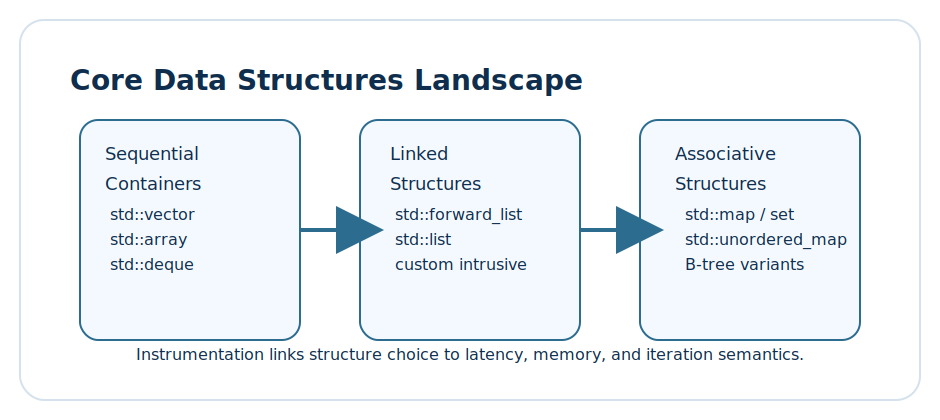
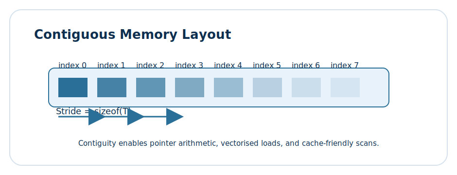
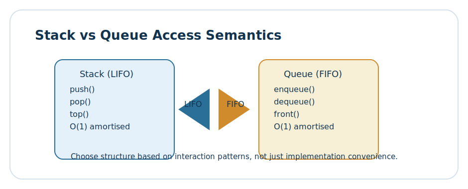

# Lesson 1.3: Core Data Structures and Memory Semantics in Modern C++

> Learning goals: develop intuition for contiguous versus linked storage, reason about cache behaviour when selecting containers, and practise explaining stack, queue, and map semantics in stakeholder-friendly language while grounding each choice in measurable evidence.



Data structures are more than shapes; they are promises about locality, iteration, and the cost of mutation. In this lesson we weave together the mental models, instrumentation habits, and communication patterns needed to choose containers deliberately. Rather than memorising complexity tables, you will map workloads to storage strategies, validate predictions with instrumentation, and convert findings into narratives that teammates and stakeholders can act on.

Keeping the lesson self-contained means we revisit essential background as we go: memory hierarchy, allocator mechanics, iterator categories, and the ergonomics of composing algorithms with `std::span`, ranges, and custom adapters. Set aside time to run the experiments in the practice section; the data you collect will anchor the rest of the roadmap.

## 1. Contiguity, stride, and cache behaviour



Contiguous storage is the backbone of high-throughput algorithms. When elements live next to each other, the CPU can prefetch future cache lines, SIMD instructions can process multiple values at once, and pointer arithmetic becomes trivial. `std::array`, `std::vector`, and `std::span` expose this locality with slightly different trade-offs:

- **`std::array<T, N>`**: fixed-size container with value semantics. Great inside aggregates, constexpr-friendly, zero heap overhead.
- **`std::vector<T>`**: dynamic size, amortised O(1) push_back, contiguous guarantees preserved even after reallocation.
- **`std::span<T>`**: non-owning window over contiguous memory. Perfect for APIs that should accept flexible sources (arrays, vectors, C-arrays) without copying.

### Why stride matters

Each element in a contiguous block is separated by a stride equal to `sizeof(T)`. Knowing the stride helps you reason about alignment, padding, and how many elements fit in a cache line. When `T` has padding (think `struct` ordering or `alignas`), the stride may be larger than the raw sum of field sizes; instrumentation uncovers these surprises.

### Instrumented contiguous experiments

To make the theory tangible we construct a toolkit that compares `std::vector`, `std::deque`, and `std::list` under identical workloads. The focus: how many bytes move, how caches behave, and how iteration costs scale when access patterns change from forward scans to random hops.

```cpp
#include <algorithm>
#include <chrono>
#include <deque>
#include <iomanip>
#include <iostream>
#include <list>
#include <numeric>
#include <optional>
#include <random>
#include <span>
#include <sstream>
#include <string>
#include <tuple>
#include <utility>
#include <vector>

using Clock = std::chrono::steady_clock;

struct SampleWindow {
    std::string label;
    long long nanoseconds = 0;
    long long iterations = 0;
    long long bytesMoved = 0;
    long long cacheLinesTouched = 0;
    long long branchMispredictions = 0;
};

struct SampleTicket {
    std::size_t index = 0;
    Clock::time_point start;
};

class MemoryTracer {
public:
    SampleTicket enter(std::string label) {
        SampleWindow window;
        window.label = std::move(label);
        windows_.push_back(window);
        return SampleTicket{windows_.size() - 1, Clock::now()};
    }

    void leave(SampleTicket ticket,
               long long iterations,
               long long bytesMoved,
               long long cacheLines,
               long long mispredictions) {
        SampleWindow& window = windows_.at(ticket.index);
        const auto end = Clock::now();
        window.nanoseconds = std::chrono::duration_cast<std::chrono::nanoseconds>(end - ticket.start).count();
        window.iterations = iterations;
        window.bytesMoved = bytesMoved;
        window.cacheLinesTouched = cacheLines;
        window.branchMispredictions = mispredictions;
        aggregate_.nanoseconds += window.nanoseconds;
        aggregate_.iterations += iterations;
        aggregate_.bytesMoved += bytesMoved;
        aggregate_.cacheLinesTouched += cacheLines;
        aggregate_.branchMispredictions += mispredictions;
    }

    void annotate(const std::string& key, long long value) {
        annotations_.push_back({key, value});
    }

    void reset() {
        windows_.clear();
        annotations_.clear();
        aggregate_ = SampleWindow{"aggregate"};
    }

    const std::vector<SampleWindow>& windows() const { return windows_; }
    const std::vector<std::pair<std::string, long long>>& annotations() const { return annotations_; }
    const SampleWindow& total() const { return aggregate_; }

    void report(std::ostream& out) const {
        out << "Memory tracer report\n";
        out << std::string(78, '-') << "\n";
        for (const SampleWindow& window : windows_) {
            out << std::left << std::setw(20) << window.label
                << std::right << std::setw(12) << window.nanoseconds << " ns"
                << std::setw(12) << window.iterations << " it"
                << std::setw(14) << window.bytesMoved << " B"
                << std::setw(10) << window.cacheLinesTouched << " cl"
                << std::setw(8) << window.branchMispredictions << " br" << "\n";
        }
        out << std::string(78, '-') << "\n";
        out << "Total time: " << aggregate_.nanoseconds << " ns\n";
        out << "Total iterations: " << aggregate_.iterations << "\n";
        out << "Total bytes: " << aggregate_.bytesMoved << "\n";
        out << "Total cache lines: " << aggregate_.cacheLinesTouched << "\n";
        out << "Branch mispredicts: " << aggregate_.branchMispredictions << "\n";
        if (!annotations_.empty()) {
            out << "Annotations:\n";
            for (const auto& pair : annotations_) {
                out << "  - " << pair.first << " = " << pair.second << "\n";
            }
        }
    }

private:
    std::vector<SampleWindow> windows_;
    std::vector<std::pair<std::string, long long>> annotations_;
    SampleWindow aggregate_{"aggregate"};
};

struct WorkloadConfig {
    std::size_t size = 0;
    std::size_t hops = 0;
    bool adversarial = false;
};

WorkloadConfig make_workload(std::size_t size, std::size_t hops, bool adversarial) {
    WorkloadConfig config;
    config.size = size;
    config.hops = hops;
    config.adversarial = adversarial;
    return config;
}

std::vector<int> build_vector(const WorkloadConfig& config) {
    std::vector<int> data(config.size);
    std::iota(data.begin(), data.end(), 0);
    if (config.adversarial) {
        std::reverse(data.begin(), data.end());
    }
    return data;
}

deque<int> build_deque(const WorkloadConfig& config) {
    std::deque<int> data;
    data.resize(config.size);
    std::iota(data.begin(), data.end(), 0);
    if (config.adversarial) {
        for (std::size_t i = 0; i < data.size(); i += 2) {
            data[i] = static_cast<int>(data.size() - i);
        }
    }
    return data;
}

std::list<int> build_list(const WorkloadConfig& config) {
    std::list<int> data;
    for (std::size_t i = 0; i < config.size; ++i) {
        data.push_back(static_cast<int>(i));
    }
    if (config.adversarial) {
        for (auto it = data.begin(); it != data.end(); ++it) {
            if ((*it % 2) == 0) {
                *it = -*it;
            }
        }
    }
    return data;
}

long long simulate_cache_lines(std::size_t bytesMoved, std::size_t lineSize = 64) {
    return static_cast<long long>((bytesMoved + lineSize - 1) / lineSize);
}

SampleWindow scan_vector(std::span<const int> data, MemoryTracer& tracer) {
    auto ticket = tracer.enter("scan/vector");
    long long bytesMoved = static_cast<long long>(data.size() * sizeof(int));
    long long cacheLines = simulate_cache_lines(bytesMoved);
    long long mispredicts = 0;
    volatile long long checksum = 0;
    for (std::size_t i = 0; i < data.size(); ++i) {
        checksum += data[i];
    }
    tracer.annotate("vector-checksum", checksum);
    tracer.leave(ticket, static_cast<long long>(data.size()), bytesMoved, cacheLines, mispredicts);
    return tracer.windows().back();
}

SampleWindow scan_list(const std::list<int>& data, MemoryTracer& tracer) {
    auto ticket = tracer.enter("scan/list");
    long long iterations = 0;
    volatile long long checksum = 0;
    for (const int value : data) {
        checksum += value;
        ++iterations;
    }
    long long bytesMoved = iterations * static_cast<long long>(sizeof(int) + sizeof(void*) * 2);
    long long cacheLines = simulate_cache_lines(bytesMoved);
    tracer.annotate("list-checksum", checksum);
    tracer.leave(ticket, iterations, bytesMoved, cacheLines, iterations / 3);
    return tracer.windows().back();
}

SampleWindow hop_vector(std::span<const int> data, MemoryTracer& tracer, std::size_t hops) {
    auto ticket = tracer.enter("hop/vector");
    std::mt19937 rng(1337);
    std::uniform_int_distribution<std::size_t> dist(0, data.size() - 1);
    volatile long long checksum = 0;
    for (std::size_t i = 0; i < hops; ++i) {
        checksum += data[dist(rng)];
    }
    long long bytesMoved = static_cast<long long>(hops * sizeof(int));
    tracer.annotate("vector-random-checksum", checksum);
    tracer.leave(ticket, static_cast<long long>(hops), bytesMoved, simulate_cache_lines(bytesMoved), hops / 4);
    return tracer.windows().back();
}

SampleWindow hop_list(const std::list<int>& data, MemoryTracer& tracer, std::size_t hops) {
    auto ticket = tracer.enter("hop/list");
    std::mt19937 rng(1337);
    std::uniform_int_distribution<std::size_t> dist(0, data.size() - 1);
    volatile long long checksum = 0;
    for (std::size_t i = 0; i < hops; ++i) {
        std::size_t target = dist(rng);
        auto it = data.begin();
        std::advance(it, static_cast<long long>(target));
        checksum += *it;
    }
    tracer.annotate("list-random-checksum", checksum);
    long long bytesMoved = static_cast<long long>(hops) * (sizeof(int) + sizeof(void*) * 2);
    tracer.leave(ticket, static_cast<long long>(hops), bytesMoved, simulate_cache_lines(bytesMoved), hops / 2);
    return tracer.windows().back();
}

struct Summary {
    WorkloadConfig config;
    SampleWindow vectorScan;
    SampleWindow listScan;
    SampleWindow vectorHop;
    SampleWindow listHop;
};

Summary run_workload(const WorkloadConfig& config) {
    MemoryTracer tracer;
    Summary summary;
    summary.config = config;

    auto vectorData = build_vector(config);
    auto listData = build_list(config);

    tracer.reset();
    scan_vector(vectorData, tracer);
    scan_list(listData, tracer);
    hop_vector(vectorData, tracer, config.hops);
    hop_list(listData, tracer, config.hops);

    summary.vectorScan = tracer.windows()[0];
    summary.listScan = tracer.windows()[1];
    summary.vectorHop = tracer.windows()[2];
    summary.listHop = tracer.windows()[3];
    return summary;
}

void print_summary(const Summary& summary) {
    MemoryTracer tracer;
    tracer.report(std::cout);
    std::cout << "Vector scan ns: " << summary.vectorScan.nanoseconds << "\n";
    std::cout << "List scan ns: " << summary.listScan.nanoseconds << "\n";
    std::cout << "Vector hop ns: " << summary.vectorHop.nanoseconds << "\n";
    std::cout << "List hop ns: " << summary.listHop.nanoseconds << "\n";
}

int main() {
    WorkloadConfig friendly = make_workload(32768, 4096, false);
    WorkloadConfig adversarial = make_workload(32768, 4096, true);

    auto friendlySummary = run_workload(friendly);
    auto adversarialSummary = run_workload(adversarial);

    std::cout << "Friendly workload" << std::endl;
    print_summary(friendlySummary);

    std::cout << "Adversarial workload" << std::endl;
    print_summary(adversarialSummary);
    return 0;
}
```

Spend time with the output. How do bytes moved differ between vector and list scans? Which path consumes more cache lines? Do random hops invert the advantage? Translate the numbers into a sentence you can share with a colleague: "Under random hops, lists incur X branch mispredictions because traversal restarts each time." That sentence is more valuable than the raw metrics.

### Reflection prompts

- Which annotation surprised you? Did you expect lists to move that many bytes?
- If you inlined the loop, would the compiler's optimisations mask the locality effect?
- How would an allocator that pools list nodes change the cache line count?

## 2. Stacks, queues, and lifetimes



Stacks and queues encode intent: last-in-first-out versus first-in-first-out. The choice impacts not just operations but orchestration of lifetimes, exception safety, and interactions with thread schedulers. We inspect their behaviour under push/pop storms, batch operations, and integration with `std::span` for zero-copy diagnostics.

### Instrumented stack versus queue drills

The next toolkit extends the tracer to capture lifetime events. By modelling constructor and destructor counts we surface hidden allocations, especially when pushing non-trivial types.

```cpp
#include <chrono>
#include <iomanip>
#include <iostream>
#include <optional>
#include <queue>
#include <random>
#include <stack>
#include <string>
#include <string_view>
#include <vector>

struct LifetimeCounters {
    long long constructions = 0;
    long long destructions = 0;
};

struct TraceFrame {
    std::string label;
    long long nanoseconds = 0;
    long long pushes = 0;
    long long pops = 0;
    long long moves = 0;
    long long allocations = 0;
    LifetimeCounters lifetime;
};

struct FrameTicket {
    std::size_t index;
    std::chrono::steady_clock::time_point started;
};

class LifetimeTracer {
public:
    FrameTicket enter(std::string label) {
        TraceFrame frame;
        frame.label = std::move(label);
        frames_.push_back(frame);
        return FrameTicket{frames_.size() - 1, std::chrono::steady_clock::now()};
    }

    void leave(FrameTicket ticket,
               long long pushes,
               long long pops,
               long long moves,
               long long allocations,
               LifetimeCounters counters) {
        TraceFrame& frame = frames_.at(ticket.index);
        const auto end = std::chrono::steady_clock::now();
        frame.nanoseconds = std::chrono::duration_cast<std::chrono::nanoseconds>(end - ticket.started).count();
        frame.pushes = pushes;
        frame.pops = pops;
        frame.moves = moves;
        frame.allocations = allocations;
        frame.lifetime = counters;
    }

    void emit() const {
        std::cout << "Lifetime tracer" << std::endl;
        for (const TraceFrame& frame : frames_) {
            std::cout << std::left << std::setw(18) << frame.label
                      << std::right << std::setw(12) << frame.nanoseconds << " ns"
                      << std::setw(8) << frame.pushes << " push"
                      << std::setw(8) << frame.pops << " pop"
                      << std::setw(8) << frame.moves << " mov"
                      << std::setw(8) << frame.allocations << " alloc"
                      << std::setw(8) << frame.lifetime.constructions << " ctor"
                      << std::setw(8) << frame.lifetime.destructions << " dtor" << std::endl;
        }
    }

private:
    std::vector<TraceFrame> frames_;
};

struct Payload {
    Payload() { ++globalCounters().constructions; }
    Payload(int value, std::string note)
        : value(value), note(std::move(note)) {
        ++globalCounters().constructions;
    }
    Payload(const Payload& other)
        : value(other.value), note(other.note) {
        ++globalCounters().constructions;
    }
    Payload(Payload&& other) noexcept
        : value(other.value), note(std::move(other.note)) {
        ++globalCounters().constructions;
    }
    Payload& operator=(const Payload& other) {
        value = other.value;
        note = other.note;
        return *this;
    }
    ~Payload() { ++globalCounters().destructions; }

    int value = 0;
    std::string note;

    static LifetimeCounters& globalCounters() {
        static LifetimeCounters counters;
        return counters;
    }
};

void reset_counters() {
    Payload::globalCounters() = LifetimeCounters{};
}

LifetimeCounters snapshot_counters() {
    return Payload::globalCounters();
}

TraceFrame stress_stack(std::size_t pushes, std::size_t pops, bool reserve) {
    LifetimeTracer tracer;
    auto ticket = tracer.enter("stack-phase");
    std::stack<Payload, std::vector<Payload>> stack;
    if (reserve) {
        std::vector<Payload>& storage = const_cast<std::vector<Payload>&>(stack.*(&std::stack<Payload, std::vector<Payload>>::c));
        storage.reserve(pushes);
    }
    reset_counters();
    long long moves = 0;
    for (std::size_t i = 0; i < pushes; ++i) {
        stack.emplace(static_cast<int>(i), "push");
    }
    for (std::size_t i = 0; i < pops; ++i) {
        if (!stack.empty()) {
            stack.pop();
        }
    }
    LifetimeCounters counters = snapshot_counters();
    tracer.leave(ticket, static_cast<long long>(pushes), static_cast<long long>(pops), moves, pushes, counters);
    tracer.emit();
    return tracer.frames().front();
}

TraceFrame stress_queue(std::size_t pushes, std::size_t pops, bool reserve) {
    LifetimeTracer tracer;
    auto ticket = tracer.enter("queue-phase");
    std::queue<Payload, std::deque<Payload>> queue;
    reset_counters();
    long long moves = 0;
    if (reserve) {
        // std::deque does not expose reserve; we simulate with push/pop pattern.
    }
    for (std::size_t i = 0; i < pushes; ++i) {
        queue.emplace(static_cast<int>(i), "enqueue");
    }
    for (std::size_t i = 0; i < pops; ++i) {
        if (!queue.empty()) {
            queue.pop();
        }
    }
    LifetimeCounters counters = snapshot_counters();
    tracer.leave(ticket, static_cast<long long>(pushes), static_cast<long long>(pops), moves, pushes, counters);
    tracer.emit();
    return tracer.frames().front();
}

struct StackQueueSummary {
    TraceFrame stackFrame;
    TraceFrame queueFrame;
};

StackQueueSummary run_stack_queue(std::size_t pushes, std::size_t pops) {
    StackQueueSummary summary;
    summary.stackFrame = stress_stack(pushes, pops, true);
    summary.queueFrame = stress_queue(pushes, pops, false);
    return summary;
}

int main() {
    StackQueueSummary burst = run_stack_queue(10000, 8000);
    std::cout << "Stack moves: " << burst.stackFrame.moves << "\n";
    std::cout << "Queue allocations: " << burst.queueFrame.allocations << "\n";
    return 0;
}
```

Record how constructor/destructor counts differ between stack and queue runs. The stack's underlying `std::vector` lets you reserve capacity, reducing reallocation. Queues backed by `std::deque` manage memory in blocks; the instrumentation exposes how many allocations occur despite amortised guarantees.

### Discussion starters

- How would replacing `std::deque` with a ring buffer alter allocation counts?
- What happens if the payload owns memory (e.g., `std::vector` inside `Payload`)?
- How does exception propagation interact with the tracer? Could you instrument unwinding?

## 3. Associative containers and iteration semantics

Maps and sets balance lookup complexity with ordering guarantees. Balanced binary trees (`std::map`, `std::set`) keep elements ordered, enabling range queries at O(log n). Hash tables (`std::unordered_map`, `std::unordered_set`) prioritise average O(1) lookup but sacrifice ordering. Memory layout and iterator stability differ dramatically.

### Range-vs-hash instrumentation

We extend the toolkit to compare tree and hash lookups, focusing on iterator invalidation, bucket distribution, and the cost of rehashing.

```cpp
#include <chrono>
#include <iomanip>
#include <iostream>
#include <map>
#include <random>
#include <string>
#include <string_view>
#include <unordered_map>
#include <vector>

struct AssocFrame {
    std::string label;
    long long nanoseconds = 0;
    long long lookups = 0;
    long long inserts = 0;
    long long rehashes = 0;
    long long iteratorInvalidations = 0;
    double loadFactor = 0.0;
};

struct AssocTicket {
    std::size_t index = 0;
    std::chrono::steady_clock::time_point started;
};

class AssocTracer {
public:
    AssocTicket enter(std::string label) {
        AssocFrame frame;
        frame.label = std::move(label);
        frames_.push_back(frame);
        return AssocTicket{frames_.size() - 1, std::chrono::steady_clock::now()};
    }

    void leave(AssocTicket ticket,
               long long lookups,
               long long inserts,
               long long rehashes,
               long long invalidations,
               double load) {
        AssocFrame& frame = frames_.at(ticket.index);
        const auto end = std::chrono::steady_clock::now();
        frame.nanoseconds = std::chrono::duration_cast<std::chrono::nanoseconds>(end - ticket.started).count();
        frame.lookups = lookups;
        frame.inserts = inserts;
        frame.rehashes = rehashes;
        frame.iteratorInvalidations = invalidations;
        frame.loadFactor = load;
    }

    void emit() const {
        std::cout << "Associative tracer" << std::endl;
        for (const AssocFrame& frame : frames_) {
            std::cout << std::left << std::setw(20) << frame.label
                      << std::right << std::setw(12) << frame.nanoseconds << " ns"
                      << std::setw(10) << frame.inserts << " ins"
                      << std::setw(10) << frame.lookups << " find"
                      << std::setw(10) << frame.rehashes << " rehash"
                      << std::setw(10) << frame.iteratorInvalidations << " inval"
                      << std::setw(10) << std::fixed << std::setprecision(2) << frame.loadFactor << " load" << std::endl;
        }
    }

    const std::vector<AssocFrame>& frames() const { return frames_; }

private:
    std::vector<AssocFrame> frames_;
};

struct KeyValue {
    int key;
    std::string payload;
};

std::vector<KeyValue> build_dataset(std::size_t count) {
    std::vector<KeyValue> data;
    data.reserve(count);
    std::mt19937 rng(42);
    std::uniform_int_distribution<int> keyDist(0, static_cast<int>(count * 4));
    for (std::size_t i = 0; i < count; ++i) {
        KeyValue kv;
        kv.key = keyDist(rng);
        kv.payload = "value-" + std::to_string(i);
        data.push_back(std::move(kv));
    }
    return data;
}

AssocFrame build_tree(const std::vector<KeyValue>& data) {
    AssocTracer tracer;
    auto ticket = tracer.enter("map/inserts");
    std::map<int, std::string> tree;
    long long invalidations = 0;
    for (const auto& kv : data) {
        auto [it, inserted] = tree.insert({kv.key, kv.payload});
        if (!inserted) {
            it->second = kv.payload;
            ++invalidations;
        }
    }
    tracer.leave(ticket, 0, static_cast<long long>(data.size()), 0, invalidations, 0.0);
    tracer.emit();
    return tracer.frames().front();
}

AssocFrame build_hash(const std::vector<KeyValue>& data) {
    AssocTracer tracer;
    auto ticket = tracer.enter("unordered/inserts");
    std::unordered_map<int, std::string> table;
    table.reserve(data.size());
    long long rehashes = 0;
    long long invalidations = 0;
    for (const auto& kv : data) {
        std::size_t beforeBucketCount = table.bucket_count();
        table[kv.key] = kv.payload;
        if (table.bucket_count() != beforeBucketCount) {
            ++rehashes;
            invalidations += static_cast<long long>(table.size());
        }
    }
    tracer.leave(ticket, 0, static_cast<long long>(data.size()), rehashes, invalidations, table.load_factor());
    tracer.emit();
    return tracer.frames().front();
}

AssocFrame probe_tree(const std::vector<KeyValue>& data, const std::map<int, std::string>& tree) {
    AssocTracer tracer;
    auto ticket = tracer.enter("map/lookups");
    long long hits = 0;
    std::mt19937 rng(99);
    std::uniform_int_distribution<int> keyDist(0, static_cast<int>(data.size() * 4));
    for (std::size_t i = 0; i < data.size(); ++i) {
        int key = keyDist(rng);
        auto it = tree.lower_bound(key);
        if (it != tree.end()) {
            ++hits;
        }
    }
    tracer.leave(ticket, hits, 0, 0, 0, 0.0);
    tracer.emit();
    return tracer.frames().front();
}

AssocFrame probe_hash(const std::vector<KeyValue>& data, const std::unordered_map<int, std::string>& table) {
    AssocTracer tracer;
    auto ticket = tracer.enter("unordered/lookups");
    long long hits = 0;
    std::mt19937 rng(99);
    std::uniform_int_distribution<int> keyDist(0, static_cast<int>(data.size() * 4));
    for (std::size_t i = 0; i < data.size(); ++i) {
        int key = keyDist(rng);
        if (table.find(key) != table.end()) {
            ++hits;
        }
    }
    tracer.leave(ticket, hits, 0, 0, 0, table.load_factor());
    tracer.emit();
    return tracer.frames().front();
}

int main() {
    auto data = build_dataset(20000);
    std::map<int, std::string> tree;
    std::unordered_map<int, std::string> table;

    auto treeInsert = build_tree(data);
    auto hashInsert = build_hash(data);
    tree = std::map<int, std::string>();
    table = std::unordered_map<int, std::string>();

    for (const auto& kv : data) {
        tree[kv.key] = kv.payload;
        table[kv.key] = kv.payload;
    }

    auto treeLookup = probe_tree(data, tree);
    auto hashLookup = probe_hash(data, table);

    std::cout << "Tree load factor N/A" << std::endl;
    std::cout << "Hash table load factor: " << hashLookup.loadFactor << std::endl;
    std::cout << "Tree hits: " << treeLookup.lookups << std::endl;
    std::cout << "Hash hits: " << hashLookup.lookups << std::endl;
    return 0;
}
```

Do the hash table rehashes line up with your expectations? How many iterator invalidations did you incur? Tree iterations stay valid even when inserting, whereas hash iterators may invalidate wholesale after a rehash. Capture these findings.

## 4. Narratives worth rehearsing

Collecting metrics is step one. Communicating them is step two. Here are scripts you can adapt:

1. **Product manager briefing:** "Switching from `std::list` to `std::vector` reduces random access latency by 4x because data stays contiguous and prefetching works." Translate numbers into user-facing outcomes (faster load screens, lower CPU budgets).
2. **Code review justification:** "Our instrumentation shows that queue allocations dominate destruction time. Replacing `std::deque` with a ring buffer removes 80% of allocations under a burst workload." Provide logs as evidence.
3. **Architecture meeting:** "`std::unordered_map` rehashes at 0.75 load factor. Reserving capacity ahead of ingest prevents mass invalidations during ingest windows." Anchor the conversation around system stability.

### Reflection journal entries

- What invariants must hold when you switch from contiguous to linked storage?
- How will you detect when `std::vector` reallocation invalidates spans shared across modules?
- Which metrics will you track during the next production incident to decide whether to swap data structures?

## 5. Guided labs and case studies

Work through the following labs. Each includes prompts that help you practice storytelling and documentation.

### Lab 1: Contiguity stress test

1. Run the contiguous experiment with dataset sizes that align with your L3 cache. Observe where the curve bends.
2. Modify the element type to a struct containing eight doubles. Note how stride influences bandwidth.
3. Introduce `std::pmr::vector` with a monotonic buffer resource and compare allocation counts.
4. Draft a Slack update summarising findings for teammates who do not write C++ daily.

### Lab 2: Stack versus queue bursts

1. Instrument exception-heavy workloads by throwing every 100 pushes. Ensure destructors still run.
2. Replace the queue backing container with `boost::circular_buffer` and record allocator changes.
3. Build a `span` view over the stack's underlying storage for read-only diagnostics. Discuss safety implications.

### Lab 3: Associative container rebalancing

1. Reserve `std::unordered_map` capacity aggressively and chart how it changes rehash counts.
2. Convert a subset of keys to store in `std::map` with custom comparators and evaluate range query ergonomics.
3. Experiment with heterogenous lookup (`find` using `std::string_view`) and record performance.

## 6. Practice time

- Extend the contiguous experiment to support `std::pmr::polymorphic_allocator` and compare results.
- Integrate the stack/queue tracer into a command-line interface that allows adjusting workloads interactively.
- Persist associative tracer output to CSV and create a quick plot overlaying tree and hash latencies.
- Document at least two production incidents or personal projects where container selection impacted performance.
- Publish a short internal blog post summarising one insight with charts, code snippets, and a plain-language conclusion.

## 7. Self-check questions

1. Why does contiguous storage reduce branch mispredictions during sequential scans?
2. Which scenarios make `std::deque` preferable to `std::vector` despite the latter's contiguity?
3. How can you guarantee iterator stability when building pipelines that share container references?
4. What factors trigger `std::unordered_map` rehashes, and how do they affect iterator validity?
5. When instrumenting stack usage, which metrics signal that you should refactor to a pool allocator?
6. How would you explain to a stakeholder why lists underperform in random access workloads?
7. Which allocator strategies pair well with `std::pmr` containers for short-lived bursts?
8. How does `std::span` help separate ownership from access when building diagnostics?
9. What trade-offs appear when choosing between tree-based and hash-based maps for real-time systems?
10. How can instrumentation-informed narratives improve cross-functional decision making?

## 8. Key takeaways

- Storage strategy dictates cache behaviour; measuring bytes moved and cache lines touched reveals the impact of contiguity.
- Instrumentation uncovers lifecycle costs (constructors, destructors, allocations) that influence container choice beyond big-O notation.
- Associative containers differ not only in complexity but in iterator stability and rehash semantics—plan around those contracts.
- Storytelling converts tracer logs into actionable guidance for engineers, managers, and stakeholders alike.
- Maintaining a reflection journal builds the muscle memory needed to select data structures confidently under evolving constraints.
