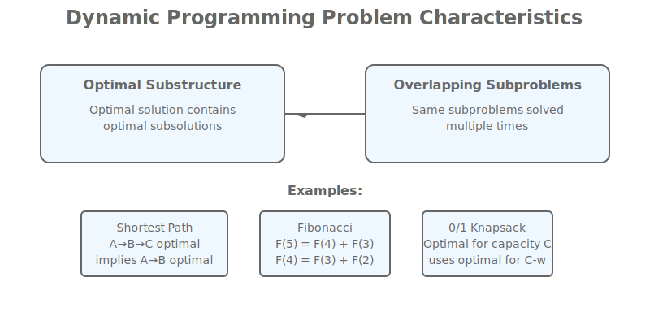
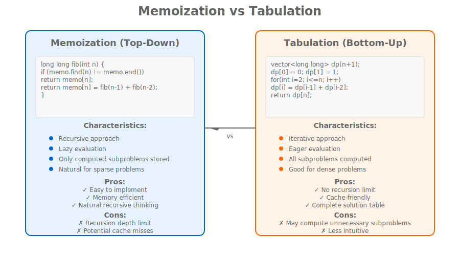

# Lesson 16.1: Memoization, Tabulation, and Dynamic Programming Principles

## Hook: The Power of Remembering Past Computations

Imagine you're climbing a mountain with multiple paths, and you keep encountering the same scenic viewpoints from different routes. Instead of describing each viewpoint every time you reach it, you remember your first description and reuse it. This is the essence of **dynamic programming** - solving complex problems by breaking them down and remembering solutions to subproblems.

In this lesson, we'll explore the fundamental principles of dynamic programming: memoization vs tabulation, optimal substructure, overlapping subproblems, and when to apply these powerful techniques in modern C++.

## Roadmap: Module 16 Overview

This lesson explores the core principles of dynamic programming:

1. **Problem Definition**: Understanding DP characteristics and applications
2. **Memoization**: Top-down approach with recursion and caching
3. **Tabulation**: Bottom-up approach with iterative table filling
4. **Optimal Substructure**: Breaking problems into smaller optimal solutions
5. **Overlapping Subproblems**: Identifying redundant computations
6. **DP vs Other Techniques**: When to choose dynamic programming
7. **Advanced Patterns**: Common DP problem-solving strategies

## What is Dynamic Programming?

### The Core Idea

Dynamic Programming (DP) is a method for solving complex problems by breaking them down into simpler subproblems, solving each subproblem only once, and storing their solutions for reuse.

### Key Characteristics

**Optimal Substructure**: A problem exhibits optimal substructure if an optimal solution to the problem contains optimal solutions to its subproblems.

**Overlapping Subproblems**: A problem has overlapping subproblems if the same subproblems are solved multiple times in a recursive solution.

### When to Use DP

- **Optimization problems** with optimal substructure
- **Counting problems** with overlapping subproblems
- **Problems with exponential naive solutions** that can be optimized
- **Sequence alignment, resource allocation, path finding**



## Memoization: Top-Down Dynamic Programming

### The Concept

Memoization is a top-down approach where we solve the problem recursively but cache the results of expensive function calls to avoid redundant computations.

### Basic Structure

```cpp
#include <vector>
#include <unordered_map>
#include <functional>
#include <iostream>

// Generic memoization wrapper
template<typename ReturnType, typename... Args>
class MemoizedFunction {
private:
    std::function<ReturnType(Args...)> function_;
    mutable std::unordered_map<std::tuple<Args...>, ReturnType> cache_;

public:
    MemoizedFunction(std::function<ReturnType(Args...)> func)
        : function_(std::move(func)) {}

    ReturnType operator()(Args... args) const {
        std::tuple<Args...> key = {args...};

        if (cache_.find(key) == cache_.end()) {
            cache_[key] = function_(args...);
        }

        return cache_[key];
    }

    void clear_cache() {
        cache_.clear();
    }

    size_t cache_size() const {
        return cache_.size();
    }
};
```

### Fibonacci Example

```cpp
#include <unordered_map>
#include <iostream>
#include <chrono>

// Naive recursive Fibonacci (exponential time)
long long fibonacci_naive(int n) {
    if (n <= 1) return n;
    return fibonacci_naive(n - 1) + fibonacci_naive(n - 2);
}

// Memoized Fibonacci (linear time)
class FibonacciMemo {
private:
    std::unordered_map<int, long long> memo_;

public:
    long long compute(int n) {
        if (n <= 1) return n;

        if (memo_.find(n) != memo_.end()) {
            return memo_[n];
        }

        long long result = compute(n - 1) + compute(n - 2);
        memo_[n] = result;
        return result;
    }

    void clear_cache() {
        memo_.clear();
    }

    size_t cache_size() const {
        return memo_.size();
    }
};

// Advanced memoization with lambda
long long fibonacci_memoized(int n) {
    static std::unordered_map<int, long long> memo;

    if (n <= 1) return n;
    if (memo.find(n) != memo.end()) return memo[n];

    long long result = fibonacci_memoized(n - 1) + fibonacci_memoized(n - 2);
    memo[n] = result;
    return result;
}
```

### Performance Comparison

```cpp
int main() {
    const int N = 40;

    // Naive approach
    auto start = std::chrono::high_resolution_clock::now();
    long long naive_result = fibonacci_naive(N);
    auto end = std::chrono::high_resolution_clock::now();
    auto naive_duration = std::chrono::duration_cast<std::chrono::milliseconds>(end - start);

    // Memoized approach
    FibonacciMemo fib_memo;
    start = std::chrono::high_resolution_clock::now();
    long long memo_result = fib_memo.compute(N);
    end = std::chrono::high_resolution_clock::now();
    auto memo_duration = std::chrono::duration_cast<std::chrono::milliseconds>(end - start);

    std::cout << "Fibonacci(" << N << ") = " << naive_result << " (naive: " << naive_duration.count() << "ms)\n";
    std::cout << "Fibonacci(" << N << ") = " << memo_result << " (memoized: " << memo_duration.count() << "ms)\n";
    std::cout << "Cache size: " << fib_memo.cache_size() << " entries\n";

    return 0;
}
```

### Memoization Advantages

- **Natural recursive thinking**: Follows problem decomposition naturally
- **Lazy evaluation**: Only computes needed subproblems
- **Space efficient**: Only stores accessed subproblems
- **Easy to implement**: Simple cache addition to recursive functions

### Memoization Limitations

- **Recursion depth**: Limited by stack size for deep recursion
- **Cache misses**: Potential for cache misses in sparse access patterns
- **Memory overhead**: Hash map storage for complex keys

## Tabulation: Bottom-Up Dynamic Programming

### The Concept

Tabulation is a bottom-up approach where we solve all subproblems iteratively, starting from the smallest and building up to the solution.

### Basic Structure

```cpp
#include <vector>
#include <iostream>

// Generic tabulation framework
template<typename T>
class DPTabulation {
protected:
    std::vector<T> dp_table_;
    size_t size_;

public:
    DPTabulation(size_t size) : size_(size), dp_table_(size) {}

    virtual void compute() = 0; // Pure virtual for specific DP logic

    const std::vector<T>& get_table() const {
        return dp_table_;
    }

    T get_result() const {
        return dp_table_.back();
    }

    void print_table() const {
        std::cout << "DP Table: ";
        for (const auto& val : dp_table_) {
            std::cout << val << " ";
        }
        std::cout << "\n";
    }
};
```

### Fibonacci with Tabulation

```cpp
#include <vector>
#include <iostream>

// Tabulated Fibonacci
class FibonacciTabulation {
private:
    std::vector<long long> dp_;

public:
    FibonacciTabulation(int n) {
        dp_.resize(n + 1, 0);
        if (n >= 0) dp_[0] = 0;
        if (n >= 1) dp_[1] = 1;

        for (int i = 2; i <= n; ++i) {
            dp_[i] = dp_[i - 1] + dp_[i - 2];
        }
    }

    long long get(int n) const {
        if (n < 0 || n >= static_cast<int>(dp_.size())) return 0;
        return dp_[n];
    }

    const std::vector<long long>& get_table() const {
        return dp_;
    }

    void print_table() const {
        std::cout << "Fibonacci DP Table:\n";
        for (size_t i = 0; i < dp_.size(); ++i) {
            std::cout << "F(" << i << ") = " << dp_[i] << "\n";
        }
    }
};
```

### Advanced Tabulation: Longest Increasing Subsequence

```cpp
#include <vector>
#include <algorithm>
#include <iostream>

// Longest Increasing Subsequence using tabulation
class LongestIncreasingSubsequence {
private:
    std::vector<int> sequence_;
    std::vector<int> dp_;      // dp[i] = length of LIS ending at index i
    std::vector<int> prev_;    // prev[i] = previous index in LIS

public:
    LongestIncreasingSubsequence(const std::vector<int>& seq)
        : sequence_(seq), dp_(seq.size(), 1), prev_(seq.size(), -1) {
        compute();
    }

private:
    void compute() {
        for (size_t i = 1; i < sequence_.size(); ++i) {
            for (size_t j = 0; j < i; ++j) {
                if (sequence_[j] < sequence_[i] && dp_[i] < dp_[j] + 1) {
                    dp_[i] = dp_[j] + 1;
                    prev_[i] = j;
                }
            }
        }
    }

public:
    int get_length() const {
        if (dp_.empty()) return 0;
        return *std::max_element(dp_.begin(), dp_.end());
    }

    std::vector<int> get_sequence() const {
        if (dp_.empty()) return {};

        // Find index with maximum dp value
        size_t max_idx = 0;
        for (size_t i = 1; i < dp_.size(); ++i) {
            if (dp_[i] > dp_[max_idx]) {
                max_idx = i;
            }
        }

        // Reconstruct sequence
        std::vector<int> result;
        size_t current = max_idx;
        while (current != static_cast<size_t>(-1)) {
            result.push_back(sequence_[current]);
            current = prev_[current];
        }
        std::reverse(result.begin(), result.end());
        return result;
    }

    void print_dp_table() const {
        std::cout << "LIS DP Table:\n";
        std::cout << "Index | Value | Length | Prev\n";
        for (size_t i = 0; i < sequence_.size(); ++i) {
            std::cout << std::setw(5) << i << " | "
                      << std::setw(5) << sequence_[i] << " | "
                      << std::setw(6) << dp_[i] << " | "
                      << std::setw(4) << prev_[i] << "\n";
        }
    }
};
```

### Tabulation Advantages

- **No recursion limit**: Avoids stack overflow for large problems
- **Cache-friendly**: Sequential memory access patterns
- **Complete solution**: Computes all subproblems (useful for reconstruction)
- **Predictable space**: Known memory requirements upfront

### Tabulation Limitations

- **All subproblems computed**: May compute unnecessary subproblems
- **Space intensive**: Stores all subproblems even if not all needed
- **Less intuitive**: Requires thinking about problem dependencies

## Memoization vs Tabulation: A Detailed Comparison

### When to Choose Memoization

```cpp
// Use memoization when:
// 1. Recursive solution is natural
// 2. Not all subproblems need to be solved
// 3. Sparse access pattern
// 4. Limited memory available

long long grid_paths_memo(int m, int n) {
    static std::unordered_map<std::string, long long> memo;

    if (m == 0 || n == 0) return 1;

    std::string key = std::to_string(m) + "," + std::to_string(n);
    if (memo.find(key) != memo.end()) return memo[key];

    long long result = grid_paths_memo(m - 1, n) + grid_paths_memo(m, n - 1);
    memo[key] = result;
    return result;
}
```

### When to Choose Tabulation

```cpp
// Use tabulation when:
// 1. All subproblems need to be solved
// 2. Dependencies are clear and sequential
// 3. Need complete DP table for reconstruction
// 4. Memory is not a major constraint

long long grid_paths_tabulation(int m, int n) {
    std::vector<std::vector<long long>> dp(m + 1, std::vector<long long>(n + 1, 0));

    // Base cases
    for (int i = 0; i <= m; ++i) dp[i][0] = 1;
    for (int j = 0; j <= n; ++j) dp[0][j] = 1;

    // Fill table
    for (int i = 1; i <= m; ++i) {
        for (int j = 1; j <= n; ++j) {
            dp[i][j] = dp[i - 1][j] + dp[i][j - 1];
        }
    }

    return dp[m][n];
}
```

### Performance Comparison

<table style="border-collapse: collapse;">
<thead>
<tr><th style="padding: 8px; border: 1px solid #ddd;">Aspect</th><th style="padding: 8px; border: 1px solid #ddd;">Memoization</th><th style="padding: 8px; border: 1px solid #ddd;">Tabulation</th></tr>
</thead>
<tbody>
<tr><td style="padding: 8px; border: 1px solid #ddd;">Approach</td><td style="padding: 8px; border: 1px solid #ddd;">Top-down</td><td style="padding: 8px; border: 1px solid #ddd;">Bottom-up</td></tr>
<tr><td style="padding: 8px; border: 1px solid #ddd;">Recursion</td><td style="padding: 8px; border: 1px solid #ddd;">Yes</td><td style="padding: 8px; border: 1px solid #ddd;">No</td></tr>
<tr><td style="padding: 8px; border: 1px solid #ddd;">Space Usage</td><td style="padding: 8px; border: 1px solid #ddd;">Only computed subproblems</td><td style="padding: 8px; border: 1px solid #ddd;">All subproblems</td></tr>
<tr><td style="padding: 8px; border: 1px solid #ddd;">Cache Misses</td><td style="padding: 8px; border: 1px solid #ddd;">Possible</td><td style="padding: 8px; border: 1px solid #ddd;">None</td></tr>
<tr><td style="padding: 8px; border: 1px solid #ddd;">Reconstruction</td><td style="padding: 8px; border: 1px solid #ddd;">Difficult</td><td style="padding: 8px; border: 1px solid #ddd;">Easy</td></tr>
<tr><td style="padding: 8px; border: 1px solid #ddd;">Best For</td><td style="padding: 8px; border: 1px solid #ddd;">Sparse problems</td><td style="padding: 8px; border: 1px solid #ddd;">Dense problems</td></tr>
</tbody>
</table>

## Optimal Substructure and Overlapping Subproblems

### Optimal Substructure

A problem has optimal substructure if the optimal solution can be constructed from optimal solutions of its subproblems.

**Examples:**

- Shortest path: shortest path to destination uses shortest paths to intermediate nodes
- Matrix chain multiplication: optimal parenthesization uses optimal sub-parenthesizations
- Knapsack: optimal selection includes optimal selections for smaller capacities

### Testing for Optimal Substructure

```cpp
// Example: Testing if a problem has optimal substructure
bool has_optimal_substructure(const std::vector<int>& problem) {
    // For shortest path: check if path A->C via B is shorter than direct A->C
    // For knapsack: check if optimal solution contains optimal subsolutions

    // This is problem-specific logic
    return true; // Placeholder
}
```

### Overlapping Subproblems

A problem has overlapping subproblems if the same subproblems are solved multiple times in a naive recursive solution.

**Detection:**

- Same function called with same parameters multiple times
- Exponential time complexity in naive recursion
- Subproblems can be cached effectively

### Visualizing Overlapping Subproblems



## Advanced DP Patterns and Techniques

### 1. State Compression

```cpp
// Using bitmasks for subset DP
class SubsetSumDP {
private:
    std::vector<int> nums_;
    std::vector<std::vector<bool>> dp_; // dp[i][sum] = can achieve sum using first i elements

public:
    SubsetSumDP(const std::vector<int>& nums) : nums_(nums) {
        int n = nums.size();
        int max_sum = 0;
        for (int num : nums) max_sum += num;

        dp_ = std::vector<std::vector<bool>>(n + 1, std::vector<bool>(max_sum + 1, false));
        dp_[0][0] = true; // Empty subset sums to 0

        for (int i = 1; i <= n; ++i) {
            for (int sum = 0; sum <= max_sum; ++sum) {
                // Don't take current element
                dp_[i][sum] = dp_[i - 1][sum];

                // Take current element if possible
                if (sum >= nums_[i - 1]) {
                    dp_[i][sum] = dp_[i][sum] || dp_[i - 1][sum - nums_[i - 1]];
                }
            }
        }
    }

    bool can_achieve_sum(int target) const {
        if (target < 0) return false;
        return dp_.back()[target];
    }
};
```

### 2. Space Optimization Techniques

```cpp
// Optimize space by using rolling arrays
class SpaceOptimizedDP {
public:
    // Example: Edit distance with O(min(m,n)) space
    static int edit_distance(const std::string& s1, const std::string& s2) {
        int m = s1.length(), n = s2.length();
        if (m > n) return edit_distance(s2, s1); // Ensure m <= n

        std::vector<int> prev(n + 1);
        std::vector<int> curr(n + 1);

        // Initialize first row
        for (int j = 0; j <= n; ++j) {
            prev[j] = j;
        }

        for (int i = 1; i <= m; ++i) {
            curr[0] = i; // First column

            for (int j = 1; j <= n; ++j) {
                if (s1[i - 1] == s2[j - 1]) {
                    curr[j] = prev[j - 1];
                } else {
                    curr[j] = 1 + std::min({prev[j], curr[j - 1], prev[j - 1]});
                }
            }

            prev = curr;
        }

        return prev[n];
    }
};
```

### 3. DP with Multiple States

```cpp
// DP with multiple dimensions/states
class MultiStateDP {
public:
    // Example: House robber with circular constraint
    static int house_robber_circular(const std::vector<int>& nums) {
        int n = nums.size();
        if (n == 0) return 0;
        if (n == 1) return nums[0];

        // Two states: rob first house or not
        auto rob_linear = [](const std::vector<int>& houses) -> int {
            int n = houses.size();
            if (n == 0) return 0;

            std::vector<int> dp(n + 1, 0);
            dp[1] = houses[0];

            for (int i = 2; i <= n; ++i) {
                dp[i] = std::max(dp[i - 1], dp[i - 2] + houses[i - 1]);
            }

            return dp[n];
        };

        // Case 1: Don't rob first house
        std::vector<int> case1(nums.begin() + 1, nums.end());

        // Case 2: Don't rob last house
        std::vector<int> case2(nums.begin(), nums.end() - 1);

        return std::max(rob_linear(case1), rob_linear(case2));
    }
};
```

## Common DP Problem Categories

### 1. Sequence DP

- **Longest Common Subsequence**
- **Edit Distance**
- **String Matching**
- **Palindrome Detection**

### 2. Optimization DP

- **Knapsack Problems**
- **Resource Allocation**
- **Path Optimization**
- **Scheduling Problems**

### 3. Counting DP

- **Ways to Reach Target**
- **Combinations/Sum Problems**
- **Grid Path Counting**
- **Subset Counting**

### 4. Game Theory DP

- **Minimax with Memoization**
- **Optimal Game Strategies**
- **State Space Search**

## DP vs Other Algorithmic Paradigms

### DP vs Divide and Conquer

<table style="border-collapse: collapse;">
<thead>
<tr><th style="padding: 8px; border: 1px solid #ddd;">Aspect</th><th style="padding: 8px; border: 1px solid #ddd;">Divide & Conquer</th><th style="padding: 8px; border: 1px solid #ddd;">Dynamic Programming</th></tr>
</thead>
<tbody>
<tr><td style="padding: 8px; border: 1px solid #ddd;">Subproblems</td><td style="padding: 8px; border: 1px solid #ddd;">Independent</td><td style="padding: 8px; border: 1px solid #ddd;">Overlapping</td></tr>
<tr><td style="padding: 8px; border: 1px solid #ddd;">Optimal Substructure</td><td style="padding: 8px; border: 1px solid #ddd;">Required</td><td style="padding: 8px; border: 1px solid #ddd;">Required</td></tr>
<tr><td style="padding: 8px; border: 1px solid #ddd;">Examples</td><td style="padding: 8px; border: 1px solid #ddd;">Merge Sort, Quick Sort</td><td style="padding: 8px; border: 1px solid #ddd;">Fibonacci, Knapsack</td></tr>
<tr><td style="padding: 8px; border: 1px solid #ddd;">Time Complexity</td><td style="padding: 8px; border: 1px solid #ddd;">O(n log n)</td><td style="padding: 8px; border: 1px solid #ddd;">Problem dependent</td></tr>
</tbody>
</table>

### DP vs Greedy Algorithms

<table style="border-collapse: collapse;">
<thead>
<tr><th style="padding: 8px; border: 1px solid #ddd;">Aspect</th><th style="padding: 8px; border: 1px solid #ddd;">Greedy</th><th style="padding: 8px; border: 1px solid #ddd;">Dynamic Programming</th></tr>
</thead>
<tbody>
<tr><td style="padding: 8px; border: 1px solid #ddd;">Choice Property</td><td style="padding: 8px; border: 1px solid #ddd;">Local optimal = Global optimal</td><td style="padding: 8px; border: 1px solid #ddd;">May need to explore all choices</td></tr>
<tr><td style="padding: 8px; border: 1px solid #ddd;">Efficiency</td><td style="padding: 8px; border: 1px solid #ddd;">Very fast</td><td style="padding: 8px; border: 1px solid #ddd;">Slower but optimal</td></tr>
<tr><td style="padding: 8px; border: 1px solid #ddd;">Correctness</td><td style="padding: 8px; border: 1px solid #ddd;">May be incorrect</td><td style="padding: 8px; border: 1px solid #ddd;">Always correct (if applicable)</td></tr>
<tr><td style="padding: 8px; border: 1px solid #ddd;">Examples</td><td style="padding: 8px; border: 1px solid #ddd;">Huffman Coding, Fractional Knapsack</td><td style="padding: 8px; border: 1px solid #ddd;">0/1 Knapsack, TSP</td></tr>
</tbody>
</table>

## Implementation Best Practices

### 1. Choosing the Right Approach

```cpp
// Decision framework for DP implementation
enum class DPApproach {
    MEMOIZATION,
    TABULATION,
    HYBRID
};

DPApproach choose_dp_approach(const ProblemCharacteristics& problem) {
    if (problem.sparse_access && problem.recursive_natural) {
        return DPApproach::MEMOIZATION;
    } else if (problem.needs_all_subproblems || problem.sequential_dependencies) {
        return DPApproach::TABULATION;
    } else {
        return DPApproach::HYBRID;
    }
}
```

### 2. Memory Management

```cpp
// Smart cache management
template<typename Key, typename Value>
class SmartCache {
private:
    std::unordered_map<Key, Value> cache_;
    size_t max_size_;

public:
    SmartCache(size_t max_size) : max_size_(max_size) {}

    std::optional<Value> get(const Key& key) {
        auto it = cache_.find(key);
        if (it != cache_.end()) {
            return it->second;
        }
        return std::nullopt;
    }

    void put(const Key& key, const Value& value) {
        if (cache_.size() >= max_size_) {
            // LRU eviction or other strategy
            cache_.erase(cache_.begin());
        }
        cache_[key] = value;
    }

    void clear() {
        cache_.clear();
    }
};
```

### 3. Debugging DP Solutions

```cpp
// DP debugging utilities
class DPDebugger {
public:
    template<typename T>
    static void print_2d_table(const std::vector<std::vector<T>>& table,
                              const std::string& title = "DP Table") {
        std::cout << title << ":\n";
        for (size_t i = 0; i < table.size(); ++i) {
            std::cout << "Row " << i << ": ";
            for (const auto& val : table[i]) {
                std::cout << std::setw(4) << val << " ";
            }
            std::cout << "\n";
        }
    }

    template<typename T>
    static void validate_dp_table(const std::vector<std::vector<T>>& table) {
        // Check for common DP errors
        if (table.empty() || table[0].empty()) {
            throw std::runtime_error("DP table is empty");
        }

        size_t row_size = table[0].size();
        for (size_t i = 1; i < table.size(); ++i) {
            if (table[i].size() != row_size) {
                throw std::runtime_error("DP table rows have inconsistent sizes");
            }
        }
    }
};
```

## Summary

Dynamic Programming is a powerful paradigm for solving optimization and counting problems through systematic problem decomposition and solution reuse.

**Key Takeaways:**

- **Memoization**: Top-down with caching, natural for recursive thinking
- **Tabulation**: Bottom-up with tables, avoids recursion limits
- **Optimal Substructure**: Problems solvable by combining optimal subsolutions
- **Overlapping Subproblems**: Same subproblems solved multiple times
- **Choice**: Depends on problem characteristics and constraints

Mastering DP requires recognizing these patterns and choosing the appropriate implementation strategy for each problem type.

## Cheat Sheet: Dynamic Programming Implementation

**Step 1: Identify DP Characteristics**

- Optimal substructure?
- Overlapping subproblems?
- Can subproblems be cached?

**Step 2: Choose Approach**

- Sparse access → Memoization
- Dense computation → Tabulation
- Complex dependencies → Hybrid

**Step 3: Define State**

- What parameters define a subproblem?
- What is the state space size?

**Step 4: Define Transitions**

- How to compute solution from subproblems?
- What are the base cases?

**Step 5: Optimize Space**

- Can rolling arrays be used?
- Are all subproblems needed?

## Key Takeaways

1. **Memoization**: Top-down DP with recursive caching for natural problem decomposition
2. **Tabulation**: Bottom-up DP with iterative table filling for complete solution computation
3. **Optimal Substructure**: Problems where optimal solutions contain optimal subsolutions
4. **Overlapping Subproblems**: Problems with redundant subproblem computations
5. **Implementation Choice**: Depends on problem sparsity, recursion depth, and memory constraints
6. **Space Optimization**: Techniques like rolling arrays can reduce memory usage significantly
7. **Debugging**: Table visualization and validation are crucial for correct DP implementations

## Practice Exercises

1. **Implement memoized vs tabulated Fibonacci** and compare performance
2. **Solve Longest Common Subsequence** using both memoization and tabulation
3. **Implement space-optimized edit distance** with rolling arrays
4. **Create a generic memoization wrapper** for any recursive function
5. **Solve the coin change problem** with multiple DP approaches

## Journal Prompts

- How does DP change your approach to problem-solving?
- When should you suspect a problem requires DP?
- What are the trade-offs between memoization and tabulation?
- How can you recognize optimal substructure in new problems?

Mastering dynamic programming opens doors to solving complex optimization problems efficiently - a cornerstone of algorithmic mastery.
