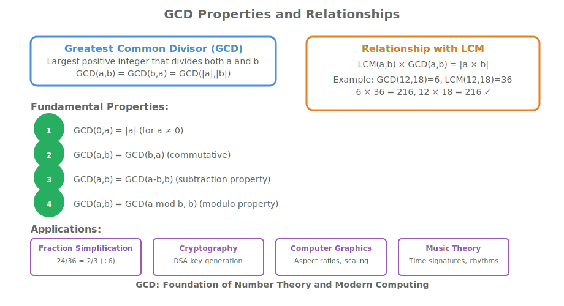

# Module 12: Euclidean Algorithm & Number Theory Fundamentals

## Hook: The Greatest Common Divisor Mystery

Imagine you're building a music streaming service that needs to display song durations in the most readable format. You have two songs: one is 3 minutes 24 seconds long, and another is 4 minutes 48 seconds long. What's the largest time unit that can evenly divide both durations? How would you find the greatest common divisor of 204 and 288 seconds?

This is where the Euclidean algorithm shines - a 2,300-year-old mathematical technique that efficiently finds the greatest common divisor (GCD) of two numbers. Beyond music apps, this algorithm powers modern cryptography, computer graphics, and even the layout engines in web browsers.

The beauty of the Euclidean algorithm lies in its simplicity: repeatedly subtracting the smaller number from the larger one until you reach zero, revealing the GCD that underlies both original numbers.

## Roadmap: Your Journey Through Number Theory

In this advanced module, you'll master the Euclidean algorithm and its applications:

1. **GCD Fundamentals**: Understanding greatest common divisors and their properties
2. **Euclidean Algorithm**: The classic subtraction-based approach
3. **Extended Euclidean Algorithm**: Finding integer solutions to linear Diophantine equations
4. **Number Theory Applications**: Modular arithmetic, cryptography foundations
5. **Computational Complexity**: Why the algorithm is so efficient
6. **Real-world Implementations**: From cryptography to computer graphics
7. **Advanced Extensions**: Binary GCD and modern optimizations

By the end of this module, you'll understand how this ancient algorithm powers modern computing systems and can implement it efficiently in C++.

## Concept Deep Dive: Greatest Common Divisors

The greatest common divisor (GCD) of two integers is the largest positive integer that divides both numbers without leaving a remainder.

### GCD Properties



### Why GCD Matters

Understanding GCD is fundamental to:

- **Fraction Simplification**: Reducing fractions to lowest terms
- **Cryptography**: RSA algorithm relies on GCD properties
- **Computer Graphics**: Aspect ratio calculations and scaling
- **Resource Allocation**: Fair distribution problems
- **Error Detection**: Checksum algorithms

## The Euclidean Algorithm: Ancient Wisdom in Modern Code

The Euclidean algorithm, attributed to Euclid around 300 BCE, finds the GCD of two numbers through repeated subtraction.

### Basic Principle

If we have two numbers a > b > 0, then:

- GCD(a, b) = GCD(b, a - b) if a > b
- GCD(a, b) = GCD(a, b - a) if b > a

This process continues until one number becomes zero, at which point the other number is the GCD.

### Example: GCD(48, 18)

```
GCD(48, 18) = GCD(18, 48-18) = GCD(18, 30)
GCD(18, 30) = GCD(18, 30-18) = GCD(18, 12)
GCD(18, 12) = GCD(12, 18-12) = GCD(12, 6)
GCD(12, 6) = GCD(6, 12-6) = GCD(6, 6)
GCD(6, 6) = GCD(6, 6-6) = GCD(6, 0)
```

When we reach GCD(6, 0), the algorithm terminates with GCD = 6.

## Euclidean Algorithm Implementation

### Basic Recursive Implementation

```cpp
#include <iostream>

// Basic recursive Euclidean algorithm
int gcd_recursive(int a, int b) {
    // Ensure a >= b by swapping if necessary
    if (a < b) {
        std::swap(a, b);
    }

    // Base case: if b is 0, GCD is a
    if (b == 0) {
        return a;
    }

    // Recursive case: GCD(a, b) = GCD(b, a % b)
    return gcd_recursive(b, a % b);
}

int main() {
    std::cout << "GCD(48, 18) = " << gcd_recursive(48, 18) << std::endl;
    std::cout << "GCD(100, 75) = " << gcd_recursive(100, 75) << std::endl;
    std::cout << "GCD(17, 13) = " << gcd_recursive(17, 13) << std::endl;
    return 0;
}
```

### Iterative Implementation

```cpp
#include <iostream>
#include <algorithm>

// Iterative Euclidean algorithm using modulo operator
int gcd_iterative(int a, int b) {
    // Handle negative numbers by taking absolute values
    a = std::abs(a);
    b = std::abs(b);

    // Ensure a >= b
    if (a < b) {
        std::swap(a, b);
    }

    // Iterate until b becomes 0
    while (b != 0) {
        int temp = b;
        b = a % b;
        a = temp;
    }

    return a;
}

int main() {
    std::cout << "GCD(48, 18) = " << gcd_iterative(48, 18) << std::endl;
    std::cout << "GCD(100, 75) = " << gcd_iterative(100, 75) << std::endl;
    std::cout << "GCD(17, 13) = " << gcd_iterative(17, 13) << std::endl;
    std::cout << "GCD(0, 5) = " << gcd_iterative(0, 5) << std::endl;
    return 0;
}
```

### Performance Analysis

The Euclidean algorithm is remarkably efficient:

- **Time Complexity**: O(log min(a,b)) - logarithmic in the smaller number
- **Space Complexity**: O(1) for iterative, O(log min(a,b)) for recursive
- **Worst Case**: When numbers are consecutive Fibonacci numbers

## Extended Euclidean Algorithm

The extended Euclidean algorithm not only finds the GCD but also finds integers x and y such that:

ax + by = GCD(a, b)

This is crucial for solving linear Diophantine equations and modular inverse calculations.

### Mathematical Foundation

For any integers a and b, there exist integers x and y such that:

ax + by = GCD(a, b)

### Implementation

```cpp
#include <iostream>
#include <tuple>

// Extended Euclidean algorithm
// Returns tuple: (gcd, x, y) where a*x + b*y = gcd
std::tuple<int, int, int> extended_gcd(int a, int b) {
    if (b == 0) {
        // Base case: gcd(a, 0) = a, and a*1 + 0*0 = a
        return std::make_tuple(a, 1, 0);
    }

    // Recursive call
    auto [gcd, x1, y1] = extended_gcd(b, a % b);

    // Update coefficients
    int x = y1;
    int y = x1 - (a / b) * y1;

    return std::make_tuple(gcd, x, y);
}

int main() {
    int a = 48, b = 18;
    auto [gcd, x, y] = extended_gcd(a, b);

    std::cout << "GCD(" << a << ", " << b << ") = " << gcd << std::endl;
    std::cout << "Coefficients: " << x << " * " << a << " + " << y << " * " << b << " = " << gcd << std::endl;
    std::cout << "Verification: " << x * a + y * b << " = " << gcd << std::endl;

    return 0;
}
```

## Modular Inverse & Cryptography Applications

One of the most important applications of the extended Euclidean algorithm is finding modular inverses, which is fundamental to RSA cryptography.

### Modular Inverse

A modular inverse of a modulo m exists if and only if GCD(a, m) = 1. In this case, there exists b such that:

a * b ≡ 1 (mod m)

### Implementation

```cpp
#include <iostream>
#include <optional>

// Find modular inverse using extended Euclidean algorithm
std::optional<int> mod_inverse(int a, int m) {
    auto [gcd, x, y] = extended_gcd(a, m);

    if (gcd != 1) {
        // No modular inverse exists
        return std::nullopt;
    }

    // Ensure positive result
    int result = (x % m + m) % m;
    return result;
}

int main() {
    int a = 7, m = 26;

    auto inverse = mod_inverse(a, m);
    if (inverse) {
        std::cout << "Modular inverse of " << a << " modulo " << m << " is " << *inverse << std::endl;
        std::cout << "Verification: " << a << " * " << *inverse << " ≡ " << (a * (*inverse) % m) << " (mod " << m << ")" << std::endl;
    } else {
        std::cout << "No modular inverse exists for " << a << " modulo " << m << std::endl;
    }

    return 0;
}
```

## Binary GCD Algorithm

The binary GCD algorithm (also known as Stein's algorithm) is an optimized version that works by repeatedly dividing by 2 and handling even/odd cases.

### Advantages

- **Faster**: Better constant factors than Euclidean algorithm
- **Bit Operations**: Uses shifts instead of modulo
- **No Division**: Avoids expensive division operations

### Implementation

```cpp
#include <iostream>

// Binary GCD algorithm (Stein's algorithm)
int binary_gcd(int a, int b) {
    // Handle negative numbers
    a = std::abs(a);
    b = std::abs(b);

    // Base cases
    if (a == 0) return b;
    if (b == 0) return a;
    if (a == b) return a;

    // Remove common factors of 2
    int shift = 0;
    while (((a | b) & 1) == 0) {
        a >>= 1;
        b >>= 1;
        shift++;
    }

    // Remove remaining factors of 2 from a
    while ((a & 1) == 0) {
        a >>= 1;
    }

    // Main loop
    while (b != 0) {
        // Remove factors of 2 from b
        while ((b & 1) == 0) {
            b >>= 1;
        }

        // Ensure a >= b
        if (a > b) {
            std::swap(a, b);
        }

        b -= a;
    }

    // Restore common factors of 2
    return a << shift;
}

int main() {
    std::cout << "Binary GCD(48, 18) = " << binary_gcd(48, 18) << std::endl;
    std::cout << "Binary GCD(100, 75) = " << binary_gcd(100, 75) << std::endl;
    std::cout << "Binary GCD(17, 13) = " << binary_gcd(17, 13) << std::endl;
    return 0;
}
```

## Least Common Multiple (LCM)

The least common multiple (LCM) of two numbers is the smallest positive integer that is divisible by both numbers.

### Relationship with GCD

LCM(a, b) *GCD(a, b) = a* b

### Implementation

```cpp
#include <iostream>

// Calculate LCM using GCD
long long lcm(int a, int b) {
    a = std::abs(a);
    b = std::abs(b);

    if (a == 0 || b == 0) {
        return 0;
    }

    // Use long long to avoid overflow
    return (static_cast<long long>(a) * b) / gcd_iterative(a, b);
}

int main() {
    std::cout << "LCM(4, 6) = " << lcm(4, 6) << std::endl;
    std::cout << "LCM(15, 20) = " << lcm(15, 20) << std::endl;
    std::cout << "LCM(7, 11) = " << lcm(7, 11) << std::endl;
    return 0;
}
```

## Applications in Computer Science

### 1. Fraction Simplification

```cpp
#include <iostream>
#include <string>

// Structure to represent a fraction
struct Fraction {
    int numerator;
    int denominator;

    void simplify() {
        int gcd = gcd_iterative(std::abs(numerator), std::abs(denominator));
        numerator /= gcd;
        denominator /= gcd;

        // Ensure denominator is positive
        if (denominator < 0) {
            numerator = -numerator;
            denominator = -denominator;
        }
    }

    std::string to_string() const {
        return std::to_string(numerator) + "/" + std::to_string(denominator);
    }
};

int main() {
    Fraction f{24, 36};
    std::cout << "Original: " << f.to_string() << std::endl;
    f.simplify();
    std::cout << "Simplified: " << f.to_string() << std::endl;
    return 0;
}
```

### 2. RSA Key Generation

```cpp
#include <iostream>
#include <vector>
#include <random>

// Simple primality test (for demonstration only)
bool is_prime(int n) {
    if (n <= 1) return false;
    if (n <= 3) return true;
    if (n % 2 == 0 || n % 3 == 0) return false;

    for (int i = 5; i * i <= n; i += 6) {
        if (n % i == 0 || n % (i + 2) == 0) return false;
    }
    return true;
}

// Generate RSA key pair (simplified demonstration)
struct RSAKeyPair {
    int n;      // modulus
    int e;      // public exponent
    int d;      // private exponent
};

RSAKeyPair generate_rsa_keypair(int p, int q) {
    int n = p * q;
    int phi = (p - 1) * (q - 1);

    // Choose e such that 1 < e < phi and gcd(e, phi) = 1
    int e = 65537; // Common choice for e
    if (gcd_iterative(e, phi) != 1) {
        e = 3; // Fallback
    }

    // Find d such that d * e ≡ 1 (mod phi)
    auto d_opt = mod_inverse(e, phi);
    int d = d_opt.value_or(0);

    return {n, e, d};
}

int main() {
    int p = 61, q = 53; // Small primes for demonstration
    auto keys = generate_rsa_keypair(p, q);

    std::cout << "RSA Key Pair:" << std::endl;
    std::cout << "n = " << keys.n << std::endl;
    std::cout << "e = " << keys.e << std::endl;
    std::cout << "d = " << keys.d << std::endl;
    return 0;
}
```

## Performance Comparison

Let's compare the performance of different GCD implementations:

```cpp
#include <iostream>
#include <chrono>
#include <vector>

// Function to measure execution time
template<typename Func>
long long measure_time(Func func, int iterations = 100000) {
    auto start = std::chrono::high_resolution_clock::now();

    for (int i = 0; i < iterations; ++i) {
        func();
    }

    auto end = std::chrono::high_resolution_clock::now();
    return std::chrono::duration_cast<std::chrono::microseconds>(end - start).count();
}

int main() {
    std::vector<std::pair<int, int>> test_cases = {
        {48, 18}, {100, 75}, {123456, 98765}, {999999, 888888}
    };

    std::cout << "Performance comparison (microseconds for 100k iterations):" << std::endl;
    std::cout << "Test Case\tRecursive\tIterative\tBinary" << std::endl;

    for (auto [a, b] : test_cases) {
        long long time_recursive = measure_time([a, b]() { gcd_recursive(a, b); });
        long long time_iterative = measure_time([a, b]() { gcd_iterative(a, b); });
        long long time_binary = measure_time([a, b]() { binary_gcd(a, b); });

        std::cout << a << "," << b << "\t\t"
                  << time_recursive << "\t\t"
                  << time_iterative << "\t\t"
                  << time_binary << std::endl;
    }

    return 0;
}
```

## Guided Walkthrough: Implementing GCD with Error Handling

Let's create a robust GCD implementation with comprehensive error handling:

```cpp
#include <iostream>
#include <stdexcept>
#include <limits>
#include <type_traits>

// Robust GCD implementation with error handling
template<typename T>
T robust_gcd(T a, T b) {
    // Ensure T is an integer type
    static_assert(std::is_integral<T>::value, "GCD requires integer types");

    // Handle potential overflow for signed types
    if constexpr (std::is_signed<T>::value) {
        if (a == std::numeric_limits<T>::min() || b == std::numeric_limits<T>::min()) {
            throw std::overflow_error("GCD input would cause overflow");
        }
    }

    // Convert to positive values
    T abs_a = std::abs(a);
    T abs_b = std::abs(b);

    // Handle zero inputs
    if (abs_a == 0 && abs_b == 0) {
        throw std::invalid_argument("GCD(0, 0) is undefined");
    }
    if (abs_a == 0) return abs_b;
    if (abs_b == 0) return abs_a;

    // Use binary GCD for efficiency
    return binary_gcd(abs_a, abs_b);
}

int main() {
    try {
        std::cout << "GCD(48, 18) = " << robust_gcd(48, 18) << std::endl;
        std::cout << "GCD(-48, 18) = " << robust_gcd(-48, 18) << std::endl;
        std::cout << "GCD(0, 5) = " << robust_gcd(0, 5) << std::endl;

        // This will throw an exception
        // std::cout << "GCD(0, 0) = " << robust_gcd(0, 0) << std::endl;

    } catch (const std::exception& e) {
        std::cerr << "Error: " << e.what() << std::endl;
    }

    return 0;
}
```

## Real-world Applications

### Computer Graphics: Aspect Ratio Calculations

```cpp
#include <iostream>

// Calculate simplified aspect ratio
struct AspectRatio {
    int width;
    int height;

    void simplify() {
        int gcd = gcd_iterative(width, height);
        width /= gcd;
        height /= gcd;
    }

    double ratio() const {
        return static_cast<double>(width) / height;
    }
};

int main() {
    AspectRatio ar{1920, 1080};
    std::cout << "Original: " << ar.width << ":" << ar.height << std::endl;
    ar.simplify();
    std::cout << "Simplified: " << ar.width << ":" << ar.height << std::endl;
    std::cout << "Ratio: " << ar.ratio() << std::endl;
    return 0;
}
```

### Music Theory: Time Signature Simplification

```cpp
#include <iostream>

// Simplify musical time signatures
struct TimeSignature {
    int beats;
    int note_value;

    void simplify() {
        int gcd = gcd_iterative(beats, note_value);
        beats /= gcd;
        note_value /= gcd;
    }
};

int main() {
    TimeSignature ts{6, 8};
    std::cout << "Original time signature: " << ts.beats << "/" << ts.note_value << std::endl;
    ts.simplify();
    std::cout << "Simplified time signature: " << ts.beats << "/" << ts.note_value << std::endl;
    return 0;
}
```

## Practice: Euclidean Algorithm Exercises

### Exercise 1: Basic GCD Calculations

Implement and test the Euclidean algorithm with various inputs:

```cpp
// Test cases for GCD
std::vector<std::pair<int, int>> test_cases = {
    {48, 18}, {100, 75}, {17, 13}, {1, 1}, {0, 5}, {5, 0}
};

for (auto [a, b] : test_cases) {
    int result = gcd_iterative(a, b);
    std::cout << "GCD(" << a << ", " << b << ") = " << result << std::endl;
}
```

### Exercise 2: Extended GCD Implementation

Create a complete implementation of the extended Euclidean algorithm:

```cpp
// Implement extended GCD and verify Bezout's identity
void test_extended_gcd(int a, int b) {
    auto [gcd, x, y] = extended_gcd(a, b);
    int verification = a * x + b * y;

    std::cout << "GCD(" << a << ", " << b << ") = " << gcd << std::endl;
    std::cout << "Bezout coefficients: " << x << ", " << y << std::endl;
    std::cout << "Verification: " << a << "*" << x << " + " << b << "*" << y << " = " << verification << std::endl;
    std::cout << "Match: " << (verification == gcd ? "Yes" : "No") << std::endl;
}
```

### Exercise 3: Modular Inverse Calculator

Build a modular inverse calculator for cryptographic applications:

```cpp
// Implement modular inverse with error handling
std::optional<int> safe_mod_inverse(int a, int m) {
    if (m <= 0) {
        return std::nullopt;
    }

    int gcd = gcd_iterative(a, m);
    if (gcd != 1) {
        return std::nullopt;
    }

    return mod_inverse(a, m);
}
```

### Exercise 4: Performance Benchmarking

Compare the performance of different GCD implementations:

```cpp
// Create a comprehensive benchmark comparing all three algorithms
void benchmark_gcd_algorithms() {
    // Large test cases
    std::vector<std::pair<int, int>> large_cases = {
        {123456789, 987654321},
        {999999999, 888888888},
        {fibonacci(30), fibonacci(29)}  // Consecutive Fibonacci numbers
    };

    // Measure and compare execution times
    for (auto [a, b] : large_cases) {
        // Time each algorithm
        // Compare results for correctness
    }
}
```

## Reflection: The Power of Ancient Mathematics

### Why the Euclidean Algorithm Endures

1. **Mathematical Elegance**: Simple principle with profound implications
2. **Computational Efficiency**: Logarithmic time complexity
3. **Ubiquitous Applications**: From cryptography to computer graphics
4. **Foundation of Number Theory**: Basis for advanced mathematical concepts

### Modern Optimizations

1. **Binary GCD**: Faster for large numbers using bit operations
2. **Hardware Acceleration**: Modern CPUs have GCD instructions
3. **Parallel Algorithms**: For computing GCD of multiple numbers
4. **Arbitrary Precision**: Extended to work with very large integers

### Connection to Other Algorithms

The Euclidean algorithm connects to:

- **Cryptography**: RSA key generation and digital signatures
- **Computer Algebra**: Polynomial GCD algorithms
- **Graph Theory**: Applications in network algorithms
- **Coding Theory**: Error-correcting codes

## Cheat Sheet: Euclidean Algorithm Quick Reference

### Basic Algorithm

```text
function gcd(a, b):
    while b ≠ 0:
        temp = b
        b = a mod b
        a = temp
    return a
```

### Extended Algorithm

```text
function extended_gcd(a, b):
    if b = 0:
        return (a, 1, 0)
    (gcd, x1, y1) = extended_gcd(b, a mod b)
    x = y1
    y = x1 - (a / b) * y1
    return (gcd, x, y)
```

### Key Properties

- **GCD(a,b) = GCD(b, a mod b)**
- **GCD(a,0) = a**
- **GCD(a,b) divides any linear combination of a and b**

### Time Complexity

- **Euclidean**: O(log min(a,b))
- **Binary GCD**: O(log min(a,b)) with better constants

## Key Takeaways

1. **Euclidean Algorithm**: Ancient, efficient method for finding GCD
2. **Extended Version**: Finds coefficients for Bezout's identity
3. **Modular Inverses**: Foundation of modern cryptography
4. **Binary Optimization**: Faster implementation using bit operations
5. **Real-world Applications**: Cryptography, graphics, music, and more
6. **Mathematical Foundation**: Connects to number theory and algebra
7. **Implementation Variants**: Recursive, iterative, and binary versions
8. **Performance Characteristics**: Logarithmic time, constant space

## Practice Checklist

- [ ] Implement basic Euclidean algorithm (recursive and iterative)
- [ ] Create extended Euclidean algorithm for Bezout coefficients
- [ ] Build modular inverse calculator for cryptography
- [ ] Compare performance of different GCD implementations
- [ ] Apply GCD to fraction simplification and aspect ratios
- [ ] Understand the mathematical foundations and properties
- [ ] Explore advanced applications in computer science

## Journal Prompts

1. How does the Euclidean algorithm demonstrate the connection between ancient mathematics and modern computing?
2. What makes the Euclidean algorithm so computationally efficient compared to other approaches?
3. How do the properties of GCD enable applications in cryptography and computer security?
4. What role does the Euclidean algorithm play in modern computer graphics and user interfaces?
5. How might the Euclidean algorithm be extended to work with polynomials or other mathematical structures?
6. What ethical implications arise from cryptographic systems that depend on the Euclidean algorithm?
7. How does the Euclidean algorithm connect to other areas of mathematics and computer science?
8. What new applications of the Euclidean algorithm might emerge with quantum computing?
