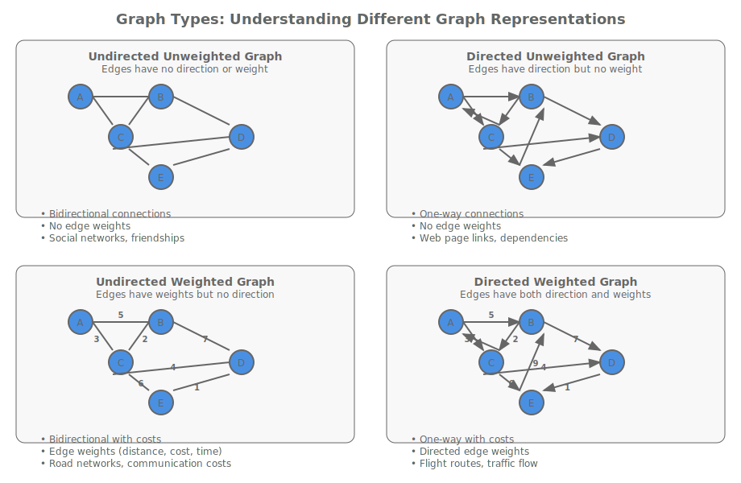
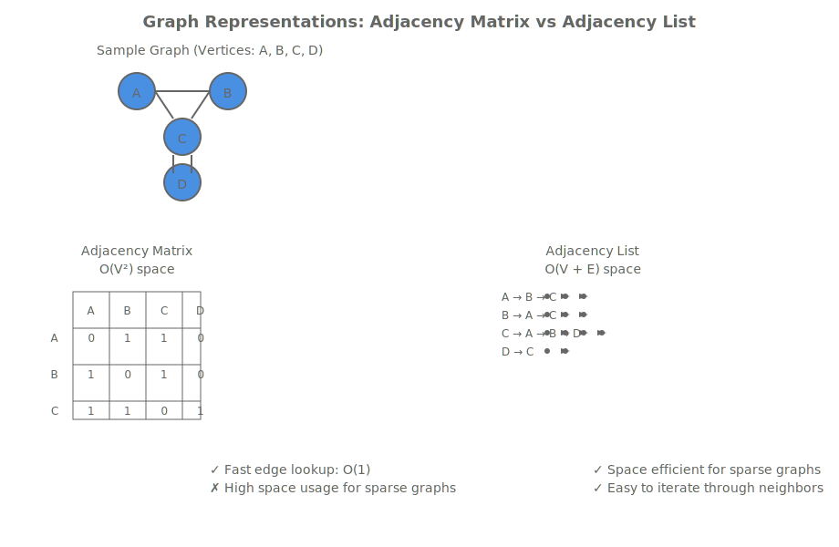
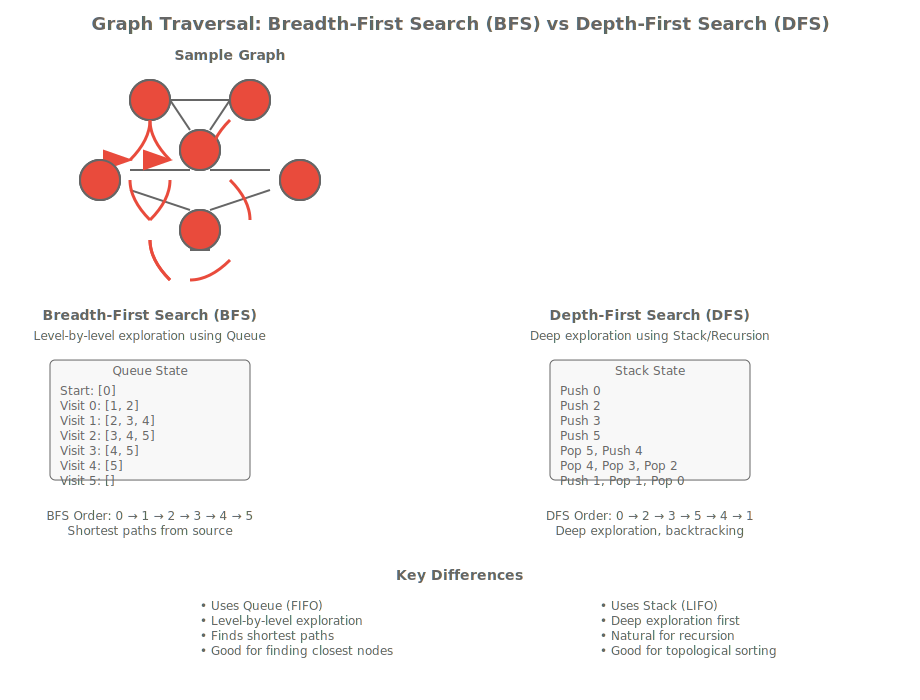

# Lesson 7.1: Graphs, Representations, and Basic Operations

## Introduction to Graph Theory

Graphs represent relationships between entities in a powerful and flexible data structure. Unlike trees that have a hierarchical structure, graphs can model complex networks where entities connect in arbitrary ways. From social networks to transportation systems, from computer networks to molecular structures, graphs provide the foundation for understanding connected systems.

A graph G consists of two sets:

- **Vertices** (also called nodes): The entities being modeled
- **Edges**: The relationships between vertices

Graphs can be:

- **Directed**: Edges have direction (one-way relationships)
- **Undirected**: Edges are bidirectional (mutual relationships)
- **Weighted**: Edges have associated costs or weights
- **Unweighted**: All edges are equivalent



## Graph Representations in C++

Choosing the right representation is crucial for performance. We'll explore the two most common approaches: adjacency matrices and adjacency lists.



### Adjacency Matrix Representation

An adjacency matrix uses a 2D array where matrix[i][j] indicates whether an edge exists between vertices i and j.

```cpp
#include <vector>
#include <iostream>

class AdjacencyMatrixGraph {
private:
    std::vector<std::vector<int>> matrix;
    int numVertices;
    bool directed;

public:
    AdjacencyMatrixGraph(int vertices, bool isDirected = false)
        : numVertices(vertices), directed(isDirected) {
        matrix.assign(vertices, std::vector<int>(vertices, 0));
    }

    // Add an edge between vertices u and v
    void addEdge(int u, int v, int weight = 1) {
        if (u >= 0 && u < numVertices && v >= 0 && v < numVertices) {
            matrix[u][v] = weight;
            if (!directed) {
                matrix[v][u] = weight; // Undirected graph
            }
        }
    }

    // Remove an edge between vertices u and v
    void removeEdge(int u, int v) {
        if (u >= 0 && u < numVertices && v >= 0 && v < numVertices) {
            matrix[u][v] = 0;
            if (!directed) {
                matrix[v][u] = 0;
            }
        }
    }

    // Check if edge exists between u and v
    bool hasEdge(int u, int v) const {
        if (u >= 0 && u < numVertices && v >= 0 && v < numVertices) {
            return matrix[u][v] != 0;
        }
        return false;
    }

    // Get weight of edge between u and v
    int getWeight(int u, int v) const {
        if (u >= 0 && u < numVertices && v >= 0 && v < numVertices) {
            return matrix[u][v];
        }
        return 0;
    }

    // Get all neighbors of vertex u
    std::vector<int> getNeighbors(int u) const {
        std::vector<int> neighbors;
        if (u >= 0 && u < numVertices) {
            for (int v = 0; v < numVertices; ++v) {
                if (matrix[u][v] != 0) {
                    neighbors.push_back(v);
                }
            }
        }
        return neighbors;
    }

    // Display the adjacency matrix
    void display() const {
        std::cout << "Adjacency Matrix:" << std::endl;
        for (int i = 0; i < numVertices; ++i) {
            for (int j = 0; j < numVertices; ++j) {
                std::cout << matrix[i][j] << " ";
            }
            std::cout << std::endl;
        }
    }

    int getNumVertices() const { return numVertices; }
    bool isDirected() const { return directed; }
};

int main() {
    // Create an undirected graph with 5 vertices
    AdjacencyMatrixGraph graph(5, false);

    // Add edges
    graph.addEdge(0, 1);
    graph.addEdge(0, 4);
    graph.addEdge(1, 2);
    graph.addEdge(1, 3);
    graph.addEdge(1, 4);
    graph.addEdge(2, 3);
    graph.addEdge(3, 4);

    graph.display();

    std::cout << "Neighbors of vertex 1: ";
    auto neighbors = graph.getNeighbors(1);
    for (int n : neighbors) {
        std::cout << n << " ";
    }
    std::cout << std::endl;

    return 0;
}
```

### Adjacency List Representation

Adjacency lists use an array of lists where each list contains the neighbors of a vertex. This is more space-efficient for sparse graphs.

```cpp
#include <vector>
#include <list>
#include <iostream>
#include <memory>

struct Edge {
    int to;
    int weight;

    Edge(int t, int w = 1) : to(t), weight(w) {}
};

class AdjacencyListGraph {
private:
    std::vector<std::list<std::shared_ptr<Edge>>> adjList;
    int numVertices;
    bool directed;

public:
    AdjacencyListGraph(int vertices, bool isDirected = false)
        : numVertices(vertices), directed(isDirected) {
        adjList.resize(vertices);
    }

    // Add an edge between vertices u and v
    void addEdge(int u, int v, int weight = 1) {
        if (u >= 0 && u < numVertices && v >= 0 && v < numVertices) {
            adjList[u].push_back(std::make_shared<Edge>(v, weight));
            if (!directed) {
                adjList[v].push_back(std::make_shared<Edge>(u, weight));
            }
        }
    }

    // Remove an edge between vertices u and v
    void removeEdge(int u, int v) {
        if (u >= 0 && u < numVertices && v >= 0 && v < numVertices) {
            // Remove u -> v
            adjList[u].remove_if([v](const std::shared_ptr<Edge>& edge) {
                return edge->to == v;
            });

            if (!directed) {
                // Remove v -> u for undirected graph
                adjList[v].remove_if([u](const std::shared_ptr<Edge>& edge) {
                    return edge->to == u;
                });
            }
        }
    }

    // Check if edge exists between u and v
    bool hasEdge(int u, int v) const {
        if (u >= 0 && u < numVertices) {
            for (const auto& edge : adjList[u]) {
                if (edge->to == v) {
                    return true;
                }
            }
        }
        return false;
    }

    // Get weight of edge between u and v
    int getWeight(int u, int v) const {
        if (u >= 0 && u < numVertices) {
            for (const auto& edge : adjList[u]) {
                if (edge->to == v) {
                    return edge->weight;
                }
            }
        }
        return 0;
    }

    // Get all neighbors of vertex u
    std::vector<int> getNeighbors(int u) const {
        std::vector<int> neighbors;
        if (u >= 0 && u < numVertices) {
            for (const auto& edge : adjList[u]) {
                neighbors.push_back(edge->to);
            }
        }
        return neighbors;
    }

    // Display the adjacency list
    void display() const {
        std::cout << "Adjacency List:" << std::endl;
        for (int i = 0; i < numVertices; ++i) {
            std::cout << i << ": ";
            for (const auto& edge : adjList[i]) {
                std::cout << "(" << edge->to << ", " << edge->weight << ") ";
            }
            std::cout << std::endl;
        }
    }

    int getNumVertices() const { return numVertices; }
    bool isDirected() const { return directed; }
};

int main() {
    // Create a directed graph with 5 vertices
    AdjacencyListGraph graph(5, true);

    // Add edges with weights
    graph.addEdge(0, 1, 4);
    graph.addEdge(0, 2, 1);
    graph.addEdge(1, 2, 2);
    graph.addEdge(1, 3, 5);
    graph.addEdge(2, 3, 8);
    graph.addEdge(2, 4, 10);
    graph.addEdge(3, 4, 6);

    graph.display();

    std::cout << "Neighbors of vertex 2: ";
    auto neighbors = graph.getNeighbors(2);
    for (int n : neighbors) {
        std::cout << n << " ";
    }
    std::cout << std::endl;

    std::cout << "Weight of edge 1->3: " << graph.getWeight(1, 3) << std::endl;

    return 0;
}
```

## Graph Traversal Algorithms

Traversal algorithms visit all vertices in a graph following certain rules. The two fundamental approaches are Breadth-First Search (BFS) and Depth-First Search (DFS).



### Breadth-First Search (BFS)

BFS explores the graph level by level, visiting all neighbors of a vertex before moving to the next level. It uses a queue to maintain the order of visitation.

```cpp
#include <vector>
#include <queue>
#include <iostream>
#include <set>

class GraphTraversal {
private:
    const AdjacencyListGraph& graph;

public:
    GraphTraversal(const AdjacencyListGraph& g) : graph(g) {}

    // Breadth-First Search starting from vertex start
    std::vector<int> bfs(int start) const {
        std::vector<int> result;
        std::vector<bool> visited(graph.getNumVertices(), false);
        std::queue<int> q;

        visited[start] = true;
        q.push(start);

        while (!q.empty()) {
            int current = q.front();
            q.pop();
            result.push_back(current);

            // Visit all unvisited neighbors
            auto neighbors = graph.getNeighbors(current);
            for (int neighbor : neighbors) {
                if (!visited[neighbor]) {
                    visited[neighbor] = true;
                    q.push(neighbor);
                }
            }
        }

        return result;
    }

    // BFS with level information
    std::vector<std::vector<int>> bfsLevels(int start) const {
        std::vector<std::vector<int>> levels;
        std::vector<bool> visited(graph.getNumVertices(), false);
        std::queue<int> q;

        visited[start] = true;
        q.push(start);

        while (!q.empty()) {
            int levelSize = q.size();
            std::vector<int> currentLevel;

            for (int i = 0; i < levelSize; ++i) {
                int current = q.front();
                q.pop();
                currentLevel.push_back(current);

                auto neighbors = graph.getNeighbors(current);
                for (int neighbor : neighbors) {
                    if (!visited[neighbor]) {
                        visited[neighbor] = true;
                        q.push(neighbor);
                    }
                }
            }

            levels.push_back(currentLevel);
        }

        return levels;
    }

    // Find shortest path between start and target using BFS
    std::vector<int> shortestPath(int start, int target) const {
        std::vector<int> parent(graph.getNumVertices(), -1);
        std::vector<bool> visited(graph.getNumVertices(), false);
        std::queue<int> q;

        visited[start] = true;
        q.push(start);
        parent[start] = -2; // Mark start

        bool found = false;
        while (!q.empty() && !found) {
            int current = q.front();
            q.pop();

            auto neighbors = graph.getNeighbors(current);
            for (int neighbor : neighbors) {
                if (!visited[neighbor]) {
                    visited[neighbor] = true;
                    parent[neighbor] = current;
                    q.push(neighbor);

                    if (neighbor == target) {
                        found = true;
                        break;
                    }
                }
            }
        }

        // Reconstruct path
        std::vector<int> path;
        if (found) {
            int current = target;
            while (current != -2) {
                path.push_back(current);
                current = parent[current];
            }
            std::reverse(path.begin(), path.end());
        }

        return path;
    }
};

int main() {
    AdjacencyListGraph graph(6, false);

    // Create a sample graph
    graph.addEdge(0, 1);
    graph.addEdge(0, 2);
    graph.addEdge(1, 3);
    graph.addEdge(1, 4);
    graph.addEdge(2, 4);
    graph.addEdge(3, 5);
    graph.addEdge(4, 5);

    GraphTraversal traversal(graph);

    std::cout << "BFS traversal starting from 0: ";
    auto bfsResult = traversal.bfs(0);
    for (int v : bfsResult) {
        std::cout << v << " ";
    }
    std::cout << std::endl;

    std::cout << "BFS levels: " << std::endl;
    auto levels = traversal.bfsLevels(0);
    for (size_t i = 0; i < levels.size(); ++i) {
        std::cout << "Level " << i << ": ";
        for (int v : levels[i]) {
            std::cout << v << " ";
        }
        std::cout << std::endl;
    }

    std::cout << "Shortest path from 0 to 5: ";
    auto path = traversal.shortestPath(0, 5);
    for (int v : path) {
        std::cout << v << " ";
    }
    std::cout << std::endl;

    return 0;
}
```

### Depth-First Search (DFS)

DFS explores as far as possible along each branch before backtracking. It uses a stack (or recursion) to maintain the traversal order.

```cpp
class GraphTraversalDFS : public GraphTraversal {
public:
    GraphTraversalDFS(const AdjacencyListGraph& g) : GraphTraversal(g) {}

    // Recursive DFS
    void dfsRecursive(int vertex, std::vector<bool>& visited, std::vector<int>& result) const {
        visited[vertex] = true;
        result.push_back(vertex);

        auto neighbors = graph.getNeighbors(vertex);
        for (int neighbor : neighbors) {
            if (!visited[neighbor]) {
                dfsRecursive(neighbor, visited, result);
            }
        }
    }

    // Iterative DFS using stack
    std::vector<int> dfsIterative(int start) const {
        std::vector<int> result;
        std::vector<bool> visited(graph.getNumVertices(), false);
        std::stack<int> s;

        s.push(start);

        while (!s.empty()) {
            int current = s.top();
            s.pop();

            if (!visited[current]) {
                visited[current] = true;
                result.push_back(current);

                // Push neighbors in reverse order to maintain DFS order
                auto neighbors = graph.getNeighbors(current);
                for (auto it = neighbors.rbegin(); it != neighbors.rend(); ++it) {
                    if (!visited[*it]) {
                        s.push(*it);
                    }
                }
            }
        }

        return result;
    }

    // DFS traversal starting from vertex
    std::vector<int> dfs(int start) const {
        std::vector<int> result;
        std::vector<bool> visited(graph.getNumVertices(), false);
        dfsRecursive(start, visited, result);
        return result;
    }

    // Count connected components in undirected graph
    int countConnectedComponents() const {
        std::vector<bool> visited(graph.getNumVertices(), false);
        int components = 0;

        for (int i = 0; i < graph.getNumVertices(); ++i) {
            if (!visited[i]) {
                components++;
                std::vector<int> component;
                dfsRecursive(i, visited, component);
            }
        }

        return components;
    }

    // Check if graph is connected (for undirected graphs)
    bool isConnected() const {
        if (graph.getNumVertices() == 0) return true;

        std::vector<bool> visited(graph.getNumVertices(), false);
        std::vector<int> component;
        dfsRecursive(0, visited, component);

        // Check if all vertices were visited
        for (bool v : visited) {
            if (!v) return false;
        }

        return true;
    }
};

int main() {
    AdjacencyListGraph graph(7, false);

    // Create a graph with two components
    graph.addEdge(0, 1);
    graph.addEdge(0, 2);
    graph.addEdge(1, 2);
    graph.addEdge(3, 4);
    graph.addEdge(4, 5);
    graph.addEdge(5, 6);

    GraphTraversalDFS traversal(graph);

    std::cout << "DFS traversal starting from 0: ";
    auto dfsResult = traversal.dfs(0);
    for (int v : dfsResult) {
        std::cout << v << " ";
    }
    std::cout << std::endl;

    std::cout << "Iterative DFS: ";
    auto dfsIterResult = traversal.dfsIterative(0);
    for (int v : dfsIterResult) {
        std::cout << v << " ";
    }
    std::cout << std::endl;

    std::cout << "Number of connected components: " << traversal.countConnectedComponents() << std::endl;
    std::cout << "Is graph connected: " << (traversal.isConnected() ? "Yes" : "No") << std::endl;

    return 0;
}
```

## Graph Analysis and Properties

Understanding graph properties helps in choosing appropriate algorithms and representations.

```cpp
class GraphAnalyzer {
private:
    const AdjacencyListGraph& graph;

public:
    GraphAnalyzer(const AdjacencyListGraph& g) : graph(g) {}

    // Calculate degree of a vertex
    int degree(int vertex) const {
        return graph.getNeighbors(vertex).size();
    }

    // Find vertex with maximum degree
    int maxDegreeVertex() const {
        int maxDegree = 0;
        int maxVertex = 0;

        for (int i = 0; i < graph.getNumVertices(); ++i) {
            int deg = degree(i);
            if (deg > maxDegree) {
                maxDegree = deg;
                maxVertex = i;
            }
        }

        return maxVertex;
    }

    // Check if graph has cycles (for undirected graphs)
    bool hasCycle() const {
        std::vector<bool> visited(graph.getNumVertices(), false);
        std::vector<int> parent(graph.getNumVertices(), -1);

        for (int i = 0; i < graph.getNumVertices(); ++i) {
            if (!visited[i]) {
                if (hasCycleUtil(i, visited, parent)) {
                    return true;
                }
            }
        }

        return false;
    }

    // Helper for cycle detection
    bool hasCycleUtil(int vertex, std::vector<bool>& visited, std::vector<int>& parent) const {
        visited[vertex] = true;

        auto neighbors = graph.getNeighbors(vertex);
        for (int neighbor : neighbors) {
            if (!visited[neighbor]) {
                parent[neighbor] = vertex;
                if (hasCycleUtil(neighbor, visited, parent)) {
                    return true;
                }
            } else if (neighbor != parent[vertex]) {
                // Found a back edge
                return true;
            }
        }

        return false;
    }

    // Check if graph is a tree (connected and acyclic)
    bool isTree() const {
        GraphTraversalDFS traversal(graph);
        return traversal.isConnected() && !hasCycle();
    }

    // Find articulation points (vertices whose removal increases connected components)
    std::vector<int> findArticulationPoints() const {
        std::vector<int> articulationPoints;
        std::vector<bool> visited(graph.getNumVertices(), false);
        std::vector<int> discoveryTime(graph.getNumVertices(), -1);
        std::vector<int> lowTime(graph.getNumVertices(), -1);
        std::vector<int> parent(graph.getNumVertices(), -1);
        std::vector<bool> isArticulation(graph.getNumVertices(), false);

        int time = 0;

        auto articulationUtil = [&](auto&& self, int u) -> void {
            visited[u] = true;
            discoveryTime[u] = lowTime[u] = time++;
            int children = 0;

            auto neighbors = graph.getNeighbors(u);
            for (int v : neighbors) {
                if (!visited[v]) {
                    children++;
                    parent[v] = u;
                    self(self, v);

                    lowTime[u] = std::min(lowTime[u], lowTime[v]);

                    if (parent[u] == -1 && children > 1) {
                        isArticulation[u] = true;
                    }

                    if (parent[u] != -1 && lowTime[v] >= discoveryTime[u]) {
                        isArticulation[u] = true;
                    }
                } else if (v != parent[u]) {
                    lowTime[u] = std::min(lowTime[u], discoveryTime[v]);
                }
            }
        };

        for (int i = 0; i < graph.getNumVertices(); ++i) {
            if (!visited[i]) {
                articulationUtil(articulationUtil, i);
            }
        }

        for (int i = 0; i < graph.getNumVertices(); ++i) {
            if (isArticulation[i]) {
                articulationPoints.push_back(i);
            }
        }

        return articulationPoints;
    }
};

int main() {
    AdjacencyListGraph graph(6, false);

    // Create a sample graph
    graph.addEdge(0, 1);
    graph.addEdge(0, 2);
    graph.addEdge(1, 2);
    graph.addEdge(1, 3);
    graph.addEdge(3, 4);
    graph.addEdge(3, 5);
    graph.addEdge(4, 5);

    GraphAnalyzer analyzer(graph);

    std::cout << "Degrees: ";
    for (int i = 0; i < graph.getNumVertices(); ++i) {
        std::cout << "Vertex " << i << ": " << analyzer.degree(i) << " ";
    }
    std::cout << std::endl;

    std::cout << "Vertex with max degree: " << analyzer.maxDegreeVertex() << std::endl;
    std::cout << "Has cycle: " << (analyzer.hasCycle() ? "Yes" : "No") << std::endl;
    std::cout << "Is tree: " << (analyzer.isTree() ? "Yes" : "No") << std::endl;

    return 0;
}
```

## Performance Comparison: Matrix vs List

Choosing between representations depends on the graph's characteristics and usage patterns.

```cpp
#include <chrono>
#include <random>

class PerformanceTest {
public:
    static void compareRepresentations(int vertices, int edges) {
        // Create test data
        std::vector<std::pair<int, int>> testEdges;
        std::mt19937 gen(42);
        std::uniform_int_distribution<> dist(0, vertices - 1);

        for (int i = 0; i < edges; ++i) {
            int u = dist(gen);
            int v = dist(gen);
            if (u != v) {
                testEdges.emplace_back(u, v);
            }
        }

        // Test Adjacency Matrix
        auto matrixStart = std::chrono::high_resolution_clock::now();
        AdjacencyMatrixGraph matrixGraph(vertices, false);
        for (auto& edge : testEdges) {
            matrixGraph.addEdge(edge.first, edge.second);
        }

        // Test operations
        int operations = 0;
        for (int i = 0; i < vertices && operations < 1000; ++i) {
            auto neighbors = matrixGraph.getNeighbors(i);
            operations += neighbors.size();
        }
        auto matrixEnd = std::chrono::high_resolution_clock::now();

        // Test Adjacency List
        auto listStart = std::chrono::high_resolution_clock::now();
        AdjacencyListGraph listGraph(vertices, false);
        for (auto& edge : testEdges) {
            listGraph.addEdge(edge.first, edge.second);
        }

        operations = 0;
        for (int i = 0; i < vertices && operations < 1000; ++i) {
            auto neighbors = listGraph.getNeighbors(i);
            operations += neighbors.size();
        }
        auto listEnd = std::chrono::high_resolution_clock::now();

        auto matrixTime = std::chrono::duration_cast<std::chrono::microseconds>(matrixEnd - matrixStart);
        auto listTime = std::chrono::duration_cast<std::chrono::microseconds>(listEnd - listStart);

        std::cout << "Vertices: " << vertices << ", Edges: " << edges << std::endl;
        std::cout << "Matrix time: " << matrixTime.count() << " μs" << std::endl;
        std::cout << "List time: " << listTime.count() << " μs" << std::endl;
        std::cout << "Matrix space: " << vertices * vertices * sizeof(int) << " bytes" << std::endl;
        std::cout << "List space: ~" << (vertices + 2 * edges) * sizeof(int) << " bytes" << std::endl;
    }
};

int main() {
    std::cout << "Performance comparison for sparse graph (100 vertices, 200 edges):" << std::endl;
    PerformanceTest::compareRepresentations(100, 200);

    std::cout << "\nPerformance comparison for dense graph (100 vertices, 2000 edges):" << std::endl;
    PerformanceTest::compareRepresentations(100, 2000);

    return 0;
}
```

## Applications of Graphs

Graphs model real-world systems across many domains:

1. **Social Networks**: Users as vertices, friendships as edges
2. **Transportation Networks**: Cities as vertices, roads/rails as edges
3. **Computer Networks**: Devices as vertices, connections as edges
4. **Web Structure**: Web pages as vertices, hyperlinks as edges
5. **Dependency Management**: Software modules as vertices, dependencies as edges
6. **Recommendation Systems**: Users and items as vertices, ratings as edges

## Best Practices for Graph Implementation

1. **Choose Representation Wisely**: Use adjacency lists for sparse graphs, matrices for dense graphs
2. **Handle Edge Cases**: Validate vertex indices, handle self-loops and parallel edges appropriately
3. **Memory Management**: Use appropriate data structures to minimize memory usage
4. **Algorithm Selection**: Choose algorithms based on graph properties (directed/undirected, weighted/unweighted)
5. **Performance Monitoring**: Profile operations to identify bottlenecks

## Summary

Graphs provide a powerful abstraction for modeling relationships and networks. The choice between adjacency matrices and lists depends on graph density and usage patterns. BFS and DFS offer fundamental traversal strategies, while understanding graph properties enables efficient algorithm selection. Proper implementation requires careful consideration of representation, validation, and performance characteristics.

## Practice Exercises

1. Implement a weighted graph using adjacency lists
2. Add cycle detection for directed graphs
3. Implement topological sort for DAGs
4. Create a graph visualization utility
5. Implement graph isomorphism checking

## Further Reading

- "Introduction to Algorithms" by Cormen et al. - Chapter 22: Elementary Graph Algorithms
- "Algorithms" by Sedgewick - Chapter 4: Graphs
- "Graph Theory" by Diestel - Comprehensive theoretical foundation
