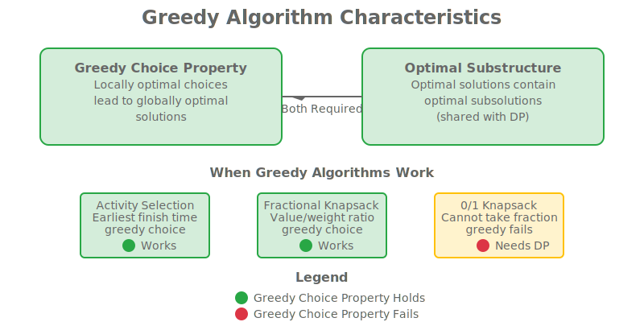

# Lesson 17.1: Greedy Algorithms, Greedy Choice Property, and Optimization

## Hook: Making Locally Optimal Choices for Globally Optimal Solutions

Imagine you're planning a road trip across multiple cities, and at each intersection, you always choose the road that gets you closest to your destination. This "greedy" approach of making the best local choice at each step often leads to the optimal global solution. This is the essence of **greedy algorithms** - solving complex optimization problems by making a series of locally optimal choices.

In this lesson, we'll explore the greedy choice property, when greedy algorithms work, common greedy algorithms, and their applications in modern C++.

## Roadmap: Module 17 Overview

This lesson explores greedy algorithms and their applications:

1. **Problem Definition**: Understanding greedy choice property and greedy algorithms
2. **Greedy Choice Property**: When local optimal choices lead to global optimal solutions
3. **Common Greedy Algorithms**: Activity selection, Huffman coding, Kruskal's algorithm
4. **Greedy vs Dynamic Programming**: When to choose each approach
5. **Implementation Patterns**: Generic greedy algorithm framework
6. **Advanced Applications**: Real-world greedy algorithm applications

## What are Greedy Algorithms?

### The Core Idea

Greedy algorithms build solutions piece by piece, always choosing the next piece that offers the most immediate benefit. They make locally optimal choices with the hope that these choices will lead to a globally optimal solution.

### Key Characteristics

**Greedy Choice Property**: A problem exhibits the greedy choice property if a globally optimal solution can be arrived at by making a locally optimal choice at each stage.

**Optimal Substructure**: Similar to dynamic programming, greedy algorithms require that optimal solutions contain optimal subsolutions.

### When Greedy Algorithms Work

- **Problems with greedy choice property**
- **Optimization problems with clear local optimal criteria**
- **Problems where making optimal local choices leads to global optimum**
- **Problems that can be solved by sorting and selecting**

### When Greedy Algorithms Don't Work

- **Problems requiring backtracking or exploration of multiple paths**
- **Problems where local optimal choices lead to suboptimal global solutions**
- **Problems with complex interdependencies between choices**



## The Greedy Choice Property

### Understanding the Property

The greedy choice property states that a globally optimal solution can be obtained by making locally optimal choices at each step. This property must be proven for each problem where greedy algorithms are applied.

### Proving Greedy Choice Property

```cpp
// Example: Proving greedy choice property for activity selection
// If we have an optimal solution S that includes activity a_i
// We can replace a_i with the greedy choice and maintain optimality

struct Activity {
    int start;
    int finish;
    int id;
};

bool compareActivities(const Activity& a, const Activity& b) {
    return a.finish < b.finish;
}

std::vector<Activity> activitySelectionGreedy(std::vector<Activity> activities) {
    // Sort activities by finish time (greedy choice: earliest finish time)
    std::sort(activities.begin(), activities.end(), compareActivities);

    std::vector<Activity> selected;
    if (!activities.empty()) {
        selected.push_back(activities[0]);
    }

    for (size_t i = 1; i < activities.size(); ++i) {
        // If this activity starts after the last selected activity finishes
        if (activities[i].start >= selected.back().finish) {
            selected.push_back(activities[i]);
        }
    }

    return selected;
}
```

### Mathematical Foundation

For activity selection, the greedy choice property holds because:

- The activity with earliest finish time leaves the most time for remaining activities
- Any optimal solution can be modified to include this choice without loss of optimality
- The remaining subproblem is still optimal

## Classic Greedy Algorithms

### 1. Activity Selection Problem

```cpp
#include <vector>
#include <algorithm>
#include <iostream>

struct Activity {
    int id;
    int start;
    int finish;

    Activity(int i, int s, int f) : id(i), start(s), finish(f) {}
};

class ActivitySelection {
public:
    static std::vector<Activity> selectMaximumActivities(std::vector<Activity> activities) {
        // Sort by finish time
        std::sort(activities.begin(), activities.end(),
                  [](const Activity& a, const Activity& b) {
                      return a.finish < b.finish;
                  });

        std::vector<Activity> selected;

        if (!activities.empty()) {
            selected.push_back(activities[0]);
        }

        for (size_t i = 1; i < activities.size(); ++i) {
            if (activities[i].start >= selected.back().finish) {
                selected.push_back(activities[i]);
            }
        }

        return selected;
    }

    static void printActivities(const std::vector<Activity>& activities) {
        std::cout << "Selected activities: ";
        for (const auto& activity : activities) {
            std::cout << activity.id << " ";
        }
        std::cout << "\nTotal activities selected: " << activities.size() << "\n";
    }
};

int main() {
    std::vector<Activity> activities = {
        {1, 1, 4}, {2, 3, 5}, {3, 0, 6}, {4, 5, 7}, {5, 3, 9},
        {6, 5, 9}, {7, 6, 10}, {8, 8, 11}, {9, 8, 12}, {10, 2, 14},
        {11, 12, 16}
    };

    auto selected = ActivitySelection::selectMaximumActivities(activities);
    ActivitySelection::printActivities(selected);

    return 0;
}
```

### 2. Fractional Knapsack Problem

```cpp
#include <vector>
#include <algorithm>
#include <iostream>
#include <iomanip>

struct Item {
    int id;
    int weight;
    int value;
    double ratio; // value/weight

    Item(int i, int w, int v) : id(i), weight(w), value(v), ratio(static_cast<double>(v) / w) {}
};

class FractionalKnapsack {
public:
    static double getMaximumValue(std::vector<Item>& items, int capacity) {
        // Sort items by value-to-weight ratio in descending order
        std::sort(items.begin(), items.end(),
                  [](const Item& a, const Item& b) {
                      return a.ratio > b.ratio;
                  });

        double totalValue = 0.0;
        int currentWeight = 0;

        for (const auto& item : items) {
            if (currentWeight + item.weight <= capacity) {
                // Take the whole item
                currentWeight += item.weight;
                totalValue += item.value;
                std::cout << "Taking item " << item.id << " completely (weight: " << item.weight
                          << ", value: " << item.value << ")\n";
            } else {
                // Take fraction of the item
                int remainingWeight = capacity - currentWeight;
                double fraction = static_cast<double>(remainingWeight) / item.weight;
                totalValue += item.value * fraction;
                std::cout << "Taking " << std::fixed << std::setprecision(2) << fraction * 100
                          << "% of item " << item.id << " (weight: " << remainingWeight
                          << ", value: " << item.value * fraction << ")\n";
                break;
            }
        }

        return totalValue;
    }
};

int main() {
    std::vector<Item> items = {
        {1, 10, 60}, {2, 20, 100}, {3, 30, 120}
    };
    int capacity = 50;

    double maxValue = FractionalKnapsack::getMaximumValue(items, capacity);
    std::cout << "Maximum value: " << std::fixed << std::setprecision(2) << maxValue << "\n";

    return 0;
}
```

### 3. Huffman Coding (Greedy Tree Construction)

```cpp
#include <queue>
#include <unordered_map>
#include <string>
#include <iostream>
#include <memory>

struct HuffmanNode {
    char character;
    int frequency;
    std::shared_ptr<HuffmanNode> left;
    std::shared_ptr<HuffmanNode> right;

    HuffmanNode(char c, int freq)
        : character(c), frequency(freq), left(nullptr), right(nullptr) {}

    HuffmanNode(std::shared_ptr<HuffmanNode> l, std::shared_ptr<HuffmanNode> r)
        : character('\0'), frequency(l->frequency + r->frequency), left(l), right(r) {}
};

class HuffmanCoding {
private:
    std::shared_ptr<HuffmanNode> root;
    std::unordered_map<char, std::string> codes;

    struct CompareNodes {
        bool operator()(const std::shared_ptr<HuffmanNode>& a,
                       const std::shared_ptr<HuffmanNode>& b) const {
            return a->frequency > b->frequency;
        }
    };

    void generateCodes(std::shared_ptr<HuffmanNode> node, std::string code) {
        if (!node) return;

        if (!node->left && !node->right) {
            codes[node->character] = code;
            return;
        }

        generateCodes(node->left, code + "0");
        generateCodes(node->right, code + "1");
    }

public:
    HuffmanCoding(const std::unordered_map<char, int>& frequencies) {
        std::priority_queue<std::shared_ptr<HuffmanNode>,
                           std::vector<std::shared_ptr<HuffmanNode>>,
                           CompareNodes> pq;

        // Create leaf nodes
        for (const auto& pair : frequencies) {
            pq.push(std::make_shared<HuffmanNode>(pair.first, pair.second));
        }

        // Build Huffman tree
        while (pq.size() > 1) {
            auto left = pq.top(); pq.pop();
            auto right = pq.top(); pq.pop();

            auto internal = std::make_shared<HuffmanNode>(left, right);
            pq.push(internal);
        }

        root = pq.top();
        generateCodes(root, "");
    }

    std::string encode(const std::string& text) const {
        std::string encoded;
        for (char c : text) {
            auto it = codes.find(c);
            if (it != codes.end()) {
                encoded += it->second;
            }
        }
        return encoded;
    }

    std::string decode(const std::string& encoded) const {
        std::string decoded;
        auto current = root;

        for (char bit : encoded) {
            if (bit == '0') {
                current = current->left;
            } else {
                current = current->right;
            }

            if (!current->left && !current->right) {
                decoded += current->character;
                current = root;
            }
        }

        return decoded;
    }

    void printCodes() const {
        std::cout << "Huffman Codes:\n";
        for (const auto& pair : codes) {
            std::cout << "'" << pair.first << "': " << pair.second << "\n";
        }
    }

    double calculateCompressionRatio(const std::string& original) const {
        int originalBits = original.length() * 8; // Assuming 8 bits per character
        int compressedBits = 0;

        for (char c : original) {
            auto it = codes.find(c);
            if (it != codes.end()) {
                compressedBits += it->second.length();
            }
        }

        return static_cast<double>(originalBits) / compressedBits;
    }
};

int main() {
    std::unordered_map<char, int> frequencies = {
        {'a', 5}, {'b', 9}, {'c', 12}, {'d', 13}, {'e', 16}, {'f', 45}
    };

    HuffmanCoding huffman(frequencies);
    huffman.printCodes();

    std::string text = "abcdef";
    std::string encoded = huffman.encode(text);
    std::string decoded = huffman.decode(encoded);

    std::cout << "Original: " << text << "\n";
    std::cout << "Encoded: " << encoded << "\n";
    std::cout << "Decoded: " << decoded << "\n";
    std::cout << "Compression ratio: " << huffman.calculateCompressionRatio(text) << ":1\n";

    return 0;
}
```

## Greedy Algorithm Framework

### Generic Greedy Algorithm Template

```cpp
#include <vector>
#include <algorithm>
#include <functional>

template<typename T, typename Comparator = std::less<T>>
class GreedyAlgorithm {
private:
    Comparator compare;

public:
    // Generic greedy selection with custom comparator
    template<typename Container, typename Selector>
    std::vector<T> selectOptimal(const Container& items, Selector selector) {
        std::vector<T> sortedItems(items.begin(), items.end());
        std::sort(sortedItems.begin(), sortedItems.end(), compare);

        std::vector<T> selected;
        for (const auto& item : sortedItems) {
            if (selector(item, selected)) {
                selected.push_back(item);
            }
        }
        return selected;
    }

    // Greedy choice with feasibility and optimality checks
    template<typename Container, typename FeasibilityCheck, typename OptimalityCheck>
    std::vector<T> greedyChoice(const Container& items,
                               FeasibilityCheck isFeasible,
                               OptimalityCheck isOptimal) {
        std::vector<T> solution;

        for (const auto& item : items) {
            if (isFeasible(item, solution) && isOptimal(item, solution)) {
                solution.push_back(item);
            }
        }

        return solution;
    }
};

// Example usage for coin change (greedy)
class CoinChangeGreedy {
public:
    static std::vector<int> makeChange(int amount, const std::vector<int>& denominations) {
        std::vector<int> sortedDenoms = denominations;
        std::sort(sortedDenoms.rbegin(), sortedDenoms.rend()); // Sort descending

        std::vector<int> change;
        int remaining = amount;

        for (int denom : sortedDenoms) {
            while (remaining >= denom) {
                change.push_back(denom);
                remaining -= denom;
            }
        }

        return remaining == 0 ? change : std::vector<int>{};
    }

    static void printChange(const std::vector<int>& change) {
        if (change.empty()) {
            std::cout << "Cannot make exact change\n";
            return;
        }

        std::cout << "Coins used: ";
        for (int coin : change) {
            std::cout << coin << " ";
        }
        std::cout << "\nTotal coins: " << change.size() << "\n";
    }
};
```

## Greedy vs Dynamic Programming

### When to Choose Greedy Algorithms

<table style="border-collapse: collapse;">
<thead>
<tr><th style="padding: 8px; border: 1px solid #ddd;">Aspect</th><th style="padding: 8px; border: 1px solid #ddd;">Greedy Algorithms</th><th style="padding: 8px; border: 1px solid #ddd;">Dynamic Programming</th></tr>
</thead>
<tbody>
<tr><td style="padding: 8px; border: 1px solid #ddd;">Optimality Guarantee</td><td style="padding: 8px; border: 1px solid #ddd;">Only when greedy choice property holds</td><td style="padding: 8px; border: 1px solid #ddd;">Always optimal (if applicable)</td></tr>
<tr><td style="padding: 8px; border: 1px solid #ddd;">Time Complexity</td><td style="padding: 8px; border: 1px solid #ddd;">Usually O(n log n) for sorting</td><td style="padding: 8px; border: 1px solid #ddd;">Often O(n²) or O(n³)</td></tr>
<tr><td style="padding: 8px; border: 1px solid #ddd;">Space Complexity</td><td style="padding: 8px; border: 1px solid #ddd;">O(n) or O(1)</td><td style="padding: 8px; border: 1px solid #ddd;">O(n) to O(n²)</td></tr>
<tr><td style="padding: 8px; border: 1px solid #ddd;">Implementation</td><td style="padding: 8px; border: 1px solid #ddd;">Simple and intuitive</td><td style="padding: 8px; border: 1px solid #ddd;">Complex state management</td></tr>
<tr><td style="padding: 8px; border: 1px solid #ddd;">Correctness</td><td style="padding: 8px; border: 1px solid #ddd;">Must be proven per problem</td><td style="padding: 8px; border: 1px solid #ddd;">Mathematically guaranteed</td></tr>
</tbody>
</table>

### Decision Framework

```cpp
enum class AlgorithmType {
    GREEDY,
    DYNAMIC_PROGRAMMING,
    OTHER
};

AlgorithmType chooseAlgorithm(const ProblemCharacteristics& problem) {
    if (problem.hasGreedyChoiceProperty && problem.hasOptimalSubstructure) {
        // Check if greedy works for this specific problem
        if (problem.greedyWorks) {
            return AlgorithmType::GREEDY;
        } else {
            return AlgorithmType::DYNAMIC_PROGRAMMING;
        }
    } else if (problem.hasOptimalSubstructure && problem.hasOverlappingSubproblems) {
        return AlgorithmType::DYNAMIC_PROGRAMMING;
    } else {
        return AlgorithmType::OTHER;
    }
}
```

## Advanced Greedy Applications

### 1. Job Scheduling with Deadlines

```cpp
#include <vector>
#include <algorithm>
#include <iostream>

struct Job {
    int id;
    int deadline;
    int profit;

    Job(int i, int d, int p) : id(i), deadline(d), profit(p) {}
};

class JobScheduling {
public:
    static std::vector<Job> scheduleJobs(std::vector<Job> jobs) {
        // Sort jobs by profit in descending order
        std::sort(jobs.begin(), jobs.end(),
                  [](const Job& a, const Job& b) {
                      return a.profit > b.profit;
                  });

        // Find maximum deadline
        int maxDeadline = 0;
        for (const auto& job : jobs) {
            maxDeadline = std::max(maxDeadline, job.deadline);
        }

        // Initialize time slots
        std::vector<bool> slots(maxDeadline, false);
        std::vector<Job> scheduledJobs;

        for (const auto& job : jobs) {
            // Find a free slot for this job (starting from the last possible slot)
            for (int slot = std::min(maxDeadline - 1, job.deadline - 1); slot >= 0; --slot) {
                if (!slots[slot]) {
                    slots[slot] = true;
                    scheduledJobs.push_back(job);
                    break;
                }
            }
        }

        return scheduledJobs;
    }

    static int calculateTotalProfit(const std::vector<Job>& jobs) {
        int total = 0;
        for (const auto& job : jobs) {
            total += job.profit;
        }
        return total;
    }
};
```

### 2. Minimum Spanning Tree (Kruskal's Algorithm)

```cpp
#include <vector>
#include <algorithm>
#include <iostream>

struct Edge {
    int src, dest, weight;
    Edge(int s, int d, int w) : src(s), dest(d), weight(w) {}
};

class DisjointSet {
private:
    std::vector<int> parent, rank;

public:
    DisjointSet(int n) {
        parent.resize(n);
        rank.resize(n, 0);
        for (int i = 0; i < n; ++i) {
            parent[i] = i;
        }
    }

    int find(int x) {
        if (parent[x] != x) {
            parent[x] = find(parent[x]); // Path compression
        }
        return parent[x];
    }

    void unionSets(int x, int y) {
        int rootX = find(x);
        int rootY = find(y);

        if (rootX != rootY) {
            if (rank[rootX] < rank[rootY]) {
                parent[rootX] = rootY;
            } else if (rank[rootX] > rank[rootY]) {
                parent[rootY] = rootX;
            } else {
                parent[rootY] = rootX;
                rank[rootX]++;
            }
        }
    }
};

class KruskalsMST {
public:
    static std::vector<Edge> findMST(std::vector<Edge> edges, int vertices) {
        // Sort edges by weight
        std::sort(edges.begin(), edges.end(),
                  [](const Edge& a, const Edge& b) {
                      return a.weight < b.weight;
                  });

        DisjointSet ds(vertices);
        std::vector<Edge> mst;

        for (const auto& edge : edges) {
            int srcParent = ds.find(edge.src);
            int destParent = ds.find(edge.dest);

            // If including this edge doesn't create a cycle
            if (srcParent != destParent) {
                mst.push_back(edge);
                ds.unionSets(srcParent, destParent);
            }
        }

        return mst;
    }

    static int calculateTotalWeight(const std::vector<Edge>& mst) {
        int total = 0;
        for (const auto& edge : mst) {
            total += edge.weight;
        }
        return total;
    }
};
```

## Implementation Best Practices

### 1. Proving Correctness

```cpp
// Framework for proving greedy algorithm correctness
class GreedyCorrectnessProof {
public:
    // Step 1: Show greedy choice property
    static bool verifyGreedyChoiceProperty(const std::vector<int>& problem) {
        // Mathematical proof that local optimal choice leads to global optimal
        // This is problem-specific and requires formal proof
        return true; // Placeholder
    }

    // Step 2: Show optimal substructure
    static bool verifyOptimalSubstructure(const std::vector<int>& problem) {
        // Show that optimal solution to subproblems leads to optimal global solution
        return true; // Placeholder
    }

    // Step 3: Induction proof
    static bool proveByInduction(const std::vector<int>& problem) {
        // Base case + inductive step
        return true; // Placeholder
    }
};
```

### 2. Handling Edge Cases

```cpp
// Robust greedy implementation with error handling
template<typename T>
class RobustGreedyAlgorithm {
public:
    template<typename Container, typename GreedyCriterion, typename Validator>
    std::vector<T> solve(const Container& input,
                        GreedyCriterion criterion,
                        Validator validate) {
        if (input.empty()) {
            return {};
        }

        std::vector<T> solution;
        std::vector<T> candidates(input.begin(), input.end());

        // Sort by greedy criterion
        std::sort(candidates.begin(), candidates.end(), criterion);

        for (const auto& candidate : candidates) {
            solution.push_back(candidate);

            // Validate partial solution
            if (!validate(solution)) {
                solution.pop_back(); // Backtrack if invalid
            }
        }

        return solution;
    }
};
```

### 3. Performance Optimization

```cpp
// Optimized greedy with early termination
template<typename T>
class OptimizedGreedy {
public:
    template<typename Container, typename Criterion, typename EarlyStop>
    std::vector<T> solveOptimized(const Container& input,
                                 Criterion criterion,
                                 EarlyStop canStop) {
        std::vector<T> candidates(input.begin(), input.end());
        std::sort(candidates.begin(), candidates.end(), criterion);

        std::vector<T> solution;

        for (const auto& candidate : candidates) {
            solution.push_back(candidate);

            // Check if we can stop early
            if (canStop(solution, candidates)) {
                break;
            }
        }

        return solution;
    }
};
```

## Common Pitfalls and Debugging

### 1. Incorrect Greedy Criterion

```cpp
// Example of incorrect greedy choice leading to suboptimal solution
class BadGreedyExample {
public:
    // Wrong: Always choose largest item first (doesn't work for 0/1 knapsack)
    static std::vector<int> badKnapsackGreedy(const std::vector<int>& weights,
                                            const std::vector<int>& values,
                                            int capacity) {
        std::vector<std::pair<int, int>> items;
        for (size_t i = 0; i < weights.size(); ++i) {
            items.emplace_back(values[i], weights[i]);
        }

        // Sort by value (greedy, but wrong for 0/1 knapsack)
        std::sort(items.rbegin(), items.rend());

        std::vector<int> selected;
        int currentWeight = 0;

        for (const auto& item : items) {
            if (currentWeight + item.second <= capacity) {
                selected.push_back(item.first);
                currentWeight += item.second;
            }
        }

        return selected;
    }
};
```

### 2. Missing Feasibility Checks

```cpp
// Greedy with proper feasibility validation
class ValidatedGreedy {
public:
    template<typename T, typename Criterion, typename Feasibility>
    std::vector<T> solveWithValidation(const std::vector<T>& items,
                                      Criterion criterion,
                                      Feasibility isFeasible) {
        std::vector<T> sortedItems = items;
        std::sort(sortedItems.begin(), sortedItems.end(), criterion);

        std::vector<T> solution;

        for (const auto& item : sortedItems) {
            // Check if adding this item maintains feasibility
            if (isFeasible(item, solution)) {
                solution.push_back(item);
            }
        }

        return solution;
    }
};
```

## Summary

Greedy algorithms provide efficient solutions to optimization problems by making locally optimal choices that lead to globally optimal solutions when the greedy choice property holds.

**Key Takeaways:**

- **Greedy Choice Property**: Local optimal choices must lead to global optimal solutions
- **Optimal Substructure**: Solutions must be built from optimal subsolutions
- **Common Applications**: Activity selection, fractional knapsack, Huffman coding, MST
- **Correctness Proof**: Must be proven mathematically for each problem
- **Efficiency**: Often O(n log n) due to sorting, much faster than DP for applicable problems

## Cheat Sheet: Greedy Algorithm Implementation

**Step 1: Verify Problem Properties**

- Does the problem have greedy choice property?
- Does it have optimal substructure?
- Can local optimal choices be proven to lead to global optimum?

**Step 2: Define Greedy Criterion**

- What makes one choice better than another?
- How to quantify "optimal" for each decision point?

**Step 3: Sort by Criterion**

- Sort items by greedy criterion (usually descending)
- Ensure sorting is stable if order matters

**Step 4: Make Greedy Choices**

- Iterate through sorted items
- Add item if it doesn't violate constraints
- Continue until no more items can be added

**Step 5: Validate Solution**

- Check if solution meets all problem requirements
- Verify optimality if possible

## Practice Exercises

1. **Implement activity selection** with different sorting criteria and compare results
2. **Solve fractional knapsack** and compare with 0/1 knapsack greedy approach
3. **Build Huffman coding tree** and measure compression ratios for different inputs
4. **Implement job scheduling** with deadlines and profits
5. **Create generic greedy framework** that works for multiple problem types

## Journal Prompts

- When should you suspect a problem can be solved with greedy algorithms?
- How do you prove that a greedy approach is correct for a specific problem?
- What are the limitations of greedy algorithms compared to dynamic programming?
- How can you identify when a greedy approach will fail?

Mastering greedy algorithms gives you powerful tools for solving optimization problems efficiently - a key skill in algorithmic problem-solving.
