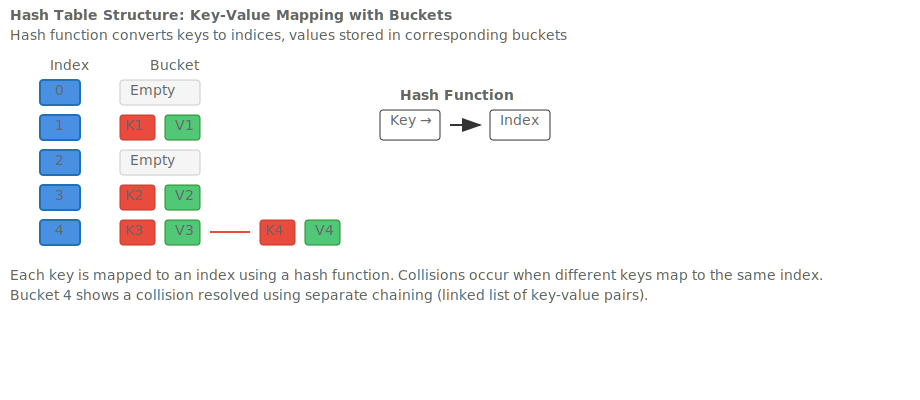
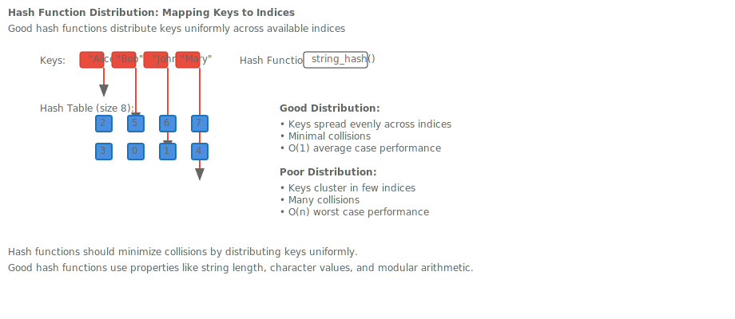
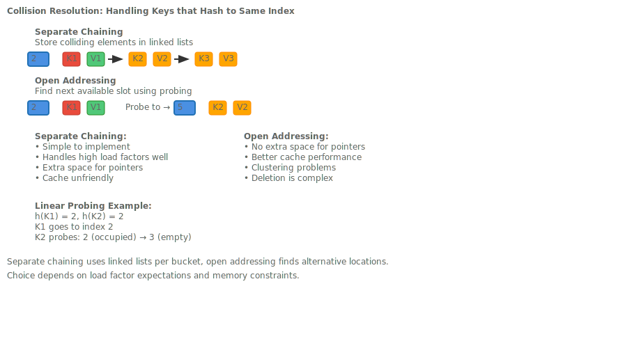
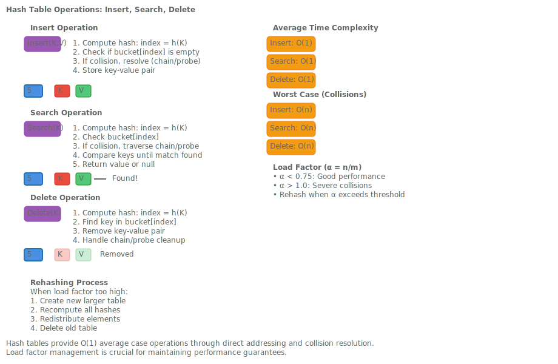
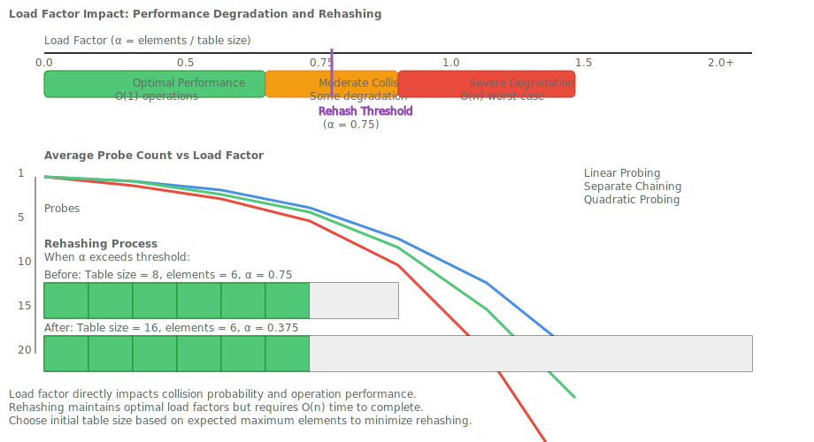

# Hash Tables & Hash-based Data Structures

## Hook: The Magic of Instant Lookup

Imagine you're building a phone book application that nee### Separate Chaining Advantages

- Simple to implement and understand
- Handles high load factors well
- Deletion is straightforward
- No clustering problems

### Separate Chaining Disadvantages

- Extra memory for pointers/links
- Poor cache performance
- Space overhead even with few collisions

### Open Addressing Advantages

- Better cache performance (all data contiguous)
- No extra space for pointers
- Potentially better space utilization

### Open Addressing Disadvantages

- Clustering can degrade performance
- Deletion is more complex (tombstones needed)
- Load factor must be kept lower contact information for millions of users. Traditional arrays would require scanning through each entry - potentially millions of operations. Hash tables solve this with their remarkable ability to provide **average O(1) lookup time**, making them one of the most important data structures in computer science.

In this lesson, we'll explore how hash tables achieve this "magic" through clever key-to-index mapping, collision resolution strategies, and load factor management. You'll learn to implement hash tables from scratch and understand their performance characteristics.

## Roadmap: Hash Tables in the DSA Landscape

Hash tables sit at the intersection of arrays and linked structures, combining the best of both worlds:

- **Direct addressing** for instant access (like arrays)
- **Dynamic collision handling** for flexibility (like linked lists)
- **Amortized performance** that approaches O(1) for all operations



This lesson builds on your understanding of arrays and linked lists, showing how they can be combined for optimal performance.

## Concept 1: Hash Function Fundamentals

The hash function is the heart of any hash table - it transforms keys into array indices.

### Key Requirements for Hash Functions

A good hash function must be:

- **Deterministic**: Same key always produces same hash
- **Efficient**: Fast to compute
- **Uniform**: Distributes keys evenly across the table
- **Avalanche effect**: Small key changes produce large hash changes

### Simple Hash Function Example

```cpp
// Simple string hash function (not production-ready)
size_t simple_hash(const std::string& key, size_t table_size) {
    size_t hash = 0;
    for (char c : key) {
        hash = (hash * 31 + c) % table_size;
    }
    return hash;
}
```

### Hash Function Distribution



The distribution shows how different keys map to table indices, ideally creating uniform coverage.

## Concept 2: Collision Resolution Strategies

Collisions occur when different keys hash to the same index. We need strategies to handle them.

### Separate Chaining

Store colliding elements in linked lists at each bucket.

```cpp
class HashTableChaining {
private:
    std::vector<std::list<std::pair<std::string, int>>> table;
    size_t capacity;

public:
    HashTableChaining(size_t cap) : capacity(cap), table(cap) {}

    void insert(const std::string& key, int value) {
        size_t index = hash_function(key, capacity);
        // Check if key exists, update if so
        for (auto& pair : table[index]) {
            if (pair.first == key) {
                pair.second = value;
                return;
            }
        }
        table[index].push_back({key, value});
    }

    std::optional<int> search(const std::string& key) {
        size_t index = hash_function(key, capacity);
        for (const auto& pair : table[index]) {
            if (pair.first == key) {
                return pair.second;
            }
        }
        return std::nullopt;
    }
};
```

### Open Addressing

Find alternative locations when collisions occur.

```cpp
class HashTableOpenAddressing {
private:
    std::vector<std::optional<std::pair<std::string, int>>> table;
    size_t capacity;
    const std::optional<std::pair<std::string, int>> DELETED =
        std::make_pair("DELETED", 0);

public:
    HashTableOpenAddressing(size_t cap) : capacity(cap), table(cap) {}

    size_t probe(size_t index, size_t attempt) {
        return (index + attempt * attempt) % capacity; // Quadratic probing
    }

    void insert(const std::string& key, int value) {
        size_t index = hash_function(key, capacity);
        size_t attempt = 0;

        while (attempt < capacity) {
            size_t probe_index = probe(index, attempt);

            if (!table[probe_index] || table[probe_index] == DELETED) {
                table[probe_index] = std::make_pair(key, value);
                return;
            }

            if (table[probe_index]->first == key) {
                table[probe_index]->second = value;
                return;
            }

            attempt++;
        }
        // Table is full - would need rehashing in real implementation
    }
};
```

## Concept 3: Collision Resolution Comparison



### Separate Chaining Advantages

- Simple to implement and understand
- Handles high load factors gracefully
- Deletion is straightforward
- No clustering problems

### Separate Chaining Disadvantages

- Extra memory for pointers/links
- Poor cache performance
- Space overhead even with few collisions

### Open Addressing Advantages

- Better cache performance (all data contiguous)
- No extra space for pointers
- Potentially better space utilization

### Open Addressing Disadvantages

- Clustering can degrade performance
- Deletion is more complex (tombstones needed)
- Load factor must be kept lower

## Concept 4: Hash Table Operations

All hash table operations follow the same pattern: hash → locate → action.



### Insert Operation

```cpp
void HashTable::insert(const std::string& key, int value) {
    if (load_factor() > max_load_factor) {
        rehash();
    }

    size_t index = hash_function(key, table.size());

    // Collision resolution depends on strategy
    // (separate chaining or open addressing)
    resolve_collision_and_insert(index, key, value);
}
```

### Search Operation

```cpp
std::optional<int> HashTable::search(const std::string& key) {
    size_t index = hash_function(key, table.size());

    // Traverse collision chain or probe sequence
    return find_in_bucket_or_probe_sequence(index, key);
}
```

### Delete Operation

```cpp
bool HashTable::remove(const std::string& key) {
    size_t index = hash_function(key, table.size());

    // Find and remove, handling collision strategy specifics
    return remove_from_bucket_or_probe_sequence(index, key);
}
```

## Concept 5: Load Factor and Rehashing

Load factor (α = n/m) is the ratio of elements to table size.

### Load Factor Impact



### Rehashing Implementation

```cpp
void HashTable::rehash() {
    size_t new_capacity = table.size() * 2;
    std::vector<BucketType> new_table(new_capacity);

    // Move all elements to new table
    for (const auto& bucket : table) {
        for (const auto& element : bucket) {
            size_t new_index = hash_function(element.first, new_capacity);
            new_table[new_index].push_back(element);
        }
    }

    table = std::move(new_table);
    capacity = new_capacity;
}
```

### Choosing Initial Capacity

```cpp
// Estimate based on expected elements and desired load factor
size_t calculate_initial_capacity(size_t expected_elements,
                                  double target_load_factor = 0.75) {
    return static_cast<size_t>(expected_elements / target_load_factor);
}
```

## Concept 6: Hash Function Design

### Good Hash Functions

```cpp
// FNV-1a hash (good distribution properties)
uint64_t fnv1a_hash(const std::string& key) {
    const uint64_t FNV_OFFSET_BASIS = 0xcbf29ce484222325ULL;
    const uint64_t FNV_PRIME = 0x100000001b3ULL;

    uint64_t hash = FNV_OFFSET_BASIS;
    for (char c : key) {
        hash ^= static_cast<uint8_t>(c);
        hash *= FNV_PRIME;
    }
    return hash;
}

// Modular hashing for table size
size_t hash_to_index(uint64_t hash, size_t table_size) {
    // Ensure table_size is power of 2 for better distribution
    if ((table_size & (table_size - 1)) == 0) {
        return hash & (table_size - 1);
    } else {
        return hash % table_size;
    }
}
```

### Common Hash Function Pitfalls

- **Poor distribution**: Keys cluster in few buckets
- **Integer overflow**: Not handling large intermediate values
- **Non-deterministic**: Using random seeds that change
- **Slow computation**: Complex math for simple keys

## Concept 7: Real-World Hash Table Usage

### String Interning

```cpp
class StringInterner {
private:
    std::unordered_map<std::string, const char*> interned_strings;

public:
    const char* intern(const std::string& str) {
        auto it = interned_strings.find(str);
        if (it != interned_strings.end()) {
            return it->second;
        }

        // Store permanent copy
        char* permanent = new char[str.size() + 1];
        std::strcpy(permanent, str.c_str());
        interned_strings[str] = permanent;
        return permanent;
    }
};
```

### Frequency Counting

```cpp
std::unordered_map<std::string, int> word_frequency;
for (const auto& word : tokenize(text)) {
    word_frequency[word]++;
}
```

### Caching/Memoization

```cpp
template<typename ReturnType, typename... Args>
class MemoizedFunction {
private:
    std::function<ReturnType(Args...)> func;
    std::unordered_map<std::tuple<Args...>, ReturnType> cache;

public:
    MemoizedFunction(std::function<ReturnType(Args...)> f) : func(f) {}

    ReturnType operator()(Args... args) {
        auto key = std::make_tuple(args...);
        auto it = cache.find(key);
        if (it != cache.end()) {
            return it->second;
        }

        ReturnType result = func(args...);
        cache[key] = result;
        return result;
    }
};
```

## Concept 8: Performance Analysis

### Time Complexity

<table>
<thead>
<tr><th>Operation  </th><th>Average Case  </th><th>Worst Case  </th></tr>
</thead>
<tbody>
<tr><td>Insert</td><td>O(1)</td><td>O(n)</td></tr>
<tr><td>Search</td><td>O(1)</td><td>O(n)</td></tr>
<tr><td>Delete</td><td>O(1)</td><td>O(n)</td></tr>
</tbody>
</table>

### Space Complexity

- **Separate Chaining**: O(n + m) where m is table size
- **Open Addressing**: O(m) where m is table size
- **Load Factor**: α = n/m affects performance

### Benchmarking Hash Tables

```cpp
void benchmark_hash_table() {
    const size_t NUM_OPERATIONS = 100000;
    std::vector<std::string> keys;

    // Generate test keys
    for (size_t i = 0; i < NUM_OPERATIONS; ++i) {
        keys.push_back("key_" + std::to_string(i));
    }

    HashTable table(1000);

    auto start = std::chrono::high_resolution_clock::now();

    // Insert benchmark
    for (const auto& key : keys) {
        table.insert(key, rand());
    }

    // Search benchmark
    for (const auto& key : keys) {
        table.search(key);
    }

    auto end = std::chrono::high_resolution_clock::now();
    auto duration = std::chrono::duration_cast<std::chrono::milliseconds>
                   (end - start);

    std::cout << "Operations completed in: " << duration.count() << "ms\n";
}
```

## Concept 9: Common Hash Table Problems

### Problem 1: Phone Book Implementation

```cpp
class PhoneBook {
private:
    std::unordered_map<std::string, std::string> contacts;

public:
    void add_contact(const std::string& name, const std::string& number) {
        contacts[name] = number;
    }

    std::optional<std::string> find_number(const std::string& name) {
        auto it = contacts.find(name);
        return (it != contacts.end()) ? std::optional<std::string>(it->second)
                                      : std::nullopt;
    }

    void remove_contact(const std::string& name) {
        contacts.erase(name);
    }
};
```

### Problem 2: Word Frequency Counter

```cpp
std::unordered_map<std::string, size_t> count_words(const std::string& text) {
    std::unordered_map<std::string, size_t> frequency;
    std::istringstream iss(text);
    std::string word;

    while (iss >> word) {
        // Normalize word (lowercase, remove punctuation)
        std::transform(word.begin(), word.end(), word.begin(), ::tolower);
        word.erase(std::remove_if(word.begin(), word.end(),
                   [](char c) { return !std::isalnum(c); }), word.end());

        if (!word.empty()) {
            frequency[word]++;
        }
    }

    return frequency;
}
```

### Problem 3: LRU Cache Implementation

```cpp
template<typename Key, typename Value>
class LRUCache {
private:
    size_t capacity;
    std::unordered_map<Key, typename std::list<std::pair<Key, Value>>::iterator> map;
    std::list<std::pair<Key, Value>> list;

public:
    LRUCache(size_t cap) : capacity(cap) {}

    void put(const Key& key, const Value& value) {
        auto it = map.find(key);
        if (it != map.end()) {
            list.erase(it->second);
            map.erase(it);
        } else if (list.size() >= capacity) {
            auto last = list.back();
            map.erase(last.first);
            list.pop_back();
        }

        list.push_front({key, value});
        map[key] = list.begin();
    }

    std::optional<Value> get(const Key& key) {
        auto it = map.find(key);
        if (it == map.end()) {
            return std::nullopt;
        }

        // Move to front
        list.splice(list.begin(), list, it->second);
        return it->second->second;
    }
};
```

## Concept 10: Advanced Hash Table Techniques

### Cuckoo Hashing

Uses multiple hash functions and moves elements to make room.

### Hopscotch Hashing

Ensures elements are within a small distance of their ideal position.

### Robin Hood Hashing

Redistributes elements to reduce variance in probe sequences.

## Concept 11: Hash Tables vs Other Data Structures

<table style="border-collapse: collapse;">
<thead>
<tr><th style="padding: 8px; border: 1px solid #ddd;">Data Structure</th><th style="padding: 8px; border: 1px solid #ddd;">Insert</th><th style="padding: 8px; border: 1px solid #ddd;">Search</th><th style="padding: 8px; border: 1px solid #ddd;">Delete</th><th style="padding: 8px; border: 1px solid #ddd;">Ordered</th><th style="padding: 8px; border: 1px solid #ddd;">Use Case</th></tr>
</thead>
<tbody>
<tr><td style="padding: 8px; border: 1px solid #ddd;">Hash Table</td><td style="padding: 8px; border: 1px solid #ddd;">O(1)</td><td style="padding: 8px; border: 1px solid #ddd;">O(1)</td><td style="padding: 8px; border: 1px solid #ddd;">O(1)</td><td style="padding: 8px; border: 1px solid #ddd;">No</td><td style="padding: 8px; border: 1px solid #ddd;">Fast lookup by key</td></tr>
<tr><td style="padding: 8px; border: 1px solid #ddd;">Binary Search Tree</td><td style="padding: 8px; border: 1px solid #ddd;">O(log n)</td><td style="padding: 8px; border: 1px solid #ddd;">O(log n)</td><td style="padding: 8px; border: 1px solid #ddd;">O(log n)</td><td style="padding: 8px; border: 1px solid #ddd;">Yes</td><td style="padding: 8px; border: 1px solid #ddd;">Ordered data, range queries</td></tr>
<tr><td style="padding: 8px; border: 1px solid #ddd;">Array</td><td style="padding: 8px; border: 1px solid #ddd;">O(1)</td><td style="padding: 8px; border: 1px solid #ddd;">O(1)</td><td style="padding: 8px; border: 1px solid #ddd;">O(1)</td><td style="padding: 8px; border: 1px solid #ddd;">Yes</td><td style="padding: 8px; border: 1px solid #ddd;">Fixed size, index access</td></tr>
<tr><td style="padding: 8px; border: 1px solid #ddd;">Linked List</td><td style="padding: 8px; border: 1px solid #ddd;">O(1)</td><td style="padding: 8px; border: 1px solid #ddd;">O(n)</td><td style="padding: 8px; border: 1px solid #ddd;">O(1)</td><td style="padding: 8px; border: 1px solid #ddd;">No</td><td style="padding: 8px; border: 1px solid #ddd;">Frequent insertions/deletions</td></tr>
</tbody>
</table>

## Concept 12: Best Practices and Optimization

### Memory Management

```cpp
// Custom allocator for hash table
template<typename T>
class PoolAllocator {
private:
    std::vector<T*> free_list;
    std::vector<T*> allocated_blocks;

public:
    T* allocate() {
        if (free_list.empty()) {
            allocate_block();
        }
        T* ptr = free_list.back();
        free_list.pop_back();
        return ptr;
    }

    void deallocate(T* ptr) {
        free_list.push_back(ptr);
    }
};
```

### Hash Function Selection

- Use well-tested hash functions (FNV, Murmur, CityHash)
- Consider key distribution characteristics
- Test for collisions with your data set

### Load Factor Monitoring

```cpp
class MonitoredHashTable {
private:
    double max_load_factor = 0.75;
    size_t rehash_count = 0;

public:
    void insert(const std::string& key, int value) {
        if (load_factor() > max_load_factor) {
            std::cout << "Rehashing triggered. Load factor: "
                      << load_factor() << std::endl;
            rehash();
            rehash_count++;
        }
        // ... actual insert logic
    }

    void print_stats() {
        std::cout << "Rehashes performed: " << rehash_count << std::endl;
        std::cout << "Current load factor: " << load_factor() << std::endl;
    }
};
```

## Guided Walkthrough: Building a Custom Hash Table

Let's implement a complete hash table with separate chaining:

```cpp
#include <vector>
#include <list>
#include <string>
#include <functional>
#include <optional>
#include <iostream>

template<typename Key, typename Value, typename Hash = std::hash<Key>>
class CustomHashTable {
private:
    using Bucket = std::list<std::pair<Key, Value>>;
    std::vector<Bucket> table;
    size_t element_count;
    Hash hash_function;
    double max_load_factor;

    size_t hash_to_index(const Key& key) const {
        return hash_function(key) % table.size();
    }

    void rehash_if_needed() {
        if (static_cast<double>(element_count) / table.size() > max_load_factor) {
            rehash(table.size() * 2);
        }
    }

    void rehash(size_t new_capacity) {
        std::vector<Bucket> new_table(new_capacity);

        for (const auto& bucket : table) {
            for (const auto& pair : bucket) {
                size_t new_index = hash_function(pair.first) % new_capacity;
                new_table[new_index].push_back(pair);
            }
        }

        table = std::move(new_table);
    }

public:
    CustomHashTable(size_t initial_capacity = 16, double max_lf = 0.75)
        : table(initial_capacity), element_count(0), max_load_factor(max_lf) {}

    void insert(const Key& key, const Value& value) {
        rehash_if_needed();

        size_t index = hash_to_index(key);
        auto& bucket = table[index];

        // Update existing key
        for (auto& pair : bucket) {
            if (pair.first == key) {
                pair.second = value;
                return;
            }
        }

        // Insert new key
        bucket.push_back({key, value});
        element_count++;
    }

    std::optional<Value> search(const Key& key) const {
        size_t index = hash_to_index(key);
        const auto& bucket = table[index];

        for (const auto& pair : bucket) {
            if (pair.first == key) {
                return pair.second;
            }
        }

        return std::nullopt;
    }

    bool remove(const Key& key) {
        size_t index = hash_to_index(key);
        auto& bucket = table[index];

        for (auto it = bucket.begin(); it != bucket.end(); ++it) {
            if (it->first == key) {
                bucket.erase(it);
                element_count--;
                return true;
            }
        }

        return false;
    }

    size_t size() const { return element_count; }
    bool empty() const { return element_count == 0; }
    double load_factor() const {
        return static_cast<double>(element_count) / table.size();
    }

    void print_stats() const {
        std::cout << "Elements: " << element_count << std::endl;
        std::cout << "Buckets: " << table.size() << std::endl;
        std::cout << "Load factor: " << load_factor() << std::endl;

        size_t empty_buckets = 0;
        size_t max_bucket_size = 0;
        for (const auto& bucket : table) {
            if (bucket.empty()) empty_buckets++;
            max_bucket_size = std::max(max_bucket_size, bucket.size());
        }

        std::cout << "Empty buckets: " << empty_buckets << std::endl;
        std::cout << "Max bucket size: " << max_bucket_size << std::endl;
    }
};
```

## Practice: Hash Table Implementation Challenges

### Challenge 1: Implement Open Addressing

Modify the custom hash table to use linear probing instead of separate chaining.

### Challenge 2: Add Iterator Support

Implement begin() and end() methods to allow range-based for loops.

### Challenge 3: Memory Pool Optimization

Add a memory pool to reduce allocation overhead for frequent insertions.

## Reflection: Hash Tables in Modern Systems

Hash tables are fundamental to modern computing:

- **Database indexing**: B-tree indices vs hash indices
- **Compiler symbol tables**: Fast variable lookups
- **Network routing**: IP address to interface mapping
- **Cryptography**: Hash functions for digital signatures
- **Caching**: Memcached, Redis implementations

The key insight is that hash tables trade space for time - using extra memory to achieve constant-time operations.

## Cheat Sheet: Hash Table Operations

### Basic Operations

```cpp
// Create hash table
std::unordered_map<std::string, int> table;

// Insert/Update
table["key"] = value;
table.insert({"key", value});

// Search
auto it = table.find("key");
if (it != table.end()) {
    // Found: it->second
}

// Delete
table.erase("key");

// Check existence
if (table.count("key") > 0) {
    // Exists
}
```

### Iteration

```cpp
for (const auto& pair : table) {
    std::cout << pair.first << ": " << pair.second << std::endl;
}
```

### Custom Hash Function

```cpp
struct CustomHash {
    size_t operator()(const MyKey& key) const {
        // Custom hashing logic
        return /* hash value */;
    }
};

std::unordered_map<MyKey, Value, CustomHash> table;
```

### Load Factor Management

```cpp
table.max_load_factor(0.75);
table.reserve(1000);  // Pre-allocate for performance
```

## Journal Prompts

1. How would you design a hash table for a system with very limited memory?
2. What happens to hash table performance when all keys hash to the same value?
3. How do hash tables compare to binary search trees for ordered data?
4. What are the security implications of poor hash function design?
5. How would you implement a concurrent hash table?

## Actionable Checklists

### Implementation Checklist

- [ ] Choose appropriate collision resolution strategy
- [ ] Implement good hash function
- [ ] Set proper initial capacity
- [ ] Monitor and manage load factor
- [ ] Handle rehashing efficiently
- [ ] Test with various key distributions

### Performance Checklist

- [ ] Measure average probe count
- [ ] Monitor load factor trends
- [ ] Benchmark against other data structures
- [ ] Profile memory usage
- [ ] Test edge cases (empty table, full table)

### Security Checklist

- [ ] Avoid predictable hash functions
- [ ] Handle hash collisions gracefully
- [ ] Implement proper bounds checking
- [ ] Consider denial-of-service attacks
- [ ] Use cryptographically secure hashes when needed

Hash tables demonstrate the power of algorithmic thinking - by accepting the possibility of collisions and handling them systematically, we achieve remarkable average-case performance that powers much of modern software.</content>
