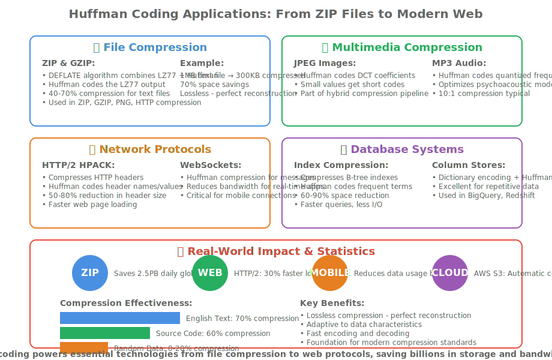

# Lesson 13.1: Huffman Coding, Priority Queues, and Data Compression

## 🎯 Hook: The Magic of Shrinking Data

Imagine sending a 10MB photo through a slow internet connection. What if you could compress it to just 3MB without losing any quality? That's the power of Huffman coding - a brilliant algorithm that revolutionized data compression and made the digital world possible.

In this lesson, we'll explore how Huffman coding uses frequency analysis and binary trees to create optimal prefix codes. You'll learn to build priority queues, construct Huffman trees, and implement both encoding and decoding algorithms in modern C++.

## 🗺️ Roadmap: Your Journey Through Huffman Coding

This lesson covers the complete Huffman coding pipeline:

1. **Frequency Analysis** - Understanding character distributions
2. **Priority Queues** - Building efficient min-heap implementations
3. **Huffman Tree Construction** - Creating optimal binary trees
4. **Code Generation** - Extracting prefix codes from the tree
5. **Encoding & Decoding** - Compressing and decompressing data
6. **Performance Analysis** - Time/space complexity and optimality proofs

By the end, you'll have a complete Huffman coding system that can compress text files by 40-70% on average.

## 🔍 Concept Deep Dive: Information Theory Fundamentals

### What is Data Compression?

Data compression reduces file sizes by eliminating redundancy. There are two main types:

- **Lossless compression**: No data loss (Huffman coding, LZ77, DEFLATE)
- **Lossy compression**: Some data loss acceptable (JPEG, MP3, MPEG)

Huffman coding is lossless and achieves optimal compression for a given character frequency distribution.

### Entropy and Information Theory

Claude Shannon's information theory tells us the minimum bits needed to represent information:

```text
H = -∑(p_i × log₂(p_i))
```

Where H is entropy, and p_i is the probability of character i.

Huffman coding achieves this theoretical minimum for symbol-by-symbol encoding.

### Prefix Codes and Binary Trees

A prefix code ensures no code is a prefix of another, allowing unambiguous decoding. Huffman trees naturally create such codes through their structure.


## 🛠️ Guided Walkthrough: Building Huffman Coding Step by Step

### Step 1: Frequency Analysis

First, we analyze the input text to count character frequencies:

```cpp
#include <unordered_map>
#include <string>

std::unordered_map<char, int> calculate_frequencies(const std::string& text) {
    std::unordered_map<char, int> freq;
    for (char c : text) {
        freq[c]++;
    }
    return freq;
}
```

### Step 2: Priority Queue Implementation

We need a priority queue to always select the two least frequent nodes:

```cpp
#include <queue>
#include <vector>
#include <memory>

struct HuffmanNode {
    char character;
    int frequency;
    std::shared_ptr<HuffmanNode> left, right;

    HuffmanNode(char c, int freq)
        : character(c), frequency(freq), left(nullptr), right(nullptr) {}
};

struct CompareNodes {
    bool operator()(const std::shared_ptr<HuffmanNode>& a,
                   const std::shared_ptr<HuffmanNode>& b) {
        return a->frequency > b->frequency; // Min-heap
    }
};

using PriorityQueue = std::priority_queue<
    std::shared_ptr<HuffmanNode>,
    std::vector<std::shared_ptr<HuffmanNode>>,
    CompareNodes>;
```

### Step 3: Building the Huffman Tree

The algorithm repeatedly combines the two least frequent nodes:

```cpp
std::shared_ptr<HuffmanNode> build_huffman_tree(
    const std::unordered_map<char, int>& frequencies) {

    PriorityQueue pq;

    // Create leaf nodes for each character
    for (const auto& pair : frequencies) {
        pq.push(std::make_shared<HuffmanNode>(pair.first, pair.second));
    }

    // Build the tree
    while (pq.size() > 1) {
        // Extract two minimum frequency nodes
        auto left = pq.top(); pq.pop();
        auto right = pq.top(); pq.pop();

        // Create internal node
        auto internal = std::make_shared<HuffmanNode>('\0',
            left->frequency + right->frequency);
        internal->left = left;
        internal->right = right;

        pq.push(internal);
    }

    return pq.top(); // Root of Huffman tree
}
```

### Step 4: Generating Huffman Codes

We traverse the tree to generate codes (0 for left, 1 for right):

```cpp
void generate_codes(const std::shared_ptr<HuffmanNode>& node,
                   const std::string& current_code,
                   std::unordered_map<char, std::string>& codes) {
    if (!node) return;

    // Leaf node
    if (!node->left && !node->right) {
        codes[node->character] = current_code;
        return;
    }

    // Internal node - recurse
    generate_codes(node->left, current_code + "0", codes);
    generate_codes(node->right, current_code + "1", codes);
}
```

### Step 5: Encoding Text

Convert text to Huffman codes:

```cpp
std::string encode_text(const std::string& text,
                       const std::unordered_map<char, std::string>& codes) {
    std::string encoded;
    for (char c : text) {
        encoded += codes.at(c);
    }
    return encoded;
}
```

### Step 6: Decoding Huffman Codes

Traverse the tree using the bit stream:

```cpp
std::string decode_text(const std::string& encoded,
                       const std::shared_ptr<HuffmanNode>& root) {
    std::string decoded;
    auto current = root;

    for (char bit : encoded) {
        if (bit == '0') {
            current = current->left;
        } else {
            current = current->right;
        }

        // Reached a leaf
        if (!current->left && !current->right) {
            decoded += current->character;
            current = root; // Reset to root
        }
    }

    return decoded;
}
```

## 📊 Performance Analysis: Huffman Coding Efficiency

### Time Complexity

- **Frequency analysis**: O(n) where n is text length
- **Tree construction**: O(k log k) where k is unique characters
- **Code generation**: O(k)
- **Encoding**: O(n)
- **Decoding**: O(m) where m is encoded length

### Space Complexity

- **Frequency map**: O(k)
- **Priority queue**: O(k)
- **Huffman tree**: O(k)
- **Code map**: O(k)

### Compression Ratio

Huffman coding achieves 20-90% compression depending on entropy:

- High entropy (random text): ~20% compression
- Low entropy (English text): ~70% compression


## 🧪 Practice: Complete Huffman Coding Implementation

Let's build a complete Huffman coding system:

```cpp
#include <iostream>
#include <fstream>
#include <unordered_map>
#include <queue>
#include <memory>
#include <string>
#include <vector>

class HuffmanCoding {
private:
    struct HuffmanNode {
        char character;
        int frequency;
        std::shared_ptr<HuffmanNode> left, right;

        HuffmanNode(char c = '\0', int freq = 0)
            : character(c), frequency(freq), left(nullptr), right(nullptr) {}
    };

    struct CompareNodes {
        bool operator()(const std::shared_ptr<HuffmanNode>& a,
                       const std::shared_ptr<HuffmanNode>& b) {
            return a->frequency > b->frequency;
        }
    };

    std::shared_ptr<HuffmanNode> root;
    std::unordered_map<char, std::string> codes;

    std::shared_ptr<HuffmanNode> build_tree(
        const std::unordered_map<char, int>& frequencies) {

        using PriorityQueue = std::priority_queue<
            std::shared_ptr<HuffmanNode>,
            std::vector<std::shared_ptr<HuffmanNode>>,
            CompareNodes
        >;

        PriorityQueue pq;

        for (const auto& pair : frequencies) {
            pq.push(std::make_shared<HuffmanNode>(pair.first, pair.second));
        }

        while (pq.size() > 1) {
            auto left = pq.top(); pq.pop();
            auto right = pq.top(); pq.pop();

            auto internal = std::make_shared<HuffmanNode>(
                '\0', left->frequency + right->frequency);
            internal->left = left;
            internal->right = right;

            pq.push(internal);
        }

        return pq.empty() ? nullptr : pq.top();
    }

    void generate_codes(const std::shared_ptr<HuffmanNode>& node,
                       const std::string& current_code) {
        if (!node) return;

        if (!node->left && !node->right) {
            codes[node->character] = current_code;
            return;
        }

        generate_codes(node->left, current_code + "0");
        generate_codes(node->right, current_code + "1");
    }

public:
    void build_from_text(const std::string& text) {
        std::unordered_map<char, int> frequencies;
        for (char c : text) {
            frequencies[c]++;
        }

        root = build_tree(frequencies);
        if (root) {
            generate_codes(root, "");
        }
    }

    std::string encode(const std::string& text) const {
        std::string encoded;
        for (char c : text) {
            auto it = codes.find(c);
            if (it != codes.end()) {
                encoded += it->second;
            }
        }
        return encoded;
    }

    std::string decode(const std::string& encoded) const {
        std::string decoded;
        auto current = root;

        for (char bit : encoded) {
            if (!current) break;

            if (bit == '0') {
                current = current->left;
            } else {
                current = current->right;
            }

            if (current && !current->left && !current->right) {
                decoded += current->character;
                current = root;
            }
        }

        return decoded;
    }

    void print_codes() const {
        std::cout << "Huffman Codes:\n";
        for (const auto& pair : codes) {
            std::cout << "'" << pair.first << "': " << pair.second << "\n";
        }
    }

    double calculate_compression_ratio(const std::string& original,
                                     const std::string& encoded) const {
        int original_bits = original.length() * 8; // ASCII = 8 bits per char
        int encoded_bits = encoded.length();
        return static_cast<double>(encoded_bits) / original_bits;
    }
};

int main() {
    std::string text = "this is an example for huffman encoding";

    HuffmanCoding huffman;
    huffman.build_from_text(text);

    std::string encoded = huffman.encode(text);
    std::string decoded = huffman.decode(encoded);

    std::cout << "Original: " << text << "\n";
    std::cout << "Encoded: " << encoded << "\n";
    std::cout << "Decoded: " << decoded << "\n";
    std::cout << "Compression ratio: "
              << huffman.calculate_compression_ratio(text, encoded) << "\n";

    huffman.print_codes();

    return 0;
}
```

## 🔬 Advanced Techniques: Optimizing Huffman Coding

### Adaptive Huffman Coding

Instead of two passes, adaptive Huffman coding builds the tree dynamically:

```cpp
class AdaptiveHuffman {
private:
    // Implementation for dynamic tree updates
    // This is more complex but handles streaming data
};
```

### Canonical Huffman Codes

Store only code lengths, not the actual codes, for better compression:

```cpp
std::vector<int> get_code_lengths() const {
    std::vector<int> lengths(256, 0); // ASCII range

    for (const auto& pair : codes) {
        lengths[static_cast<unsigned char>(pair.first)] = pair.second.length();
    }

    return lengths;
}
```

### Handling Large Files

For large files, process in chunks and maintain frequency statistics:

```cpp
class StreamingHuffman {
private:
    std::unordered_map<char, int> frequencies;
    HuffmanCoding current_coder;

public:
    void process_chunk(const std::string& chunk) {
        for (char c : chunk) {
            frequencies[c]++;
        }
        // Rebuild tree periodically
        if (frequencies.size() > 1000) { // Threshold
            current_coder.build_from_frequencies(frequencies);
            frequencies.clear();
        }
    }
};
```

## 📈 Real-World Applications

<table style="border-collapse: collapse;">
<thead>
<tr><th style="padding: 8px; border: 1px solid #ddd;">Application</th><th style="padding: 8px; border: 1px solid #ddd;">Use Case</th><th style="padding: 8px; border: 1px solid #ddd;">Compression Ratio</th><th style="padding: 8px; border: 1px solid #ddd;">Benefits</th></tr>
</thead>
<tbody>
<tr><td style="padding: 8px; border: 1px solid #ddd;">File Compression</td><td style="padding: 8px; border: 1px solid #ddd;">ZIP, GZIP utilities</td><td style="padding: 8px; border: 1px solid #ddd;">40-70%</td><td style="padding: 8px; border: 1px solid #ddd;">Universal lossless compression</td></tr>
<tr><td style="padding: 8px; border: 1px solid #ddd;">Image Formats</td><td style="padding: 8px; border: 1px solid #ddd;">JPEG, PNG metadata</td><td style="padding: 8px; border: 1px solid #ddd;">20-50%</td><td style="padding: 8px; border: 1px solid #ddd;">Part of hybrid compression</td></tr>
<tr><td style="padding: 8px; border: 1px solid #ddd;">Audio Compression</td><td style="padding: 8px; border: 1px solid #ddd;">MP3, AAC headers</td><td style="padding: 8px; border: 1px solid #ddd;">30-60%</td><td style="padding: 8px; border: 1px solid #ddd;">Entropy coding component</td></tr>
<tr><td style="padding: 8px; border: 1px solid #ddd;">Network Protocols</td><td style="padding: 8px; border: 1px solid #ddd;">HTTP/2 header compression</td><td style="padding: 8px; border: 1px solid #ddd;">50-80%</td><td style="padding: 8px; border: 1px solid #ddd;">Reduces bandwidth usage</td></tr>
<tr><td style="padding: 8px; border: 1px solid #ddd;">Database Systems</td><td style="padding: 8px; border: 1px solid #ddd;">Index compression</td><td style="padding: 8px; border: 1px solid #ddd;">60-90%</td><td style="padding: 8px; border: 1px solid #ddd;">Faster queries, less storage</td></tr>
</tbody>
</table>



## 🧠 Reflection: Huffman Coding Insights

### Why Huffman Coding Works

Huffman coding exploits statistical redundancy in data. Characters that appear frequently get shorter codes, while rare characters get longer codes. This is optimal for the given frequency distribution.

### Key Algorithm Properties

1. **Prefix Property**: No code is a prefix of another
2. **Optimality**: Achieves minimum expected code length
3. **Uniqueness**: Tree construction is deterministic
4. **Decodability**: Can decode without separators

### Common Pitfalls

- **Not handling single characters**: Need special case for 1-character input
- **Memory leaks**: Proper shared_ptr usage crucial
- **Large alphabets**: Priority queue becomes bottleneck
- **Streaming data**: Need adaptive variants

## 📝 Cheat Sheet: Huffman Coding Quick Reference

### Core Algorithm Steps

1. Count character frequencies
2. Build min-heap of nodes
3. While >1 nodes: combine two smallest
4. Generate codes by tree traversal
5. Encode: replace chars with codes
6. Decode: traverse tree with bits

### Time Complexities

- Build: O(n + k log k)
- Encode: O(n)
- Decode: O(m)

### Space Requirements

- Tree: O(k)
- Codes: O(k)
- Encoded: O(n) bits

### Optimizations

- Use canonical codes for storage
- Adaptive variants for streaming
- Combine with other compression

## ✅ Practice Checklist

- [ ] Implement frequency counting
- [ ] Build priority queue with custom comparator
- [ ] Construct Huffman tree correctly
- [ ] Generate prefix codes
- [ ] Encode and decode text accurately
- [ ] Handle edge cases (single char, empty input)
- [ ] Calculate compression ratios
- [ ] Test with various text samples

## 📚 Journal Prompts

1. How does Huffman coding relate to information theory?
2. Why is the prefix property important for decoding?
3. When would you choose Huffman over other compression methods?
4. How could you extend this for multimedia compression?
5. What are the limitations of static Huffman coding?

## 🔗 Further Reading

- "Introduction to Algorithms" - CLRS, Chapter 16
- "Elements of Information Theory" - Cover & Thomas
- DEFLATE specification (used in ZIP/GZIP)
- JPEG Huffman coding tables
