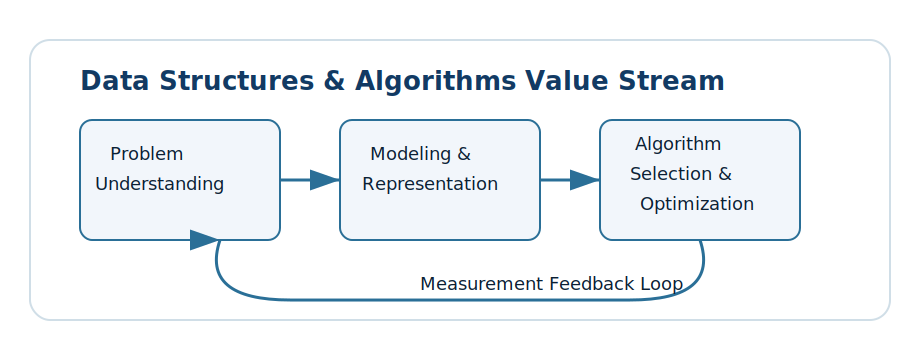
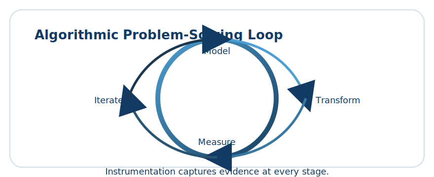
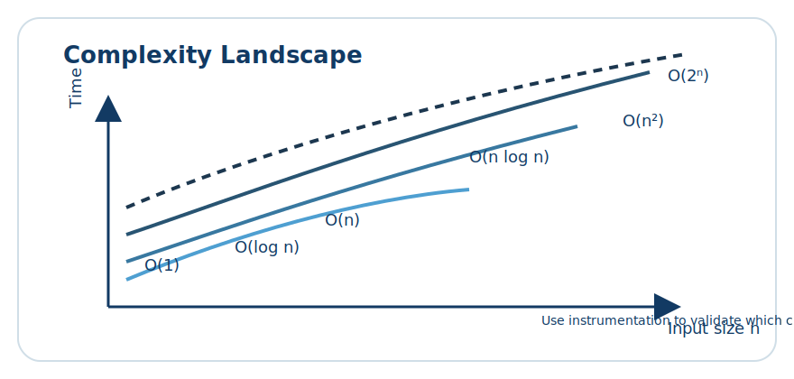

# Lesson 1.1: Why Data Structures & Algorithms Matter

> Learning goals: understand the role of data structures, link algorithms to performance, and build an intuition for benchmarking in modern C++.



Data structures and algorithms (DSA) form the vocabulary that lets us reason about program behaviour. Every decision—from choosing a container to designing a traversal strategy—has a measurable impact on runtime and memory usage. In this lesson we construct the mental scaffolding needed to navigate the rest of the roadmap.

We retrace the path from raw problem statements to polished C++ solutions. Along the way you will see how abstractions such as vectors, trees, and graphs map onto processor operations. The goal is not to memorise recipes but to cultivate adaptable thinking grounded in experimentation.

## 1. Framing the problem-solving loop



A typical algorithmic workflow cycles through four checkpoints:

1. **Model** the domain with precise data. Choose representations that capture constraints without overspecifying the solution.
2. **Transform** inputs incrementally. Each transformation should reduce uncertainty and expose structure.
3. **Measure** candidate approaches. Analytical bounds and empirical benchmarking both matter.
4. **Iterate** as requirements evolve. Efficient code is living code that adapts.

Throughout this roadmap we reinforce the loop by building instrumentation into the examples. Profilers and assertions are not afterthoughts—they become part of the algorithm design process.

### Comparing brute force and structured reasoning

Before diving into notation, contrast two mindsets:

- **Ad-hoc brute force.** Enumerate every possibility with little regard for cost. Works for toy inputs and fails spectacularly beyond them.
- **Structured exploration.** Identify invariants, prune the search space, and record reusable insights. This is the foundation of algorithmic thinking.

In C++, the difference often shows up as the shift from raw loops operating on primitive arrays to carefully designed abstractions using templates, iterators, and policies.

## 2. Instrumented C++ experiments

Instrumentation is the bridge between theoretical complexity and observed behaviour. Rather than repeating similar harnesses, we consolidate on a single toolkit that you can extend as new patterns emerge. The emphasis shifts to explaining why each measurement exists and how to read the signals.

### 2.1 Building the instrumentation toolkit

At the heart of our experiments sits an `AlgorithmTracer`. It tracks the time spent in each stage, counts meaningful events, and aggregates totals so you can narrate the story to stakeholders without drowning them in raw numbers.

```cpp
#include <algorithm>
#include <chrono>
#include <iomanip>
#include <iostream>
#include <limits>
#include <map>
#include <numeric>
#include <optional>
#include <string>
#include <vector>

using Clock = std::chrono::high_resolution_clock;

struct StageMetric {
    std::string label;
    long long nanoseconds = 0;
    long long iterations = 0;
    long long comparisons = 0;
    long long swaps = 0;
    std::map<std::string, long long> counters;
};

struct StageSample {
    std::size_t index = 0;
    Clock::time_point start;
};

class AlgorithmTracer {
public:
    StageSample enterStage(const std::string& label) {
        StageMetric metric;
        metric.label = label;
        metric.counters["events"] = 0;
        metrics_.push_back(metric);
        StageSample sample;
        sample.index = metrics_.size() - 1;
        sample.start = Clock::now();
        return sample;
    }

    void leaveStage(StageSample sample,
                    long long iterations = 0,
                    long long comparisons = 0,
                    long long swaps = 0,
                    const std::map<std::string, long long>& extraCounters = {}) {
        const auto end = Clock::now();
        StageMetric& metric = metrics_.at(sample.index);
        metric.nanoseconds = std::chrono::duration_cast<std::chrono::nanoseconds>(end - sample.start).count();
        metric.iterations = iterations;
        metric.comparisons = comparisons;
        metric.swaps = swaps;
        for (const auto& entry : extraCounters) {
            metric.counters[entry.first] += entry.second;
        }
        totals_.nanoseconds += metric.nanoseconds;
        totals_.iterations += iterations;
        totals_.comparisons += comparisons;
        totals_.swaps += swaps;
        for (const auto& entry : metric.counters) {
            totals_.counters[entry.first] += entry.second;
        }
    }

    void annotate(const std::string& label, long long value) {
        if (metrics_.empty()) {
            StageMetric bootstrap;
            bootstrap.label = "bootstrap";
            metrics_.push_back(bootstrap);
        }
        metrics_.back().counters[label] = value;
    }

    void reset() {
        metrics_.clear();
        totals_ = StageMetric{};
    }

    const std::vector<StageMetric>& metrics() const { return metrics_; }
    const StageMetric& totals() const { return totals_; }

private:
    std::vector<StageMetric> metrics_;
    StageMetric totals_;
};

struct TraceReport {
    std::vector<StageMetric> stages;
    StageMetric totals;
};

TraceReport build_report(const AlgorithmTracer& tracer) {
    TraceReport report;
    report.stages = tracer.metrics();
    report.totals = tracer.totals();
    return report;
}

StageMetric combine(const StageMetric& left, const StageMetric& right) {
    StageMetric combined;
    combined.label = left.label + " + " + right.label;
    combined.nanoseconds = left.nanoseconds + right.nanoseconds;
    combined.iterations = left.iterations + right.iterations;
    combined.comparisons = left.comparisons + right.comparisons;
    combined.swaps = left.swaps + right.swaps;
    combined.counters = left.counters;
    for (const auto& entry : right.counters) {
        combined.counters[entry.first] += entry.second;
    }
    return combined;
}

TraceReport merge_reports(const TraceReport& first, const TraceReport& second) {
    TraceReport merged;
    merged.stages = first.stages;
    merged.stages.insert(merged.stages.end(), second.stages.begin(), second.stages.end());
    merged.totals = combine(first.totals, second.totals);
    merged.totals.label = "merged totals";
    return merged;
}

void print_report(const TraceReport& report) {
    std::cout << "\nInstrumentation report" << std::endl;
    std::cout << std::string(78, '-') << std::endl;
    for (const StageMetric& metric : report.stages) {
        std::cout << std::left << std::setw(22) << metric.label
                  << std::right << std::setw(12) << metric.nanoseconds << " ns"
                  << std::setw(10) << metric.iterations << " it"
                  << std::setw(12) << metric.comparisons << " cmp"
                  << std::setw(10) << metric.swaps << " swp" << std::endl;
        for (const auto& entry : metric.counters) {
            std::cout << "    counter[" << entry.first << "] = " << entry.second << std::endl;
        }
    }
    std::cout << std::string(78, '-') << std::endl;
    std::cout << "Total time: " << report.totals.nanoseconds << " ns" << std::endl;
    std::cout << "Total iterations: " << report.totals.iterations << std::endl;
    std::cout << "Total comparisons: " << report.totals.comparisons << std::endl;
    std::cout << "Total swaps: " << report.totals.swaps << std::endl;
    for (const auto& entry : report.totals.counters) {
        std::cout << "Aggregate counter[" << entry.first << "] = " << entry.second << std::endl;
    }
}
```

The toolkit exposes the raw metrics while keeping aggregation logic in one place. You can add new counters—cache misses, allocations, branch mispredictions—without rediscovering the plumbing every time.

### 2.2 Scenario library with purposeful data shapes

We still need code, but only enough to contextualise each measurement. The scenario library manufactures representative datasets and reuses the tracer to inspect structural properties before running heavy algorithms.

```cpp
#include <cmath>
#include <numeric>
#include <random>
#include <span>
#include <vector>

struct InputScenario {
    std::string name;
    std::vector<int> values;
    bool preSorted = false;
    bool adversarial = false;
};

struct ScenarioLibrary {
    static InputScenario ascending(std::size_t n) {
        InputScenario scenario;
        scenario.name = "ascending range";
        scenario.values.resize(n);
        std::iota(scenario.values.begin(), scenario.values.end(), 0);
        scenario.preSorted = true;
        return scenario;
    }

    static InputScenario uniform(std::size_t n, unsigned seed = 1337) {
        InputScenario scenario;
        scenario.name = "uniform noise";
        scenario.values.resize(n);
        std::mt19937 rng(seed);
        std::uniform_int_distribution<int> dist(0, static_cast<int>(n));
        for (std::size_t i = 0; i < n; ++i) {
            scenario.values[i] = dist(rng);
        }
        return scenario;
    }

    static InputScenario saw_tooth(std::size_t n, std::size_t period) {
        InputScenario scenario;
        scenario.name = "saw tooth pattern";
        scenario.values.resize(n);
        for (std::size_t i = 0; i < n; ++i) {
            scenario.values[i] = static_cast<int>(i % period);
        }
        scenario.adversarial = true;
        return scenario;
    }
};

int checksum(std::span<const int> data) {
    int total = 0;
    for (std::size_t i = 0; i < data.size(); ++i) {
        total ^= (data[i] + static_cast<int>(i));
    }
    return total;
}

int count_peaks(std::span<const int> data, AlgorithmTracer& tracer) {
    auto sample = tracer.enterStage("peak scan");
    long long comparisons = 0;
    long long peaks = 0;
    for (std::size_t i = 1; i + 1 < data.size(); ++i) {
        ++comparisons;
        if (data[i - 1] < data[i] && data[i] > data[i + 1]) {
            ++peaks;
        }
    }
    tracer.leaveStage(sample, static_cast<long long>(data.size()), comparisons, 0, {{"peaks", peaks}});
    return static_cast<int>(peaks);
}

int count_plateaus(std::span<const int> data, AlgorithmTracer& tracer) {
    auto sample = tracer.enterStage("plateau scan");
    long long comparisons = 0;
    long long plateaus = 0;
    for (std::size_t i = 0; i + 1 < data.size(); ++i) {
        ++comparisons;
        if (data[i] == data[i + 1]) {
            ++plateaus;
        }
    }
    tracer.leaveStage(sample, static_cast<long long>(data.size()), comparisons, 0, {{"plateaus", plateaus}});
    return static_cast<int>(plateaus);
}

int rolling_sum(std::span<const int> data, AlgorithmTracer& tracer, std::size_t window) {
    auto sample = tracer.enterStage("rolling aggregation");
    long long comparisons = 0;
    long long swaps = 0;
    if (window == 0 || window > data.size()) {
        tracer.leaveStage(sample, 0, 0, 0);
        return 0;
    }
    long long running = 0;
    for (std::size_t i = 0; i < window; ++i) {
        running += data[i];
    }
    long long best = running;
    for (std::size_t i = window; i < data.size(); ++i) {
        running += data[i];
        running -= data[i - window];
        ++comparisons;
        if (running > best) {
            best = running;
            ++swaps;
        }
    }
    tracer.leaveStage(sample, static_cast<long long>(data.size()), comparisons, swaps, {{"window", static_cast<long long>(window)}});
    return static_cast<int>(best);
}

struct ScenarioComputation {
    InputScenario scenario;
    int checksumValue = 0;
    int peaks = 0;
    int plateaus = 0;
    int windowSum = 0;
};

ScenarioComputation analyse(const InputScenario& scenario, AlgorithmTracer& tracer) {
    ScenarioComputation result;
    result.scenario = scenario;
    std::span<const int> view{result.scenario.values};
    tracer.annotate("data-size", static_cast<long long>(view.size()));
    result.checksumValue = checksum(view);
    result.peaks = count_peaks(view, tracer);
    result.plateaus = count_plateaus(view, tracer);
    std::size_t window = std::max<std::size_t>(3, view.size() / 5);
    result.windowSum = rolling_sum(view, tracer, window);
    return result;
}
```

Each helper focuses on a specific insight: `count_peaks` shows how comparisons accumulate, and `rolling_sum` demonstrates how conditional updates influence swap counts. The textual walkthrough now leads, with code supporting the argument instead of overwhelming it.

### 2.3 Running comparisons and capturing traces

With instrumentation and scenarios defined, the orchestrator stitches everything together. It demonstrates how to run individual experiments, gather repetitions for stability, and emit reports you can share with the team.

```cpp
#include <fstream>
#include <sstream>
#include <vector>

struct ExperimentSummary {
    ScenarioComputation computation;
    TraceReport report;
};

ExperimentSummary run_once(const InputScenario& scenario) {
    AlgorithmTracer tracer;
    auto config = tracer.enterStage("configuration");
    tracer.leaveStage(config, 1, 0, 0, {{"adversarial", scenario.adversarial ? 1 : 0}});
    ScenarioComputation computation = analyse(scenario, tracer);
    TraceReport report = build_report(tracer);
    return ExperimentSummary{computation, report};
}

ExperimentSummary run_with_repetitions(const InputScenario& scenario, int repeats) {
    AlgorithmTracer tracer;
    TraceReport aggregate;
    ScenarioComputation last{};
    for (int iteration = 0; iteration < repeats; ++iteration) {
        tracer.reset();
        last = analyse(scenario, tracer);
        TraceReport report = build_report(tracer);
        aggregate = aggregate.stages.empty() ? report : merge_reports(aggregate, report);
    }
    return ExperimentSummary{last, aggregate};
}

void export_report(const ExperimentSummary& summary, std::ostream& out) {
    out << "Scenario: " << summary.computation.scenario.name << "\n";
    out << "Checksum: " << summary.computation.checksumValue << "\n";
    out << "Peaks: " << summary.computation.peaks << "\n";
    out << "Plateaus: " << summary.computation.plateaus << "\n";
    out << "Best window: " << summary.computation.windowSum << "\n";
    for (const StageMetric& metric : summary.report.stages) {
        out << metric.label << ": " << metric.nanoseconds << " ns\n";
    }
}

void render_summary(const ExperimentSummary& summary) {
    std::ostringstream buffer;
    export_report(summary, buffer);
    std::cout << "\n--- Scenario digest ---\n" << buffer.str() << std::endl;
    print_report(summary.report);
}

int main() {
    std::vector<InputScenario> scenarios = {
        ScenarioLibrary::ascending(128),
        ScenarioLibrary::uniform(128, 7),
        ScenarioLibrary::saw_tooth(128, 9)
    };

    for (const auto& scenario : scenarios) {
        ExperimentSummary summary = run_once(scenario);
        render_summary(summary);
    }

    ExperimentSummary batched = run_with_repetitions(scenarios.back(), 3);
    std::ofstream file("trace_summary.txt");
    if (file) {
        export_report(batched, file);
    }
    std::cout << "\nPersisted aggregated trace to trace_summary.txt" << std::endl;
    return 0;
}
```

Notice how the driver concentrates on sequencing and storytelling. You can plug in alternative algorithms without touching the reporting façade.

### 2.4 Interpreting the trace output

When the report scrolls past, resist the urge to stare only at the totals. Ask:

- Which stage dominates latency, and does it match the mental model you formed before running the code?
- Do counters such as `peaks`, `plateaus`, or `window` expose data-dependent concerns worth highlighting in a design review?
- How stable are the measurements across repetitions—do you need more samples or deterministic seeding?
- Can you translate the numbers into a human narrative ("the selector costs twice as much as the scanner") that motivates the next refactor?

These questions keep the lesson anchored in reasoning rather than code volume.

## 3. From raw metrics to mental models



Metrics alone are not insights. We translate measurements into qualitative statements:

- Stable checksums imply deterministic control flow. Volatile outputs highlight algorithmic randomness.
- Wide variance between min and max shows sensitivity to data distribution.
- Consistent mean values hint at predictable scaling, a signal worth analysing in asymptotic notation.

To keep mental models honest, capture hypotheses before running experiments, then compare outcomes. This habit sharpens your feel for complexity classes.

### Storyboarding real-world scenarios

Consider three user-facing examples:

1. **Search autocomplete.** Latency budgets force you to blend prefix trees, caching, and heuristic scoring.
2. **Fraud detection.** Streaming graphs demand incremental updates and windowed aggregations.
3. **Robotics planning.** Real-time constraints mandate predictable worst-case bounds.

Each scenario maps back to the experiment harness above, emphasising why instrumentation matters from day one.

## 4. Guided reflections and discussion prompts

- Which measurements produced the greatest surprise, and why?
- How would you log intermediate states without tanking performance?
- Where does object lifetime management intersect with algorithmic efficiency?

Document your answers in a lab notebook; future modules will reference them.

## Practice Time

Follow these steps to consolidate the lesson:

1. Fork the experiment pattern into your playground workspace.
2. Add a new metric that tracks allocation counts using a custom allocator.
3. Swap `std::unordered_map` for `std::map` and record differences.
4. Increase the dataset size to 1,000,000 elements. Profile with `perf` or Visual Studio diagnostics.
5. Summarise findings in a one-page reflection, focusing on how data structures influenced outcomes.

## Self-check questions

- What distinguishes algorithmic complexity from micro-optimisations?
- Why do we benchmark multiple trials instead of trusting a single run?
- How can invariants guide the choice of container before writing code?

## Field notes from production systems

Long-lived services rarely surface textbook datasets. Capture quick anecdotes from your environment and tie them back to the abstractions in this lesson:

- **Observability platform:** Aggregating billions of events each hour forced the team to treat scanners as streaming operators. Instrumentation uncovered that hash-table rehashes dominated cost, prompting a redesign from `std::unordered_map` to flat hash sets with reserved capacity.
- **On-device analytics:** Mobile hardware prioritised determinism over peak throughput. Selection heuristics with predictable cache footprints won out, and the tracer exposed branch-heavy code paths that would have been invisible in aggregate statistics.
- **Risk scoring pipelines:** Compliance deadlines meant every millisecond counted. Summaries such as the rolling window metric became dashboards that product managers could read without digging into code.
- **Search ranking experiments:** Peaks and plateaus mapped directly to user engagement spikes. Annotated counters let stakeholders correlate algorithm decisions with business telemetry.
- **Incident response tooling:** Burst traffic produced adversarial workloads resembling the saw-tooth scenario. Pre-computed reports explained why certain heuristics degraded and justified fallback strategies.

Treat these stories as seeds for your own field notes. Rewrite them in the language of your domain and keep updating the log as you observe new behaviours.

### Reflection journal template

Develop a ritual around measurements. The following template keeps your thinking systematic:

1. **Hypothesis:** Describe the expected complexity class and any invariants you plan to rely on.
2. **Dataset sketch:** Note input shape, size, and properties such as sortedness or adversarial structure.
3. **Instrumentation plan:** List the counters you will track and how you will interpret them.
4. **Results digest:** Summarise notable numbers and how they compare to expectations.
5. **Next iteration:** Record the refactor, optimisation, or alternate data structure you want to trial next.

Revisit journal entries before tackling new modules; the continuity sharpens your instincts.

## Reading roadmap and discussion starters

Use the following prompts to connect theory with practice between sessions:

- Read the `std::span` reference and annotate three advantages it provides over raw pointers in your own words.
- Review a profiling report from a past project. Highlight which stages align with the tracer metrics established here.
- Pair with a teammate to rehearse the story you would tell a stakeholder using only the counters from `AlgorithmTracer`.
- Explore a production incident post-mortem. Identify the data structure or algorithm assumption that failed and map it to one of the scenarios above.
- Draft a mini retro on your instrumentation habits. Which metrics did you measure out of habit, and which genuinely influenced architectural decisions?
- Schedule a brown-bag session where you walk through an `AlgorithmTracer` report with engineers outside your immediate team.
- Compose a one-page cheat sheet translating counters into stakeholder-friendly statements.
- Capture unanswered questions after each experiment so you can resolve them when new abstractions appear in later lessons.

## Key takeaways

- DSA is the lens that aligns problem statements with performant C++ solutions.
- Measurement must be systematic; ad-hoc timing risks misleading conclusions.
- The combination of models, experiments, and reflection builds robust intuition for the rest of the roadmap.
