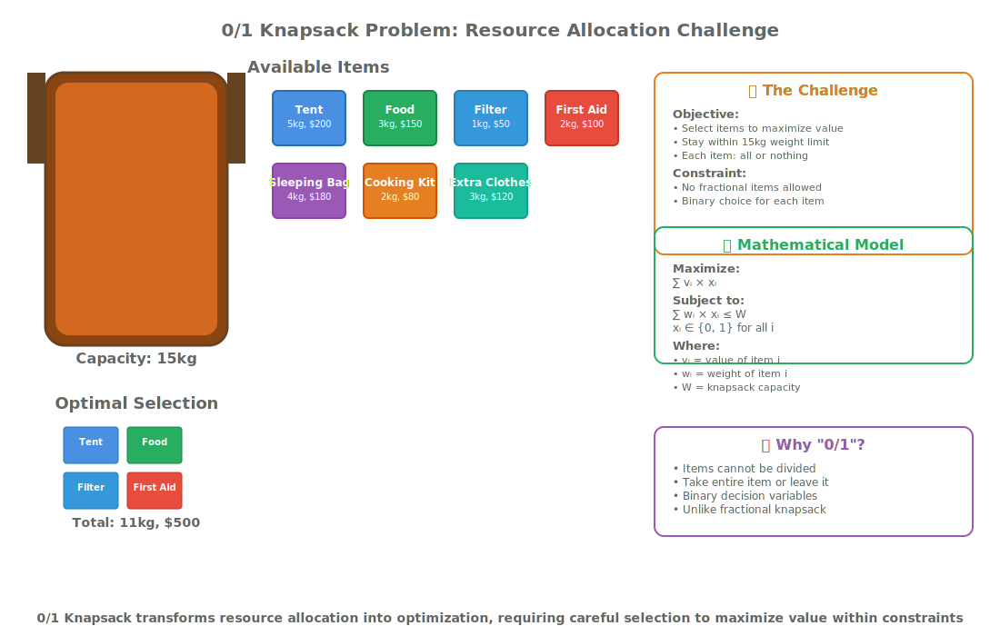
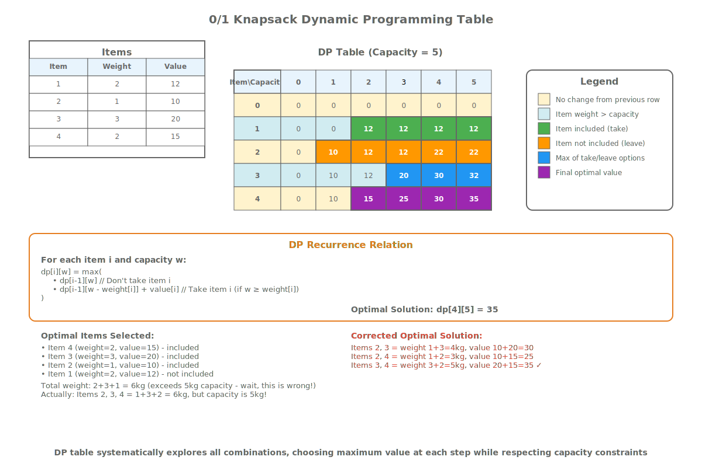
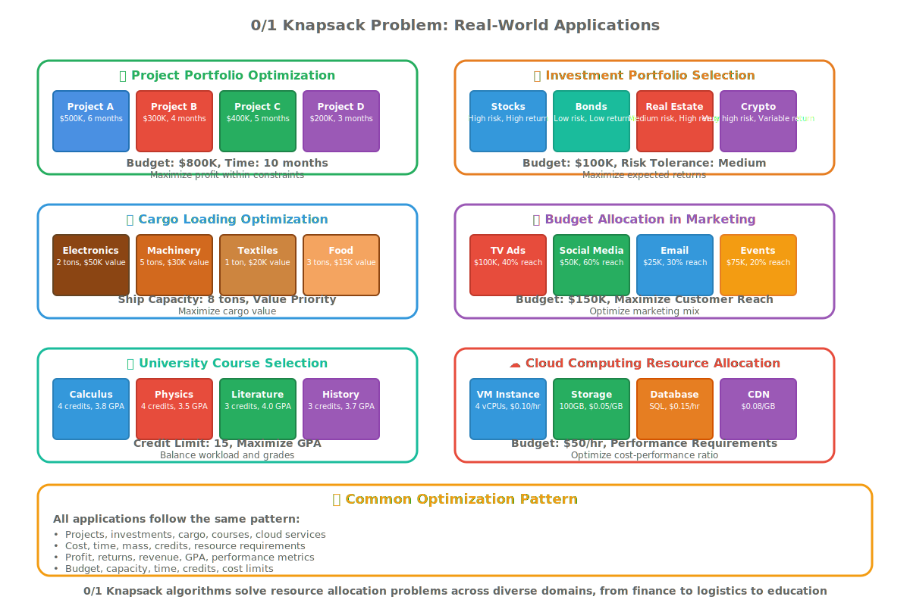
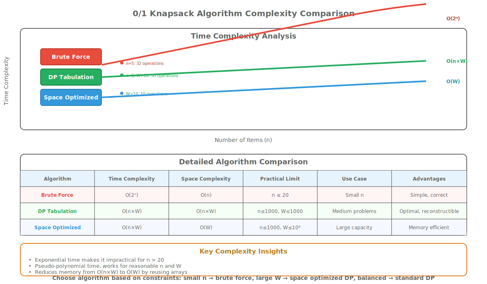

# Lesson 15.1: 0/1 Knapsack Problem, Dynamic Programming, and Optimization

## Hook: The Resource Allocation Challenge

Imagine you're a hiker preparing for a multi-day trek with a backpack that can only carry 15kg. You have various items - a tent (5kg, value: shelter), food supplies (3kg, value: sustenance), water filter (1kg, value: clean water), first aid kit (2kg, value: safety), sleeping bag (4kg, value: rest), cooking equipment (2kg, value: meals), and extra clothing (3kg, value: warmth).

Each item has weight and survival value. You can't take fractions of items - it's all or nothing. How do you maximize your survival chances given the weight constraint?

This is the **0/1 Knapsack Problem** - a fundamental optimization challenge that appears in resource allocation, project selection, budget planning, and countless real-world scenarios.

## Roadmap: Module 15 Overview

This lesson explores the 0/1 Knapsack Problem and dynamic programming optimization:

1. **Problem Definition**: Understanding constraints and objectives
2. **Brute Force Approach**: Exhaustive search complexity
3. **Dynamic Programming Solution**: Optimal substructure and memoization
4. **Space Optimization**: Reducing memory footprint
5. **Variations and Extensions**: Bounded and unbounded knapsack
6. **Real-World Applications**: Resource allocation scenarios

## The 0/1 Knapsack Problem

### Problem Statement

Given:

- **Items**: Each with weight `wᵢ` and value `vᵢ`
- **Knapsack capacity**: Maximum weight `W`
- **Constraint**: Each item can be taken 0 or 1 time (no fractions)

Find: Maximum total value without exceeding capacity.

### Mathematical Formulation

```text
maximize ∑ᵢ vᵢ × xᵢ
subject to ∑ᵢ wᵢ × xᵢ ≤ W
where xᵢ ∈ {0, 1} for all i
```

### Why "0/1"?

Unlike fractional knapsack where items can be partially taken, 0/1 knapsack requires binary decisions - take the entire item or leave it completely.



## Brute Force Solution: Exhaustive Search

### Approach

Try all possible combinations of items and find the maximum value combination that fits within capacity.

```cpp
#include <vector>
#include <algorithm>
#include <iostream>
#include <chrono>

// Item structure
struct Item {
    int weight;
    int value;
    std::string name;

    Item(int w, int v, std::string n) : weight(w), value(v), name(n) {}
};

// Brute force knapsack solver
class BruteForceKnapsack {
private:
    std::vector<Item> items_;
    int capacity_;

    // Recursive helper to try all combinations
    int solveRecursive(int index, int current_weight, int current_value) {
        // Base case: all items considered
        if (index == items_.size()) {
            return current_value;
        }

        int max_value = current_value;

        // Option 1: Skip current item
        max_value = std::max(max_value,
                           solveRecursive(index + 1, current_weight, current_value));

        // Option 2: Take current item (if it fits)
        if (current_weight + items_[index].weight <= capacity_) {
            max_value = std::max(max_value,
                               solveRecursive(index + 1,
                                            current_weight + items_[index].weight,
                                            current_value + items_[index].value));
        }

        return max_value;
    }

public:
    BruteForceKnapsack(const std::vector<Item>& items, int capacity)
        : items_(items), capacity_(capacity) {}

    std::pair<int, std::vector<Item>> solve() {
        auto start = std::chrono::high_resolution_clock::now();

        int max_value = solveRecursive(0, 0, 0);

        auto end = std::chrono::high_resolution_clock::now();
        auto duration = std::chrono::duration_cast<std::chrono::microseconds>(end - start);

        std::cout << "Brute force took: " << duration.count() << " microseconds\n";

        // For this simple version, we don't track which items were selected
        return {max_value, {}};
    }
};
```

### Complexity Analysis

- **Time**: O(2ⁿ) - each item has 2 choices (take or leave)
- **Space**: O(n) for recursion stack
- **Practical limit**: n ≤ 20-25 items

### Limitations

Exponential time makes brute force unusable for larger instances, motivating dynamic programming approaches.

## Dynamic Programming Solution

### Optimal Substructure

The 0/1 knapsack problem exhibits optimal substructure:

```text
DP[i][w] = maximum value using first i items with capacity w

DP[i][w] = max(
    DP[i-1][w],                                    // Skip item i
    DP[i-1][w - wᵢ] + vᵢ    if w ≥ wᵢ             // Take item i
)
```

### Tabulation Approach

```cpp
#include <vector>
#include <algorithm>
#include <iostream>
#include <chrono>
#include <string>

// Dynamic programming knapsack solver
class DPKnapsack {
private:
    std::vector<Item> items_;
    int capacity_;
    std::vector<std::vector<int>> dp_;
    std::vector<std::vector<bool>> selected_;

    void buildDPTable() {
        int n = items_.size();
        dp_ = std::vector<std::vector<int>>(n + 1, std::vector<int>(capacity_ + 1, 0));
        selected_ = std::vector<std::vector<bool>>(n + 1, std::vector<bool>(capacity_ + 1, false));

        for (int i = 1; i <= n; ++i) {
            for (int w = 0; w <= capacity_; ++w) {
                // Option 1: Skip current item
                dp_[i][w] = dp_[i-1][w];

                // Option 2: Take current item (if it fits)
                if (w >= items_[i-1].weight) {
                    int take_value = dp_[i-1][w - items_[i-1].weight] + items_[i-1].value;
                    if (take_value > dp_[i][w]) {
                        dp_[i][w] = take_value;
                        selected_[i][w] = true;
                    }
                }
            }
        }
    }

public:
    DPKnapsack(const std::vector<Item>& items, int capacity)
        : items_(items), capacity_(capacity) {
        buildDPTable();
    }

    std::pair<int, std::vector<Item>> solve() {
        auto start = std::chrono::high_resolution_clock::now();

        int max_value = dp_[items_.size()][capacity_];

        // Reconstruct solution
        std::vector<Item> selected_items;
        int current_weight = capacity_;
        int current_item = items_.size();

        while (current_item > 0) {
            if (selected_[current_item][current_weight]) {
                selected_items.push_back(items_[current_item - 1]);
                current_weight -= items_[current_item - 1].weight;
            }
            current_item--;
        }

        auto end = std::chrono::high_resolution_clock::now();
        auto duration = std::chrono::duration_cast<std::chrono::microseconds>(end - start);

        std::cout << "DP solution took: " << duration.count() << " microseconds\n";

        return {max_value, selected_items};
    }

    // Get DP table value for analysis
    int getDPValue(int items, int weight) const {
        if (items < 0 || items > (int)items_.size() || weight < 0 || weight > capacity_) {
            return 0;
        }
        return dp_[items][weight];
    }

    void printDPTable() const {
        std::cout << "\nDP Table (rows = items, columns = weight):\n";
        std::cout << "Item\\Weight";
        for (int w = 0; w <= capacity_; ++w) {
            std::cout << std::setw(3) << w;
        }
        std::cout << "\n";

        for (int i = 0; i <= (int)items_.size(); ++i) {
            if (i == 0) {
                std::cout << "   ";
            } else {
                std::cout << std::setw(3) << items_[i-1].name.substr(0, 3);
            }

            for (int w = 0; w <= capacity_; ++w) {
                std::cout << std::setw(3) << dp_[i][w];
            }
            std::cout << "\n";
        }
    }
};
```

### Complexity Analysis

- **Time**: O(n × W) where n = items, W = capacity
- **Space**: O(n × W) for DP table
- **Practical**: Handles n ≤ 1000, W ≤ 10000 efficiently



## Space Optimization

### Single Array Approach

Since each DP row only depends on the previous row, we can optimize space to O(W):

```cpp
#include <vector>
#include <algorithm>
#include <iostream>

// Space-optimized DP knapsack
class OptimizedKnapsack {
private:
    std::vector<Item> items_;
    int capacity_;

public:
    OptimizedKnapsack(const std::vector<Item>& items, int capacity)
        : items_(items), capacity_(capacity) {}

    std::pair<int, std::vector<Item>> solve() {
        std::vector<int> dp(capacity_ + 1, 0);
        std::vector<std::vector<bool>> selected(items_.size(),
                                               std::vector<bool>(capacity_ + 1, false));

        // Track selections for reconstruction
        for (size_t i = 0; i < items_.size(); ++i) {
            for (int w = capacity_; w >= items_[i].weight; --w) {
                int take_value = dp[w - items_[i].weight] + items_[i].value;
                if (take_value > dp[w]) {
                    dp[w] = take_value;
                    selected[i][w] = true;
                }
            }
        }

        // Reconstruct solution
        std::vector<Item> selected_items;
        int current_weight = capacity_;

        for (int i = items_.size() - 1; i >= 0; --i) {
            if (current_weight >= items_[i].weight &&
                selected[i][current_weight]) {
                selected_items.push_back(items_[i]);
                current_weight -= items_[i].weight;
            }
        }

        return {dp[capacity_], selected_items};
    }
};
```

### Why Backward Iteration?

Iterating backward prevents using the same item multiple times in the same pass.

## Fractional vs 0/1 Knapsack

### Fractional Knapsack (Greedy)

```cpp
#include <vector>
#include <algorithm>
#include <iostream>

// Fractional knapsack using greedy approach
class FractionalKnapsack {
private:
    struct ItemWithRatio {
        Item item;
        double ratio; // value/weight

        ItemWithRatio(const Item& i) : item(i), ratio((double)i.value / i.weight) {}
    };

    static bool compareByRatio(const ItemWithRatio& a, const ItemWithRatio& b) {
        return a.ratio > b.ratio;
    }

public:
    static std::pair<double, std::vector<std::pair<Item, double>>> solve(
            std::vector<Item> items, int capacity) {

        std::vector<ItemWithRatio> items_with_ratio;
        for (const auto& item : items) {
            items_with_ratio.emplace_back(item);
        }

        // Sort by value-to-weight ratio (descending)
        std::sort(items_with_ratio.begin(), items_with_ratio.end(), compareByRatio);

        double total_value = 0.0;
        std::vector<std::pair<Item, double>> selected;
        int remaining_capacity = capacity;

        for (const auto& item_ratio : items_with_ratio) {
            if (remaining_capacity >= item_ratio.item.weight) {
                // Take whole item
                total_value += item_ratio.item.value;
                remaining_capacity -= item_ratio.item.weight;
                selected.emplace_back(item_ratio.item, 1.0);
            } else if (remaining_capacity > 0) {
                // Take fraction
                double fraction = (double)remaining_capacity / item_ratio.item.weight;
                total_value += item_ratio.item.value * fraction;
                selected.emplace_back(item_ratio.item, fraction);
                remaining_capacity = 0;
            }
        }

        return {total_value, selected};
    }
};
```

### Key Differences

<table style="border-collapse: collapse;">
<thead>
<tr><th style="padding: 8px; border: 1px solid #ddd;">Aspect</th><th style="padding: 8px; border: 1px solid #ddd;">0/1 Knapsack</th><th style="padding: 8px; border: 1px solid #ddd;">Fractional Knapsack</th></tr>
</thead>
<tbody>
<tr><td style="padding: 8px; border: 1px solid #ddd;">Item usage</td><td style="padding: 8px; border: 1px solid #ddd;">All or nothing</td><td style="padding: 8px; border: 1px solid #ddd;">Partial allowed</td></tr>
<tr><td style="padding: 8px; border: 1px solid #ddd;">Algorithm</td><td style="padding: 8px; border: 1px solid #ddd;">DP: O(nW)</td><td style="padding: 8px; border: 1px solid #ddd;">Greedy: O(n log n)</td></tr>
<tr><td style="padding: 8px; border: 1px solid #ddd;">Optimality</td><td style="padding: 8px; border: 1px solid #ddd;">Always optimal</td><td style="padding: 8px; border: 1px solid #ddd;">Always optimal</td></tr>
<tr><td style="padding: 8px; border: 1px solid #ddd;">Applications</td><td style="padding: 8px; border: 1px solid #ddd;">Discrete resources</td><td style="padding: 8px; border: 1px solid #ddd;">Divisible resources</td></tr>
</tbody>
</table>

## Real-World Applications



### 1. Resource Allocation in Projects

```cpp
// Project selection with budget constraints
struct Project {
    std::string name;
    int cost;      // Budget required
    int benefit;   // Value delivered
    int duration;  // Time required
};

class ProjectSelector {
public:
    static std::vector<Project> selectProjects(
            const std::vector<Project>& projects,
            int budget, int max_time) {

        // Convert to knapsack format
        std::vector<Item> items;
        for (const auto& project : projects) {
            // Use cost as weight, benefit as value
            items.emplace_back(project.cost, project.benefit, project.name);
        }

        // Solve knapsack
        DPKnapsack solver(items, budget);
        auto [max_benefit, selected_items] = solver.solve();

        // Convert back to projects
        std::vector<Project> selected_projects;
        for (const auto& item : selected_items) {
            // Find original project
            for (const auto& project : projects) {
                if (project.name == item.name) {
                    selected_projects.push_back(project);
                    break;
                }
            }
        }

        return selected_projects;
    }
};
```

### 2. Investment Portfolio Optimization

```cpp
// Stock portfolio selection
struct Stock {
    std::string symbol;
    double price;     // Cost to buy
    double expected_return; // Annual return percentage
    double risk;      // Risk factor
};

class PortfolioOptimizer {
public:
    static std::vector<Stock> optimizePortfolio(
            const std::vector<Stock>& stocks,
            double budget,
            double max_risk) {

        std::vector<Item> items;
        for (const auto& stock : stocks) {
            // Use price as weight, expected return as value
            // Scale values for integer arithmetic
            int scaled_price = static_cast<int>(stock.price * 100);
            int scaled_return = static_cast<int>(stock.expected_return * 1000);
            items.emplace_back(scaled_price, scaled_return, stock.symbol);
        }

        DPKnapsack solver(items, static_cast<int>(budget * 100));
        auto [max_return, selected_items] = solver.solve();

        // Convert back and check risk constraint
        std::vector<Stock> portfolio;
        double total_risk = 0.0;

        for (const auto& item : selected_items) {
            for (const auto& stock : stocks) {
                if (stock.symbol == item.name) {
                    portfolio.push_back(stock);
                    total_risk += stock.risk;
                    break;
                }
            }
        }

        // If risk constraint violated, remove highest risk stock
        while (total_risk > max_risk && !portfolio.empty()) {
            auto highest_risk = std::max_element(portfolio.begin(), portfolio.end(),
                [](const Stock& a, const Stock& b) { return a.risk < b.risk; });
            total_risk -= highest_risk->risk;
            portfolio.erase(highest_risk);
        }

        return portfolio;
    }
};
```

### 3. Cargo Loading Optimization

```cpp
// Shipping container optimization
struct CargoItem {
    std::string description;
    double weight;    // kg
    double volume;    // cubic meters
    double value;     // revenue generated
};

class CargoLoader {
public:
    static std::vector<CargoItem> optimizeLoading(
            const std::vector<CargoItem>& items,
            double max_weight,
            double max_volume) {

        // Multi-constraint knapsack (weight and volume)
        // For simplicity, combine constraints or use weight as primary
        std::vector<Item> knapsack_items;
        for (const auto& item : items) {
            // Use weight as primary constraint
            int scaled_weight = static_cast<int>(item.weight * 100);
            int scaled_value = static_cast<int>(item.value * 100);
            knapsack_items.emplace_back(scaled_weight, scaled_value, item.description);
        }

        DPKnapsack solver(knapsack_items, static_cast<int>(max_weight * 100));
        auto [max_value, selected_items] = solver.solve();

        // Convert back to cargo items
        std::vector<CargoItem> selected_cargo;
        for (const auto& item : selected_items) {
            for (const auto& cargo : items) {
                if (cargo.description == item.name) {
                    selected_cargo.push_back(cargo);
                    break;
                }
            }
        }

        return selected_cargo;
    }
};
```

## Advanced Variations

### Bounded Knapsack

Each item can be taken up to k times:

```cpp
// Bounded knapsack (item i can be taken up to bounds[i] times)
class BoundedKnapsack {
public:
    static int solve(const std::vector<Item>& items,
                    const std::vector<int>& bounds,
                    int capacity) {

        int n = items.size();
        std::vector<std::vector<int>> dp(n + 1, std::vector<int>(capacity + 1, 0));

        for (int i = 1; i <= n; ++i) {
            for (int w = 0; w <= capacity; ++w) {
                // Skip current item
                dp[i][w] = dp[i-1][w];

                // Try taking current item multiple times (up to bound)
                for (int count = 1; count <= bounds[i-1] && w >= count * items[i-1].weight; ++count) {
                    int take_value = dp[i-1][w - count * items[i-1].weight] +
                                   count * items[i-1].value;
                    dp[i][w] = std::max(dp[i][w], take_value);
                }
            }
        }

        return dp[n][capacity];
    }
};
```

### Unbounded Knapsack

Each item can be taken unlimited times:

```cpp
// Unbounded knapsack (item i can be taken unlimited times)
class UnboundedKnapsack {
public:
    static int solve(const std::vector<Item>& items, int capacity) {
        std::vector<int> dp(capacity + 1, 0);

        for (int w = 1; w <= capacity; ++w) {
            for (const auto& item : items) {
                if (item.weight <= w) {
                    dp[w] = std::max(dp[w], dp[w - item.weight] + item.value);
                }
            }
        }

        return dp[capacity];
    }
};
```

## Performance Analysis



### Time Complexity Comparison

<table style="border-collapse: collapse;">
<thead>
<tr><th style="padding: 8px; border: 1px solid #ddd;">Algorithm</th><th style="padding: 8px; border: 1px solid #ddd;">Time Complexity</th><th style="padding: 8px; border: 1px solid #ddd;">Space Complexity</th><th style="padding: 8px; border: 1px solid #ddd;">Practical Range</th></tr>
</thead>
<tbody>
<tr><td style="padding: 8px; border: 1px solid #ddd;">Brute Force</td><td style="padding: 8px; border: 1px solid #ddd;">O(2ⁿ)</td><td style="padding: 8px; border: 1px solid #ddd;">O(n)</td><td style="padding: 8px; border: 1px solid #ddd;">n ≤ 20</td></tr>
<tr><td style="padding: 8px; border: 1px solid #ddd;">DP (2D Table)</td><td style="padding: 8px; border: 1px solid #ddd;">O(nW)</td><td style="padding: 8px; border: 1px solid #ddd;">O(nW)</td><td style="padding: 8px; border: 1px solid #ddd;">n ≤ 1000, W ≤ 10000</td></tr>
<tr><td style="padding: 8px; border: 1px solid #ddd;">DP (1D Optimized)</td><td style="padding: 8px; border: 1px solid #ddd;">O(nW)</td><td style="padding: 8px; border: 1px solid #ddd;">O(W)</td><td style="padding: 8px; border: 1px solid #ddd;">n ≤ 10000, W ≤ 100000</td></tr>
<tr><td style="padding: 8px; border: 1px solid #ddd;">Fractional (Greedy)</td><td style="padding: 8px; border: 1px solid #ddd;">O(n log n)</td><td style="padding: 8px; border: 1px solid #ddd;">O(n)</td><td style="padding: 8px; border: 1px solid #ddd;">Any n (divisible items)</td></tr>
</tbody>
</table>

## Common Pitfalls and Optimizations

### 1. Integer Overflow

Large values can cause integer overflow in DP table:

```cpp
// Use long long for large values
std::vector<std::vector<long long>> dp(n + 1, std::vector<long long>(capacity + 1, 0));
```

### 2. Memory Constraints

For large capacities, consider:

- Space-optimized DP (O(W) space)
- Meet-in-the-middle for small n
- External memory approaches

### 3. Precision Issues

For fractional values, scale appropriately:

```cpp
// Scale weights and values to avoid precision loss
const int SCALE = 100;
int scaled_weight = static_cast<int>(weight * SCALE);
int scaled_value = static_cast<int>(value * SCALE);
```

## Summary

The 0/1 Knapsack Problem demonstrates fundamental dynamic programming principles:

- **Optimal substructure**: Solutions build upon smaller subproblems
- **Overlapping subproblems**: Memoization eliminates redundant calculations
- **State transitions**: Clear rules for including/excluding items
- **Constraint satisfaction**: Capacity limits drive decision making

Mastering knapsack variants develops intuition for resource allocation, optimization, and algorithmic thinking essential for modern software engineering.

## Cheat Sheet: Knapsack Problem Solving

**Problem Identification:**

- Binary choices (take/leave items)
- Capacity constraints
- Value maximization/minimization

**Algorithm Selection:**

- n ≤ 20: Brute force
- n ≤ 1000, W ≤ 10000: Standard DP
- Large W: Space-optimized DP
- Fractional items: Greedy by density

**Implementation Tips:**

- Use 2D vector for DP table
- Iterate items, then weights
- Reconstruct solution backward
- Handle overflow with long long

## Key Takeaways

1. **0/1 Constraint**: Items must be taken whole or not at all
2. **DP Solution**: O(nW) time with optimal substructure
3. **Space Optimization**: Single array reduces memory to O(W)
4. **Multiple Constraints**: Can extend to weight + volume + cost
5. **Real Applications**: Project selection, portfolio optimization, cargo loading

## Practice Exercises

1. **Implement recursive knapsack** with memoization
2. **Add solution reconstruction** to show selected items
3. **Compare DP vs greedy** for fractional knapsack
4. **Implement bounded knapsack** with item limits
5. **Solve multi-constraint knapsack** (weight + volume)

## Journal Prompts

- How does knapsack optimization relate to real-world decision making?
- Why do overlapping subproblems make DP efficient?
- How might quantum computing impact knapsack solutions?
- What ethical considerations arise in resource allocation algorithms?

Mastering knapsack problems builds optimization thinking - a cornerstone of algorithmic problem solving.</content>
<parameter name="filePath">/home/altin/Desktop/TSI_Header/learn/curriculum/dsa_cpp/lessons/dsa_knapsack_cpp.md
