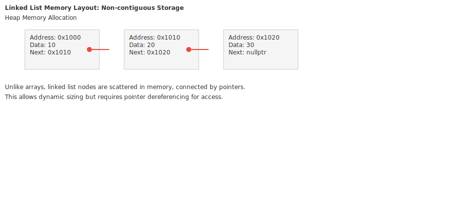
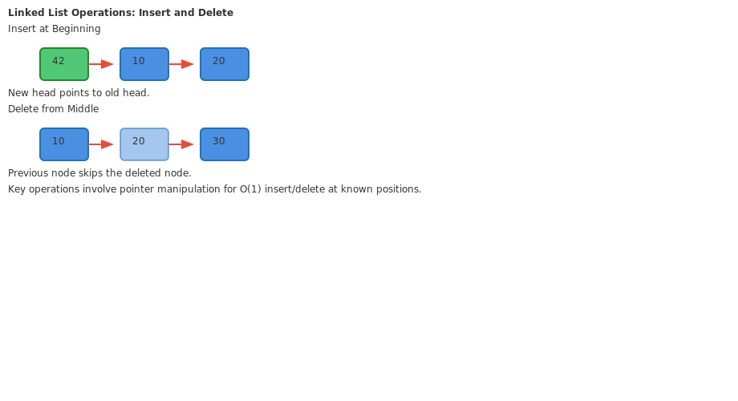

# Lesson 3.1: Linked Lists, Memory Management, and Operations

## Hook: The Flexibility of Dynamic Structures

Imagine you're building a playlist app. With arrays, adding a new song in the middle means shifting everything. Linked lists offer a different approach - each song points to the next, allowing instant insertions and deletions. This lesson explores how linked lists provide dynamic memory management in C++, contrasting with the rigidity of arrays.

## Roadmap for This Lesson

1. **Understanding Linked List Fundamentals**
   - Node structure and pointer relationships
   - Memory allocation patterns vs. arrays
   - Singly vs. doubly linked lists

2. **Memory Management in C++**
   - Dynamic allocation with `new` and `delete`
   - Smart pointers and RAII principles
   - Memory leaks and dangling pointers

3. **Core Operations Implementation**
   - Insertion at various positions
   - Deletion with proper cleanup
   - Traversal and search algorithms

4. **Performance Analysis**
   - Time complexity of operations
   - Space overhead considerations
   - When to choose linked lists over arrays

5. **Advanced Patterns**
   - Circular linked lists
   - Sentinel nodes for simplification
   - Common pitfalls and debugging

## Concept Deep Dive: Node-Based Architecture

Unlike arrays that store elements contiguously, linked lists use nodes scattered across memory. Each node contains data and pointers to other nodes.


This diagram shows how nodes connect via pointers, creating a chain of data elements.

### Singly Linked Lists

The simplest form allows traversal in one direction only.


```cpp
struct Node {
    int data;
    Node* next;
    
    Node(int val) : data(val), next(nullptr) {}
};
```

### Doubly Linked Lists

Bidirectional traversal with prev and next pointers.


```cpp
struct DoublyNode {
    int data;
    DoublyNode* prev;
    DoublyNode* next;
    
    DoublyNode(int val) : data(val), prev(nullptr), next(nullptr) {}
};
```

## Memory Management Deep Dive

Linked lists showcase C++'s dynamic memory capabilities.



```cpp
// Proper node creation
Node* createNode(int value) {
    Node* newNode = new Node(value);
    return newNode;
}

// Memory cleanup
void deleteNode(Node* node) {
    delete node;
}
```

### RAII and Smart Pointers

Modern C++ prefers smart pointers for automatic cleanup.

```cpp
#include <memory>

struct SmartNode {
    int data;
    std::unique_ptr<SmartNode> next;
    
    SmartNode(int val) : data(val), next(nullptr) {}
};

// Usage
auto head = std::make_unique<SmartNode>(10);
head->next = std::make_unique<SmartNode>(20);
```

## Guided Walkthrough: Building a Singly Linked List Class

Let's implement a complete singly linked list with proper memory management.

```cpp
class LinkedList {
private:
    struct Node {
        int data;
        Node* next;
        Node(int val) : data(val), next(nullptr) {}
    };
    
    Node* head;
    size_t size_;
    
public:
    LinkedList() : head(nullptr), size_(0) {}
    
    ~LinkedList() {
        clear();
    }
    
    void clear() {
        Node* current = head;
        while (current) {
            Node* temp = current;
            current = current->next;
            delete temp;
        }
        head = nullptr;
        size_ = 0;
    }
    
    // Copy constructor and assignment operator would be needed for deep copy
};
```

### Insertion Operations

```cpp
void insertAtBeginning(int value) {
    Node* newNode = new Node(value);
    newNode->next = head;
    head = newNode;
    size_++;
}

void insertAtEnd(int value) {
    Node* newNode = new Node(value);
    
    if (!head) {
        head = newNode;
    } else {
        Node* current = head;
        while (current->next) {
            current = current->next;
        }
        current->next = newNode;
    }
    size_++;
}

void insertAtPosition(size_t position, int value) {
    if (position == 0) {
        insertAtBeginning(value);
        return;
    }
    
    if (position > size_) {
        throw std::out_of_range("Position out of range");
    }
    
    Node* newNode = new Node(value);
    Node* current = head;
    
    for (size_t i = 0; i < position - 1; ++i) {
        current = current->next;
    }
    
    newNode->next = current->next;
    current->next = newNode;
    size_++;
}
```

### Deletion Operations

```cpp
void deleteFromBeginning() {
    if (!head) return;
    
    Node* temp = head;
    head = head->next;
    delete temp;
    size_--;
}

void deleteFromEnd() {
    if (!head) return;
    
    if (!head->next) {
        delete head;
        head = nullptr;
    } else {
        Node* current = head;
        while (current->next->next) {
            current = current->next;
        }
        delete current->next;
        current->next = nullptr;
    }
    size_--;
}

void deleteAtPosition(size_t position) {
    if (position >= size_) {
        throw std::out_of_range("Position out of range");
    }
    
    if (position == 0) {
        deleteFromBeginning();
        return;
    }
    
    Node* current = head;
    for (size_t i = 0; i < position - 1; ++i) {
        current = current->next;
    }
    
    Node* temp = current->next;
    current->next = temp->next;
    delete temp;
    size_--;
}
```

### Traversal and Search

```cpp
void print() const {
    Node* current = head;
    while (current) {
        std::cout << current->data << " -> ";
        current = current->next;
    }
    std::cout << "nullptr" << std::endl;
}

bool search(int value) const {
    Node* current = head;
    while (current) {
        if (current->data == value) {
            return true;
        }
        current = current->next;
    }
    return false;
}

int get(size_t position) const {
    if (position >= size_) {
        throw std::out_of_range("Position out of range");
    }
    
    Node* current = head;
    for (size_t i = 0; i < position; ++i) {
        current = current->next;
    }
    return current->data;
}
```

## Operations Visualization



The diagram illustrates how pointer manipulation enables efficient insertions and deletions.

## Performance Analysis

### Time Complexity

- **Access by index**: O(n) - must traverse from head
- **Search**: O(n) - linear traversal
- **Insert at beginning**: O(1)
- **Insert at end**: O(n) - need to find end
- **Insert at position**: O(n) - traverse to position
- **Delete operations**: O(n) for position-based, O(1) for known node

### Space Complexity

- **Overhead**: O(n) - each element has pointer overhead
- **Dynamic sizing**: No wasted space like arrays
- **Memory fragmentation**: Potential issue with scattered allocation

## Advanced Patterns: Circular Linked Lists

```cpp
class CircularLinkedList {
private:
    struct Node {
        int data;
        Node* next;
        Node(int val) : data(val), next(nullptr) {}
    };
    
    Node* head;
    size_t size_;
    
public:
    CircularLinkedList() : head(nullptr), size_(0) {}
    
    void insertAtEnd(int value) {
        Node* newNode = new Node(value);
        
        if (!head) {
            head = newNode;
            head->next = head; // Point to itself
        } else {
            Node* current = head;
            while (current->next != head) {
                current = current->next;
            }
            current->next = newNode;
            newNode->next = head;
        }
        size_++;
    }
    
    // Other operations adapted for circular structure
};
```

## Common Pitfalls and Debugging

### Memory Leaks

```cpp
// BAD: Forgetting to delete nodes
void badClear() {
    head = nullptr; // Nodes still allocated!
}

// GOOD: Proper cleanup
void goodClear() {
    Node* current = head;
    while (current) {
        Node* temp = current;
        current = current->next;
        delete temp;
    }
    head = nullptr;
}
```

### Dangling Pointers

```cpp
// BAD: Accessing deleted memory
Node* node = new Node(10);
// ... use node ...
delete node;
// node is now dangling!
node->data = 20; // Undefined behavior
```

### Null Pointer Dereference

```cpp
// Always check for null
void safeTraverse() {
    Node* current = head;
    while (current != nullptr) {
        std::cout << current->data << std::endl;
        current = current->next;
    }
}
```

## Practice Exercises

1. **Implement a doubly linked list** with all CRUD operations.

2. **Create a function to reverse a singly linked list** in-place.

3. **Detect cycles** in a linked list using Floyd's algorithm.

4. **Merge two sorted linked lists** into one sorted list.

5. **Implement a linked list with sentinel nodes** to simplify boundary conditions.

## Reflection: When to Use Linked Lists

- **Advantages**: Dynamic sizing, efficient insertions/deletions at ends
- **Disadvantages**: Poor random access, memory overhead, cache unfriendly
- **Best for**: Queues, stacks, frequent insertions/deletions
- **Alternatives**: std::vector for random access, std::deque for both ends

## Cheat Sheet: Linked List Operations

### Node Creation

```cpp
Node* node = new Node(value);
```

### Insertion Patterns

- **Beginning**: `newNode->next = head; head = newNode;`
- **End**: Traverse to end, `last->next = newNode;`
- **Middle**: Find position, `newNode->next = current->next; current->next = newNode;`

### Deletion Patterns

- **Beginning**: `temp = head; head = head->next; delete temp;`
- **End**: Find second last, `delete last; secondLast->next = nullptr;`
- **Middle**: `temp = current->next; current->next = temp->next; delete temp;`

### Traversal

```cpp
for (Node* current = head; current; current = current->next) {
    // Process current->data
}
```

## Journal Prompts

1. How does linked list memory management differ from array allocation?
2. When would you choose a linked list over std::vector?
3. What are the trade-offs between singly and doubly linked lists?
4. How can smart pointers prevent memory leaks in linked list implementations?

## Action Items

- [ ] Implement a complete singly linked list class
- [ ] Add unit tests for all operations
- [ ] Compare performance with std::vector for various use cases
- [ ] Study std::forward_list and std::list in the standard library
- [ ] Practice implementing common linked list algorithms

Remember: Linked lists teach us about dynamic memory and pointer manipulation, foundational concepts for more complex data structures in C++.

## Comparing with C++ Standard Library

The C++ standard library provides linked list implementations that you should know.

### std::forward_list (Singly Linked)

```cpp
#include <forward_list>
#include <iostream>

void demonstrateForwardList() {
    std::forward_list<int> flist = {1, 2, 3, 4, 5};
    
    // Insert at beginning - O(1)
    flist.push_front(0);
    
    // Insert after position - O(1) if iterator available
    auto it = flist.begin();
    ++it; // Point to second element
    flist.insert_after(it, 99);
    
    // Remove elements
    flist.remove(3); // Remove all occurrences of 3
    
    // Iterate
    for (int val : flist) {
        std::cout << val << " ";
    }
    std::cout << std::endl;
}
```

### std::list (Doubly Linked)

```cpp
#include <list>

void demonstrateList() {
    std::list<int> dlist = {1, 2, 3, 4, 5};
    
    // Insert at any position - O(1) with iterator
    auto it = dlist.begin();
    std::advance(it, 2); // Move to third position
    dlist.insert(it, 42);
    
    // Erase elements
    dlist.erase(it); // Erase at iterator position
    
    // Splice - move elements between lists efficiently
    std::list<int> other = {6, 7, 8};
    dlist.splice(dlist.end(), other); // Move all from other to end of dlist
    
    // Reverse in-place
    dlist.reverse();
    
    // Sort
    dlist.sort();
}
```

## Advanced Implementation: Templated Linked List

For reusability, create a templated version.

```cpp
template<typename T>
class LinkedList {
private:
    struct Node {
        T data;
        Node* next;
        Node(const T& val) : data(val), next(nullptr) {}
    };
    
    Node* head;
    size_t size_;
    
public:
    LinkedList() : head(nullptr), size_(0) {}
    ~LinkedList() { clear(); }
    
    void clear() {
        Node* current = head;
        while (current) {
            Node* temp = current;
            current = current->next;
            delete temp;
        }
        head = nullptr;
        size_ = 0;
    }
    
    void push_front(const T& value) {
        Node* newNode = new Node(value);
        newNode->next = head;
        head = newNode;
        size_++;
    }
    
    void push_back(const T& value) {
        Node* newNode = new Node(value);
        if (!head) {
            head = newNode;
        } else {
            Node* current = head;
            while (current->next) {
                current = current->next;
            }
            current->next = newNode;
        }
        size_++;
    }
    
    // Iterator support for range-based loops
    class Iterator {
    private:
        Node* current;
    public:
        Iterator(Node* node) : current(node) {}
        T& operator*() { return current->data; }
        Iterator& operator++() { current = current->next; return *this; }
        bool operator!=(const Iterator& other) { return current != other.current; }
    };
    
    Iterator begin() { return Iterator(head); }
    Iterator end() { return Iterator(nullptr); }
};
```

## Usage Example with Custom Types

```cpp
struct Person {
    std::string name;
    int age;
    
    Person(const std::string& n, int a) : name(n), age(a) {}
};

void demonstrateCustomTypes() {
    LinkedList<Person> people;
    
    people.push_back(Person("Alice", 25));
    people.push_back(Person("Bob", 30));
    people.push_front(Person("Charlie", 35));
    
    for (const auto& person : people) {
        std::cout << person.name << " (" << person.age << ")" << std::endl;
    }
}
```

## Performance Benchmarking

Compare linked list vs vector performance.

```cpp
#include <chrono>
#include <vector>

void benchmarkInsertions() {
    const int NUM_ELEMENTS = 10000;
    
    // Linked List insertions
    auto start = std::chrono::high_resolution_clock::now();
    LinkedList<int> llist;
    for (int i = 0; i < NUM_ELEMENTS; ++i) {
        llist.push_front(i); // O(1) per insertion
    }
    auto end = std::chrono::high_resolution_clock::now();
    auto llist_time = std::chrono::duration_cast<std::chrono::microseconds>(end - start);
    
    // Vector insertions (worst case)
    start = std::chrono::high_resolution_clock::now();
    std::vector<int> vec;
    for (int i = 0; i < NUM_ELEMENTS; ++i) {
        vec.insert(vec.begin(), i); // O(n) per insertion
    }
    end = std::chrono::high_resolution_clock::now();
    auto vec_time = std::chrono::duration_cast<std::chrono::microseconds>(end - start);
    
    std::cout << "Linked List time: " << llist_time.count() << " μs" << std::endl;
    std::cout << "Vector time: " << vec_time.count() << " μs" << std::endl;
    std::cout << "Linked list is " << (vec_time.count() / static_cast<double>(llist_time.count())) 
              << "x faster for front insertions" << std::endl;
}
```

## Memory Pool Optimization

For performance-critical applications, use memory pools to reduce allocation overhead.

```cpp
class MemoryPool {
private:
    struct Block {
        Block* next;
        char data[sizeof(Node)]; // Space for Node
    };
    
    Block* freeList;
    
public:
    MemoryPool() : freeList(nullptr) {}
    
    void* allocate() {
        if (freeList) {
            void* result = freeList;
            freeList = freeList->next;
            return result;
        }
        return new Block();
    }
    
    void deallocate(void* ptr) {
        Block* block = static_cast<Block*>(ptr);
        block->next = freeList;
        freeList = block;
    }
};
```

## Thread Safety Considerations

Linked lists can be made thread-safe with mutexes.

```cpp
#include <mutex>

class ThreadSafeLinkedList {
private:
    struct Node {
        int data;
        Node* next;
        Node(int val) : data(val), next(nullptr) {}
    };
    
    Node* head;
    size_t size_;
    mutable std::mutex mutex_;
    
public:
    void push_front(int value) {
        Node* newNode = new Node(value);
        std::lock_guard<std::mutex> lock(mutex_);
        newNode->next = head;
        head = newNode;
        size_++;
    }
    
    // Other operations similarly protected
};
```

## Common Interview Problems

### Reverse a Linked List

```cpp
Node* reverseList(Node* head) {
    Node* prev = nullptr;
    Node* current = head;
    Node* next = nullptr;
    
    while (current) {
        next = current->next;     // Store next
        current->next = prev;     // Reverse current node's pointer
        prev = current;           // Move prev to current
        current = next;           // Move to next node
    }
    
    return prev; // New head
}
```

### Detect Cycle (Floyd's Algorithm)

```cpp
bool hasCycle(Node* head) {
    if (!head || !head->next) return false;
    
    Node* slow = head;
    Node* fast = head->next;
    
    while (fast && fast->next) {
        if (slow == fast) return true;
        slow = slow->next;
        fast = fast->next->next;
    }
    
    return false;
}
```

### Find Middle Element

```cpp
Node* findMiddle(Node* head) {
    if (!head) return nullptr;
    
    Node* slow = head;
    Node* fast = head;
    
    while (fast->next && fast->next->next) {
        slow = slow->next;
        fast = fast->next->next;
    }
    
    return slow;
}
```

## Best Practices Summary

1. **Use smart pointers** for automatic memory management
2. **Implement proper copy semantics** if needed
3. **Consider sentinel nodes** to simplify boundary checks
4. **Profile performance** before choosing over arrays
5. **Use standard library** containers when possible
6. **Handle edge cases** like empty lists and single nodes
7. **Document ownership** and lifetime expectations
8. **Test thoroughly** with various input sizes

## Action Items

- [ ] Implement a complete singly linked list class
- [ ] Add unit tests for all operations
- [ ] Compare performance with std::vector for various use cases
- [ ] Study std::forward_list and std::list in the standard library
- [ ] Practice implementing common linked list algorithms
- [ ] Experiment with memory pools for optimization
- [ ] Implement thread-safe version with mutexes
- [ ] Solve linked list interview problems

Remember: Linked lists teach us about dynamic memory and pointer manipulation, foundational concepts for more complex data structures in C++.
