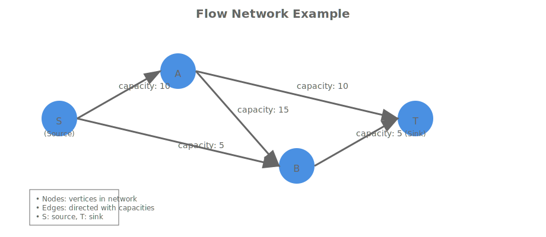
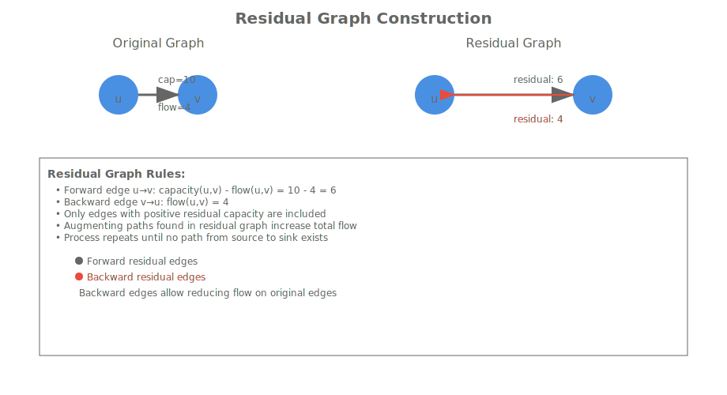
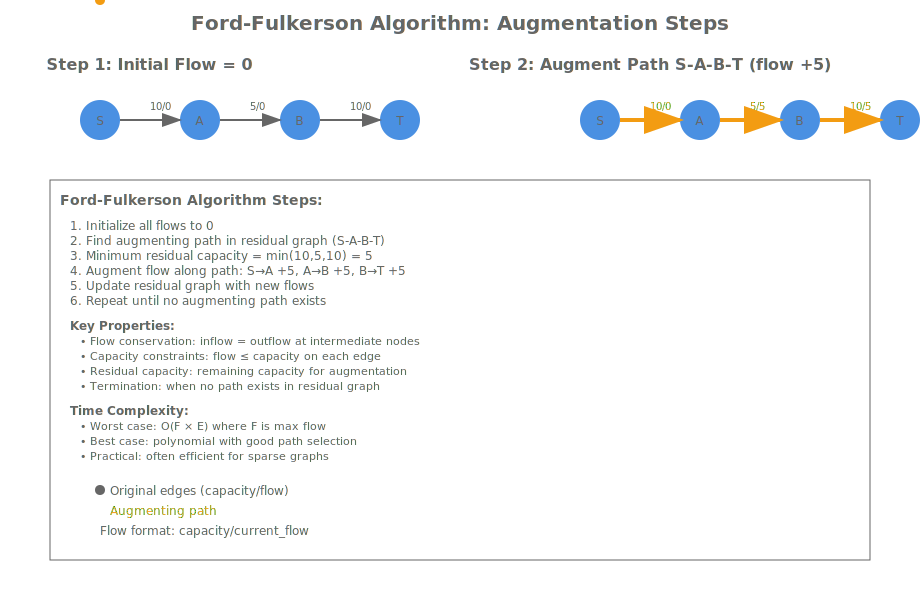
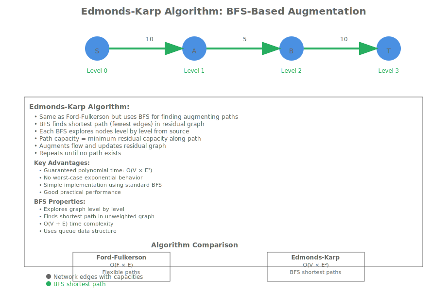

# Module 10: Maximum Flow Algorithms

## Hook: The Flow Network Challenge

Imagine you're managing a transportation network where goods need to flow from a central warehouse to multiple distribution centers. Each road segment has a maximum capacity for trucks per hour, and intersections have complex routing constraints. How do you determine the maximum number of trucks that can flow through the network simultaneously without violating any capacity limits?

This is the maximum flow problem - finding the maximum amount of flow that can be sent from a source to a sink in a flow network. Maximum flow algorithms provide the mathematical foundation for solving these flow optimization problems across transportation systems, communication networks, and resource allocation systems.

The elegance of maximum flow algorithms lies in their use of residual graphs and augmenting paths, iteratively finding bottlenecks and increasing flow until no more improvements are possible. This approach extends beyond network flow to solving matching problems, image segmentation, and circuit design.

## Roadmap: Your Journey Through Maximum Flow Algorithms

In this comprehensive module, you'll master the fundamental algorithms for computing maximum flow in flow networks:

1. **Core Concepts**: Understanding flow networks, capacities, and flow conservation
2. **Residual Graphs**: The key data structure for augmenting path algorithms
3. **Ford-Fulkerson Algorithm**: The foundational method using augmenting paths
4. **Edmonds-Karp Algorithm**: BFS-based implementation for polynomial time
5. **Performance Analysis**: Comparing algorithmic approaches and complexity bounds
6. **Real-world Applications**: Network routing, matching problems, and optimization
7. **Advanced Topics**: Variants, optimizations, and implementation considerations
8. **Practical Implementation**: C++ code with modern standard library features

By the end of this module, you'll understand how these algorithms work, when to use each approach, and how to implement them efficiently in production code.

## Concept Deep Dive: Understanding Flow Networks

A flow network is a directed graph where each edge has a capacity and flow value:

- **Capacity**: Maximum amount that can flow through an edge
- **Flow**: Current amount flowing through an edge
- **Source**: Node where flow originates
- **Sink**: Node where flow terminates



### Flow Properties

1. **Capacity Constraint**: Flow on each edge ≤ capacity
2. **Flow Conservation**: Flow into a node = flow out (except source/sink)
3. **Skew Symmetry**: Flow on reverse edge is negative of forward flow

These properties define valid flows and guide the development of algorithms that find maximum flows.

## Residual Graphs: The Augmentation Engine

A residual graph contains edges with remaining capacity for augmentation:

- **Forward Edges**: Capacity - flow > 0
- **Backward Edges**: Flow > 0 (can reduce flow)



### Residual Graph Construction

```text
For each edge u->v in original graph:
  - If capacity(u,v) - flow(u,v) > 0: add edge u->v with capacity capacity(u,v) - flow(u,v)
  - If flow(u,v) > 0: add edge v->u with capacity flow(u,v)
```

This construction enables finding augmenting paths that increase total flow.

## Ford-Fulkerson Algorithm: Augmenting Path Foundation

Ford-Fulkerson finds augmenting paths in residual graphs and augments flow along them.

### Ford-Fulkerson Algorithm Overview

```text
1. Initialize all flows to 0
2. While there exists an augmenting path from source to sink in residual graph:
   a. Find path with minimum residual capacity
   b. Augment flow along path by that amount
   c. Update residual graph
3. Return total flow
```



### Ford-Fulkerson C++ Implementation

```cpp
#include <vector>
#include <queue>
#include <limits>
#include <iostream>
#include <algorithm>

class FordFulkerson {
private:
    int V;
    std::vector<std::vector<int>> capacity;
    std::vector<std::vector<int>> flow;

    bool bfs(int s, int t, std::vector<int>& parent) {
        std::vector<bool> visited(V, false);
        std::queue<int> q;
        q.push(s);
        visited[s] = true;
        parent[s] = -1;

        while (!q.empty()) {
            int u = q.front();
            q.pop();

            for (int v = 0; v < V; ++v) {
                if (!visited[v] && capacity[u][v] - flow[u][v] > 0) {
                    q.push(v);
                    parent[v] = u;
                    visited[v] = true;
                    if (v == t) return true;
                }
            }
        }
        return false;
    }

public:
    FordFulkerson(int vertices) : V(vertices), capacity(vertices, std::vector<int>(vertices, 0)), flow(vertices, std::vector<int>(vertices, 0)) {}

    void addEdge(int u, int v, int cap) {
        capacity[u][v] = cap;
    }

    int maxFlow(int s, int t) {
        std::vector<int> parent(V);
        int max_flow = 0;

        while (bfs(s, t, parent)) {
            int path_flow = std::numeric_limits<int>::max();
            for (int v = t; v != s; v = parent[v]) {
                int u = parent[v];
                path_flow = std::min(path_flow, capacity[u][v] - flow[u][v]);
            }

            for (int v = t; v != s; v = parent[v]) {
                int u = parent[v];
                flow[u][v] += path_flow;
                flow[v][u] -= path_flow;
            }

            max_flow += path_flow;
        }

        return max_flow;
    }
};
```

### Time Complexity Analysis

- **Worst Case**: O(F * E) where F is maximum flow - can be exponential
- **Best Case**: Polynomial when using efficient path finding
- **Space Complexity**: O(V²) for capacity and flow matrices
- **Practical Performance**: Often good for sparse graphs with small capacities
- **Termination**: Guaranteed when capacities are integers, may not terminate with irrational capacities

## Edmonds-Karp Algorithm: BFS-Optimized Ford-Fulkerson

Edmonds-Karp uses BFS to find shortest augmenting paths, ensuring polynomial time.

### Edmonds-Karp Algorithm Overview

```text
Same as Ford-Fulkerson, but use BFS instead of DFS for finding augmenting paths
```



### Edmonds-Karp C++ Implementation

```cpp
#include <vector>
#include <queue>
#include <limits>
#include <iostream>
#include <algorithm>

class EdmondsKarp {
private:
    int V;
    std::vector<std::vector<int>> capacity;
    std::vector<std::vector<int>> flow;

    int bfs(int s, int t, std::vector<int>& parent) {
        std::vector<bool> visited(V, false);
        std::queue<int> q;
        q.push(s);
        visited[s] = true;
        parent[s] = -1;

        while (!q.empty()) {
            int u = q.front();
            q.pop();

            for (int v = 0; v < V; ++v) {
                if (!visited[v] && capacity[u][v] - flow[u][v] > 0) {
                    q.push(v);
                    parent[v] = u;
                    visited[v] = true;
                    if (v == t) {
                        int path_flow = std::numeric_limits<int>::max();
                        for (int v2 = t; v2 != s; v2 = parent[v2]) {
                            int u2 = parent[v2];
                            path_flow = std::min(path_flow, capacity[u2][v2] - flow[u2][v2]);
                        }
                        return path_flow;
                    }
                }
            }
        }
        return 0;
    }

public:
    EdmondsKarp(int vertices) : V(vertices), capacity(vertices, std::vector<int>(vertices, 0)), flow(vertices, std::vector<int>(vertices, 0)) {}

    void addEdge(int u, int v, int cap) {
        capacity[u][v] = cap;
    }

    int maxFlow(int s, int t) {
        std::vector<int> parent(V);
        int max_flow = 0;
        int path_flow;

        while ((path_flow = bfs(s, t, parent)) > 0) {
            for (int v = t; v != s; v = parent[v]) {
                int u = parent[v];
                flow[u][v] += path_flow;
                flow[v][u] -= path_flow;
            }
            max_flow += path_flow;
        }

        return max_flow;
    }
};
```

### Time Complexity Analysis

- **Time Complexity**: O(V E²) - polynomial and efficient
- **Space Complexity**: O(V²) for matrices
- **Worst Case**: Better than general Ford-Fulkerson
- **Practical Performance**: Excellent for most applications
- **Guarantee**: Always terminates with integer capacities

## Performance Comparison

<table style="border-collapse: collapse;">
<thead>
<tr><th style="padding: 8px; border: 1px solid #ddd;">Algorithm</th><th style="padding: 8px; border: 1px solid #ddd;">Time Complexity</th><th style="padding: 8px; border: 1px solid #ddd;">Space Complexity</th><th style="padding: 8px; border: 1px solid #ddd;">Best For</th><th style="padding: 8px; border: 1px solid #ddd;">Implementation Notes</th></tr>
</thead>
<tbody>
<tr><td style="padding: 8px; border: 1px solid #ddd;">Ford-Fulkerson</td><td style="padding: 8px; border: 1px solid #ddd;">O(F * E)</td><td style="padding: 8px; border: 1px solid #ddd;">O(V²)</td><td style="padding: 8px; border: 1px solid #ddd;">Small capacities</td><td style="padding: 8px; border: 1px solid #ddd;">Flexible path finding, may be slow</td></tr>
<tr><td style="padding: 8px; border: 1px solid #ddd;">Edmonds-Karp</td><td style="padding: 8px; border: 1px solid #ddd;">O(V E²)</td><td style="padding: 8px; border: 1px solid #ddd;">O(V²)</td><td style="padding: 8px; border: 1px solid #ddd;">General use</td><td style="padding: 8px; border: 1px solid #ddd;">BFS-based, guaranteed polynomial</td></tr>
</tbody>
</table>

## Guided Walkthrough: Solving a Network Flow Problem

Consider a network with source A, sink F, and capacities:

```text
A->B: 10, A->C: 5, B->C: 15, B->D: 10, C->D: 5, C->E: 10, D->E: 5, D->F: 10, E->F: 15
```

### Ford-Fulkerson Solution

1. Path A-B-D-F: min(10,10,10)=10, flow=10
2. Path A-C-E-F: min(5,10,15)=5, flow=15
3. Path A-B-C-E-F: min(10,15,10,15)=10, flow=25
4. No more paths, max flow=25

### Edmonds-Karp Solution

Same result, but using BFS for shortest paths.

## Real-world Applications of Maximum Flow

Maximum flow algorithms solve numerous practical problems:

1. **Network Routing**: Finding maximum data throughput in communication networks
2. **Transportation Planning**: Optimizing cargo flow in logistics networks
3. **Matching Problems**: Bipartite matching in assignment problems
4. **Image Segmentation**: Finding min-cuts in computer vision
5. **Circuit Design**: Optimizing wire routing in electronic circuits


These applications demonstrate how maximum flow algorithms provide optimal solutions for flow optimization problems.

## Practice: Implementing Maximum Flow Algorithms

### Exercise 1: Ford-Fulkerson with DFS

Implement Ford-Fulkerson using DFS for finding augmenting paths. Compare performance with BFS version.

### Exercise 1: Ford-Fulkerson with DFS

Implement Ford-Fulkerson using DFS for finding augmenting paths. Compare performance with BFS version.

```cpp
#include <vector>
#include <queue>
#include <limits>
#include <iostream>
#include <algorithm>

class FordFulkersonDFS {
private:
    int V;
    std::vector<std::vector<int>> capacity;
    std::vector<std::vector<int>> flow;

    bool dfs(int s, int t, std::vector<int>& parent, std::vector<bool>& visited) {
        visited[s] = true;

        for (int v = 0; v < V; ++v) {
            if (!visited[v] && capacity[s][v] - flow[s][v] > 0) {
                parent[v] = s;
                if (v == t || dfs(v, t, parent, visited)) {
                    return true;
                }
            }
        }
        return false;
    }

public:
    FordFulkersonDFS(int vertices) : V(vertices), capacity(vertices, std::vector<int>(vertices, 0)), flow(vertices, std::vector<int>(vertices, 0)) {}

    void addEdge(int u, int v, int cap) {
        capacity[u][v] = cap;
    }

    int maxFlow(int s, int t) {
        std::vector<int> parent(V);
        int max_flow = 0;

        while (true) {
            std::vector<bool> visited(V, false);
            if (!dfs(s, t, parent, visited)) break;

            int path_flow = std::numeric_limits<int>::max();
            for (int v = t; v != s; v = parent[v]) {
                int u = parent[v];
                path_flow = std::min(path_flow, capacity[u][v] - flow[u][v]);
            }

            for (int v = t; v != s; v = parent[v]) {
                int u = parent[v];
                flow[u][v] += path_flow;
                flow[v][u] -= path_flow;
            }

            max_flow += path_flow;
        }

        return max_flow;
    }
};
```

### Exercise 2: Edmonds-Karp Optimization

Enhance Edmonds-Karp with capacity scaling or other optimizations. Implement capacity scaling for better performance on large capacity networks.

```cpp
#include <vector>
#include <queue>
#include <limits>
#include <iostream>
#include <algorithm>

class CapacityScalingEdmondsKarp {
private:
    int V;
    std::vector<std::vector<int>> capacity;
    std::vector<std::vector<int>> flow;

    int bfs(int s, int t, std::vector<int>& parent, int delta) {
        std::vector<bool> visited(V, false);
        std::queue<int> q;
        q.push(s);
        visited[s] = true;
        parent[s] = -1;

        while (!q.empty()) {
            int u = q.front();
            q.pop();

            for (int v = 0; v < V; ++v) {
                if (!visited[v] && capacity[u][v] - flow[u][v] >= delta) {
                    q.push(v);
                    parent[v] = u;
                    visited[v] = true;
                    if (v == t) {
                        int path_flow = std::numeric_limits<int>::max();
                        for (int v2 = t; v2 != s; v2 = parent[v2]) {
                            int u2 = parent[v2];
                            path_flow = std::min(path_flow, capacity[u2][v2] - flow[u2][v2]);
                        }
                        return path_flow;
                    }
                }
            }
        }
        return 0;
    }

public:
    CapacityScalingEdmondsKarp(int vertices) : V(vertices), capacity(vertices, std::vector<int>(vertices, 0)), flow(vertices, std::vector<int>(vertices, 0)) {}

    void addEdge(int u, int v, int cap) {
        capacity[u][v] = cap;
    }

    int maxFlow(int s, int t) {
        std::vector<int> parent(V);
        int max_flow = 0;
        int delta = 1 << 30; // Large initial delta

        while (delta > 0) {
            int path_flow;
            while ((path_flow = bfs(s, t, parent, delta)) > 0) {
                for (int v = t; v != s; v = parent[v]) {
                    int u = parent[v];
                    flow[u][v] += path_flow;
                    flow[v][u] -= path_flow;
                }
                max_flow += path_flow;
            }
            delta /= 2;
        }

        return max_flow;
    }
};
```

### Exercise 3: Maximum Flow in Real Networks

Apply maximum flow algorithms to model real-world network problems like transportation or communication networks.

```cpp
// Example: Modeling a transportation network
#include <vector>
#include <iostream>

class TransportationNetwork {
private:
    EdmondsKarp mf;
    std::vector<std::string> nodeNames;

public:
    TransportationNetwork(int nodes, const std::vector<std::string>& names) 
        : mf(nodes), nodeNames(names) {}

    void addRoad(const std::string& from, const std::string& to, int capacity) {
        auto it1 = std::find(nodeNames.begin(), nodeNames.end(), from);
        auto it2 = std::find(nodeNames.begin(), nodeNames.end(), to);
        if (it1 != nodeNames.end() && it2 != nodeNames.end()) {
            int u = it1 - nodeNames.begin();
            int v = it2 - nodeNames.begin();
            mf.addEdge(u, v, capacity);
        }
    }

    int getMaxFlow(const std::string& source, const std::string& sink) {
        auto it1 = std::find(nodeNames.begin(), nodeNames.end(), source);
        auto it2 = std::find(nodeNames.begin(), nodeNames.end(), sink);
        if (it1 != nodeNames.end() && it2 != nodeNames.end()) {
            int s = it1 - nodeNames.begin();
            int t = it2 - nodeNames.begin();
            return mf.maxFlow(s, t);
        }
        return 0;
    }
};
```

### Exercise 4: Min-Cut Max-Flow Theorem

Implement and verify the max-flow min-cut theorem. Find both maximum flow and minimum cut in the same network.

```cpp
#include <vector>
#include <queue>
#include <limits>
#include <iostream>
#include <algorithm>

class MaxFlowMinCut {
private:
    int V;
    std::vector<std::vector<int>> capacity;
    std::vector<std::vector<int>> flow;
    std::vector<int> level;

    bool bfs(int s, int t) {
        level.assign(V, -1);
        level[s] = 0;
        std::queue<int> q;
        q.push(s);

        while (!q.empty()) {
            int u = q.front();
            q.pop();

            for (int v = 0; v < V; ++v) {
                if (level[v] == -1 && capacity[u][v] - flow[u][v] > 0) {
                    level[v] = level[u] + 1;
                    q.push(v);
                }
            }
        }
        return level[t] != -1;
    }

    int dfs(int u, int t, int f) {
        if (u == t || f == 0) return f;
        for (int v = 0; v < V; ++v) {
            if (level[v] == level[u] + 1 && capacity[u][v] - flow[u][v] > 0) {
                int df = dfs(v, t, std::min(f, capacity[u][v] - flow[u][v]));
                if (df > 0) {
                    flow[u][v] += df;
                    flow[v][u] -= df;
                    return df;
                }
            }
        }
        return 0;
    }

public:
    MaxFlowMinCut(int vertices) : V(vertices), capacity(vertices, std::vector<int>(vertices, 0)), 
                                  flow(vertices, std::vector<int>(vertices, 0)), level(vertices) {}

    void addEdge(int u, int v, int cap) {
        capacity[u][v] = cap;
    }

    int maxFlow(int s, int t) {
        int total = 0;
        while (bfs(s, t)) {
            int f;
            while ((f = dfs(s, t, std::numeric_limits<int>::max())) > 0) {
                total += f;
            }
        }
        return total;
    }

    std::pair<int, std::vector<std::pair<int, int>>> minCut(int s, int t) {
        int mf = maxFlow(s, t);
        std::vector<bool> visited(V, false);
        std::queue<int> q;
        q.push(s);
        visited[s] = true;

        while (!q.empty()) {
            int u = q.front();
            q.pop();
            for (int v = 0; v < V; ++v) {
                if (!visited[v] && capacity[u][v] - flow[u][v] > 0) {
                    visited[v] = true;
                    q.push(v);
                }
            }
        }

        std::vector<std::pair<int, int>> cut;
        for (int u = 0; u < V; ++u) {
            if (visited[u]) {
                for (int v = 0; v < V; ++v) {
                    if (!visited[v] && capacity[u][v] > 0) {
                        cut.emplace_back(u, v);
                    }
                }
            }
        }

        return {mf, cut};
    }
};
```

### Exercise 5: Bipartite Matching

Use maximum flow to solve bipartite matching problems. Implement Hopcroft-Karp algorithm as comparison.

```cpp
#include <vector>
#include <queue>
#include <iostream>

class BipartiteMatching {
private:
    int n, m; // Left and right set sizes
    std::vector<std::vector<int>> adj;
    std::vector<int> pairU, pairV, dist;

    bool bfs() {
        std::queue<int> q;
        for (int u = 0; u < n; ++u) {
            if (pairU[u] == -1) {
                dist[u] = 0;
                q.push(u);
            } else {
                dist[u] = std::numeric_limits<int>::max();
            }
        }
        dist[n] = std::numeric_limits<int>::max();

        while (!q.empty()) {
            int u = q.front();
            q.pop();
            if (dist[u] < dist[n]) {
                for (int v : adj[u]) {
                    if (dist[pairV[v]] == std::numeric_limits<int>::max()) {
                        dist[pairV[v]] = dist[u] + 1;
                        q.push(pairV[v]);
                    }
                }
            }
        }
        return dist[n] != std::numeric_limits<int>::max();
    }

    bool dfs(int u) {
        if (u != n) {
            for (int v : adj[u]) {
                if (dist[pairV[v]] == dist[u] + 1 && dfs(pairV[v])) {
                    pairV[v] = u;
                    pairU[u] = v;
                    return true;
                }
            }
            dist[u] = std::numeric_limits<int>::max();
            return false;
        }
        return true;
    }

public:
    BipartiteMatching(int left, int right) : n(left), m(right), adj(left), 
                                             pairU(left, -1), pairV(right, n), dist(left + 1) {}

    void addEdge(int u, int v) {
        adj[u].push_back(v);
    }

    int maxMatching() {
        int matching = 0;
        while (bfs()) {
            for (int u = 0; u < n; ++u) {
                if (pairU[u] == -1 && dfs(u)) {
                    ++matching;
                }
            }
        }
        return matching;
    }
};
```

### Exercise 2: Edmonds-Karp Optimization

Enhance Edmonds-Karp with capacity scaling or other optimizations. Implement capacity scaling for better performance on large capacity networks.

```cpp
// TODO: Add capacity scaling to Edmonds-Karp
// TODO: Implement Dinic's algorithm as alternative
// TODO: Compare performance with different optimization techniques
```

### Exercise 3: Maximum Flow in Real Networks

Apply maximum flow algorithms to model real-world network problems like transportation or communication networks.

### Exercise 4: Min-Cut Max-Flow Theorem

Implement and verify the max-flow min-cut theorem. Find both maximum flow and minimum cut in the same network.

### Exercise 5: Bipartite Matching

Use maximum flow to solve bipartite matching problems. Implement Hopcroft-Karp algorithm as comparison.

## Reflection: Maximum Flow Algorithm Insights

### When to Choose Ford-Fulkerson vs Edmonds-Karp

- **Ford-Fulkerson**:
  - Flexible path finding (DFS/DFS/custom)
  - Can be faster with good heuristics
  - Risk of exponential time in worst case

- **Edmonds-Karp**:
  - Guaranteed polynomial time
  - Simple BFS implementation
  - Good general-purpose choice

### Common Pitfalls

1. **Residual Graph Updates**: Always update both forward and backward edges
2. **Flow Conservation**: Ensure flow balance at all nodes except source/sink
3. **Capacity Constraints**: Never exceed edge capacities
4. **Termination**: Handle cases where no augmenting path exists

### Maximum Flow Variants and Extensions

Beyond basic maximum flow algorithms, several variants address specific requirements:

1. **Minimum Cost Maximum Flow**: Find maximum flow with minimum cost
2. **Multi-Commodity Flow**: Route multiple commodities simultaneously
3. **Stochastic Flow**: Handle uncertain capacities
4. **Dynamic Flow**: Networks that change over time

These variants require modifications to the basic Ford-Fulkerson and Edmonds-Karp algorithms.

### Performance Optimization Techniques

For large-scale networks, several optimization techniques improve maximum flow computation:

1. **Capacity Scaling**: Process high-capacity edges first
2. **Dinic's Algorithm**: Layered graph approach for O(V²E) time
3. **Push-Relabel**: Pre-flow based method for certain graph types
4. **Parallel Flow**: Distributed computation for massive networks

Understanding these advanced techniques helps in implementing efficient solutions for real-world scale problems.

## Cheat Sheet: Maximum Flow Algorithm Quick Reference

### Ford-Fulkerson Steps
1. Initialize flow to 0
2. Find augmenting path in residual graph
3. Augment flow along path
4. Update residual graph
5. Repeat until no path exists

### Edmonds-Karp Steps
1. Same as Ford-Fulkerson
2. Use BFS for shortest paths
3. Guaranteed O(V E²) time

### Residual Graph Rules
- Forward edge: capacity - flow
- Backward edge: current flow
- Path capacity: minimum residual capacity

### Time Complexity Reference
- Ford-Fulkerson: O(F * E)
- Edmonds-Karp: O(V E²)
- Dinic's: O(V² E)
- Dense graphs: Matrix representations
- Sparse graphs: Adjacency lists

## Key Takeaways

1. **Flow Network**: Directed graph with capacities on edges, source and sink nodes
2. **Maximum Flow**: Largest possible flow from source to sink respecting capacities
3. **Residual Graph**: Contains edges with remaining capacity for augmentation
4. **Ford-Fulkerson**: Augmenting path algorithm, flexible but potentially slow
5. **Edmonds-Karp**: BFS-based Ford-Fulkerson, polynomial time guarantee
6. **Augmenting Path**: Path in residual graph from source to sink
7. **Flow Conservation**: Flow in = flow out for intermediate nodes
8. **Capacity Constraint**: Flow ≤ capacity on each edge
9. **Min-Cut**: Smallest cut equals maximum flow
10. **Applications**: Network routing, matching, transportation, image processing
11. **Implementation**: Matrix for dense, adjacency list for sparse graphs
12. **Optimizations**: Capacity scaling, Dinic's algorithm, parallel processing

## Practice Checklist

- [ ] Implement Ford-Fulkerson with DFS and BFS
- [ ] Implement Edmonds-Karp algorithm
- [ ] Compare performance on different graph types
- [ ] Solve network flow problems
- [ ] Verify max-flow min-cut theorem
- [ ] Apply to bipartite matching
- [ ] Optimize for large-scale networks
- [ ] Analyze algorithm trade-offs

## Journal Prompts

1. How do maximum flow algorithms relate to other graph algorithms?
2. What real-world problems can be modeled as maximum flow problems?
3. How does the choice of path finding affect algorithm performance?
4. What are the implications of the max-flow min-cut theorem?
5. How might parallel processing improve maximum flow computation?
6. What are the connections between maximum flow and linear programming?
7. How do maximum flow algorithms handle dynamic networks?
8. What role do residual graphs play in optimization algorithms?
9. How can maximum flow be used for image segmentation?
10. What are the limitations of current maximum flow algorithms?