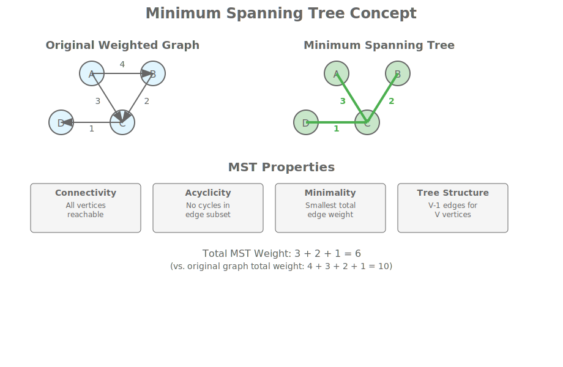
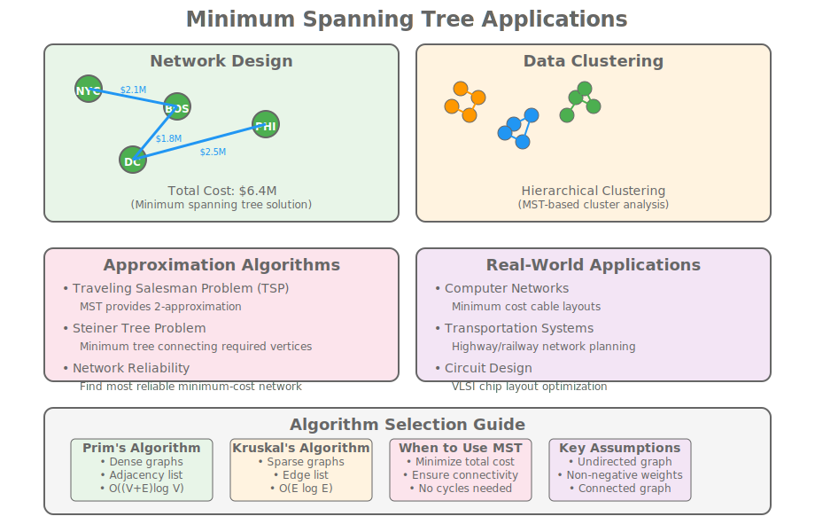

# Module 9: Minimum Spanning Tree Algorithms

## Hook: The Network Design Challenge

Imagine you're tasked with connecting a series of cities with fiber optic cables at minimum cost. Each city pair has a different cable cost based on distance, terrain difficulty, and existing infrastructure. Some routes cross mountains requiring expensive tunneling, others follow existing highways with lower installation costs.

How do you choose which connections to make to connect all cities while minimizing total cost? This is more than just picking the cheapest individual cables - you must ensure the entire network forms a connected system without any isolated cities.

This challenge captures the essence of the Minimum Spanning Tree (MST) problem - finding a subset of edges that connects all vertices without cycles while minimizing total edge weight. MST algorithms provide the mathematical foundation for solving these connectivity optimization problems across computer networks, transportation systems, and electrical grids.

The beauty of MST algorithms lies in their greedy approach: at each step, make the locally optimal choice that leads to a globally optimal solution. This principle extends beyond graph theory into optimization problems throughout computer science and engineering.

## Roadmap: Your Journey Through MST Algorithms

In this comprehensive module, you'll master the fundamental algorithms for computing minimum spanning trees:

1. **Core Concepts**: Understanding spanning trees, connectivity, and optimality criteria
2. **Prim's Algorithm**: Growing the MST from a single vertex using priority queues
3. **Kruskal's Algorithm**: Building the MST by adding edges in sorted order
4. **Union-Find Data Structure**: Efficient cycle detection for Kruskal's algorithm
5. **Performance Analysis**: Comparing algorithmic approaches and their trade-offs
6. **Real-world Applications**: Network design, clustering, and optimization problems
7. **Advanced Topics**: Variants, optimizations, and implementation considerations
8. **Practical Implementation**: C++ code with modern standard library features

By the end of this module, you'll understand how these algorithms work, when to use each approach, and how to implement them efficiently in production code.

## Concept Deep Dive: Understanding Minimum Spanning Trees

A Minimum Spanning Tree is a subset of edges forming a tree that:

- Connects all vertices
- Contains no cycles
- Has minimum total edge weight



### Key Properties

1. **Connectivity**: All vertices must be reachable through the tree edges. This ensures the network functions as a single connected component, allowing communication between any two nodes.

2. **Acyclicity**: No cycles in the edge subset. Cycles would represent redundant connections that increase cost without providing additional connectivity benefits.

3. **Minimality**: Smallest possible total edge weight among all possible spanning trees. This optimality property ensures the most cost-effective solution.

4. **Uniqueness**: May not be unique if edge weights are equal. Multiple spanning trees can have the same total weight when different combinations of equal-weight edges are chosen.

These properties define the MST problem and guide the development of algorithms that guarantee optimal solutions. The challenge lies in efficiently finding a tree that satisfies all these properties simultaneously.

## Prim's Algorithm: Growing from a Seed

Prim's algorithm starts with a single vertex and grows the MST by repeatedly adding the cheapest edge that connects a new vertex to the existing tree.

### Algorithm Overview

```text
1. Start with an arbitrary vertex as the initial tree
2. While there are vertices not in the tree:
   a. Find the minimum-weight edge connecting tree to non-tree vertex
   b. Add that edge and vertex to the tree
3. Return the complete tree
```


### C++ Implementation

```cpp
#include <vector>
#include <queue>
#include <limits>
#include <iostream>

class PrimsMST {
private:
    int V; // Number of vertices
    std::vector<std::vector<std::pair<int, int>>> adj; // adjacency list: {weight, vertex}

public:
    PrimsMST(int vertices) : V(vertices), adj(vertices) {}

    void addEdge(int u, int v, int weight) {
        adj[u].push_back({weight, v});
        adj[v].push_back({weight, u});
    }

    int findMST() {
        std::vector<int> key(V, std::numeric_limits<int>::max());
        std::vector<bool> inMST(V, false);
        std::vector<int> parent(V, -1);

        // Priority queue: {weight, vertex}
        std::priority_queue<std::pair<int, int>,
                          std::vector<std::pair<int, int>>,
                          std::greater<std::pair<int, int>>> pq;

        // Start from vertex 0
        key[0] = 0;
        pq.push({0, 0});

        int totalWeight = 0;

        while (!pq.empty()) {
            int u = pq.top().second;
            pq.pop();

            if (inMST[u]) continue;
            inMST[u] = true;
            totalWeight += key[u];

            for (auto& edge : adj[u]) {
                int weight = edge.first;
                int v = edge.second;

                if (!inMST[v] && weight < key[v]) {
                    key[v] = weight;
                    parent[v] = u;
                    pq.push({key[v], v});
                }
            }
        }

        return totalWeight;
    }
};
```

### Dense Graph Optimization

For dense graphs, using an adjacency matrix can be more efficient:

```cpp
#include <vector>
#include <queue>
#include <limits>
#include <iostream>

class DensePrimsMST {
private:
    int V;
    std::vector<std::vector<int>> adjMatrix;

public:
    DensePrimsMST(int vertices) : V(vertices), adjMatrix(vertices, std::vector<int>(vertices, std::numeric_limits<int>::max())) {}

    void addEdge(int u, int v, int weight) {
        adjMatrix[u][v] = weight;
        adjMatrix[v][u] = weight;
    }

    int findMST() {
        std::vector<int> key(V, std::numeric_limits<int>::max());
        std::vector<bool> inMST(V, false);
        std::vector<int> parent(V, -1);

        std::priority_queue<std::pair<int, int>, std::vector<std::pair<int, int>>, std::greater<std::pair<int, int>>> pq;

        key[0] = 0;
        pq.push({0, 0});

        int totalWeight = 0;

        while (!pq.empty()) {
            int u = pq.top().second;
            pq.pop();

            if (inMST[u]) continue;
            inMST[u] = true;
            totalWeight += key[u];

            for (int v = 0; v < V; ++v) {
                if (adjMatrix[u][v] != std::numeric_limits<int>::max() && !inMST[v] && adjMatrix[u][v] < key[v]) {
                    key[v] = adjMatrix[u][v];
                    parent[v] = u;
                    pq.push({key[v], v});
                }
            }
        }

        return totalWeight;
    }
};
```

### Time Complexity Analysis

- **Priority Queue Operations**: O((V + E) log V) with binary heap - each of the V extractions and up to E insertions take O(log V) time
- **Space Complexity**: O(V + E) for adjacency list storage plus O(V) for priority queue and auxiliary arrays
- **Best Case**: Dense graphs where E ≈ V² - Prim's performs well due to efficient priority queue operations
- **Worst Case**: Sparse graphs with few edges - the log factor becomes less significant
- **Practical Performance**: Often faster than theoretical bounds due to cache-friendly adjacency list traversals
- **Comparison with Kruskal's**: For very sparse graphs, Kruskal's O(E log E) can be better when E << V log V

## Kruskal's Algorithm: Edge-by-Edge Construction

Kruskal's algorithm sorts all edges by weight and adds them to the MST if they don't create a cycle, using Union-Find for cycle detection.

### Kruskal's Algorithm Overview

```text
1. Sort all edges by increasing weight
2. Initialize each vertex as its own component
3. For each edge in sorted order:
   a. If endpoints are in different components:
      i. Add edge to MST
      ii. Merge the components
4. Stop when V-1 edges added or all edges processed
```


### C++ Implementation with Union-Find

```cpp
#include <vector>
#include <algorithm>
#include <iostream>

class UnionFind {
private:
    std::vector<int> parent, rank;

public:
    UnionFind(int n) {
        parent.resize(n);
        rank.resize(n, 0);
        for (int i = 0; i < n; ++i) {
            parent[i] = i;
        }
    }

    int find(int x) {
        if (parent[x] != x) {
            parent[x] = find(parent[x]); // Path compression
        }
        return parent[x];
    }

    bool unite(int x, int y) {
        int rootX = find(x);
        int rootY = find(y);

        if (rootX == rootY) return false;

        // Union by rank
        if (rank[rootX] < rank[rootY]) {
            parent[rootX] = rootY;
        } else if (rank[rootX] > rank[rootY]) {
            parent[rootY] = rootX;
        } else {
            parent[rootY] = rootX;
            rank[rootX]++;
        }
        return true;
    }
};

class KruskalsMST {
private:
    struct Edge {
        int u, v, weight;
        bool operator<(const Edge& other) const {
            return weight < other.weight;
        }
    };

    std::vector<Edge> edges;
    int V;

public:
    KruskalsMST(int vertices) : V(vertices) {}

    void addEdge(int u, int v, int weight) {
        edges.push_back({u, v, weight});
    }

    int findMST() {
        std::sort(edges.begin(), edges.end());

        UnionFind uf(V);
        int totalWeight = 0;
        int edgesUsed = 0;

        for (const auto& edge : edges) {
            if (uf.unite(edge.u, edge.v)) {
                totalWeight += edge.weight;
                edgesUsed++;
                if (edgesUsed == V - 1) break;
            }
        }

        return totalWeight;
    }
};
```

### Union-Find Optimization Details

- **Path Compression**: Reduces find operation to nearly O(1) amortized time by flattening the tree structure during queries
- **Union by Rank**: Keeps tree height minimal by attaching smaller trees to larger ones, preventing worst-case linear trees
- **Amortized Complexity**: Nearly O(α(V)) where α is the inverse Ackermann function, effectively constant for all practical purposes
- **Space Efficiency**: O(V) space for parent and rank arrays, minimal overhead beyond the graph storage
- **Lazy Evaluation**: Operations are performed only when needed, avoiding unnecessary computations
- **Inverse Ackermann Function**: Grows so slowly that α(V) ≤ 5 for any practical V, making the data structure extremely efficient

## Performance Comparison

<table style="border-collapse: collapse;">
<thead>
<tr><th style="padding: 8px; border: 1px solid #ddd;">Algorithm</th><th style="padding: 8px; border: 1px solid #ddd;">Time Complexity</th><th style="padding: 8px; border: 1px solid #ddd;">Space Complexity</th><th style="padding: 8px; border: 1px solid #ddd;">Best For</th><th style="padding: 8px; border: 1px solid #ddd;">Implementation Notes</th></tr>
</thead>
<tbody>
<tr><td style="padding: 8px; border: 1px solid #ddd;">Prim's</td><td style="padding: 8px; border: 1px solid #ddd;">O((V + E) log V)</td><td style="padding: 8px; border: 1px solid #ddd;">O(V + E)</td><td style="padding: 8px; border: 1px solid #ddd;">Dense graphs</td><td style="padding: 8px; border: 1px solid #ddd;">Priority queue based, good cache performance</td></tr>
<tr><td style="padding: 8px; border: 1px solid #ddd;">Kruskal's</td><td style="padding: 8px; border: 1px solid #ddd;">O(E log E)</td><td style="padding: 8px; border: 1px solid #ddd;">O(V + E)</td><td style="padding: 8px; border: 1px solid #ddd;">Sparse graphs</td><td style="padding: 8px; border: 1px solid #ddd;">Sort edges first, Union-Find for cycles</td></tr>
</tbody>
</table>

## Guided Walkthrough: Solving a Network Design Problem

Let's design a fiber optic network connecting 6 cities with minimum cost:

```text

City connections and costs:
A-B: 4, A-C: 2, B-C: 3, B-D: 5, C-D: 1, C-E: 6, D-E: 2, D-F: 4, E-F: 3

```

### Prim's Solution

Start at city A (vertex 0):

1. Initial: {A}, cheapest edge to B(4) or C(2) → choose C(2)
2. Tree: {A,C}, cheapest edges: A-B(4), C-B(3), C-D(1), C-E(6) → choose C-D(1)
3. Tree: {A,C,D}, cheapest edges: A-B(4), C-B(3), D-B(5), D-E(2), D-F(4) → choose D-E(2)
4. Tree: {A,C,D,E}, cheapest edges: A-B(4), C-B(3), E-F(3) → choose E-F(3)
5. Tree: {A,C,D,E,F}, cheapest edges: A-B(4), C-B(3) → choose C-B(3)

Total cost: 2 + 1 + 2 + 3 + 3 = 11

### Kruskal's Solution

Sort edges: C-D(1), D-E(2), A-C(2), E-F(3), C-B(3), A-B(4), D-F(4), B-D(5), C-E(6)

1. Add C-D(1): Components {A}, {B}, {C,D}, {E}, {F}
2. Add D-E(2): Components {A}, {B}, {C,D,E}, {F}
3. Add A-C(2): Components {A,C,D,E}, {B}, {F}
4. Add E-F(3): Components {A,C,D,E,F}, {B}
5. Add C-B(3): Components {A,B,C,D,E,F}

Total cost: 1 + 2 + 2 + 3 + 3 = 11

## Real-world Applications of Minimum Spanning Trees

MSTs have numerous practical applications across various domains:

1. **Network Design**: Connecting cities with minimum cable length, designing efficient communication networks
2. **Clustering**: Grouping similar data points in machine learning and data analysis
3. **Approximation Algorithms**: Used in solving complex optimization problems like the traveling salesman problem
4. **Circuit Design**: Minimizing wire length in electronic circuit boards
5. **Transportation Networks**: Planning road or rail networks with minimum construction cost



These applications demonstrate how MST algorithms provide optimal solutions for connectivity problems with cost constraints.

## Practice: Implementing MST Algorithms

### Exercise 1: Prim's Algorithm with Dense Graph

Implement Prim's algorithm for a complete graph where every pair of vertices is connected. Consider using an adjacency matrix representation for O(V²) time complexity, which can be more efficient than adjacency lists for dense graphs.

```cpp
#include <vector>
#include <queue>
#include <limits>
#include <iostream>

class DensePrimsMST {
private:
    int V;
    std::vector<std::vector<int>> adjMatrix;

public:
    DensePrimsMST(int vertices) : V(vertices), adjMatrix(vertices, std::vector<int>(vertices, std::numeric_limits<int>::max())) {}

    void addEdge(int u, int v, int weight) {
        adjMatrix[u][v] = weight;
        adjMatrix[v][u] = weight;
    }

    int findMST() {
        std::vector<int> key(V, std::numeric_limits<int>::max());
        std::vector<bool> inMST(V, false);
        std::vector<int> parent(V, -1);

        std::priority_queue<std::pair<int, int>, std::vector<std::pair<int, int>>, std::greater<std::pair<int, int>>> pq;

        key[0] = 0;
        pq.push({0, 0});

        int totalWeight = 0;

        while (!pq.empty()) {
            int u = pq.top().second;
            pq.pop();

            if (inMST[u]) continue;
            inMST[u] = true;
            totalWeight += key[u];

            for (int v = 0; v < V; ++v) {
                if (adjMatrix[u][v] != std::numeric_limits<int>::max() && !inMST[v] && adjMatrix[u][v] < key[v]) {
                    key[v] = adjMatrix[u][v];
                    parent[v] = u;
                    pq.push({key[v], v});
                }
            }
        }

        return totalWeight;
    }
};
```

### Exercise 2: Kruskal's with Disjoint Set Optimization

Enhance Kruskal's algorithm with advanced Union-Find optimizations. Implement both iterative and recursive find operations, and compare their performance characteristics.

```cpp
class IterativeUnionFind {
private:
    std::vector<int> parent, rank;

public:
    IterativeUnionFind(int n) {
        parent.resize(n);
        rank.resize(n, 0);
        for (int i = 0; i < n; ++i) {
            parent[i] = i;
        }
    }

    int find(int x) {
        while (parent[x] != x) {
            x = parent[x];
        }
        return x;
    }

    bool unite(int x, int y) {
        int rootX = find(x);
        int rootY = find(y);

        if (rootX == rootY) return false;

        if (rank[rootX] < rank[rootY]) {
            parent[rootX] = rootY;
        } else if (rank[rootX] > rank[rootY]) {
            parent[rootY] = rootX;
        } else {
            parent[rootY] = rootX;
            rank[rootX]++;
        }
        return true;
    }
};
```

### Exercise 3: MST for Real-world Network

Given a graph representing computer network topology, find the minimum spanning tree to minimize cable costs while ensuring connectivity. Consider factors like network reliability and maintenance costs.

### Exercise 4: Performance Comparison

Implement both Prim's and Kruskal's algorithms and compare their performance on graphs of varying density. Create test cases with sparse graphs (E ≈ V), medium density (E ≈ V log V), and dense graphs (E ≈ V²).

```cpp
#include <chrono>
#include <iostream>
#include <vector>
#include <random>
#include <queue>
#include <algorithm>
#include <limits>

// Assuming PrimsMST and KruskalsMST classes are defined as above

double measurePrimsTime(PrimsMST& mst, int V) {
    auto start = std::chrono::high_resolution_clock::now();
    int weight = mst.findMST();
    auto end = std::chrono::high_resolution_clock::now();
    std::chrono::duration<double> duration = end - start;
    return duration.count();
}

double measureKruskalsTime(KruskalsMST& mst, int V) {
    auto start = std::chrono::high_resolution_clock::now();
    int weight = mst.findMST();
    auto end = std::chrono::high_resolution_clock::now();
    std::chrono::duration<double> duration = end - start;
    return duration.count();
}

int main() {
    std::vector<int> sizes = {100, 500, 1000};
    std::random_device rd;
    std::mt19937 gen(rd());
    std::uniform_int_distribution<> weightDist(1, 100);

    for (int V : sizes) {
        // Sparse graph
        PrimsMST primsSparse(V);
        KruskalsMST kruskalsSparse(V);
        for (int i = 0; i < V; ++i) {
            for (int j = i + 1; j < std::min(i + 10, V); ++j) {
                int w = weightDist(gen);
                primsSparse.addEdge(i, j, w);
                kruskalsSparse.addEdge(i, j, w);
            }
        }
        double primsTime = measurePrimsTime(primsSparse, V);
        double kruskalsTime = measureKruskalsTime(kruskalsSparse, V);
        std::cout << "V=" << V << " Sparse: Prim's " << primsTime << "s, Kruskal's " << kruskalsTime << "s" << std::endl;

        // Dense graph
        PrimsMST primsDense(V);
        KruskalsMST kruskalsDense(V);
        for (int i = 0; i < V; ++i) {
            for (int j = i + 1; j < V; ++j) {
                int w = weightDist(gen);
                primsDense.addEdge(i, j, w);
                kruskalsDense.addEdge(i, j, w);
            }
        }
        primsTime = measurePrimsTime(primsDense, V);
        kruskalsTime = measureKruskalsTime(kruskalsDense, V);
        std::cout << "V=" << V << " Dense: Prim's " << primsTime << "s, Kruskal's " << kruskalsTime << "s" << std::endl;
    }
    return 0;
}
```

### Exercise 5: MST with Constraints

Modify the MST algorithms to handle additional constraints such as maximum degree limits or edge capacity restrictions. This introduces the concept of constrained spanning trees.

## Reflection: MST Algorithm Insights

### When to Choose Prim's vs Kruskal's

- **Prim's Algorithm**:
  - Better for dense graphs (E ≈ V²)
  - Easier to implement with adjacency lists
  - Good cache performance with priority queues

- **Kruskal's Algorithm**:
  - Better for sparse graphs
  - Easier to implement with edge lists
  - More flexible for dynamic graphs

### Common Pitfalls

1. **Cycle Detection**: Always check for cycles when adding edges
2. **Connectivity**: Ensure the graph is connected before running MST
3. **Negative Weights**: MST algorithms assume non-negative edge weights
4. **Multiple MSTs**: Handle cases where multiple valid MSTs exist

### MST Variants and Extensions

Beyond basic MST algorithms, several variants address specific requirements:

1. **Maximum Spanning Tree**: Find tree with maximum total edge weight - useful for reliability analysis
2. **Minimum Bottleneck Spanning Tree**: Minimize the maximum edge weight in the spanning tree
3. **Bounded MST**: Constrain edge weights within specified ranges
4. **Degree-Constrained MST**: Limit the degree of vertices in the spanning tree

These variants require modifications to the basic Prim's and Kruskal's algorithms, often involving additional constraints during edge selection.

### Performance Optimization Techniques

For large-scale graphs, several optimization techniques improve MST computation:

1. **Fibonacci Heaps**: Reduce Prim's algorithm to O(E + V log V) time
2. **Parallel MST**: Use parallel processing for distributed graph processing
3. **External Memory Algorithms**: Handle graphs larger than main memory
4. **Approximation Algorithms**: For NP-hard variants with additional constraints

Understanding these advanced techniques helps in implementing efficient solutions for real-world scale problems.

## Cheat Sheet: MST Algorithm Quick Reference

### Prim's Algorithm Steps

1. Initialize priority queue with starting vertex (key = 0)
2. While queue not empty:
   - Extract minimum key vertex
   - Mark as visited
   - Update keys of adjacent unvisited vertices
3. Sum of keys gives MST weight

### Kruskal's Algorithm Steps

1. Sort edges by weight ascending
2. Initialize Union-Find structure
3. For each edge in sorted order:
   - If vertices in different components:
     - Add edge to MST
     - Union the components
4. Stop when V-1 edges added

### Time Complexity Reference

- Prim's: O((V + E) log V) with binary heap
- Kruskal's: O(E log E) due to sorting
- Dense graphs: Prim's often faster
- Sparse graphs: Kruskal's more efficient

## Key Takeaways

1. **MST Definition**: Tree connecting all vertices with minimum total edge weight and no cycles
2. **Prim's Algorithm**: Grows tree from seed vertex using priority queue, O((V + E) log V) time
3. **Kruskal's Algorithm**: Builds tree by adding smallest edges without cycles, O(E log E) time
4. **Algorithm Selection**: Choose Prim's for dense graphs, Kruskal's for sparse graphs
5. **Union-Find Structure**: Essential for Kruskal's cycle detection with path compression and union by rank
6. **Performance Trade-offs**: Consider graph density, memory access patterns, and implementation complexity
7. **Applications**: Network design, clustering, transportation planning, circuit design, approximation algorithms
8. **Edge Cases**: Handle disconnected graphs, negative weights, and multiple possible MSTs
9. **Implementation Details**: Priority queues for Prim's, sorting for Kruskal's, adjacency lists vs edge lists
10. **Optimizations**: Fibonacci heaps for Prim's, parallel sorting for Kruskal's, external memory algorithms
11. **Variants**: Maximum spanning trees, degree-constrained MSTs, bottleneck MSTs
12. **Real-world Impact**: Enables efficient solutions for connectivity problems with cost constraints

## Practice Checklist

- [ ] Implement Prim's algorithm with priority queue
- [ ] Implement Kruskal's algorithm with Union-Find
- [ ] Compare performance on dense vs sparse graphs
- [ ] Solve network design problems using MST
- [ ] Handle disconnected graphs and negative weights
- [ ] Optimize implementations with advanced data structures
- [ ] Apply MST to clustering and approximation problems
- [ ] Analyze algorithm trade-offs for different graph types

## Journal Prompts

1. How would you modify MST algorithms for graphs with negative weights?
2. What real-world problems can be modeled as MST problems?
3. How do MST algorithms relate to other graph algorithms you've learned?
4. What are the trade-offs between Prim's and Kruskal's implementations?
5. How might parallel processing change MST algorithm performance?
6. What are the implications of multiple possible MSTs for a graph?
7. How do MST algorithms connect to broader optimization theory?
8. What role do MSTs play in machine learning and data analysis?
9. How would you implement MST for dynamic graphs that change over time?
10. What are the connections between MST and other spanning tree variants?
