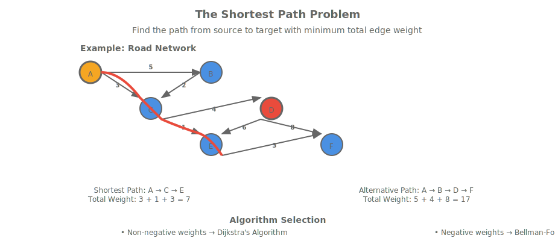
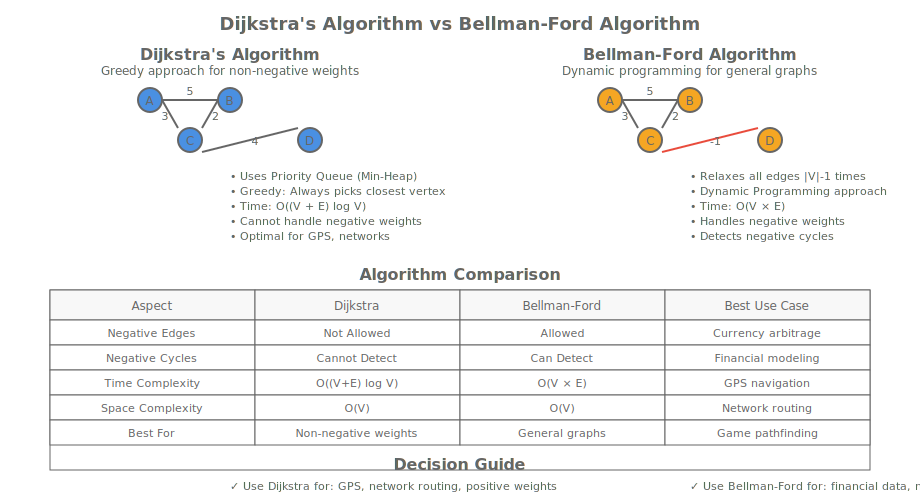

# Lesson 8.1: Dijkstra's Algorithm and Bellman-Ford

## Introduction to Shortest Path Problems

Shortest path algorithms solve the fundamental problem of finding the minimum-cost route between two points in a network. These algorithms form the backbone of routing systems, GPS navigation, network optimization, and countless other applications where efficiency matters.

The shortest path problem can be stated as: Given a weighted graph G = (V, E) with source vertex s and target vertex t, find the path from s to t with minimum total edge weight.



## Dijkstra's Algorithm

Dijkstra's algorithm finds the shortest path from a source vertex to all other vertices in a graph with non-negative edge weights. It uses a greedy approach, always selecting the vertex with the smallest tentative distance.

### Algorithm Overview

1. Initialize distances: distance[source] = 0, distance[other vertices] = ∞
2. Create a priority queue to track vertices by their current shortest distance
3. While priority queue is not empty:
   - Extract vertex u with smallest distance
   - For each neighbor v of u:
     - If distance[u] + weight(u,v) < distance[v]:
       - Update distance[v]
       - Update parent[v] for path reconstruction

### C++ Implementation with Priority Queue

```cpp
#include <vector>
#include <queue>
#include <limits>
#include <iostream>
#include <functional>

class DijkstraAlgorithm {
private:
    const AdjacencyListGraph& graph;

public:
    DijkstraAlgorithm(const AdjacencyListGraph& g) : graph(g) {}

    // Dijkstra's algorithm using priority queue
    std::vector<int> shortestPath(int source, int target) {
        const int INF = std::numeric_limits<int>::max();
        int numVertices = graph.getNumVertices();

        std::vector<int> distance(numVertices, INF);
        std::vector<int> parent(numVertices, -1);
        std::vector<bool> visited(numVertices, false);

        // Min-heap priority queue: pair<distance, vertex>
        using DistanceVertex = std::pair<int, int>;
        std::priority_queue<DistanceVertex, std::vector<DistanceVertex>,
                           std::greater<DistanceVertex>> pq;

        distance[source] = 0;
        pq.push({0, source});

        while (!pq.empty()) {
            auto [currentDistance, u] = pq.top();
            pq.pop();

            // Skip if we already processed this vertex with better distance
            if (visited[u]) continue;
            visited[u] = true;

            // If we reached the target, we can stop
            if (u == target) break;

            // Relax all neighbors
            auto neighbors = graph.getNeighbors(u);
            for (int v : neighbors) {
                if (!visited[v]) {
                    int weight = graph.getWeight(u, v);
                    if (weight != 0 && distance[u] != INF &&
                        distance[u] + weight < distance[v]) {

                        distance[v] = distance[u] + weight;
                        parent[v] = u;
                        pq.push({distance[v], v});
                    }
                }
            }
        }

        // Reconstruct path
        std::vector<int> path;
        if (distance[target] != INF) {
            int current = target;
            while (current != -1) {
                path.push_back(current);
                current = parent[current];
            }
            std::reverse(path.begin(), path.end());
        }

        return path;
    }

    // Get shortest distances from source to all vertices
    std::vector<int> shortestDistances(int source) {
        const int INF = std::numeric_limits<int>::max();
        int numVertices = graph.getNumVertices();

        std::vector<int> distance(numVertices, INF);
        std::vector<bool> visited(numVertices, false);

        using DistanceVertex = std::pair<int, int>;
        std::priority_queue<DistanceVertex, std::vector<DistanceVertex>,
                           std::greater<DistanceVertex>> pq;

        distance[source] = 0;
        pq.push({0, source});

        while (!pq.empty()) {
            auto [currentDistance, u] = pq.top();
            pq.pop();

            if (visited[u]) continue;
            visited[u] = true;

            auto neighbors = graph.getNeighbors(u);
            for (int v : neighbors) {
                if (!visited[v]) {
                    int weight = graph.getWeight(u, v);
                    if (weight != 0 && distance[u] != INF &&
                        distance[u] + weight < distance[v]) {

                        distance[v] = distance[u] + weight;
                        pq.push({distance[v], v});
                    }
                }
            }
        }

        return distance;
    }

    // Check if graph has negative edges (Dijkstra doesn't work with negative weights)
    bool hasNegativeEdges() const {
        for (int u = 0; u < graph.getNumVertices(); ++u) {
            auto neighbors = graph.getNeighbors(u);
            for (int v : neighbors) {
                if (graph.getWeight(u, v) < 0) {
                    return true;
                }
            }
        }
        return false;
    }
};

int main() {
    // Create a weighted graph
    AdjacencyListGraph graph(6, true); // directed graph

    // Add edges with weights
    graph.addEdge(0, 1, 4);
    graph.addEdge(0, 2, 2);
    graph.addEdge(1, 2, 5);
    graph.addEdge(1, 3, 10);
    graph.addEdge(2, 1, 3);
    graph.addEdge(2, 3, 2);
    graph.addEdge(2, 4, 4);
    graph.addEdge(3, 5, 11);
    graph.addEdge(4, 3, 4);
    graph.addEdge(4, 5, 5);

    DijkstraAlgorithm dijkstra(graph);

    std::cout << "Graph has negative edges: " << (dijkstra.hasNegativeEdges() ? "Yes" : "No") << std::endl;

    // Find shortest path from 0 to 5
    auto path = dijkstra.shortestPath(0, 5);
    std::cout << "Shortest path from 0 to 5: ";
    for (int vertex : path) {
        std::cout << vertex << " ";
    }
    std::cout << std::endl;

    // Find shortest distances from 0 to all vertices
    auto distances = dijkstra.shortestDistances(0);
    std::cout << "Shortest distances from 0:" << std::endl;
    for (int i = 0; i < distances.size(); ++i) {
        if (distances[i] == std::numeric_limits<int>::max()) {
            std::cout << "  " << i << ": unreachable" << std::endl;
        } else {
            std::cout << "  " << i << ": " << distances[i] << std::endl;
        }
    }

    return 0;
}
```

### Dijkstra's Algorithm with Binary Heap Optimization

The standard implementation uses a binary heap (priority queue) for O((V + E) log V) time complexity.

```cpp
class OptimizedDijkstra {
private:
    const AdjacencyListGraph& graph;

public:
    OptimizedDijkstra(const AdjacencyListGraph& g) : graph(g) {}

    // Optimized Dijkstra with decrease-key simulation
    std::vector<int> shortestDistances(int source) {
        const int INF = std::numeric_limits<int>::max();
        int numVertices = graph.getNumVertices();

        std::vector<int> distance(numVertices, INF);
        std::vector<bool> visited(numVertices, false);

        // Use priority queue with custom comparator
        auto compare = [](const std::pair<int, int>& a, const std::pair<int, int>& b) {
            return a.first > b.first; // Min-heap
        };

        std::priority_queue<std::pair<int, int>,
                           std::vector<std::pair<int, int>>,
                           decltype(compare)> pq(compare);

        distance[source] = 0;
        pq.push({0, source});

        while (!pq.empty()) {
            auto [currentDistance, u] = pq.top();
            pq.pop();

            // Skip if we already found a better path
            if (visited[u] || currentDistance > distance[u]) continue;
            visited[u] = true;

            auto neighbors = graph.getNeighbors(u);
            for (int v : neighbors) {
                int weight = graph.getWeight(u, v);
                if (weight != 0 && !visited[v] &&
                    distance[u] != INF &&
                    distance[u] + weight < distance[v]) {

                    distance[v] = distance[u] + weight;
                    pq.push({distance[v], v});
                }
            }
        }

        return distance;
    }

    // Dijkstra for dense graphs using adjacency matrix
    std::vector<int> dijkstraMatrix(int source, const AdjacencyMatrixGraph& matrixGraph) {
        const int INF = std::numeric_limits<int>::max();
        int numVertices = matrixGraph.getNumVertices();

        std::vector<int> distance(numVertices, INF);
        std::vector<bool> visited(numVertices, false);

        distance[source] = 0;

        for (int count = 0; count < numVertices - 1; ++count) {
            // Find vertex with minimum distance
            int minDistance = INF;
            int u = -1;

            for (int v = 0; v < numVertices; ++v) {
                if (!visited[v] && distance[v] < minDistance) {
                    minDistance = distance[v];
                    u = v;
                }
            }

            if (u == -1) break; // No more reachable vertices
            visited[u] = true;

            // Update distances of adjacent vertices
            for (int v = 0; v < numVertices; ++v) {
                int weight = matrixGraph.getWeight(u, v);
                if (!visited[v] && weight != 0 &&
                    distance[u] != INF &&
                    distance[u] + weight < distance[v]) {
                    distance[v] = distance[u] + weight;
                }
            }
        }

        return distance;
    }
};

int main() {
    AdjacencyListGraph graph(6, true);

    // Create the same graph as before
    graph.addEdge(0, 1, 4);
    graph.addEdge(0, 2, 2);
    graph.addEdge(1, 2, 5);
    graph.addEdge(1, 3, 10);
    graph.addEdge(2, 1, 3);
    graph.addEdge(2, 3, 2);
    graph.addEdge(2, 4, 4);
    graph.addEdge(3, 5, 11);
    graph.addEdge(4, 3, 4);
    graph.addEdge(4, 5, 5);

    OptimizedDijkstra optDijkstra(graph);

    auto distances = optDijkstra.shortestDistances(0);
    std::cout << "Optimized Dijkstra distances from 0:" << std::endl;
    for (int i = 0; i < distances.size(); ++i) {
        if (distances[i] == std::numeric_limits<int>::max()) {
            std::cout << "  " << i << ": unreachable" << std::endl;
        } else {
            std::cout << "  " << i << ": " << distances[i] << std::endl;
        }
    }

    return 0;
}
```

## Bellman-Ford Algorithm

Bellman-Ford algorithm finds shortest paths from a source vertex to all other vertices, even when the graph contains negative edge weights. It can also detect negative cycles.

### Bellman-Ford Algorithm Overview

1. Initialize distances: distance[source] = 0, distance[other vertices] = ∞
2. Relax all edges |V| - 1 times
3. Check for negative cycles by attempting one more relaxation

### C++ Implementation

```cpp
class BellmanFordAlgorithm {
private:
    const AdjacencyListGraph& graph;

public:
    BellmanFordAlgorithm(const AdjacencyListGraph& g) : graph(g) {}

    // Bellman-Ford algorithm
    std::pair<std::vector<int>, bool> shortestPaths(int source) {
        const int INF = std::numeric_limits<int>::max();
        int numVertices = graph.getNumVertices();

        std::vector<int> distance(numVertices, INF);
        std::vector<int> parent(numVertices, -1);

        distance[source] = 0;

        // Relax all edges |V| - 1 times
        for (int iteration = 1; iteration < numVertices; ++iteration) {
            bool updated = false;

            // Relax all edges
            for (int u = 0; u < numVertices; ++u) {
                if (distance[u] == INF) continue;

                auto neighbors = graph.getNeighbors(u);
                for (int v : neighbors) {
                    int weight = graph.getWeight(u, v);
                    if (weight != 0 && distance[u] + weight < distance[v]) {
                        distance[v] = distance[u] + weight;
                        parent[v] = u;
                        updated = true;
                    }
                }
            }

            // Early termination if no updates
            if (!updated) break;
        }

        // Check for negative cycles
        bool hasNegativeCycle = false;
        for (int u = 0; u < numVertices; ++u) {
            if (distance[u] == INF) continue;

            auto neighbors = graph.getNeighbors(u);
            for (int v : neighbors) {
                int weight = graph.getWeight(u, v);
                if (weight != 0 && distance[u] + weight < distance[v]) {
                    hasNegativeCycle = true;
                    break;
                }
            }
            if (hasNegativeCycle) break;
        }

        return {distance, hasNegativeCycle};
    }

    // Get shortest path to target vertex
    std::vector<int> shortestPath(int source, int target) {
        auto [distances, hasNegativeCycle] = shortestPaths(source);

        if (hasNegativeCycle || distances[target] == std::numeric_limits<int>::max()) {
            return {}; // No path exists
        }

        // Reconstruct path using parent pointers
        // Note: Bellman-Ford doesn't maintain parent pointers in the basic implementation
        // This is a simplified version - in practice you'd need to track parents
        std::vector<int> path;
        int current = target;
        while (current != source && current != -1) {
            path.push_back(current);
            // This is a limitation - we'd need to modify the algorithm to track parents
            current = -1; // Placeholder
        }
        if (current == source) {
            path.push_back(source);
            std::reverse(path.begin(), path.end());
        }

        return path;
    }

    // Detect negative cycles
    bool hasNegativeCycle() {
        auto [distances, negativeCycle] = shortestPaths(0);
        return negativeCycle;
    }

    // Find all vertices affected by negative cycles
    std::vector<int> verticesInNegativeCycles() {
        auto [distances, hasNegativeCycle] = shortestPaths(0);

        std::vector<int> affectedVertices;
        if (!hasNegativeCycle) return affectedVertices;

        // Run another relaxation to find vertices affected by negative cycles
        std::vector<bool> inNegativeCycle(graph.getNumVertices(), false);

        for (int u = 0; u < graph.getNumVertices(); ++u) {
            if (distances[u] == std::numeric_limits<int>::max()) continue;

            auto neighbors = graph.getNeighbors(u);
            for (int v : neighbors) {
                int weight = graph.getWeight(u, v);
                if (weight != 0 && distances[u] + weight < distances[v]) {
                    inNegativeCycle[v] = true;
                }
            }
        }

        for (int i = 0; i < graph.getNumVertices(); ++i) {
            if (inNegativeCycle[i]) {
                affectedVertices.push_back(i);
            }
        }

        return affectedVertices;
    }
};

int main() {
    // Create a graph with negative edges
    AdjacencyListGraph graph(5, true);

    // Add edges (some with negative weights)
    graph.addEdge(0, 1, 4);
    graph.addEdge(0, 2, 2);
    graph.addEdge(1, 2, -3);  // Negative edge
    graph.addEdge(1, 3, 1);
    graph.addEdge(2, 3, 2);
    graph.addEdge(3, 4, 3);
    graph.addEdge(4, 1, -6);  // Negative edge creating a cycle

    BellmanFordAlgorithm bellmanFord(graph);

    std::cout << "Graph has negative cycle: " << (bellmanFord.hasNegativeCycle() ? "Yes" : "No") << std::endl;

    auto [distances, hasNegativeCycle] = bellmanFord.shortestPaths(0);

    std::cout << "Bellman-Ford distances from 0:" << std::endl;
    for (int i = 0; i < distances.size(); ++i) {
        if (distances[i] == std::numeric_limits<int>::max()) {
            std::cout << "  " << i << ": unreachable" << std::endl;
        } else {
            std::cout << "  " << i << ": " << distances[i] << std::endl;
        }
    }

    if (hasNegativeCycle) {
        auto affected = bellmanFord.verticesInNegativeCycles();
        std::cout << "Vertices affected by negative cycles: ";
        for (int v : affected) {
            std::cout << v << " ";
        }
        std::cout << std::endl;
    }

    return 0;
}
```

## Algorithm Comparison and Applications

### Dijkstra vs Bellman-Ford

<table style="border-collapse: collapse;">
<thead>
<tr><th style="padding: 8px; border: 1px solid #ddd;">Aspect</th><th style="padding: 8px; border: 1px solid #ddd;">Dijkstra</th><th style="padding: 8px; border: 1px solid #ddd;">Bellman-Ford</th></tr>
</thead>
<tbody>
<tr><td style="padding: 8px; border: 1px solid #ddd;">Negative Edges</td><td style="padding: 8px; border: 1px solid #ddd;">Not allowed</td><td style="padding: 8px; border: 1px solid #ddd;">Allowed</td></tr>
<tr><td style="padding: 8px; border: 1px solid #ddd;">Negative Cycles</td><td style="padding: 8px; border: 1px solid #ddd;">Cannot detect</td><td style="padding: 8px; border: 1px solid #ddd;">Can detect</td></tr>
<tr><td style="padding: 8px; border: 1px solid #ddd;">Time Complexity</td><td style="padding: 8px; border: 1px solid #ddd;">O((V + E) log V)</td><td style="padding: 8px; border: 1px solid #ddd;">O(V × E)</td></tr>
<tr><td style="padding: 8px; border: 1px solid #ddd;">Space Complexity</td><td style="padding: 8px; border: 1px solid #ddd;">O(V)</td><td style="padding: 8px; border: 1px solid #ddd;">O(V)</td></tr>
<tr><td style="padding: 8px; border: 1px solid #ddd;">Best For</td><td style="padding: 8px; border: 1px solid #ddd;">Non-negative weights</td><td style="padding: 8px; border: 1px solid #ddd;">General graphs</td></tr>
</tbody>
</table>



### Performance Analysis

```cpp
#include <chrono>
#include <random>

class PerformanceComparison {
public:
    static void compareAlgorithms(int vertices, int edges, double negativeEdgeProbability = 0.0) {
        // Generate random graph
        AdjacencyListGraph graph(vertices, true);

        std::mt19937 gen(42);
        std::uniform_int_distribution<> vertexDist(0, vertices - 1);
        std::uniform_int_distribution<> weightDist(-10, 20); // Allow negative weights
        std::uniform_real_distribution<> negProb(0.0, 1.0);

        // Add random edges
        for (int i = 0; i < edges; ++i) {
            int u = vertexDist(gen);
            int v = vertexDist(gen);
            if (u != v) {
                int weight = weightDist(gen);
                // Make some edges negative based on probability
                if (negProb(gen) < negativeEdgeProbability) {
                    weight = -std::abs(weight);
                }
                graph.addEdge(u, v, weight);
            }
        }

        // Test Dijkstra (if no negative edges)
        DijkstraAlgorithm dijkstra(graph);
        bool hasNegatives = dijkstra.hasNegativeEdges();

        std::cout << "Graph: " << vertices << " vertices, " << edges << " edges" << std::endl;
        std::cout << "Negative edges: " << (hasNegatives ? "Yes" : "No") << std::endl;

        // Time Dijkstra
        if (!hasNegatives) {
            auto start = std::chrono::high_resolution_clock::now();
            auto distances = dijkstra.shortestDistances(0);
            auto end = std::chrono::high_resolution_clock::now();
            auto dijkstraTime = std::chrono::duration_cast<std::chrono::microseconds>(end - start);

            std::cout << "Dijkstra time: " << dijkstraTime.count() << " μs" << std::endl;
        } else {
            std::cout << "Dijkstra: Skipped (negative edges present)" << std::endl;
        }

        // Time Bellman-Ford
        BellmanFordAlgorithm bellmanFord(graph);
        auto start = std::chrono::high_resolution_clock::now();
        auto [distances, hasNegativeCycle] = bellmanFord.shortestPaths(0);
        auto end = std::chrono::high_resolution_clock::now();
        auto bellmanTime = std::chrono::duration_cast<std::chrono::microseconds>(end - start);

        std::cout << "Bellman-Ford time: " << bellmanTime.count() << " μs" << std::endl;
        std::cout << "Negative cycle detected: " << (hasNegativeCycle ? "Yes" : "No") << std::endl;
        std::cout << std::endl;
    }
};

int main() {
    std::cout << "Performance comparison - Non-negative weights:" << std::endl;
    PerformanceComparison::compareAlgorithms(100, 500, 0.0);

    std::cout << "Performance comparison - With negative weights:" << std::endl;
    PerformanceComparison::compareAlgorithms(100, 500, 0.1);

    std::cout << "Performance comparison - Dense graph:" << std::endl;
    PerformanceComparison::compareAlgorithms(50, 1000, 0.05);

    return 0;
}
```

## Applications of Shortest Path Algorithms

### GPS and Navigation Systems

Shortest path algorithms power routing in GPS systems, finding optimal driving routes considering distance, traffic, and road conditions.

```cpp
class GPSRouting {
private:
    AdjacencyListGraph& roadNetwork;

public:
    GPSRouting(AdjacencyListGraph& network) : roadNetwork(network) {}

    // Find fastest route considering traffic
    std::vector<int> findFastestRoute(int start, int destination,
                                    const std::vector<double>& trafficFactors) {
        // Modify edge weights based on traffic
        AdjacencyListGraph weightedNetwork = roadNetwork;

        for (int u = 0; u < roadNetwork.getNumVertices(); ++u) {
            auto neighbors = roadNetwork.getNeighbors(u);
            for (int v : neighbors) {
                int baseWeight = roadNetwork.getWeight(u, v);
                double trafficMultiplier = (u < trafficFactors.size()) ? trafficFactors[u] : 1.0;
                int adjustedWeight = static_cast<int>(baseWeight * trafficMultiplier);
                // Update weight in our copy
                weightedNetwork.addEdge(u, v, adjustedWeight);
            }
        }

        DijkstraAlgorithm dijkstra(weightedNetwork);
        return dijkstra.shortestPath(start, destination);
    }

    // Multi-criteria routing (distance + time)
    std::vector<int> findBalancedRoute(int start, int destination,
                                     const std::vector<int>& distances,
                                     const std::vector<int>& times) {
        AdjacencyListGraph balancedNetwork = roadNetwork;

        for (int u = 0; u < roadNetwork.getNumVertices(); ++u) {
            auto neighbors = roadNetwork.getNeighbors(u);
            for (int v : neighbors) {
                // Combine distance and time with weights
                int distance = (u < distances.size()) ? distances[u] : 1;
                int time = (u < times.size()) ? times[u] : 1;
                int balancedWeight = distance + time * 2; // Time is more important
                balancedNetwork.addEdge(u, v, balancedWeight);
            }
        }

        DijkstraAlgorithm dijkstra(balancedNetwork);
        return dijkstra.shortestPath(start, destination);
    }
};
```

### Network Routing and Telecommunications

ISPs use shortest path algorithms to route internet traffic efficiently through complex network topologies.

### Game Development and AI Pathfinding

A* algorithm (an extension of Dijkstra's) is fundamental in game AI for character navigation and pathfinding.

### Financial Modeling and Arbitrage Detection

Bellman-Ford detects negative cycles in currency exchange graphs, identifying arbitrage opportunities.

## Advanced Topics and Optimizations

### A* Algorithm - Heuristic Search

A* combines Dijkstra's algorithm with heuristics for more efficient pathfinding in specific domains.

### Bidirectional Search

Search from both source and target simultaneously to reduce search space.

### Fibonacci Heap Optimization

Using Fibonacci heaps can improve Dijkstra's time complexity to O(E + V log V).

### Parallel and Distributed Shortest Path

GPU-accelerated and distributed implementations for massive graphs.

## Summary

Shortest path algorithms are fundamental to computer science and have widespread applications:

- **Dijkstra's Algorithm**: Efficient for non-negative weights, O((V + E) log V) time
- **Bellman-Ford Algorithm**: Handles negative weights, detects negative cycles, O(V × E) time
- **Choice depends on graph properties**: Non-negative weights → Dijkstra, general graphs → Bellman-Ford

Understanding these algorithms provides insight into optimization problems across domains from transportation to finance.

## Practice Exercises

1. Implement A* algorithm for grid-based pathfinding
2. Add negative cycle detection with path reconstruction
3. Implement bidirectional Dijkstra's algorithm
4. Create a routing system with multiple cost criteria
5. Optimize shortest path computation for dense graphs
