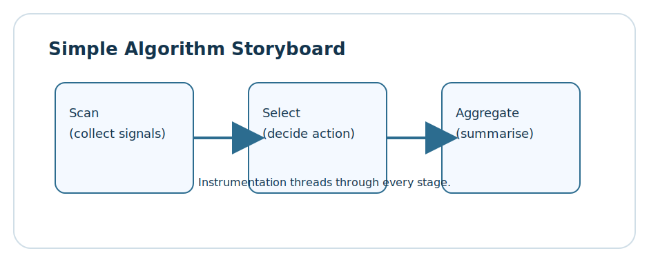

# Lesson 1.2: Building Simple Algorithms in C++

> Learning goals: connect algorithm design patterns to real C++ implementations, reason about control flow decisions, and practice explaining complexity in plain language.



This lesson translates abstract steps such as "scan", "select", and "aggregate" into concrete C++ code. We emphasise clarity, instrumentation, and communication so that even simple routines become teachable building blocks.

By the end you will refactor naive sketches into production-ready functions, annotate them with diagnostic hooks, and narrate the trade-offs that each decision entails.

## 1. Designing algorithmic building blocks


We focus on three archetypes:

1. **Scanners** iterate through data to gather observations.
2. **Selectors** filter or reorder elements using simple heuristics.
3. **Aggregators** combine results into a concise summary.

The interplay of these structures forms the backbone of many higher-level algorithms.

### Pseudocode to C++ translation checklist

- Start with descriptive variable names and guard clauses.
- Annotate loop invariants or preconditions in comments.
- Embed lightweight timing or counting where the lesson calls for measurement.
- Prefer `std::vector` and `std::span` for contiguous data in the initial prototypes.

Throughout the section we practise the checklist with progressively richer examples.

## 2. Pattern library for simple algorithms

Simple algorithms become maintainable when each stage has a defined responsibility and a shared vocabulary. Rather than duplicating similar code, we invest in richer descriptions and instrumentation so the narrative stays front-and-centre.

### 2.1 Scanner blueprint: resilient data sweeps

Scanners are the eyes of the algorithm. They traverse data, spot signals, and feed selectors with the context they require. The following blueprint instruments every sweep so you can explain costs and failure modes without rewriting tracing code from scratch.

```cpp
#include <chrono>
#include <cstddef>
#include <iomanip>
#include <iostream>
#include <optional>
#include <span>
#include <string>
#include <string_view>
#include <utility>
#include <vector>

using Clock = std::chrono::steady_clock;

struct StageTicket {
    std::size_t index;
    Clock::time_point started;
};

struct StageRecord {
    std::string label;
    long long comparisons = 0;
    long long nanoseconds = 0;
    long long samples = 0;
    int lastValue = 0;
};

class ScannerInspector {
public:
    StageTicket enter(std::string label) {
        StageRecord record;
        record.label = std::move(label);
        records_.push_back(record);
        return StageTicket{records_.size() - 1, Clock::now()};
    }

    void leave(StageTicket ticket, long long comparisons, int lastValue) {
        const auto stopped = Clock::now();
        StageRecord& record = records_.at(ticket.index);
        record.nanoseconds = std::chrono::duration_cast<std::chrono::nanoseconds>(stopped - ticket.started).count();
        record.comparisons = comparisons;
        record.lastValue = lastValue;
        record.samples += 1;
        totalComparisons_ += comparisons;
    }

    void annotate(std::string_view key, long long value) {
        annotations_.emplace_back(std::string(key), value);
    }

    void render() const {
        std::cout << "Scanner log" << std::endl;
        for (const StageRecord& record : records_) {
            std::cout << std::left << std::setw(18) << record.label
                      << std::right << std::setw(12) << record.nanoseconds << " ns  "
                      << "cmp=" << std::setw(6) << record.comparisons
                      << " last=" << record.lastValue << std::endl;
        }
        std::cout << "Total comparisons: " << totalComparisons_ << std::endl;
        for (const auto& note : annotations_) {
            std::cout << "  note(" << note.first << ") = " << note.second << std::endl;
        }
    }

    const std::vector<StageRecord>& records() const { return records_; }
    const std::vector<std::pair<std::string, long long>>& annotations() const { return annotations_; }

private:
    std::vector<StageRecord> records_;
    std::vector<std::pair<std::string, long long>> annotations_;
    long long totalComparisons_ = 0;
};

template <typename T, typename Predicate>
std::optional<std::size_t> scan_until(std::span<const T> data, Predicate predicate, ScannerInspector& inspector) {
    if (data.empty()) {
        inspector.annotate("guard-empty", 1);
        return std::nullopt;
    }
    StageTicket sweep = inspector.enter("scan/forward");
    long long comparisons = 0;
    std::optional<std::size_t> result;
    for (std::size_t index = 0; index < data.size(); ++index) {
        ++comparisons;
        if (predicate(data[index])) {
            result = index;
            inspector.annotate("first-hit", static_cast<long long>(index));
            break;
        }
    }
    const int sample = result ? static_cast<int>(data[*result]) : -1;
    inspector.leave(sweep, comparisons, sample);
    return result;
}

template <typename T>
std::optional<std::size_t> scan_with_stride(std::span<const T> data, std::size_t stride, ScannerInspector& inspector) {
    if (stride == 0) {
        inspector.annotate("invalid-stride", 1);
        return std::nullopt;
    }
    StageTicket stage = inspector.enter("scan/stride");
    long long comparisons = 0;
    std::optional<std::size_t> found;
    for (std::size_t index = 0; index < data.size(); index += stride) {
        ++comparisons;
        if ((index % 2) == 0 && data[index] % 2 == 0) {
            found = index;
            break;
        }
    }
    const int sample = found ? static_cast<int>(data[*found]) : -1;
    inspector.leave(stage, comparisons, sample);
    return found;
}

void demo_scanner() {
    ScannerInspector inspector;
    std::vector<int> dataset{9, 7, 5, 3, 6, 4, 2, 8};
    std::span<const int> view{dataset};
    auto hit = scan_until(view, [](int value) { return value < 5; }, inspector);
    if (!hit) {
        inspector.annotate("missed-hits", 1);
    }
    scan_with_stride(view, 3, inspector);
    inspector.render();
}
```

The inspector collects timing, comparisons, and annotations. Because the logs are structured, you can export them to JSON, drive dashboards, or share the findings in code reviews.

### 2.2 Selector blueprint: deliberate choices

Selectors convert raw observations into actionable decisions. They choose pivots, maintain invariants, and balance deterministic behaviour with adaptability. The template below shows how to keep that decision process transparent.

```cpp
#include <algorithm>
#include <array>
#include <chrono>
#include <functional>
#include <iostream>
#include <span>
#include <stdexcept>
#include <string>
#include <tuple>
#include <vector>

struct SelectionStage {
    std::string label;
    long long comparisons = 0;
    long long swaps = 0;
    long long nanoseconds = 0;
};

struct SelectionTicket {
    std::size_t index;
    std::chrono::high_resolution_clock::time_point started;
};

class Selector {
public:
    SelectionTicket begin(std::string label) {
        SelectionStage stage;
        stage.label = std::move(label);
        stages_.push_back(stage);
        return SelectionTicket{stages_.size() - 1, std::chrono::high_resolution_clock::now()};
    }

    void recordComparison(const SelectionTicket& ticket) {
        stages_.at(ticket.index).comparisons += 1;
    }

    void recordSwap(const SelectionTicket& ticket) {
        stages_.at(ticket.index).swaps += 1;
    }

    void end(const SelectionTicket& ticket) {
        const auto stop = std::chrono::high_resolution_clock::now();
        SelectionStage& stage = stages_.at(ticket.index);
        stage.nanoseconds = std::chrono::duration_cast<std::chrono::nanoseconds>(stop - ticket.started).count();
    }

    void emit() const {
        std::cout << "Selector log" << std::endl;
        for (const SelectionStage& stage : stages_) {
            std::cout << "  " << stage.label
                      << " cmp=" << stage.comparisons
                      << " swaps=" << stage.swaps
                      << " time=" << stage.nanoseconds << " ns" << std::endl;
        }
    }

    const std::vector<SelectionStage>& stages() const { return stages_; }

private:
    std::vector<SelectionStage> stages_;
};

template <typename T, typename Comparator>
std::size_t choose_pivot(std::span<T> data, Comparator comp, Selector& selector) {
    SelectionTicket ticket = selector.begin("selector/pivot");
    if (data.size() < 3) {
        selector.end(ticket);
        return data.size() / 2;
    }
    std::array<std::size_t, 3> indices{0, data.size() / 2, data.size() - 1};
    std::sort(indices.begin(), indices.end(), [&](std::size_t lhs, std::size_t rhs) {
        selector.recordComparison(ticket);
        return comp(data[lhs], data[rhs]);
    });
    selector.end(ticket);
    return indices[1];
}

template <typename T, typename Comparator>
std::size_t partition_window(std::span<T> window, std::size_t pivotOffset, Comparator comp, Selector& selector) {
    SelectionTicket ticket = selector.begin("selector/partition");
    T pivot = window[pivotOffset];
    std::swap(window[pivotOffset], window.back());
    std::size_t storeIndex = 0;
    for (std::size_t idx = 0; idx + 1 < window.size(); ++idx) {
        selector.recordComparison(ticket);
        if (comp(window[idx], pivot)) {
            std::swap(window[idx], window[storeIndex]);
            selector.recordSwap(ticket);
            ++storeIndex;
        }
    }
    std::swap(window[storeIndex], window.back());
    selector.recordSwap(ticket);
    selector.end(ticket);
    return storeIndex;
}

template <typename T, typename Comparator>
T select_kth(std::span<T> data, std::size_t k, Comparator comp, Selector& selector) {
    if (data.empty()) {
        throw std::logic_error("select_kth requires data");
    }
    if (k >= data.size()) {
        throw std::out_of_range("k exceeds data length");
    }
    std::size_t left = 0;
    std::size_t right = data.size() - 1;
    while (true) {
        std::size_t length = right - left + 1;
        std::span<T> window = data.subspan(left, length);
        std::size_t pivotOffset = choose_pivot(window, comp, selector);
        std::size_t pivotIndex = left + partition_window(window, pivotOffset, comp, selector);
        if (pivotIndex == k) {
            return data[k];
        }
        if (k < pivotIndex) {
            if (pivotIndex == 0) {
                return data[0];
            }
            right = pivotIndex - 1;
        } else {
            left = pivotIndex + 1;
            if (left >= data.size()) {
                return data.back();
            }
        }
        if (left == right) {
            return data[left];
        }
    }
}

void demo_selector() {
    Selector selector;
    std::vector<int> values{18, 3, 7, 12, 5, 9, 1, 14, 6};
    std::span<int> view{values};
    const std::size_t medianIndex = view.size() / 2;
    int median = select_kth(view, medianIndex, std::less<int>{}, selector);
    selector.emit();
    std::cout << "Median candidate: " << median << std::endl;
}
```

The selector captures where comparisons concentrate, how many swaps occur, and which branch produced the final answer. That story becomes crucial when stakeholders ask why a routine behaves the way it does.

### 2.3 Aggregator blueprint: story-driven summaries

Aggregators tell the rest of the team what just happened. They condense scanner and selector outputs into metrics that map to latency, memory, or user experience goals.

```cpp
#include <iomanip>
#include <iostream>
#include <map>
#include <numeric>
#include <sstream>
#include <string>
#include <vector>

struct AggregationMetric {
    std::string label;
    long long value = 0;
};

struct AggregationReport {
    std::vector<AggregationMetric> metrics;
    std::map<std::string, long long> counters;
};

class SimpleAggregator {
public:
    void ingestScanner(const ScannerInspector& inspector) {
        for (const StageRecord& record : inspector.records()) {
            metrics_.push_back({"scanner:" + record.label, record.nanoseconds});
            counters_["scanner-comparisons"] += record.comparisons;
            counters_["scanner-last"] = record.lastValue;
        }
        for (const auto& note : inspector.annotations()) {
            counters_["note:" + note.first] += note.second;
        }
    }

    void ingestSelector(const Selector& selector) {
        for (const SelectionStage& stage : selector.stages()) {
            metrics_.push_back({"selector:" + stage.label, stage.nanoseconds});
            counters_["selector-comparisons"] += stage.comparisons;
            counters_["selector-swaps"] += stage.swaps;
        }
    }

    void push(std::string label, long long value) {
        metrics_.push_back({std::move(label), value});
    }

    AggregationReport build() const {
        AggregationReport report;
        report.metrics = metrics_;
        report.counters = counters_;
        return report;
    }

private:
    std::vector<AggregationMetric> metrics_;
    std::map<std::string, long long> counters_;
};

void narrate(const AggregationReport& report) {
    std::cout << "\nStory summary" << std::endl;
    for (const AggregationMetric& metric : report.metrics) {
        std::cout << std::left << std::setw(26) << metric.label
                  << std::right << std::setw(12) << metric.value << std::endl;
    }
    std::cout << "Counters:" << std::endl;
    for (const auto& entry : report.counters) {
        std::cout << "  " << entry.first << " = " << entry.second << std::endl;
    }
}

void demo_story() {
    ScannerInspector inspector;
    Selector selector;
    std::vector<int> data{15, 7, 21, 3, 9, 1, 18, 11, 5};
    std::span<int> view{data};

    auto firstEven = scan_until(view, [](int value) { return value % 2 == 0; }, inspector);
    int pivot = select_kth(view, view.size() / 2, std::less<int>{}, selector);

    SimpleAggregator aggregator;
    aggregator.ingestScanner(inspector);
    aggregator.ingestSelector(selector);
    aggregator.push("pivot-value", pivot);
    if (firstEven) {
        aggregator.push("first-even-index", static_cast<long long>(*firstEven));
    }

    AggregationReport report = aggregator.build();
    narrate(report);
}
```

Use the aggregator to translate raw telemetry into a narrative. The `narrate` function demonstrates how to hand off the results to logs, dashboards, or a design document.

### 2.4 Putting the pieces together

When you compose the blueprints, follow this checklist:

1. Start with the scanner to validate your assumptions about the dataset.
2. Feed the selector with the scanner’s annotations so the decision logic stays data-aware.
3. Hand both logs to the aggregator and write the stakeholder-facing summary immediately after each run.
4. Archive representative traces; they become regression checks and onboarding material for new teammates.

### 2.5 Practise the storytelling loop

To turn the blueprint into muscle memory:

- Run `demo_scanner`, `demo_selector`, and `demo_story` with different dataset sizes and note how the metrics evolve.
- Swap in alternative predicates or comparators and record how the stage labels shift.
- Pair-program the narration step with a colleague who is new to the codebase—if they can retell the story, your instrumentation is doing its job.
- Capture unanswered questions after each experiment and log them alongside the trace outputs so you can revisit them in later modules.

## 3. Complexity narratives for simple patterns


The lesson encourages you to articulate time and space costs without jargon. Example structure:

- **Linear search.** O(n) comparisons, constant memory. Mention typical use-cases where sorted order is unavailable.
- **Selection sort.** Always O(n²) comparisons but offers deterministic behaviour—useful in teaching environments or when datasets are tiny.
- **Partition operation.** Average-case O(n) with good pivots. Explain fallback strategies when encountering degenerate orderings.

### Communicating trade-offs to stakeholders

Stakeholders respond to narratives, not solely to big-O notation. Frame your explanations around:

- Latency expectations (e.g., autocomplete must respond within 50 ms).
- Memory ceilings (embedded targets may afford only a few kilobytes).
- Developer ergonomics (maintainable code beats clever shortcuts that only one person understands).

## 4. Guided labs and debugging drills

Complete these tasks to deepen understanding:

1. Introduce intentional off-by-one errors and use assertions to catch them.
2. Instrument the selection pipeline to count swaps separately from comparisons.
3. Replace `std::vector` with `std::deque` and compare access costs.
4. Build a small CLI tool that reports tracer metrics in JSON.

## Practice Time

Work through the following steps:

1. Reimplement the tracer using RAII objects that record scope lifetimes.
2. Add optional parallel execution using `std::execution::par_unseq` for large datasets and observe the differences.
3. Document invariant statements beside each loop to make reasoning explicit.
4. Run the program with 10,000 random integers and capture the trace output.
5. Summarise your observations in a message to your future self describing when each pattern shines.

## Self-check questions

- How would you explain the difference between linear search and partition to a junior teammate?
- Which parts of the tracer should be disabled in release builds, and why?
- What signals indicate it is time to graduate from selection sort to faster algorithms?

## Scenario retrospectives

Pause after each lab run to translate numbers into language that resonates with your team:

- **Latency posture:** Compare scanner results against your service-level objectives. If the stride-based scan blows the budget, document which data shapes caused it.
- **Stability audit:** Chronicle variance across runs. High dispersion often signals that the selector is suffering from poor pivots or cache effects.
- **Memory sketch:** Even simple routines allocate; note where temporary buffers appeared and how large they grew.
- **Stakeholder narrative:** Write a two-sentence update that a product manager could understand. Force yourself to mention both benefits and trade-offs.
- **Next hypothesis:** Capture the experiment you want to run next and the metric that will confirm or reject it.

Revise the retrospective regularly so future you can track how intuition evolved as datasets and business constraints changed.

## Collaborative drills

Learning sticks when shared. Try the following with peers:

- Host a whiteboard walkthrough of the scanner-selector-aggregator pipeline and invite others to challenge your assumptions.
- Swap tracing logs with a teammate and summarise each other's results without looking at the source code.
- Pair on a code review where you focus exclusively on instrumentation and storytelling clarity.
- Record a short demo of `demo_story` running against production-like data and gather feedback from developers, QA, and product partners.

## Key takeaways

- Simple algorithms are the laboratory where DSA intuition is forged.
- Instrumentation encourages curiosity and disciplined debugging.
- Communicating trade-offs turns raw implementation details into actionable guidance.
