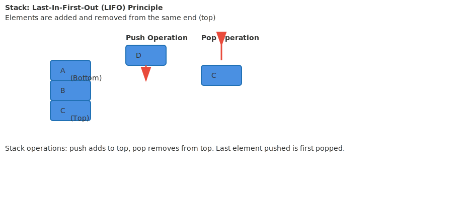
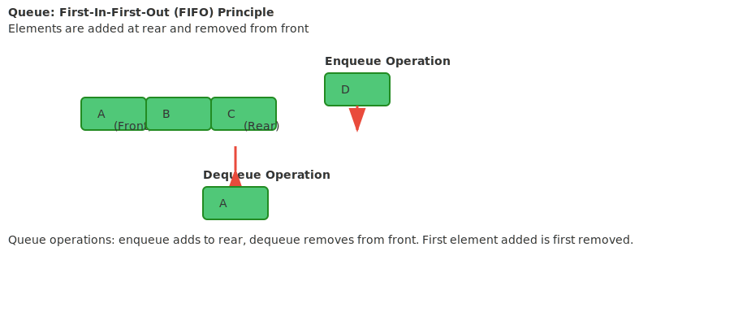
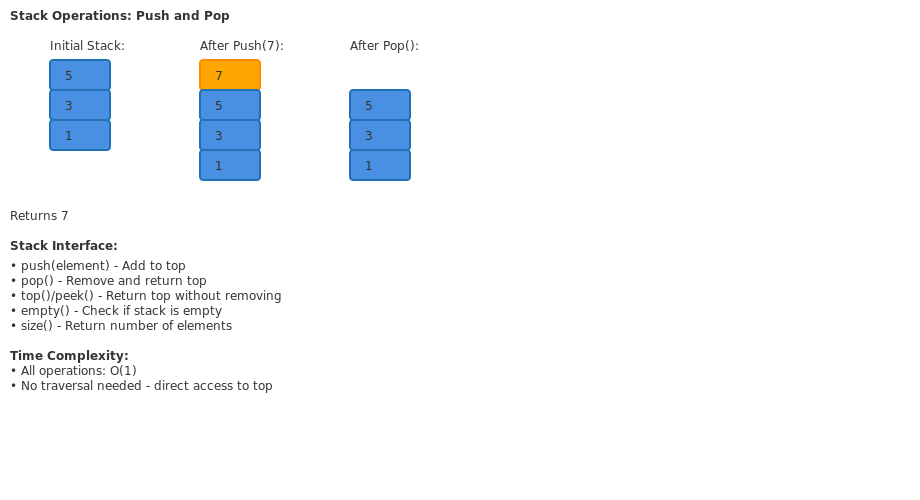
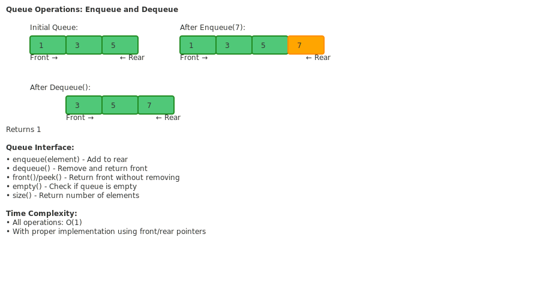
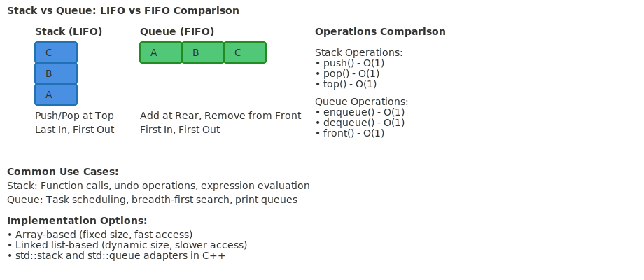

# Lesson 4.1: Stacks, Queues, and Their C++ Implementations

## Hook: The Power of Restricted Access

Imagine managing a busy coffee shop. Customers form a line (queue) for service, while dirty dishes pile up in the kitchen (stack) waiting to be washed. These simple access patterns - Last-In-First-Out and First-In-First-Out - power everything from your browser's back button to operating system task scheduling.

## Roadmap for This Lesson

1. **Stack Fundamentals**
   - LIFO principle and real-world applications
   - Array-based and linked list implementations
   - Common stack operations and use cases

2. **Queue Fundamentals**
   - FIFO principle and applications
   - Circular arrays and linked list implementations
   - Queue operations and variants

3. **C++ Standard Library Adapters**
   - std::stack and std::queue containers
   - Underlying container choices
   - Performance characteristics

4. **Advanced Implementations**
   - Circular queues for efficiency
   - Double-ended queues (deques)
   - Priority queues

5. **Applications and Problem Solving**
   - Expression evaluation and parsing
   - Task scheduling and simulation
   - Algorithm implementations

## Concept Deep Dive: Stack - LIFO Data Structure

A stack follows the Last-In-First-Out principle, where the most recently added element is the first to be removed.



This visualization shows how stacks work like a stack of plates - you add and remove from the top.

### Stack Operations

```cpp
class Stack {
private:
    std::vector<int> data;
    
public:
    void push(int value) {
        data.push_back(value);
    }
    
    int pop() {
        if (empty()) throw std::out_of_range("Stack is empty");
        int value = data.back();
        data.pop_back();
        return value;
    }
    
    int top() const {
        if (empty()) throw std::out_of_range("Stack is empty");
        return data.back();
    }
    
    bool empty() const {
        return data.empty();
    }
    
    size_t size() const {
        return data.size();
    }
};
```

### Linked List Implementation

```cpp
class LinkedStack {
private:
    struct Node {
        int data;
        Node* next;
        Node(int val) : data(val), next(nullptr) {}
    };
    
    Node* top_;
    size_t size_;
    
public:
    LinkedStack() : top_(nullptr), size_(0) {}
    ~LinkedStack() { clear(); }
    
    void clear() {
        while (!empty()) {
            pop();
        }
    }
    
    void push(int value) {
        Node* newNode = new Node(value);
        newNode->next = top_;
        top_ = newNode;
        size_++;
    }
    
    int pop() {
        if (empty()) throw std::out_of_range("Stack is empty");
        Node* temp = top_;
        int value = temp->data;
        top_ = top_->next;
        delete temp;
        size_--;
        return value;
    }
    
    int top() const {
        if (empty()) throw std::out_of_range("Stack is empty");
        return top_->data;
    }
    
    bool empty() const {
        return top_ == nullptr;
    }
    
    size_t size() const {
        return size_;
    }
};
```

## Concept Deep Dive: Queue - FIFO Data Structure

A queue follows the First-In-First-Out principle, where the first element added is the first to be removed.



Queues work like a line at a store - customers are served in the order they arrived.

### Array-Based Queue Implementation

```cpp
class ArrayQueue {
private:
    std::vector<int> data;
    size_t front_;
    size_t rear_;
    size_t capacity_;
    
public:
    ArrayQueue(size_t capacity) : data(capacity), front_(0), rear_(0), capacity_(capacity) {}
    
    void enqueue(int value) {
        if (size() == capacity_ - 1) throw std::overflow_error("Queue is full");
        data[rear_] = value;
        rear_ = (rear_ + 1) % capacity_;
    }
    
    int dequeue() {
        if (empty()) throw std::out_of_range("Queue is empty");
        int value = data[front_];
        front_ = (front_ + 1) % capacity_;
        return value;
    }
    
    int front() const {
        if (empty()) throw std::out_of_range("Queue is empty");
        return data[front_];
    }
    
    bool empty() const {
        return front_ == rear_;
    }
    
    size_t size() const {
        return (rear_ - front_ + capacity_) % capacity_;
    }
};
```

### Linked List Queue Implementation

```cpp
class LinkedQueue {
private:
    struct Node {
        int data;
        Node* next;
        Node(int val) : data(val), next(nullptr) {}
    };
    
    Node* front_;
    Node* rear_;
    size_t size_;
    
public:
    LinkedQueue() : front_(nullptr), rear_(nullptr), size_(0) {}
    ~LinkedQueue() { clear(); }
    
    void clear() {
        while (!empty()) {
            dequeue();
        }
    }
    
    void enqueue(int value) {
        Node* newNode = new Node(value);
        if (empty()) {
            front_ = rear_ = newNode;
        } else {
            rear_->next = newNode;
            rear_ = newNode;
        }
        size_++;
    }
    
    int dequeue() {
        if (empty()) throw std::out_of_range("Queue is empty");
        Node* temp = front_;
        int value = temp->data;
        front_ = front_->next;
        if (front_ == nullptr) {
            rear_ = nullptr;
        }
        delete temp;
        size_--;
        return value;
    }
    
    int front() const {
        if (empty()) throw std::out_of_range("Queue is empty");
        return front_->data;
    }
    
    bool empty() const {
        return front_ == nullptr;
    }
    
    size_t size() const {
        return size_;
    }
};
```

## Stack Operations Visualization



The diagram shows how push and pop operations work on a stack with O(1) time complexity.

## Queue Operations Visualization



Queue operations maintain FIFO order with efficient front and rear pointer management.

## C++ Standard Library Stack and Queue

Modern C++ provides adapter classes that wrap underlying containers.

### std::stack

```cpp
#include <stack>
#include <vector>
#include <deque>
#include <list>

void demonstrateStack() {
    // Default stack (uses deque)
    std::stack<int> s1;
    s1.push(1);
    s1.push(2);
    s1.push(3);
    
    while (!s1.empty()) {
        std::cout << s1.top() << " "; // 3 2 1
        s1.pop();
    }
    std::cout << std::endl;
    
    // Stack with vector
    std::stack<int, std::vector<int>> s2;
    s2.push(10);
    s2.push(20);
    
    // Stack with list
    std::stack<int, std::list<int>> s3;
    s3.push(100);
    s3.push(200);
}
```

### std::queue

```cpp
#include <queue>

void demonstrateQueue() {
    // Default queue (uses deque)
    std::queue<int> q1;
    q1.push(1);
    q1.push(2);
    q1.push(3);
    
    while (!q1.empty()) {
        std::cout << q1.front() << " "; // 1 2 3
        q1.pop();
    }
    std::cout << std::endl;
    
    // Queue with list
    std::queue<int, std::list<int>> q2;
    q2.push(10);
    q2.push(20);
}
```

## Advanced: Circular Queue

Circular queues reuse space efficiently by wrapping around the array.

```cpp
class CircularQueue {
private:
    std::vector<int> data;
    size_t front_;
    size_t rear_;
    size_t capacity_;
    bool full_;
    
public:
    CircularQueue(size_t capacity) : data(capacity), front_(0), rear_(0), capacity_(capacity), full_(false) {}
    
    void enqueue(int value) {
        if (full()) throw std::overflow_error("Queue is full");
        data[rear_] = value;
        rear_ = (rear_ + 1) % capacity_;
        if (rear_ == front_) {
            full_ = true;
        }
    }
    
    int dequeue() {
        if (empty()) throw std::out_of_range("Queue is empty");
        int value = data[front_];
        front_ = (front_ + 1) % capacity_;
        full_ = false;
        return value;
    }
    
    int front() const {
        if (empty()) throw std::out_of_range("Queue is empty");
        return data[front_];
    }
    
    bool empty() const {
        return !full_ && (front_ == rear_);
    }
    
    bool full() const {
        return full_;
    }
    
    size_t size() const {
        if (full_) return capacity_;
        return (rear_ - front_ + capacity_) % capacity_;
    }
};
```

## Double-Ended Queue (Deque)

Deques allow insertion and deletion from both ends.

```cpp
#include <deque>

void demonstrateDeque() {
    std::deque<int> dq;
    
    // Add to front and back
    dq.push_front(1);     // [1]
    dq.push_back(2);      // [1, 2]
    dq.push_front(0);     // [0, 1, 2]
    dq.push_back(3);      // [0, 1, 2, 3]
    
    // Remove from both ends
    dq.pop_front();       // [1, 2, 3]
    dq.pop_back();        // [1, 2]
    
    // Access elements
    std::cout << "Front: " << dq.front() << std::endl; // 1
    std::cout << "Back: " << dq.back() << std::endl;   // 2
    std::cout << "Size: " << dq.size() << std::endl;   // 2
}
```

## Applications: Expression Evaluation

Stacks are perfect for parsing and evaluating expressions.

### Infix to Postfix Conversion

```cpp
#include <stack>
#include <string>
#include <cctype>

int precedence(char op) {
    if (op == '+' || op == '-') return 1;
    if (op == '*' || op == '/') return 2;
    if (op == '^') return 3;
    return 0;
}

std::string infixToPostfix(const std::string& infix) {
    std::stack<char> operators;
    std::string postfix;
    
    for (char c : infix) {
        if (std::isalnum(c)) {
            postfix += c;
        } else if (c == '(') {
            operators.push(c);
        } else if (c == ')') {
            while (!operators.empty() && operators.top() != '(') {
                postfix += operators.top();
                operators.pop();
            }
            if (!operators.empty()) operators.pop(); // Remove '('
        } else { // Operator
            while (!operators.empty() && precedence(operators.top()) >= precedence(c)) {
                postfix += operators.top();
                operators.pop();
            }
            operators.push(c);
        }
    }
    
    while (!operators.empty()) {
        postfix += operators.top();
        operators.pop();
    }
    
    return postfix;
}
```

### Postfix Evaluation

```cpp
int evaluatePostfix(const std::string& postfix) {
    std::stack<int> values;
    
    for (char c : postfix) {
        if (std::isdigit(c)) {
            values.push(c - '0'); // Simple case, assumes single digits
        } else {
            int b = values.top(); values.pop();
            int a = values.top(); values.pop();
            
            switch (c) {
                case '+': values.push(a + b); break;
                case '-': values.push(a - b); break;
                case '*': values.push(a * b); break;
                case '/': values.push(a / b); break;
            }
        }
    }
    
    return values.top();
}
```

## Applications: Breadth-First Search Simulation

Queues are essential for BFS algorithms.

```cpp
#include <queue>
#include <vector>
#include <iostream>

class Graph {
private:
    std::vector<std::vector<int>> adjList;
    int vertices;
    
public:
    Graph(int v) : vertices(v), adjList(v) {}
    
    void addEdge(int u, int v) {
        adjList[u].push_back(v);
        adjList[v].push_back(u); // Undirected
    }
    
    void BFS(int start) {
        std::vector<bool> visited(vertices, false);
        std::queue<int> q;
        
        visited[start] = true;
        q.push(start);
        
        while (!q.empty()) {
            int current = q.front();
            q.pop();
            std::cout << current << " ";
            
            for (int neighbor : adjList[current]) {
                if (!visited[neighbor]) {
                    visited[neighbor] = true;
                    q.push(neighbor);
                }
            }
        }
        std::cout << std::endl;
    }
};
```

## Performance Analysis

### Time Complexity

<table>
  <thead>
    <tr>
      <th> Operation  </th>
      <th> Array Stack  </th>
      <th> Linked Stack  </th>
      <th> Array Queue  </th>
      <th> Linked Queue  </th>
    </tr>
  </thead>
  <tbody>
    <tr>
      <td> push/enqueue  </td>
      <td>O(1)</td>
      <td>O(1)</td>
      <td>O(1)</td>
      <td>O(1)</td>
    </tr>
    <tr>
      <td> pop/dequeue  </td>
      <td>O(1)</td>
      <td>O(1)</td>
      <td>O(1)</td>
      <td>O(1)</td>
    </tr>
    <tr>
      <td> top/front  </td>
      <td>O(1)</td>
      <td>O(1)</td>
      <td>O(1)</td>
      <td>O(1)</td>
    </tr>
    <tr>
      <td> empty/size  </td>
      <td>O(1)</td>
      <td>O(1)</td>
      <td>O(1)</td>
      <td>O(1)</td>
    </tr>
  </tbody>
</table>

### Space Complexity

- **Array-based**: O(n) fixed size, potential waste
- **Linked-based**: O(n) dynamic, overhead per node
- **Circular queue**: Better space utilization

## Stack vs Queue Comparison



The comparison shows the fundamental differences between LIFO and FIFO structures.

## Common Pitfalls

### Queue Implementation Issues

```cpp
// BAD: Naive array queue (wasteful)
class BadQueue {
    std::vector<int> data;
    size_t front_;
    
public:
    BadQueue() : front_(0) {}
    
    void enqueue(int val) { data.push_back(val); }
    
    int dequeue() {
        if (front_ >= data.size()) throw std::out_of_range("Empty");
        return data[front_++]; // Front keeps increasing, wastes space!
    }
};
```

### Stack Overflow/Underflow

```cpp
// Always check bounds
void safeOperations(Stack& s, Queue& q) {
    if (!s.empty()) {
        int val = s.pop();
        // Use val
    }
    
    try {
        q.enqueue(42);
    } catch (const std::overflow_error& e) {
        std::cout << "Queue full: " << e.what() << std::endl;
    }
}
```

## Practice Exercises

1. **Implement a stack using two queues** and analyze the trade-offs.

2. **Create a queue using two stacks** - compare enqueue vs dequeue costs.

3. **Build a circular buffer** that automatically overwrites old data when full.

4. **Implement a priority queue** using a sorted vector vs heap approach.

5. **Create a deque class** with efficient operations at both ends.

## Reflection: Choosing the Right Structure

- **Use stacks for**: Function calls, undo operations, expression parsing
- **Use queues for**: Task scheduling, BFS, resource management
- **Consider deque for**: Need both stack and queue operations
- **Think about bounds**: Fixed vs dynamic sizing requirements

## Cheat Sheet: Stack and Queue Operations

### Stack (LIFO)

```cpp
std::stack<T> s;
s.push(item);     // Add to top
T val = s.top();  // Peek top
s.pop();          // Remove top
bool empty = s.empty();
size_t n = s.size();
```

### Queue (FIFO)

```cpp
std::queue<T> q;
q.push(item);     // Add to rear
T val = q.front(); // Peek front
q.pop();          // Remove front
bool empty = q.empty();
size_t n = q.size();
```

### Deque (Double-ended)

```cpp
std::deque<T> dq;
dq.push_front(item); // Add to front
dq.push_back(item);  // Add to back
T front = dq.front();
T back = dq.back();
dq.pop_front();      // Remove front
dq.pop_back();       // Remove back
```

## Journal Prompts

1. When would you choose an array-based vs linked implementation?
2. How do stacks and queues relate to real-world systems?
3. What are the performance implications of different underlying containers?
4. How can circular buffers improve memory efficiency?

## Action Items

- [ ] Implement array and linked versions of stack and queue
- [ ] Experiment with std::stack and std::queue adapters
- [ ] Build expression evaluator using stacks
- [ ] Implement BFS using queues
- [ ] Compare performance of different implementations
- [ ] Study priority_queue and its heap-based implementation

Remember: Stacks and queues teach us about constrained access patterns that enable efficient algorithms and data processing pipelines in C++.
