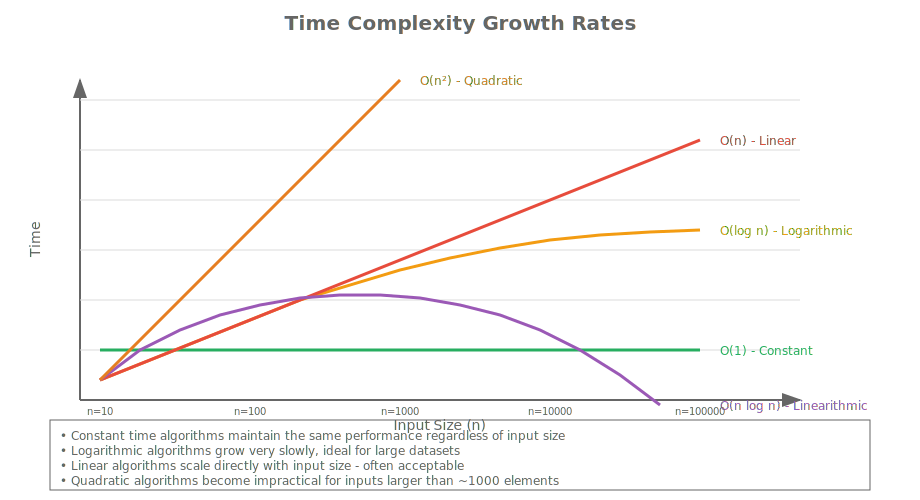
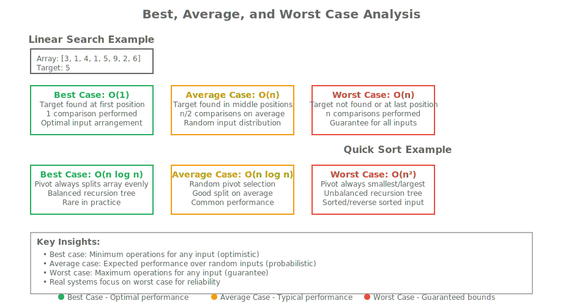
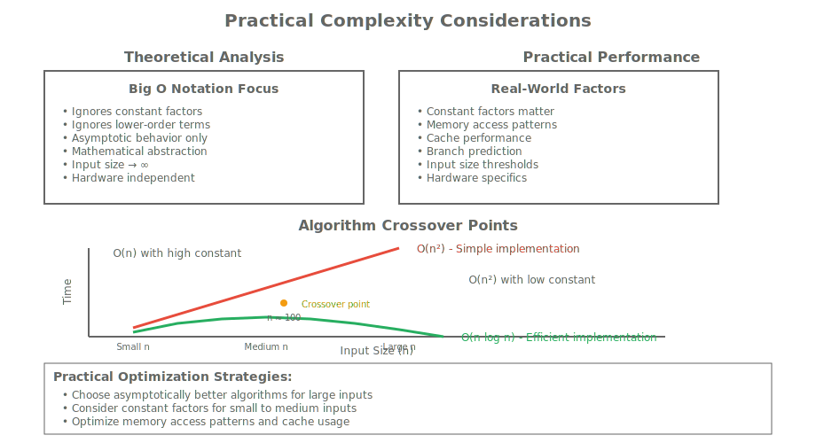
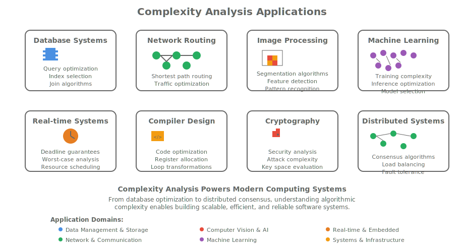

# Module 11: Time Complexity Analysis

## Hook: The Performance Puzzle

Imagine you're building a social media platform that needs to handle millions of users posting content simultaneously. Your algorithm for finding mutual friends works fine with 100 users, but what happens when you scale to 1 million users? Does it still work? How long does it take? How much memory does it consume?

This is the domain of algorithmic complexity analysis - the mathematical framework for understanding how algorithms behave as input sizes grow. Time complexity analysis provides the tools to predict performance, identify bottlenecks, and make informed decisions about algorithm selection in production C++ systems.

The elegance of Big O notation lies in its simplicity: a single letter that captures the asymptotic behavior of an algorithm, enabling developers to reason about performance without running exhaustive benchmarks.

## Roadmap: Your Journey Through Complexity Analysis

In this comprehensive module, you'll master the fundamental concepts of algorithmic complexity analysis:

1. **Core Concepts**: Understanding time and space complexity
2. **Big O Notation**: The language of algorithmic performance
3. **Complexity Classes**: Common complexity categories and their characteristics
4. **Algorithm Analysis**: Analyzing sorting, searching, and graph algorithms
5. **Best/Average/Worst Case**: Understanding different performance scenarios
6. **Amortized Analysis**: Dealing with operations that vary over time
7. **Practical Considerations**: Real-world performance implications
8. **Optimization Techniques**: Improving algorithmic efficiency

By the end of this module, you'll understand how to analyze algorithms mathematically, predict their performance characteristics, and make data-driven decisions about algorithm selection for C++ applications.

## Concept Deep Dive: Understanding Algorithmic Complexity

Algorithmic complexity measures how an algorithm's resource requirements (time and space) change as the input size grows. This analysis is crucial for predicting performance and scalability in real-world applications.

### Time Complexity

Time complexity measures how the execution time of an algorithm increases with input size. It's typically expressed using Big O notation, which describes the upper bound of growth rate.



### Space Complexity

Space complexity measures how much additional memory an algorithm requires relative to input size. This includes auxiliary space used for variables, data structures, and recursion stacks.

### Why Complexity Matters

Understanding algorithmic complexity helps developers:

- Predict performance scaling behavior
- Compare alternative algorithm implementations
- Identify performance bottlenecks
- Make informed architectural decisions
- Optimize resource utilization

## Big O Notation: The Language of Performance

Big O notation provides a standardized way to describe algorithmic complexity by focusing on the dominant term and ignoring constant factors and lower-order terms.

### Big O Definition

O(f(n)) represents the set of functions that grow no faster than f(n) asymptotically. For a function g(n) ∈ O(f(n)), there exist constants c > 0 and n₀ such that g(n) ≤ c × f(n) for all n ≥ n₀.

### Common Complexity Classes

<table style="border-collapse: collapse;">
<thead>
<tr><th style="padding: 8px; border: 1px solid #ddd;">Complexity</th><th style="padding: 8px; border: 1px solid #ddd;">Name</th><th style="padding: 8px; border: 1px solid #ddd;">Description</th><th style="padding: 8px; border: 1px solid #ddd;">Example</th></tr>
</thead>
<tbody>
<tr><td style="padding: 8px; border: 1px solid #ddd;">O(1)</td><td style="padding: 8px; border: 1px solid #ddd;">Constant</td><td style="padding: 8px; border: 1px solid #ddd;">Performance doesn't change with input size</td><td style="padding: 8px; border: 1px solid #ddd;">Array access by index</td></tr>
<tr><td style="padding: 8px; border: 1px solid #ddd;">O(log n)</td><td style="padding: 8px; border: 1px solid #ddd;">Logarithmic</td><td style="padding: 8px; border: 1px solid #ddd;">Performance grows slowly with input size</td><td style="padding: 8px; border: 1px solid #ddd;">Binary search</td></tr>
<tr><td style="padding: 8px; border: 1px solid #ddd;">O(n)</td><td style="padding: 8px; border: 1px solid #ddd;">Linear</td><td style="padding: 8px; border: 1px solid #ddd;">Performance grows proportionally with input size</td><td style="padding: 8px; border: 1px solid #ddd;">Linear search</td></tr>
<tr><td style="padding: 8px; border: 1px solid #ddd;">O(n log n)</td><td style="padding: 8px; border: 1px solid #ddd;">Linearithmic</td><td style="padding: 8px; border: 1px solid #ddd;">Common for efficient sorting algorithms</td><td style="padding: 8px; border: 1px solid #ddd;">Merge sort, quicksort</td></tr>
<tr><td style="padding: 8px; border: 1px solid #ddd;">O(n²)</td><td style="padding: 8px; border: 1px solid #ddd;">Quadratic</td><td style="padding: 8px; border: 1px solid #ddd;">Performance grows with square of input size</td><td style="padding: 8px; border: 1px solid #ddd;">Bubble sort, nested loops</td></tr>
<tr><td style="padding: 8px; border: 1px solid #ddd;">O(2ⁿ)</td><td style="padding: 8px; border: 1px solid #ddd;">Exponential</td><td style="padding: 8px; border: 1px solid #ddd;">Performance doubles with each input increase</td><td style="padding: 8px; border: 1px solid #ddd;">Subset generation</td></tr>
</tbody>
</table>

## Complexity Analysis Techniques

### Counting Operations

The most straightforward approach is to count the number of basic operations (assignments, comparisons, arithmetic operations) performed by an algorithm.

```cpp
// O(1) - Constant time
int getFirstElement(const std::vector<int>& arr) {
    return arr[0];  // Single operation regardless of array size
}

// O(n) - Linear time
int sumArray(const std::vector<int>& arr) {
    int sum = 0;
    for (int num : arr) {  // n iterations
        sum += num;         // n additions
    }
    return sum;
}

// O(n²) - Quadratic time
void printPairs(const std::vector<int>& arr) {
    for (size_t i = 0; i < arr.size(); ++i) {     // n iterations
        for (size_t j = 0; j < arr.size(); ++j) { // n iterations each
            std::cout << arr[i] << "," << arr[j] << " ";
        }
    }
}
```

### Analyzing Control Structures

Different control structures contribute to complexity in predictable ways:

- **Sequential statements**: Add complexities (O(f(n)) + O(g(n)) = O(max(f(n), g(n))))
- **Loops**: Multiply by iteration count
- **Nested loops**: Multiply complexities
- **Conditional statements**: Take the maximum complexity
- **Function calls**: Include callee complexity

## Best, Average, and Worst Case Analysis

Most algorithms have different performance characteristics depending on input characteristics.

### Best Case

The minimum time required for any input of size n. Often occurs with optimally arranged data.

### Worst Case

The maximum time required for any input of size n. Critical for real-time systems and guarantees.

### Average Case

The expected time over all possible inputs of size n. Requires probability analysis of input distribution.



### Example: Linear Search

```cpp
// Best case: O(1) - element found at first position
// Worst case: O(n) - element not found or at last position
// Average case: O(n) - element equally likely at any position
int linearSearch(const std::vector<int>& arr, int target) {
    for (size_t i = 0; i < arr.size(); ++i) {
        if (arr[i] == target) {
            return static_cast<int>(i);
        }
    }
    return -1;
}
```

## Analyzing Sorting Algorithms

Let's analyze the time complexity of various sorting algorithms we've encountered.

### Bubble Sort - O(n²)

```cpp
void bubbleSort(std::vector<int>& arr) {
    size_t n = arr.size();
    for (size_t i = 0; i < n - 1; ++i) {        // n iterations
        for (size_t j = 0; j < n - i - 1; ++j) { // n-i iterations
            if (arr[j] > arr[j + 1]) {
                std::swap(arr[j], arr[j + 1]);     // Constant time
            }
        }
    }
}
// Time Complexity: O(n²) in all cases
```

### Quick Sort - O(n log n) Average, O(n²) Worst

```cpp
size_t partition(std::vector<int>& arr, size_t low, size_t high) {
    int pivot = arr[high];
    size_t i = low - 1;

    for (size_t j = low; j < high; ++j) {
        if (arr[j] <= pivot) {
            ++i;
            std::swap(arr[i], arr[j]);
        }
    }
    std::swap(arr[i + 1], arr[high]);
    return i + 1;
}

void quickSort(std::vector<int>& arr, size_t low, size_t high) {
    if (low < high) {
        size_t pi = partition(arr, low, high);  // O(n) partitioning

        quickSort(arr, low, pi - 1);            // T(n/2) left
        quickSort(arr, pi + 1, high);           // T(n/2) right
    }
}
// Average case: O(n log n), Worst case: O(n²)
```

### Merge Sort - O(n log n) Guaranteed

```cpp
void merge(std::vector<int>& arr, size_t left, size_t mid, size_t right) {
    std::vector<int> temp(right - left + 1);
    size_t i = left, j = mid + 1, k = 0;

    while (i <= mid && j <= right) {
        if (arr[i] <= arr[j]) {
            temp[k++] = arr[i++];
        } else {
            temp[k++] = arr[j++];
        }
    }

    while (i <= mid) temp[k++] = arr[i++];
    while (j <= right) temp[k++] = arr[j++];

    for (size_t p = 0; p < k; ++p) {
        arr[left + p] = temp[p];
    }
}

void mergeSort(std::vector<int>& arr, size_t left, size_t right) {
    if (left < right) {
        size_t mid = left + (right - left) / 2;

        mergeSort(arr, left, mid);       // T(n/2)
        mergeSort(arr, mid + 1, right);  // T(n/2)
        merge(arr, left, mid, right);    // O(n)
    }
}
// Time Complexity: O(n log n) in all cases
```

## Analyzing Search Algorithms

### Binary Search - O(log n)

```cpp
int binarySearch(const std::vector<int>& arr, int target) {
    size_t left = 0;
    size_t right = arr.size() - 1;

    while (left <= right) {
        size_t mid = left + (right - left) / 2;

        if (arr[mid] == target) {
            return static_cast<int>(mid);
        } else if (arr[mid] < target) {
            left = mid + 1;
        } else {
            right = mid - 1;
        }
    }
    return -1;
}
// Time Complexity: O(log n) - search space halves each iteration
```

## Amortized Analysis

Amortized analysis deals with algorithms where most operations are fast but some are expensive. Instead of analyzing each operation individually, we analyze the average cost over a sequence of operations.

### Example: Dynamic Array (std::vector)

```cpp
// std::vector push_back operation:
// - Usually O(1) amortized
// - Occasionally O(n) when resizing
// - Average cost over many operations is O(1)

std::vector<int> vec;
for (int i = 0; i < 1000000; ++i) {
    vec.push_back(i);  // Amortized O(1) per operation
}
```

### Accounting Method

Charge each operation an amortized cost that covers both cheap and expensive operations. The total amortized cost must be ≥ total actual cost.

## Space Complexity Analysis

Space complexity measures additional memory usage beyond input storage.

### Examples

```cpp
// O(1) space - constant extra space
int sumArray(const std::vector<int>& arr) {
    int sum = 0;  // Constant space
    for (int num : arr) {
        sum += num;
    }
    return sum;
}

// O(n) space - linear extra space
std::vector<int> copyArray(const std::vector<int>& arr) {
    std::vector<int> copy = arr;  // O(n) space
    return copy;
}

// O(log n) space - recursive stack
int binarySearchRecursive(const std::vector<int>& arr, int target,
                         size_t left, size_t right) {
    if (left > right) return -1;

    size_t mid = left + (right - left) / 2;
    if (arr[mid] == target) return mid;

    if (arr[mid] > target) {
        return binarySearchRecursive(arr, target, left, mid - 1);
    } else {
        return binarySearchRecursive(arr, target, mid + 1, right);
    }
}
```

## Practical Performance Considerations

### Constants Matter in Practice

Big O notation ignores constants, but in practice, constants can be significant:

```cpp
// Both O(n), but second is 10x faster in practice
void slowLoop(const std::vector<int>& arr) {
    for (size_t i = 0; i < arr.size(); ++i) {
        for (int j = 0; j < 10; ++j) {  // Constant factor
            // Do something
        }
    }
}

void fastLoop(const std::vector<int>& arr) {
    for (size_t i = 0; i < arr.size(); ++i) {
        // Do something
    }
}
```

### Cache Performance

Algorithmic complexity doesn't account for memory access patterns. Cache-friendly algorithms often perform better in practice.

### Input Size Thresholds

For small inputs, simpler algorithms may outperform asymptotically superior ones due to lower constants.



## Guided Walkthrough: Analyzing a Custom Algorithm

Let's analyze a custom algorithm that finds the maximum subarray sum using Kadane's algorithm.

```cpp
int maxSubarraySum(const std::vector<int>& arr) {
    if (arr.empty()) return 0;

    int max_current = arr[0];
    int max_global = arr[0];

    for (size_t i = 1; i < arr.size(); ++i) {
        max_current = std::max(arr[i], max_current + arr[i]);
        max_global = std::max(max_global, max_current);
    }

    return max_global;
}
```

### Analysis

- **Time Complexity**: O(n) - single pass through array
- **Space Complexity**: O(1) - constant extra space
- **Best Case**: O(n) - must examine all elements
- **Worst Case**: O(n) - same as best case
- **Stability**: Algorithm is stable and predictable

## Real-world Applications of Complexity Analysis

Complexity analysis guides algorithm selection in production systems:

1. **Database Query Optimization**: Choosing efficient join algorithms
2. **Network Routing**: Selecting shortest path algorithms for large graphs
3. **Image Processing**: Choosing appropriate filtering algorithms
4. **Machine Learning**: Understanding training time complexity
5. **Real-time Systems**: Ensuring algorithms meet timing constraints



## Practice: Analyzing Algorithm Complexity

### Exercise 1: Basic Complexity Analysis

Analyze the time complexity of these simple functions:

```cpp
// Function A
int findMax(const std::vector<int>& arr) {
    int max_val = arr[0];
    for (size_t i = 1; i < arr.size(); ++i) {
        if (arr[i] > max_val) {
            max_val = arr[i];
        }
    }
    return max_val;
}

// Function B
void printMatrix(const std::vector<std::vector<int>>& matrix) {
    for (const auto& row : matrix) {
        for (int val : row) {
            std::cout << val << " ";
        }
        std::cout << std::endl;
    }
}

// Function C
bool containsDuplicate(const std::vector<int>& arr) {
    for (size_t i = 0; i < arr.size(); ++i) {
        for (size_t j = i + 1; j < arr.size(); ++j) {
            if (arr[i] == arr[j]) return true;
        }
    }
    return false;
}
```

### Exercise 2: Recursive Algorithm Analysis

Analyze the time complexity of this recursive function:

```cpp
int fibonacci(int n) {
    if (n <= 1) return n;
    return fibonacci(n - 1) + fibonacci(n - 2);
}
```

### Exercise 3: Space Complexity Analysis

Determine the space complexity of these data structure operations:

```cpp
// Operation A: In-order traversal of binary tree
void inOrderTraversal(TreeNode* root) {
    if (root == nullptr) return;
    inOrderTraversal(root->left);
    std::cout << root->val << " ";
    inOrderTraversal(root->right);
}

// Operation B: Breadth-first search
void bfs(Graph& graph, int start) {
    std::queue<int> q;
    std::vector<bool> visited(graph.size(), false);

    q.push(start);
    visited[start] = true;

    while (!q.empty()) {
        int node = q.front();
        q.pop();
        std::cout << node << " ";

        for (int neighbor : graph[node]) {
            if (!visited[neighbor]) {
                visited[neighbor] = true;
                q.push(neighbor);
            }
        }
    }
}
```

### Exercise 4: Best/Worst/Average Case Analysis

For the quicksort partition function, identify:

- Best case input arrangement
- Worst case input arrangement
- Average case performance

### Exercise 5: Amortized Analysis

Analyze the amortized cost of std::vector operations and explain why push_back is considered O(1) amortized.

## Reflection: Complexity Analysis Insights

### When to Use Different Complexity Classes

- **O(1)**: Perfect for frequently called operations
- **O(log n)**: Excellent for large datasets
- **O(n)**: Good baseline, often acceptable
- **O(n log n)**: Standard for efficient sorting
- **O(n²)**: Only acceptable for small inputs
- **O(2ⁿ)**: Usually indicates algorithmic flaws

### Common Analysis Mistakes

1. **Ignoring constants**: O(2n) = O(n), not O(2n)
2. **Wrong dominant terms**: O(n² + n) = O(n²)
3. **Misunderstanding recursion**: Each recursive call adds stack space
4. **Forgetting input size**: Complexity is relative to input size
5. **Confusing worst vs average**: Always consider the worst case for guarantees

### Performance Optimization Strategies

1. **Algorithm selection**: Choose asymptotically better algorithms
2. **Data structure optimization**: Use appropriate data structures
3. **Caching and memoization**: Avoid redundant computations
4. **Early termination**: Stop when results are known
5. **Parallelization**: Distribute work across multiple cores

## Cheat Sheet: Complexity Analysis Quick Reference

### Big O Hierarchy (from best to worst)

- O(1) - Constant
- O(log n) - Logarithmic
- O(n) - Linear
- O(n log n) - Linearithmic
- O(n²) - Quadratic
- O(n³) - Cubic
- O(2ⁿ) - Exponential
- O(n!) - Factorial

### Common Algorithm Complexities

<table style="border-collapse: collapse;">
<thead>
<tr><th style="padding: 8px; border: 1px solid #ddd;">Algorithm</th><th style="padding: 8px; border: 1px solid #ddd;">Time Complexity</th><th style="padding: 8px; border: 1px solid #ddd;">Space Complexity</th></tr>
</thead>
<tbody>
<tr><td style="padding: 8px; border: 1px solid #ddd;">Linear Search</td><td style="padding: 8px; border: 1px solid #ddd;">O(n)</td><td style="padding: 8px; border: 1px solid #ddd;">O(1)</td></tr>
<tr><td style="padding: 8px; border: 1px solid #ddd;">Binary Search</td><td style="padding: 8px; border: 1px solid #ddd;">O(log n)</td><td style="padding: 8px; border: 1px solid #ddd;">O(1)</td></tr>
<tr><td style="padding: 8px; border: 1px solid #ddd;">Bubble Sort</td><td style="padding: 8px; border: 1px solid #ddd;">O(n²)</td><td style="padding: 8px; border: 1px solid #ddd;">O(1)</td></tr>
<tr><td style="padding: 8px; border: 1px solid #ddd;">Quick Sort (avg)</td><td style="padding: 8px; border: 1px solid #ddd;">O(n log n)</td><td style="padding: 8px; border: 1px solid #ddd;">O(log n)</td></tr>
<tr><td style="padding: 8px; border: 1px solid #ddd;">Merge Sort</td><td style="padding: 8px; border: 1px solid #ddd;">O(n log n)</td><td style="padding: 8px; border: 1px solid #ddd;">O(n)</td></tr>
<tr><td style="padding: 8px; border: 1px solid #ddd;">Dijkstra's</td><td style="padding: 8px; border: 1px solid #ddd;">O((V+E) log V)</td><td style="padding: 8px; border: 1px solid #ddd;">O(V)</td></tr>
<tr><td style="padding: 8px; border: 1px solid #ddd;">Prim's MST</td><td style="padding: 8px; border: 1px solid #ddd;">O((V+E) log V)</td><td style="padding: 8px; border: 1px solid #ddd;">O(V)</td></tr>
</tbody>
</table>

### Analysis Rules

- **Loops**: Multiply by iteration count
- **Nested loops**: Multiply complexities
- **Consecutive statements**: Take maximum
- **Recursive calls**: T(n) = T(subproblems) + work
- **Branching**: Take maximum path

## Key Takeaways

1. **Time Complexity**: Measures execution time growth with input size
2. **Space Complexity**: Measures memory usage growth with input size
3. **Big O Notation**: Describes upper bound of growth rate
4. **Best/Worst/Average Case**: Different performance scenarios
5. **Amortized Analysis**: Average cost over operation sequences
6. **Practical Considerations**: Constants and cache behavior matter
7. **Algorithm Selection**: Balance theoretical and practical performance
8. **Optimization**: Focus on dominant operations and bottlenecks

## Practice Checklist

- [ ] Analyze time complexity of basic algorithms
- [ ] Calculate space complexity of data structures
- [ ] Identify best, worst, and average cases
- [ ] Apply amortized analysis techniques
- [ ] Compare algorithm performance theoretically
- [ ] Consider practical performance factors
- [ ] Optimize algorithms for better complexity
- [ ] Document complexity analysis in code comments

## Journal Prompts

1. How does understanding algorithmic complexity change how you approach problem-solving?
2. What are the limitations of Big O notation for real-world performance prediction?
3. How do different programming languages affect algorithmic complexity analysis?
4. What role does hardware architecture play in algorithmic performance?
5. How can complexity analysis guide software architecture decisions?
6. What are the ethical implications of choosing algorithms with different complexity characteristics?
7. How does complexity analysis apply to distributed systems and cloud computing?
8. What are the connections between algorithmic complexity and information theory?
