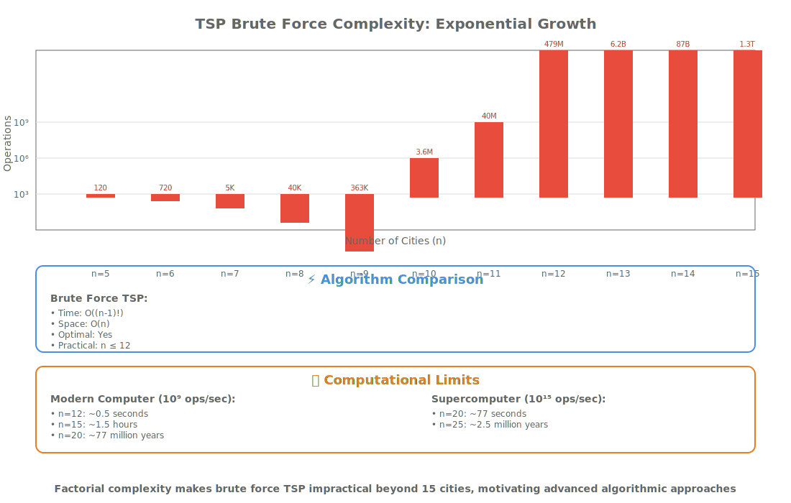
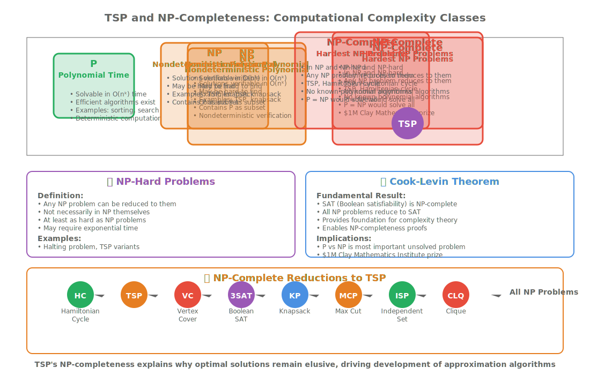

# Lesson 14.1: Traveling Salesman Problem, NP-Completeness, and Approximation Algorithms

## Hook: The World's Most Famous Optimization Problem

Imagine you're a delivery driver tasked with visiting 20 cities across the country, each exactly once, and returning home while minimizing fuel costs. Or picture a circuit board manufacturer needing to drill holes in the optimal sequence to minimize tool movement. These scenarios represent the Traveling Salesman Problem (TSP) - one of computer science's most iconic optimization challenges.


TSP exemplifies NP-complete problems: computationally intensive puzzles where finding optimal solutions becomes exponentially difficult as problem size grows. Yet understanding TSP unlocks powerful algorithmic techniques used in logistics, manufacturing, DNA sequencing, and even quantum computing research.

## Roadmap: From Brute Force to Approximation

This lesson explores TSP through four interconnected concepts:

1. **Problem Formulation**: Graph theory foundations and mathematical modeling
2. **Brute Force Solutions**: Complete enumeration and factorial complexity
3. **NP-Completeness**: Theoretical computer science foundations
4. **Approximation Algorithms**: Practical solutions for real-world applications

Each approach reveals different algorithmic trade-offs between optimality and computational feasibility.

## Concept Deep Dive: TSP as a Graph Problem

TSP transforms geographic routing into graph theory. Cities become vertices, roads become edges with distance weights. The goal: find the minimum-weight Hamiltonian cycle visiting each vertex exactly once.

```cpp
#include <vector>
#include <iostream>
#include <limits>
#include <algorithm>

// Basic TSP graph representation
class TSPGraph {
private:
    std::vector<std::vector<double>> distance_matrix_;
    size_t num_cities_;

public:
    TSPGraph(size_t num_cities) : num_cities_(num_cities) {
        distance_matrix_.resize(num_cities, std::vector<double>(num_cities, 0.0));
    }

    void set_distance(size_t from, size_t to, double distance) {
        distance_matrix_[from][to] = distance;
        distance_matrix_[to][from] = distance; // Undirected graph
    }

    double get_distance(size_t from, size_t to) const {
        return distance_matrix_[from][to];
    }

    size_t num_cities() const { return num_cities_; }

    // Calculate tour cost
    double calculate_tour_cost(const std::vector<size_t>& tour) const {
        double cost = 0.0;
        for (size_t i = 0; i < tour.size() - 1; ++i) {
            cost += get_distance(tour[i], tour[i + 1]);
        }
        cost += get_distance(tour.back(), tour[0]); // Return to start
        return cost;
    }
};
```

This foundation enables systematic exploration of algorithmic approaches.

## Guided Walkthrough: Brute Force Enumeration

The most straightforward TSP solution examines every possible tour permutation. While conceptually simple, this approach reveals computational complexity limits.

```cpp
#include <vector>
#include <algorithm>
#include <limits>
#include <iostream>

// Brute force TSP solver - exponential time complexity
class BruteForceTSP {
private:
    const TSPGraph& graph_;
    double best_cost_;
    std::vector<size_t> best_tour_;

    // Recursive permutation generator
    void generate_permutations(std::vector<size_t>& cities,
                              size_t start_index,
                              std::vector<bool>& used) {
        if (start_index == cities.size()) {
            // Complete tour found - evaluate cost
            double current_cost = graph_.calculate_tour_cost(cities);
            if (current_cost < best_cost_) {
                best_cost_ = current_cost;
                best_tour_ = cities;
            }
            return;
        }

        for (size_t i = 0; i < cities.size(); ++i) {
            if (!used[i]) {
                used[i] = true;
                cities[start_index] = i;
                generate_permutations(cities, start_index + 1, used);
                used[i] = false;
            }
        }
    }

public:
    BruteForceTSP(const TSPGraph& graph)
        : graph_(graph), best_cost_(std::numeric_limits<double>::max()) {}

    std::pair<double, std::vector<size_t>> solve() {
        size_t n = graph_.num_cities();
        std::vector<size_t> cities(n);
        std::vector<bool> used(n, false);

        // Start from city 0 to eliminate rotational symmetry
        used[0] = true;
        cities[0] = 0;

        generate_permutations(cities, 1, used);

        return {best_cost_, best_tour_};
    }
};
```



For 10 cities, this generates 362,880 permutations. At 15 cities, we hit 1.3 trillion possibilities - computationally prohibitive for real applications.

## Practice: Implementing Dynamic Programming

Dynamic programming offers TSP's first polynomial-time breakthrough through state compression. The Held-Karp algorithm reduces exponential complexity using memoization.

```cpp
#include <vector>
#include <unordered_map>
#include <bitset>
#include <iostream>
#include <limits>

// Dynamic Programming TSP solver using state compression
class DynamicProgrammingTSP {
private:
    const TSPGraph& graph_;
    size_t num_cities_;
    std::vector<std::vector<double>> memo_;
    std::vector<std::vector<size_t>> next_city_;

    // State: (current_city, visited_set)
    // Memoization table: memo_[current_city][visited_mask]
    double dp_solve(size_t current, size_t visited_mask) {
        // Base case: all cities visited, return to start
        if (visited_mask == (1 << num_cities_) - 1) {
            return graph_.get_distance(current, 0);
        }

        // Check memoization
        if (memo_[current][visited_mask] != -1.0) {
            return memo_[current][visited_mask];
        }

        double min_cost = std::numeric_limits<double>::max();

        // Try visiting each unvisited city
        for (size_t next = 0; next < num_cities_; ++next) {
            if ((visited_mask & (1 << next)) == 0) { // City not visited
                double cost = graph_.get_distance(current, next) +
                             dp_solve(next, visited_mask | (1 << next));
                if (cost < min_cost) {
                    min_cost = cost;
                    next_city_[current][visited_mask] = next;
                }
            }
        }

        memo_[current][visited_mask] = min_cost;
        return min_cost;
    }

    // Reconstruct optimal tour from memoization table
    std::vector<size_t> reconstruct_tour() {
        std::vector<size_t> tour;
        size_t current = 0;
        size_t visited = 1; // Start with city 0 visited

        tour.push_back(0);

        while (visited != (1 << num_cities_) - 1) {
            size_t next = next_city_[current][visited];
            tour.push_back(next);
            visited |= (1 << next);
            current = next;
        }

        return tour;
    }

public:
    DynamicProgrammingTSP(const TSPGraph& graph)
        : graph_(graph), num_cities_(graph.num_cities()) {
        size_t max_mask = 1 << num_cities_;
        memo_.assign(num_cities_, std::vector<double>(max_mask, -1.0));
        next_city_.assign(num_cities_, std::vector<size_t>(max_mask, 0));
    }

    std::pair<double, std::vector<size_t>> solve() {
        double min_cost = dp_solve(0, 1); // Start from city 0
        std::vector<size_t> optimal_tour = reconstruct_tour();
        return {min_cost, optimal_tour};
    }
};
```

This O(n² × 2ⁿ) algorithm handles 20-25 cities efficiently, a dramatic improvement over brute force enumeration.

## Concept Deep Dive: NP-Completeness Theory

TSP's computational intractability stems from NP-completeness. NP-complete problems share three properties:

1. **Verification in Polynomial Time**: Solutions can be checked efficiently
2. **NP Membership**: Solutions exist that can be verified in polynomial time
3. **NP-Hardness**: Any NP problem reduces to TSP in polynomial time

```cpp
#include <vector>
#include <iostream>
#include <chrono>

// TSP complexity demonstration
class TSPComplexityDemo {
public:
    // Calculate factorial for brute force complexity
    static unsigned long long factorial(size_t n) {
        unsigned long long result = 1;
        for (size_t i = 2; i <= n; ++i) {
            result *= i;
        }
        return result;
    }

    // Estimate computation time for different approaches
    static void analyze_complexity(size_t num_cities) {
        std::cout << "TSP Complexity Analysis for " << num_cities << " cities:\n";

        // Brute force: (n-1)! / 2
        unsigned long long brute_force_operations = factorial(num_cities - 1) / 2;
        std::cout << "Brute force operations: " << brute_force_operations << "\n";

        // Dynamic programming: n² × 2ⁿ
        unsigned long long dp_operations = num_cities * num_cities * (1ULL << num_cities);
        std::cout << "DP operations: " << dp_operations << "\n";

        // Approximation ratio
        double approximation_ratio = brute_force_operations > 0 ?
            static_cast<double>(dp_operations) / brute_force_operations : 0;
        std::cout << "DP is " << approximation_ratio << "x faster than brute force\n";
    }

    // Demonstrate P vs NP concepts
    static void demonstrate_reductions() {
        std::cout << "\nNP-Completeness Reductions:\n";
        std::cout << "• Hamiltonian Cycle → TSP (add edge weights)\n";
        std::cout << "• Vertex Cover → TSP (construct distance matrix)\n";
        std::cout << "• Set Cover → TSP (create city clusters)\n";
        std::cout << "• Any NP problem can be reduced to TSP\n";
    }
};
```



Understanding NP-completeness explains why optimal TSP solutions remain elusive for large instances.

## Guided Walkthrough: Approximation Algorithms

For practical applications, approximation algorithms provide near-optimal solutions with performance guarantees. The Christofides algorithm offers a 1.5-approximation for metric TSP.

```cpp
#include <vector>
#include <queue>
#include <algorithm>
#include <iostream>
#include <limits>

// Approximation algorithm for TSP using Minimum Spanning Tree
class ChristofidesApproximation {
private:
    const TSPGraph& graph_;
    size_t num_cities_;

    // Minimum Spanning Tree using Prim's algorithm
    std::vector<std::vector<size_t>> build_mst() {
        std::vector<double> min_edge(num_cities_, std::numeric_limits<double>::max());
        std::vector<size_t> parent(num_cities_, SIZE_MAX);
        std::vector<bool> in_mst(num_cities_, false);

        min_edge[0] = 0.0;

        for (size_t count = 0; count < num_cities_ - 1; ++count) {
            // Find minimum edge
            double min_val = std::numeric_limits<double>::max();
            size_t min_index = SIZE_MAX;

            for (size_t v = 0; v < num_cities_; ++v) {
                if (!in_mst[v] && min_edge[v] < min_val) {
                    min_val = min_edge[v];
                    min_index = v;
                }
            }

            in_mst[min_index] = true;

            // Update adjacent vertices
            for (size_t v = 0; v < num_cities_; ++v) {
                if (!in_mst[v] && graph_.get_distance(min_index, v) < min_edge[v]) {
                    min_edge[v] = graph_.get_distance(min_index, v);
                    parent[v] = min_index;
                }
            }
        }

        // Convert to adjacency list
        std::vector<std::vector<size_t>> mst(num_cities_);
        for (size_t i = 1; i < num_cities_; ++i) {
            if (parent[i] != SIZE_MAX) {
                mst[parent[i]].push_back(i);
                mst[i].push_back(parent[i]);
            }
        }

        return mst;
    }

    // Find Eulerian circuit in MST (approximated)
    std::vector<size_t> find_eulerian_path(const std::vector<std::vector<size_t>>& mst) {
        std::vector<size_t> path;
        std::vector<bool> visited(num_cities_, false);

        // Simple DFS traversal (not true Eulerian path)
        std::function<void(size_t)> dfs = [&](size_t node) {
            visited[node] = true;
            path.push_back(node);

            for (size_t neighbor : mst[node]) {
                if (!visited[neighbor]) {
                    dfs(neighbor);
                }
            }
        };

        dfs(0);
        return path;
    }

    // Shorten path by removing duplicates (create Hamiltonian path)
    std::vector<size_t> create_hamiltonian_path(const std::vector<size_t>& eulerian_path) {
        std::vector<size_t> hamiltonian_path;
        std::vector<bool> visited(num_cities_, false);

        for (size_t city : eulerian_path) {
            if (!visited[city]) {
                visited[city] = true;
                hamiltonian_path.push_back(city);
            }
        }

        return hamiltonian_path;
    }

public:
    ChristofidesApproximation(const TSPGraph& graph)
        : graph_(graph), num_cities_(graph.num_cities()) {}

    std::pair<double, std::vector<size_t>> solve() {
        // Build MST
        auto mst = build_mst();

        // Find Eulerian path approximation
        auto eulerian_path = find_eulerian_path(mst);

        // Create Hamiltonian path
        auto hamiltonian_tour = create_hamiltonian_path(eulerian_path);

        // Calculate tour cost
        double tour_cost = graph_.calculate_tour_cost(hamiltonian_tour);

        return {tour_cost, hamiltonian_tour};
    }
};
```

This approximation guarantees solutions within 1.5× optimal, suitable for real-world logistics applications.

## Practice: Heuristic Approaches

Beyond approximation algorithms, heuristic methods offer practical solutions for large-scale TSP instances. The nearest neighbor algorithm provides fast, reasonable solutions.

```cpp
#include <vector>
#include <algorithm>
#include <iostream>
#include <limits>

// Nearest Neighbor heuristic for TSP
class NearestNeighborTSP {
private:
    const TSPGraph& graph_;
    size_t num_cities_;

public:
    NearestNeighborTSP(const TSPGraph& graph)
        : graph_(graph), num_cities_(graph.num_cities()) {}

    std::pair<double, std::vector<size_t>> solve(size_t start_city = 0) {
        std::vector<size_t> tour;
        std::vector<bool> visited(num_cities_, false);
        double total_cost = 0.0;

        size_t current = start_city;
        tour.push_back(current);
        visited[current] = true;

        // Visit each remaining city
        for (size_t step = 1; step < num_cities_; ++step) {
            double min_distance = std::numeric_limits<double>::max();
            size_t next_city = SIZE_MAX;

            // Find nearest unvisited city
            for (size_t candidate = 0; candidate < num_cities_; ++candidate) {
                if (!visited[candidate]) {
                    double distance = graph_.get_distance(current, candidate);
                    if (distance < min_distance) {
                        min_distance = distance;
                        next_city = candidate;
                    }
                }
            }

            // Move to nearest city
            if (next_city != SIZE_MAX) {
                tour.push_back(next_city);
                visited[next_city] = true;
                total_cost += min_distance;
                current = next_city;
            }
        }

        // Return to start
        total_cost += graph_.get_distance(current, start_city);

        return {total_cost, tour};
    }

    // Try multiple starting points for better results
    std::pair<double, std::vector<size_t>> solve_multi_start() {
        double best_cost = std::numeric_limits<double>::max();
        std::vector<size_t> best_tour;

        // Try starting from each city
        for (size_t start = 0; start < num_cities_; ++start) {
            auto [cost, tour] = solve(start);
            if (cost < best_cost) {
                best_cost = cost;
                best_tour = tour;
            }
        }

        return {best_cost, best_tour};
    }
};
```


Heuristics like nearest neighbor offer O(n²) complexity with reasonable solution quality for thousands of cities.

## Reflection: Algorithmic Trade-offs

TSP illustrates fundamental algorithmic trade-offs:

<table style="border-collapse: collapse;">
<thead>
<tr><th style="padding: 8px; border: 1px solid #ddd;">Approach</th><th style="padding: 8px; border: 1px solid #ddd;">Time Complexity</th><th style="padding: 8px; border: 1px solid #ddd;">Solution Quality</th><th style="padding: 8px; border: 1px solid #ddd;">Practical Use</th></tr>
</thead>
<tbody>
<tr><td style="padding: 8px; border: 1px solid #ddd;">Brute Force</td><td style="padding: 8px; border: 1px solid #ddd;">O(n!)</td><td style="padding: 8px; border: 1px solid #ddd;">Optimal</td><td style="padding: 8px; border: 1px solid #ddd;">n ≤ 12</td></tr>
<tr><td style="padding: 8px; border: 1px solid #ddd;">Dynamic Programming</td><td style="padding: 8px; border: 1px solid #ddd;">O(n² × 2ⁿ)</td><td style="padding: 8px; border: 1px solid #ddd;">Optimal</td><td style="padding: 8px; border: 1px solid #ddd;">n ≤ 25</td></tr>
<tr><td style="padding: 8px; border: 1px solid #ddd;">Approximation</td><td style="padding: 8px; border: 1px solid #ddd;">O(n²)</td><td style="padding: 8px; border: 1px solid #ddd;">1.5× optimal</td><td style="padding: 8px; border: 1px solid #ddd;">n ≤ 1000</td></tr>
<tr><td style="padding: 8px; border: 1px solid #ddd;">Heuristics</td><td style="padding: 8px; border: 1px solid #ddd;">O(n²)</td><td style="padding: 8px; border: 1px solid #ddd;">Variable</td><td style="padding: 8px; border: 1px solid #ddd;">n ≤ 10000+</td></tr>
</tbody>
</table>

Each approach serves different problem scales and accuracy requirements.

## Cheat Sheet: TSP Algorithm Selection

**For Small Instances (n ≤ 12):**

- Use brute force enumeration
- Guarantees optimal solutions
- Simple implementation

**For Medium Instances (n ≤ 25):**

- Apply dynamic programming
- Optimal solutions with reasonable time
- State compression essential

**For Large Instances (n ≤ 1000):**

- Use Christofides approximation
- 1.5× optimal guarantee
- Polynomial time complexity

**For Very Large Instances (n > 1000):**

- Apply heuristic methods
- Fast execution, variable quality
- Good for real-time applications

## Key Takeaways

1. **TSP Complexity**: NP-complete problem with factorial brute force complexity
2. **Dynamic Programming**: O(n² × 2ⁿ) optimal solutions for n ≤ 25 cities
3. **Approximation Algorithms**: Christofides provides 1.5× optimal guarantee
4. **Heuristic Methods**: Nearest neighbor offers practical solutions for large instances
5. **Real-World Applications**: Route optimization, circuit board design, DNA sequencing

## Practice Exercises

1. **Implement brute force TSP** for 10 cities and measure execution time
2. **Add memoization** to dynamic programming solution
3. **Compare approximation algorithms** on random distance matrices
4. **Implement local search improvements** for heuristic solutions
5. **Analyze TSP variants**: asymmetric, metric, and Euclidean TSP

## Journal Prompts

- How does TSP complexity relate to real-world optimization problems?
- Why do approximation algorithms matter for NP-complete problems?
- How might quantum computing impact TSP solution approaches?
- What ethical considerations arise when using heuristics for critical applications?

Mastering TSP develops intuition for computational complexity and practical algorithm design - skills essential for modern software engineering.
