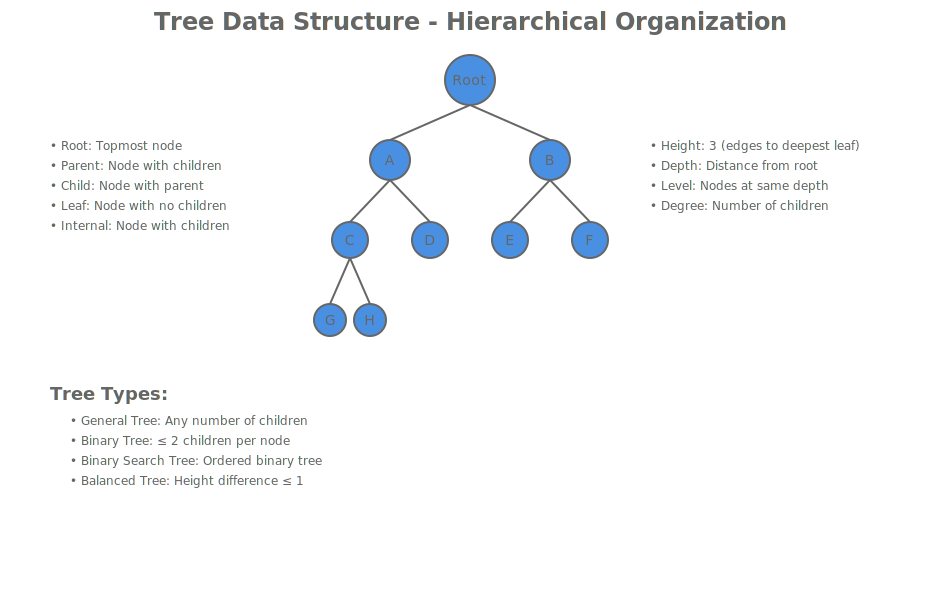
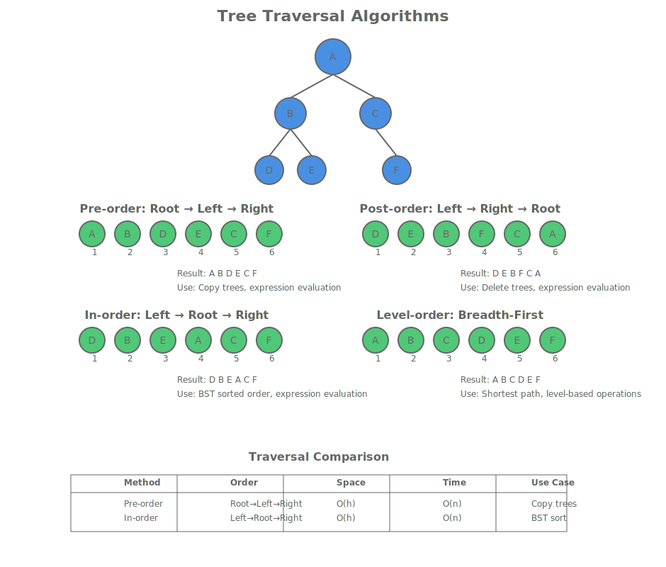
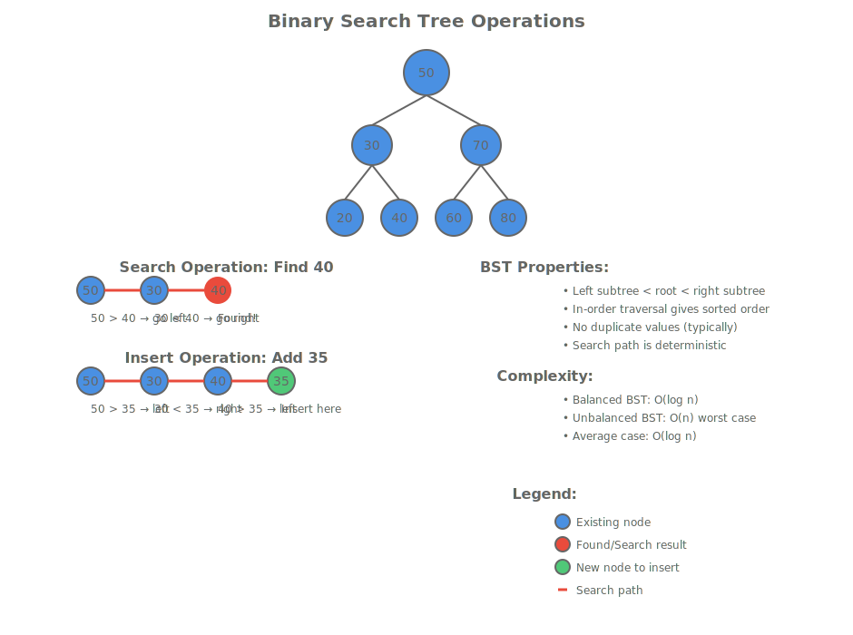
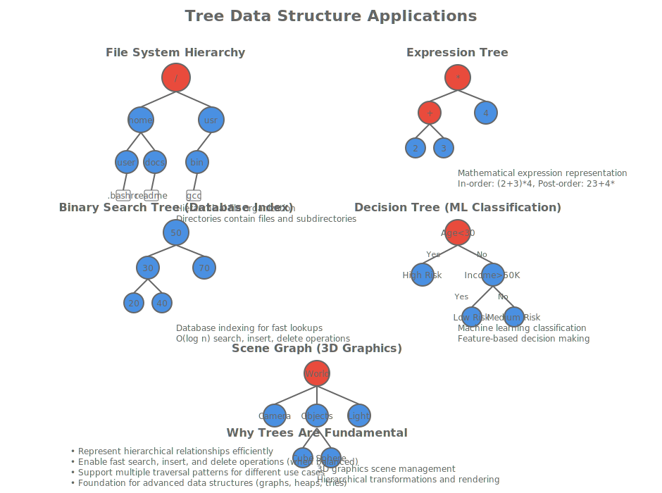

# Trees - Hierarchical Data Structures

## Hook: The Power of Hierarchical Organization

Imagine you're building a file system for an operating system. Files and directories form a natural hierarchy - each directory can contain files and other directories. This tree-like structure allows for efficient organization and navigation. But how do we represent and manipulate these hierarchical relationships in code?

Trees are fundamental data structures that capture hierarchical relationships between elements. From file systems to organizational charts, from decision trees in machine learning to syntax trees in compilers, trees provide the backbone for representing structured data. In this lesson, we'll explore how trees work, how to implement them in C++, and the algorithms that make them powerful.

## Roadmap: Trees in the DSA Landscape

Trees build upon the concepts we've learned about linked structures, extending them into hierarchical organizations:

- **Tree fundamentals** connect back to linked lists (each node can have multiple children)
- **Binary trees** introduce the concept of ordered hierarchies
- **Tree traversals** demonstrate systematic ways to visit all nodes
- **Search trees** combine ordering with efficient lookup operations



This lesson bridges the gap between linear structures (arrays, linked lists) and hierarchical ones, preparing you for advanced data structures like graphs.

## Concept 1: Tree Fundamentals

### What is a Tree?

A tree is a hierarchical data structure consisting of nodes connected by edges. Each node can have zero or more child nodes, but exactly one parent node (except the root).

### Tree Terminology

- **Root**: The topmost node with no parent
- **Leaf**: A node with no children
- **Internal Node**: A node with at least one child
- **Parent**: A node that has child nodes
- **Child**: A node that has a parent
- **Siblings**: Nodes that share the same parent
- **Height**: Maximum depth from root to leaf
- **Depth**: Distance from root to a node
- **Level**: All nodes at the same depth

### Tree Properties

```cpp
struct TreeNode {
    int data;
    std::vector<TreeNode*> children;

    TreeNode(int val) : data(val) {}
};
```

### Basic Tree Operations

```cpp
class Tree {
private:
    TreeNode* root;

public:
    Tree() : root(nullptr) {}

    void insert(int value) {
        if (!root) {
            root = new TreeNode(value);
            return;
        }
        // Implementation depends on tree type
    }

    TreeNode* search(int value) {
        return searchHelper(root, value);
    }

    void remove(int value) {
        // Tree removal is complex - depends on tree type
    }

private:
    TreeNode* searchHelper(TreeNode* node, int value) {
        if (!node || node->data == value) {
            return node;
        }

        for (TreeNode* child : node->children) {
            TreeNode* result = searchHelper(child, value);
            if (result) return result;
        }

        return nullptr;
    }
};
```

## Concept 2: Binary Trees

Binary trees restrict each node to have at most two children: left and right.

### Binary Tree Structure

```cpp
struct BinaryTreeNode {
    int data;
    BinaryTreeNode* left;
    BinaryTreeNode* right;

    BinaryTreeNode(int val) : data(val), left(nullptr), right(nullptr) {}
};
```

### Binary Tree Types

- **Full Binary Tree**: Every node has 0 or 2 children
- **Complete Binary Tree**: All levels filled except possibly last, filled left-to-right
- **Perfect Binary Tree**: All levels completely filled
- **Balanced Binary Tree**: Height difference between subtrees ≤ 1

### Binary Tree Operations

```cpp
class BinaryTree {
private:
    BinaryTreeNode* root;

public:
    BinaryTree() : root(nullptr) {}

    void insert(int value) {
        if (!root) {
            root = new BinaryTreeNode(value);
            return;
        }
        insertHelper(root, value);
    }

    BinaryTreeNode* search(int value) {
        return searchHelper(root, value);
    }

    void inorderTraversal() {
        inorderHelper(root);
        std::cout << std::endl;
    }

private:
    void insertHelper(BinaryTreeNode* node, int value) {
        if (value < node->data) {
            if (!node->left) {
                node->left = new BinaryTreeNode(value);
            } else {
                insertHelper(node->left, value);
            }
        } else {
            if (!node->right) {
                node->right = new BinaryTreeNode(value);
            } else {
                insertHelper(node->right, value);
            }
        }
    }

    BinaryTreeNode* searchHelper(BinaryTreeNode* node, int value) {
        if (!node || node->data == value) {
            return node;
        }

        if (value < node->data) {
            return searchHelper(node->left, value);
        } else {
            return searchHelper(node->right, value);
        }
    }

    void inorderHelper(BinaryTreeNode* node) {
        if (node) {
            inorderHelper(node->left);
            std::cout << node->data << " ";
            inorderHelper(node->right);
        }
    }
};
```

## Concept 3: Tree Traversal Algorithms

Tree traversal visits each node exactly once in a systematic order.

### Depth-First Traversals

#### Pre-order Traversal (Root, Left, Right)

```cpp
void preorderTraversal(BinaryTreeNode* node) {
    if (node) {
        std::cout << node->data << " ";  // Visit root first
        preorderTraversal(node->left);   // Then left subtree
        preorderTraversal(node->right);  // Then right subtree
    }
}
```

#### In-order Traversal (Left, Root, Right)

```cpp
void inorderTraversal(BinaryTreeNode* node) {
    if (node) {
        inorderTraversal(node->left);   // Left subtree first
        std::cout << node->data << " ";  // Then root
        inorderTraversal(node->right);  // Then right subtree
    }
}
```

#### Post-order Traversal (Left, Right, Root)

```cpp
void postorderTraversal(BinaryTreeNode* node) {
    if (node) {
        postorderTraversal(node->left);   // Left subtree first
        postorderTraversal(node->right);  // Then right subtree
        std::cout << node->data << " ";   // Root last
    }
}
```

### Breadth-First Traversal (Level Order)

```cpp
void levelOrderTraversal(BinaryTreeNode* root) {
    if (!root) return;

    std::queue<BinaryTreeNode*> q;
    q.push(root);

    while (!q.empty()) {
        BinaryTreeNode* current = q.front();
        q.pop();

        std::cout << current->data << " ";

        if (current->left) q.push(current->left);
        if (current->right) q.push(current->right);
    }
}
```

### Traversal Comparison

<table style="border-collapse: collapse;">
<thead>
<tr><th style="padding: 8px; border: 1px solid #ddd;">Traversal Type</th><th style="padding: 8px; border: 1px solid #ddd;">Order</th><th style="padding: 8px; border: 1px solid #ddd;">Use Case</th><th style="padding: 8px; border: 1px solid #ddd;">Space Complexity</th></tr>
</thead>
<tbody>
<tr><td style="padding: 8px; border: 1px solid #ddd;">Pre-order</td><td style="padding: 8px; border: 1px solid #ddd;">Root → Left → Right</td><td style="padding: 8px; border: 1px solid #ddd;">Copying trees, expression evaluation</td><td style="padding: 8px; border: 1px solid #ddd;">O(h)</td></tr>
<tr><td style="padding: 8px; border: 1px solid #ddd;">In-order</td><td style="padding: 8px; border: 1px solid #ddd;">Left → Root → Right</td><td style="padding: 8px; border: 1px solid #ddd;">Binary search trees (sorted order)</td><td style="padding: 8px; border: 1px solid #ddd;">O(h)</td></tr>
<tr><td style="padding: 8px; border: 1px solid #ddd;">Post-order</td><td style="padding: 8px; border: 1px solid #ddd;">Left → Right → Root</td><td style="padding: 8px; border: 1px solid #ddd;">Deleting trees, expression evaluation</td><td style="padding: 8px; border: 1px solid #ddd;">O(h)</td></tr>
<tr><td style="padding: 8px; border: 1px solid #ddd;">Level-order</td><td style="padding: 8px; border: 1px solid #ddd;">Level by level</td><td style="padding: 8px; border: 1px solid #ddd;">Finding shortest path, level-based operations</td><td style="padding: 8px; border: 1px solid #ddd;">O(w)</td></tr>
</tbody>
</table>

### Tree Traversal Visualization



This diagram demonstrates the different traversal orders, showing how each algorithm visits nodes in a systematic pattern to process the entire tree structure.

## Concept 4: Binary Search Trees (BST)

BSTs maintain an ordering property: left subtree < root < right subtree.

### BST Properties

- All left subtree values < root value
- All right subtree values > root value
- No duplicate values (typically)
- In-order traversal gives sorted order

### BST Operations

```cpp
class BST {
private:
    BinaryTreeNode* root;

public:
    BST() : root(nullptr) {}

    void insert(int value) {
        root = insertHelper(root, value);
    }

    bool search(int value) {
        return searchHelper(root, value);
    }

    void remove(int value) {
        root = removeHelper(root, value);
    }

    void inorderTraversal() {
        inorderHelper(root);
        std::cout << std::endl;
    }

private:
    BinaryTreeNode* insertHelper(BinaryTreeNode* node, int value) {
        if (!node) {
            return new BinaryTreeNode(value);
        }

        if (value < node->data) {
            node->left = insertHelper(node->left, value);
        } else if (value > node->data) {
            node->right = insertHelper(node->right, value);
        }

        return node;
    }

    bool searchHelper(BinaryTreeNode* node, int value) {
        if (!node) return false;
        if (node->data == value) return true;

        if (value < node->data) {
            return searchHelper(node->left, value);
        } else {
            return searchHelper(node->right, value);
        }
    }

    BinaryTreeNode* removeHelper(BinaryTreeNode* node, int value) {
        if (!node) return nullptr;

        if (value < node->data) {
            node->left = removeHelper(node->left, value);
        } else if (value > node->data) {
            node->right = removeHelper(node->right, value);
        } else {
            // Node to delete found
            if (!node->left) {
                BinaryTreeNode* temp = node->right;
                delete node;
                return temp;
            } else if (!node->right) {
                BinaryTreeNode* temp = node->left;
                delete node;
                return temp;
            }

            // Node with two children: find inorder successor
            BinaryTreeNode* temp = findMin(node->right);
            node->data = temp->data;
            node->right = removeHelper(node->right, temp->data);
        }

        return node;
    }

    BinaryTreeNode* findMin(BinaryTreeNode* node) {
        while (node && node->left) {
            node = node->left;
        }
        return node;
    }

    void inorderHelper(BinaryTreeNode* node) {
        if (node) {
            inorderHelper(node->left);
            std::cout << node->data << " ";
            inorderHelper(node->right);
        }
    }
};
```

### BST Operations Visualization



This diagram illustrates the key operations performed on a binary search tree, showing how insertions, deletions, and searches maintain the BST property while preserving the tree's structure.

## Concept 5: Tree Applications

### Expression Trees

```cpp
struct ExpressionNode {
    std::string value;
    ExpressionNode* left;
    ExpressionNode* right;

    ExpressionNode(std::string val) : value(val), left(nullptr), right(nullptr) {}
};

double evaluate(ExpressionNode* node) {
    if (!node) return 0;

    // Leaf node (number)
    if (!node->left && !node->right) {
        return std::stod(node->value);
    }

    double leftVal = evaluate(node->left);
    double rightVal = evaluate(node->right);

    if (node->value == "+") return leftVal + rightVal;
    if (node->value == "-") return leftVal - rightVal;
    if (node->value == "*") return leftVal * rightVal;
    if (node->value == "/") return leftVal / rightVal;

    return 0; // Error
}
```

### File System Representation

```cpp
struct FileNode {
    std::string name;
    bool isDirectory;
    std::vector<FileNode*> children;
    FileNode* parent;

    FileNode(std::string n, bool isDir = false)
        : name(n), isDirectory(isDir), parent(nullptr) {}
};

class FileSystem {
private:
    FileNode* root;

public:
    FileSystem() {
        root = new FileNode("/", true);
    }

    void createDirectory(const std::string& path) {
        // Parse path and create directory nodes
    }

    void createFile(const std::string& path) {
        // Parse path and create file nodes
    }

    FileNode* navigate(const std::string& path) {
        // Navigate to path and return node
        return nullptr;
    }
};
```

### Tree Applications in Computing



This diagram showcases the diverse applications of tree data structures across different domains of computer science, from file systems to machine learning algorithms.

## Concept 6: Tree Analysis and Performance

### Time Complexity

<table style="border-collapse: collapse;">
<thead>
<tr><th style="padding: 8px; border: 1px solid #ddd;">Operation</th><th style="padding: 8px; border: 1px solid #ddd;">Binary Tree</th><th style="padding: 8px; border: 1px solid #ddd;">BST (Balanced)</th><th style="padding: 8px; border: 1px solid #ddd;">BST (Unbalanced)</th></tr>
</thead>
<tbody>
<tr><td style="padding: 8px; border: 1px solid #ddd;">Search</td><td style="padding: 8px; border: 1px solid #ddd;">O(n)</td><td style="padding: 8px; border: 1px solid #ddd;">O(log n)</td><td style="padding: 8px; border: 1px solid #ddd;">O(n)</td></tr>
<tr><td style="padding: 8px; border: 1px solid #ddd;">Insert</td><td style="padding: 8px; border: 1px solid #ddd;">O(n)</td><td style="padding: 8px; border: 1px solid #ddd;">O(log n)</td><td style="padding: 8px; border: 1px solid #ddd;">O(n)</td></tr>
<tr><td style="padding: 8px; border: 1px solid #ddd;">Delete</td><td style="padding: 8px; border: 1px solid #ddd;">O(n)</td><td style="padding: 8px; border: 1px solid #ddd;">O(log n)</td><td style="padding: 8px; border: 1px solid #ddd;">O(n)</td></tr>
<tr><td style="padding: 8px; border: 1px solid #ddd;">Traversal</td><td style="padding: 8px; border: 1px solid #ddd;">O(n)</td><td style="padding: 8px; border: 1px solid #ddd;">O(n)</td><td style="padding: 8px; border: 1px solid #ddd;">O(n)</td></tr>
</tbody>
</table>

### Space Complexity

- **Binary Tree**: O(n) for nodes
- **BST**: O(n) for nodes
- **Traversal**: O(h) stack space for recursive, O(w) for iterative with queue

## Guided Walkthrough: Implementing a Complete Binary Tree

Let's implement a complete binary tree with array-based storage:

```cpp
#include <vector>
#include <iostream>
#include <queue>

template<typename T>
class ArrayBasedBinaryTree {
private:
    std::vector<T> tree;
    size_t size;

public:
    ArrayBasedBinaryTree() : size(0) {
        tree.reserve(100); // Pre-allocate space
    }

    void insert(const T& value) {
        if (size >= tree.size()) {
            tree.resize(tree.size() * 2 + 1);
        }
        tree[size] = value;
        size++;
    }

    T& operator[](size_t index) {
        if (index >= size) {
            throw std::out_of_range("Index out of bounds");
        }
        return tree[index];
    }

    const T& operator[](size_t index) const {
        if (index >= size) {
            throw std::out_of_range("Index out of bounds");
        }
        return tree[index];
    }

    size_t getSize() const { return size; }

    bool isEmpty() const { return size == 0; }

    // Get parent index
    size_t getParent(size_t index) const {
        return (index - 1) / 2;
    }

    // Get left child index
    size_t getLeftChild(size_t index) const {
        return 2 * index + 1;
    }

    // Get right child index
    size_t getRightChild(size_t index) const {
        return 2 * index + 2;
    }

    // Check if node has left child
    bool hasLeftChild(size_t index) const {
        return getLeftChild(index) < size;
    }

    // Check if node has right child
    bool hasRightChild(size_t index) const {
        return getRightChild(index) < size;
    }

    // Level-order traversal
    void levelOrderTraversal() const {
        for (size_t i = 0; i < size; ++i) {
            std::cout << tree[i] << " ";
        }
        std::cout << std::endl;
    }

    // In-order traversal for binary search property
    void inorderTraversal(size_t index = 0) const {
        if (index >= size) return;

        inorderTraversal(getLeftChild(index));
        std::cout << tree[index] << " ";
        inorderTraversal(getRightChild(index));
    }
};
```

## Practice: Tree Implementation Challenges

### Challenge 1: Tree Height Calculation

Implement a function to calculate the height of a binary tree.

### Challenge 2: Tree Diameter

Find the diameter (longest path between any two nodes) of a binary tree.

### Challenge 3: Lowest Common Ancestor

Find the lowest common ancestor of two nodes in a binary tree.

### Challenge 4: Serialize/Deserialize Tree

Convert a binary tree to a string and back.

## Reflection: Trees in Modern Computing

Trees are ubiquitous in computer science:

- **File systems**: Directory hierarchies
- **Databases**: B-tree indices for fast lookups
- **Compilers**: Abstract syntax trees for parsing
- **Machine learning**: Decision trees, random forests
- **Graphics**: Scene graphs, quadtrees, octrees
- **Networking**: Routing tables, spanning trees

The key insight is that hierarchical organization allows us to represent complex relationships efficiently, with logarithmic access times when properly balanced.

## Cheat Sheet: Tree Operations

### Creating a Binary Tree Node

```cpp
struct TreeNode {
    int data;
    TreeNode* left;
    TreeNode* right;

    TreeNode(int val) : data(val), left(nullptr), right(nullptr) {}
};
```

### Tree Traversals

```cpp
// Pre-order: Root → Left → Right
void preorder(TreeNode* node) {
    if (node) {
        cout << node->data << " ";
        preorder(node->left);
        preorder(node->right);
    }
}

// In-order: Left → Root → Right
void inorder(TreeNode* node) {
    if (node) {
        inorder(node->left);
        cout << node->data << " ";
        inorder(node->right);
    }
}

// Post-order: Left → Right → Root
void postorder(TreeNode* node) {
    if (node) {
        postorder(node->left);
        postorder(node->right);
        cout << node->data << " ";
    }
}

// Level-order: Use queue
void levelorder(TreeNode* root) {
    queue<TreeNode*> q;
    if (root) q.push(root);

    while (!q.empty()) {
        TreeNode* current = q.front(); q.pop();
        cout << current->data << " ";

        if (current->left) q.push(current->left);
        if (current->right) q.push(current->right);
    }
}
```

### BST Operations

```cpp
class BST {
public:
    void insert(int value) { root = insertHelper(root, value); }
    bool search(int value) { return searchHelper(root, value); }
    void remove(int value) { root = removeHelper(root, value); }

private:
    TreeNode* insertHelper(TreeNode* node, int value) {
        if (!node) return new TreeNode(value);

        if (value < node->data) {
            node->left = insertHelper(node->left, value);
        } else if (value > node->data) {
            node->right = insertHelper(node->right, value);
        }

        return node;
    }

    bool searchHelper(TreeNode* node, int value) {
        if (!node) return false;
        if (node->data == value) return true;

        return value < node->data ?
               searchHelper(node->left, value) :
               searchHelper(node->right, value);
    }
};
```

## Journal Prompts

1. How do trees compare to arrays and linked lists for different use cases?
2. What makes binary search trees efficient, and when do they become inefficient?
3. How would you implement a tree where each node can have an arbitrary number of children?
4. What are the trade-offs between recursive and iterative tree traversals?
5. How do balanced trees maintain their performance guarantees?

## Actionable Checklists

### Tree Implementation Checklist

- [ ] Define clear node structure with data and child pointers
- [ ] Implement basic traversal algorithms (pre/in/post/level order)
- [ ] Handle edge cases (empty tree, single node, unbalanced trees)
- [ ] Consider memory management and cleanup
- [ ] Test with various tree shapes and sizes

### BST Validation Checklist

- [ ] Verify BST property is maintained after insertions
- [ ] Test deletion cases (leaf, one child, two children)
- [ ] Check search correctness for existing and non-existing values
- [ ] Validate traversal orders produce expected results
- [ ] Measure performance on different input distributions

### Tree Analysis Checklist

- [ ] Calculate height and balance factors
- [ ] Analyze time complexity for different operations
- [ ] Consider space usage patterns
- [ ] Evaluate cache performance characteristics
- [ ] Profile real-world usage scenarios

Trees transform linear thinking into hierarchical thinking, enabling us to solve complex problems with elegant, efficient solutions.</content>
<parameter name="filePath">/home/altin/Desktop/TSI_Header/learn/curriculum/dsa_cpp/lessons/dsa_trees_cpp.md
