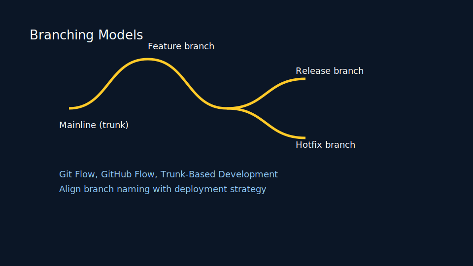
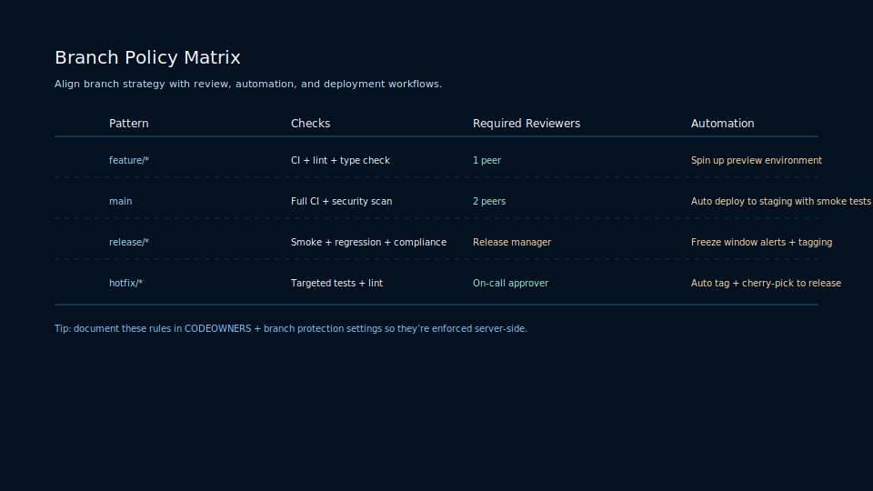
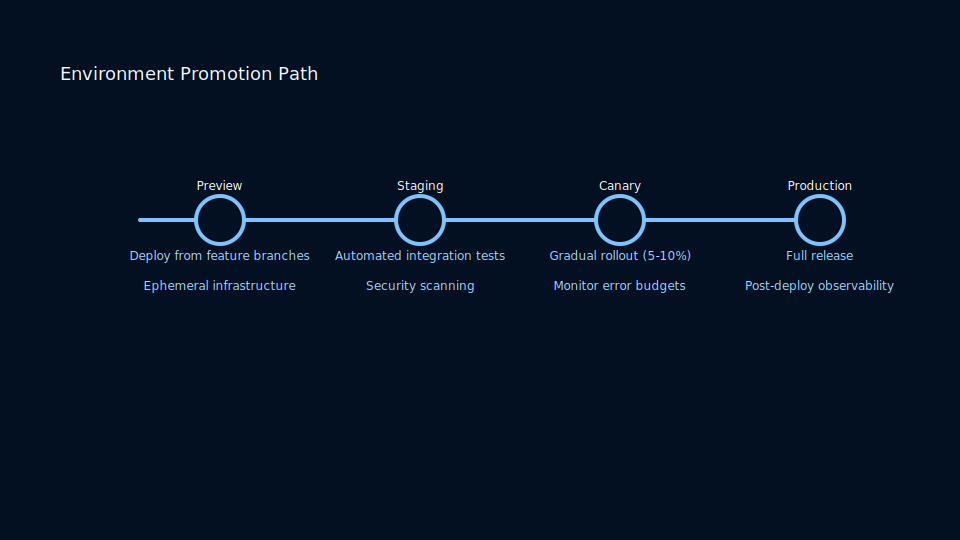

# Lesson 3.1: Feature Branching, Trunk-Based, and Gitflow

## Selecting a Branching Model

Branching policies shape collaboration velocity. Choose pragmatically:



## Decision Matrix

<!-- markdownlint-disable MD033 MD010 -->
<table>
    <thead>
        <tr>
            <th>Criteria</th>
            <th>Feature Branching</th>
            <th>Trunk-Based</th>
            <th>Gitflow</th>
        </tr>
    </thead>
    <tbody>
        <tr>
            <td>Deployment Frequency</td>
            <td>Moderate</td>
            <td>Rapid</td>
            <td>Scheduled</td>
        </tr>
        <tr>
            <td>Review Model</td>
            <td>Pull Requests</td>
            <td>Pairing, CI gates</td>
            <td>Pull Requests</td>
        </tr>
        <tr>
            <td>Rollback Simplicity</td>
            <td>Medium</td>
            <td>High</td>
            <td>Medium</td>
        </tr>
        <tr>
            <td>Complexity</td>
            <td>Low</td>
            <td>Low</td>
            <td>High</td>
        </tr>
    </tbody>
</table>
<!-- markdownlint-enable MD033 MD010 -->

### Branch Policy Matrix



Codify branch rules to maintain momentum:

- Require status checks and reviews before merging into protected branches.
- Use automation to delete merged branches and encourage short-lived work.
- Gate release branches with deployment smoke tests and service-level objectives.

### Environment Promotion Path



Map code promotion to infrastructure:

- Feature branches deploy to ephemeral preview environments.
- Mainline merges trigger staging deployments with synthetic monitoring.
- Release branches promote to production via progressive delivery (canary or blue/green).

## Aligning with CI/CD

Frequent integration requires automated testing. Combine branch protection rules with status checks to enforce quality.

### Practice

- Map your team’s release cadence against these models.
- Configure branch protection rules and required reviews in a hosting provider.
- Simulate trunk-based development with a 24-hour integration window.

---

## Extended Reference: Branching Strategies that Scale Teams and Releases

## Learning Objectives

- Compare feature branching, trunk-based development, Gitflow, and hybrid models across velocity, risk, and compliance dimensions.
- Design governance guardrails that keep branches healthy without throttling creativity.
- Automate promotion pipelines that translate branch intent into deployment confidence.
- Instrument collaboration metrics to validate the branching strategy empirically.
- Coach teams through migration plans when their current branching workflow no longer fits.

## Why Branching Matters

Branching is the surface area where culture, automation, and architecture collide. A well-designed branching strategy keeps feedback tight, merges boredom-free, and releases boring. A poor strategy breeds zombie branches, weekend merges, and compliance nightmares. This extended guide exposes the knobs you can tune before choosing a model by instinct.

## Foundational Vocabulary

- **Mainline**: The primary branch that represents the deployable state. Call it `main`, `master`, or `trunk`, but ensure the whole program agrees.
- **Integration branch**: A temporary branch that aggregates work prior to release. Gitflow uses `develop`; release trains might name them after a calendar window.
- **Short-lived branch**: A branch whose life is measured in hours or days. Powering preview environments and continuous integration, they demand automation.
- **Long-lived branch**: A branch lasting weeks or months. Use sparingly because rebasing and security updates become manual toil.
- **Release branch**: A branch representing a release candidate. Quality gates, production-like testing, and backports converge here.
- **Hotfix branch**: A branch that bypasses normal intake to patch production. Governance must keep it rare and auditable.

## Branching Model Overview

Branching fashion cycles every few years. Rather than chasing trends, evaluate what each model optimizes. Consider the trade-offs between speed, safety, and developer autonomy.

<!-- markdownlint-disable MD033 MD010 -->
<table>
    <thead>
        <tr>
            <th>Model</th>
            <th>Primary Goal</th>
            <th>Branch Lifespan</th>
            <th>Merge Frequency</th>
            <th>Ideal Team Size</th>
        </tr>
    </thead>
    <tbody>
        <tr>
            <td>Feature Branching</td>
            <td>Isolate work for async review</td>
            <td>Days to weeks</td>
            <td>When feature completes</td>
            <td>3 to 60 engineers</td>
        </tr>
        <tr>
            <td>Trunk-Based</td>
            <td>Optimize flow efficiency</td>
            <td>Hours</td>
            <td>Multiple times per day</td>
            <td>2 to 250 engineers</td>
        </tr>
        <tr>
            <td>Gitflow</td>
            <td>Formalize release trains</td>
            <td>Weeks</td>
            <td>Scheduled integrations</td>
            <td>Teams with strict compliance windows</td>
        </tr>
        <tr>
            <td>Release Train</td>
            <td>Synchronize shared services</td>
            <td>Weeks</td>
            <td>Time-boxed</td>
            <td>Programs with multiple sub-teams</td>
        </tr>
        <tr>
            <td>Environment Branching</td>
            <td>Mirror deployment tiers</td>
            <td>Months</td>
            <td>As promotion occurs</td>
            <td>Legacy or regulated stacks</td>
        </tr>
    </tbody>
</table>
<!-- markdownlint-enable MD033 MD010 -->

## Feature Branching Deep Dive

Feature branching remains the default mental model because Git hosting platforms power the experience.

### Workflow Narrative

1. Create a branch from `main` or a release branch using `git checkout -b feature/profile-search`.
2. Push early and often so CI, linting, and security hooks weave into your iteration.
3. Draft a pull request even if the work is experimental. Visibility trumps secrecy.
4. Request review from code owners configured in `CODEOWNERS`.
5. Keep rebasing or merging from the base branch to minimize merge debt.
6. When tests pass and review completes, squash merge to keep history focused.
7. Delete the branch locally, relying on `git worktree` if you still need context to triage regressions.

### Advantages

- Async review thrives because diffs stay scoped to a single concern.
- Feature toggles decouple merge readiness from release readiness.
- Preview environments give stakeholders something tangible to review.

### Boundaries

- Large features risk branch drift. Invest in incremental slices or scaffolding branches.
- Merge queues can become bottlenecks if every change must be sequentially rebased.
- Compliance programs might need additional artifact storage for review evidence.

### Automation Checklist

- Configure CI to run on every push using a fast, parallelizable pipeline.
- Enforce status checks on the pull request to block merges when tests fail.
- Automatically close Jira or Linear issues when the pull request merges.
- Use bots to label pull requests that go stale for more than 48 hours.

### Example Branch Configuration Script

```bash
#!/usr/bin/env bash
set -euo pipefail

main_branch="main"
feature_branch="$1"

git fetch origin "${main_branch}"
git checkout -b "${feature_branch}" "origin/${main_branch}"

git config branch."${feature_branch}".description "Feature work for ${feature_branch}"

echo "Created ${feature_branch} from ${main_branch}. Push soon to share progress."
```

## Trunk-Based Development Deep Dive

Trunk-based development (TBD) demands discipline but rewards teams with near real-time feedback.

### Core Practices

- Developers commit directly to `main` (or to branches that live less than a day).
- Feature toggles and branch-by-abstraction shield incomplete features from users.
- Pairing or mobbing complements commit frequency to maintain shared context.
- A merge queue or build cop shepherd keeps the trunk green.

### CI Pipeline Expectations

- Pipeline duration under 10 minutes keeps developers in flow.
- Each commit triggers unit tests, integration tests, security scans, and packaging.
- Failed pipelines auto-revert the offending change or page the on-call developer.
- Deployment automation promotes successful builds to staging immediately.

### Handling Long-Running Work

- Use `git stash` and `git worktree` to juggle experiments without creating long-lived branches.
- Break features into releasable waypoints guarded by feature flags.
- Document toggles in a registry with owners and rollback plans.

### TBD Guardrails

- Require two reviewers even if the branch lifetime is measured in hours.
- Protect `main` with branch policies that reject force pushes.
- Archive nightly snapshots to aid forensics if the trunk breaks.

### Example Merge Queue Policy

```yaml
merge_queue:
  required_status_checks:
    - unit-tests
    - integration-tests
    - security-scan
  max_in_flight: 2
  failure_policy: cancel_all
  auto_rebase: true
```

## Gitflow Deep Dive

Gitflow shines when releases are ceremonial, QA cycles are formal, and hotfix channels must stay pristine.

### Branch Taxonomy

- `main`: production-ready history containing signed tags.
- `develop`: integration branch where most features land before release.
- `feature/*`: scoped work branches cut from `develop`.
- `release/*`: stabilization branches cut from `develop` as a pre-release staging area.
- `hotfix/*`: urgent patches derived from `main`.

### Lifecycle Narrative

1. Start feature development from `develop`.
2. Merge features into `develop` as they complete; keep tests green.
3. When the release window opens, branch `release/2025.10` from `develop`.
4. Apply only critical bug fixes or release documentation to the release branch.
5. Tag `v2025.10.0` from the release branch when QA signs off.
6. Merge the release branch into both `main` and `develop` to avoid drift.
7. Cut hotfix branches from `main`, patch, and merge back into `main` and `develop`.

### Governance Considerations

- Document clearly who may cut release branches and tags.
- Require change approval boards or risk reviews before merging hotfixes.
- Automate cherry-picks from hotfixes into `develop` to keep features aligned.

### Gitflow Checklist

- Maintain a release calendar and socialize freeze dates.
- Mirror release branches to disaster recovery environments.
- Standardize branch naming with linting (for example, block spaces or uppercase).
- Track capacity so QA and release engineers have adequate staffing.

## Governance Playbook

Branching policies should be explicit and version controlled.

### Policy Pillars

1. **Visibility**: Every branch ties back to a work item, OKR, or incident.
2. **Quality**: Tests, security scans, and linting must run before integration.
3. **Recoverability**: Reverts, rollbacks, and hotfixes follow rehearsed runbooks.
4. **Compliance**: Approvals, segregation of duties, and evidence capture are auditable.
5. **Education**: New hires go through hands-on labs replicating the branching flow.

### Sample Policy Excerpt

```text
Protected branches: main, release/*
Required approvals: 2 (one code owner, one peer)
Required checks: unit-tests, integration-tests, security
Status check timeout: 20 minutes
Branch naming: ^(feature|bugfix|chore|hotfix)\/[a-z0-9\-]+$
```

### Communication Templates

- Weekly update summarizing active release branches and expected cutover dates.
- Merge freeze announcements that include exceptions, contacts, and rollback steps.
- Post-incident reviews documenting how branching helped or hindered recovery.

## Automation Patterns

### Git Hooks and Bots

- **Pre-push hooks** ensure tests run locally before saturating CI.
- **Danger or Reviewdog** annotate pull requests with lint findings.
- **Merge bots** coordinate queueing, auto-merge, and label enforcement.
- **Stale bots** encourage closing or archiving dormant branches.

### Infrastructure as Code Alignment

- Use Terraform or Pulumi stacks named after branches to spawn preview environments.
- Destroy environments when branches merge to manage cost.
- Tag cloud resources with branch metadata for billing and traceability.

### Deployment Automation Example

```yaml
name: deploy-preview

on:
  pull_request:
    types: [opened, synchronize, reopened]

jobs:
  preview:
    runs-on: ubuntu-latest
    steps:
      - uses: actions/checkout@v4
      - name: Build image
        run: |
          docker build -t registry.example.com/app:${{ github.head_ref }} .
      - name: Deploy to preview
        run: |
          helm upgrade --install pr-${{ github.head_ref }} charts/app \
            --set image.tag=${{ github.head_ref }} \
            --set ingress.host=preview-${{ github.head_ref }}.example.com
      - name: Comment URL
        uses: actions/github-script@v7
        with:
          script: |
            const url = `https://preview-${context.payload.pull_request.head.ref}.example.com`;
            github.rest.issues.createComment({
              ...context.repo,
              issue_number: context.issue.number,
              body: `Preview environment is ready: ${url}`
            });
```

## Metrics and Observability

Measure reality rather than relying on anecdotes.

### Core Metrics

- **Lead Time for Changes**: Track from first commit on a branch to deployment.
- **Deployment Frequency**: Evaluate whether the chosen model supports desired throughput.
- **Change Failure Rate**: Identify whether branch isolation correlates with reliability.
- **Mean Time to Restore**: Especially for hotfix flows.
- **Branch Lifespan Distribution**: Visualize how long branches survive.

### Instrumentation Ideas

- Export Git event streams to warehouse tables for analysis.
- Use backstops to flag branches older than 14 days.
- Visualize merge activity via Grafana dashboards.

### Scorecard Template

```text
Branching Strategy Health Scorecard
-----------------------------------
Week of: 2025-10-04

Metric                      Target     Actual     Trend
-------------------------   --------   --------   -----
Lead Time (p95)             < 48 h     36 h       improving
Branch Age (p90)            < 4 days   3.2 days   stable
Deployment Frequency        > 5/day    6.4/day    improving
Hotfix Duration (median)    < 60 min   48 min     improving
Revert Count                < 2/week   3/week     regressing
```

## Scaling Strategies

### Monorepos

- Enforce ownership boundaries via CODEOWNERS and path-based review rules.
- Use composite builds or Bazel to avoid re-running entire test suites per branch.
- Tag commits with scopes so release tools know which packages changed.

### Polyrepos and Microservices

- Standardize branch naming across repositories so automation scales.
- Use trunk-based development with service-specific feature flags.
- Implement cross-repo change pipelines that coordinate dependent merges.

### Open Source Projects

- Fork-based workflows mimic feature branching but add extra remotes.
- Issue templates remind contributors to sync with upstream `main` before merging.
- Maintain labels like `good first issue` and `needs rebase` to triage community contributions.

## Collaboration Practices

- Run weekly branch reviews to prune stale work and highlight blockers.
- Encourage developers to keep a branch journal summarizing what changed.
- Pair code reviews with working sessions to resolve complex conflicts quickly.
- Host brown-bag sessions on advanced Git tooling such as bisect, rerere, and worktree.

## Security and Compliance Hooks

- Integrate secret scanning that runs on every branch push.
- Store pull request discussions and approvals in an immutable log for audit.
- Tie branches to change management tickets using commit trailers.
- Implement mandatory signing (`git config commit.gpgsign true`) on protected branches.

## Migration Playbooks

### From Long-Lived Branches to Feature Branching

1. Catalog active branches and their owners.
2. Define a freeze period where new long-lived branches are prohibited.
3. Provide training on pull request etiquette and feature toggles.
4. Migrate automation to support preview environments.
5. Celebrate the first few merges to build confidence.

### From Gitflow to Trunk-Based

1. Start by reducing release branch duration while keeping cadence.
2. Introduce feature flags and progressive delivery to de-risk merges.
3. Gradually shrink develop branch responsibilities until redundant.
4. Revisit compliance documentation to align with the new process.
5. Measure improvements in lead time and highlight wins to leadership.

## Case Studies

### SaaS Product Pivoting to Weekly Releases

- Started with Gitflow to coordinate marketing launches.
- Bottlenecks emerged as hotfixes required dual merges.
- Transitioned to release trains with a merge queue.
- Observed a 40% reduction in release incident duration.

### Bank Modernizing Legacy Core

- Environment branching mirrored dev/test/uat/prod with manual promotion.
- Introduced trunk-based development for low-risk microservices.
- Maintained release branches for core banking modules pending regulatory review.
- Result: faster digital features without compromising compliance.

## Hands-On Labs

### Lab 1: Designing a Branching Charter

1. Interview three stakeholders about current bottlenecks.
2. Draft objectives and key results that the branching model should improve.
3. Build a decision matrix and present it in a brown-bag session.
4. Capture feedback and iterate on the charter document.

### Lab 2: Automating Branch Policy Enforcement

1. Implement branch naming checks using a continuous integration job.
2. Add Danger rules that fail pull requests without linked work items.
3. Configure a merge queue and observe behavior during peak hours.
4. Document lessons learned and update runbooks accordingly.

### Lab 3: Conflict Resolution War Game

1. Simulate a release freeze with three concurrent feature branches.
2. Practice rebasing, resolving conflicts, and using `git rerere`.
3. Record the time required to integrate each branch.
4. Compare outcomes between feature branching and trunk-based flows.

### Lab 4: Observability Drill

1. Export branch metrics into a spreadsheet or BI tool.
2. Build charts for branch age, merge frequency, and revert rate.
3. Identify outlier branches and schedule a clean-up day.
4. Share insights during an engineering all-hands meeting.

## Frequently Asked Questions

**Q: Do we need a merge queue for feature branching?**
A: A queue becomes vital once concurrency increases. It avoids race conditions between approvals and ensures the base branch remains green.

**Q: How do feature flags interact with branching?**
A: Flags let you merge partially complete work safely. Maintain a flag lifecycle policy so toggles do not accumulate forever.

**Q: Is Gitflow obsolete?**
A: No. It fits industries with heavy regulation or long QA cycles. The key is to automate the painful bits and keep documentation current.

**Q: Can we mix trunk-based for backend and feature branching for frontend?**
A: Yes. Optimize each domain separately as long as integration points are clearly owned and tested.

**Q: How do we sunset stale branches safely?**
A: Use tooling to notify owners, archive forensic branches, and delete after a grace period. Communicate and document the policy.

## Reflection Prompts

- Which branches in your repository exceed their intended lifespan? Why?
- What is the slowest part of your integration cycle, and does your branching model amplify it?
- How effectively does your team communicate release readiness across branches?
- Which metrics can you instrument this week to validate assumptions?
- How will you coach new hires through your branching philosophy?

## Summary

Branching strategies provide structure for collaboration, but they are not destiny. Pair automation, culture, and governance to bend any model toward flow efficiency and auditability. Revisit your branching charter as team size, product complexity, and regulatory demands evolve.

## Practice Checklist

- [ ] Map your current branching workflow and identify bottlenecks.
- [ ] Select two metrics to monitor weekly and build dashboards.
- [ ] Pilot a merge queue or improved feature flag practice.
- [ ] Update documentation and onboarding materials to reflect the branching charter.
- [ ] Schedule a retrospective after the next release cycle to reassess fit.

## Hybrid and Contextual Models

Most teams blend patterns. Use these heuristics to tailor a branching profile that matches your stack.

### Release Train with Trunk Features

- Developers work off short-lived branches against `main`.
- Every two weeks, snapshot `main` into `release/train-yyww`.
- QA hardens the release branch while trunk keeps serving new work.
- Regression fixes merge into both trunk and the active train to avoid divergence.

### Environment Branches

- `dev`, `test`, `staging`, and `production` branches align with deployment tiers.
- Promotion occurs via fast-forward merges from lower to higher environments.
- Guardrails ensure changes flow upward; downward merges only for hotfix rollbacks.
- Works well when infrastructure constraints block ephemeral environments.

### Service Line Branching

- Platform teams maintain `platform/main` while product squads branch from service-specific trunks.
- Shared code merges back through pull requests with contract tests verifying compatibility.
- Tag integration milestones so you can bisect when regressions appear.

## Decision Matrices

Choosing a branching model is a socio-technical decision. Build a rubric with the relevant stakeholders.

<!-- markdownlint-disable MD033 MD010 -->
<table>
  <thead>
    <tr>
      <th>Dimension</th>
      <th>Question to Ask</th>
      <th>Signals to Gather</th>
      <th>Impact if Ignored</th>
    </tr>
  </thead>
  <tbody>
    <tr>
      <td>Release Cadence</td>
      <td>How often must we ship value?</td>
      <td>Lead time metrics, market commitments</td>
      <td>Missed deadlines, context switching</td>
    </tr>
    <tr>
      <td>Compliance</td>
      <td>Which controls apply to our commits?</td>
      <td>Sox, ISO, SOC 2 mapping, audit findings</td>
      <td>Audit failures, reactive process work</td>
    </tr>
    <tr>
      <td>Team Autonomy</td>
      <td>How independent are squads?</td>
      <td>Dependency maps, ownership docs</td>
      <td>Bottlenecked teams, stalled roadmaps</td>
    </tr>
    <tr>
      <td>Architecture</td>
      <td>How coupled is the codebase?</td>
      <td>ADR records, static/dynamic coupling metrics</td>
      <td>Merge hell, unpredictable releases</td>
    </tr>
    <tr>
      <td>Tooling Maturity</td>
      <td>Do we trust CI/CD automation?</td>
      <td>Flake rate, pipeline duration, rollback MTTR</td>
      <td>Manual gates, hero culture, burnout</td>
    </tr>
  </tbody>
</table>
<!-- markdownlint-enable MD033 MD010 -->

## Risk Landscape by Model

Quantify risk so the selection conversation stays grounded.

<!-- markdownlint-disable MD033 MD010 -->
<table>
  <thead>
    <tr>
      <th>Risk Category</th>
      <th>Feature Branching</th>
      <th>Trunk-Based</th>
      <th>Gitflow</th>
    </tr>
  </thead>
  <tbody>
    <tr>
      <td>Merge Conflicts</td>
      <td>Medium if branches linger</td>
      <td>Low due to rapid integration</td>
      <td>High when backporting between develop and main</td>
    </tr>
    <tr>
      <td>Production Rollback</td>
      <td>Fast with cherry-pick or revert</td>
      <td>Fast because history stays linear</td>
      <td>Slower because release branches diverge</td>
    </tr>
    <tr>
      <td>Audit Trail</td>
      <td>Strong when pull requests archived</td>
      <td>Requires complementary change management tooling</td>
      <td>Strong due to formal release artifacts</td>
    </tr>
    <tr>
      <td>Developer Onboarding</td>
      <td>Friendly with clear pull request workflow</td>
      <td>Challenging until automation and pairing culture mature</td>
      <td>Complex; needs good documentation and automation</td>
    </tr>
    <tr>
      <td>Hotfix Cadence</td>
      <td>Medium friction</td>
      <td>Low friction</td>
      <td>Requires careful dual merges</td>
    </tr>
  </tbody>
</table>
<!-- markdownlint-enable MD033 MD010 -->
