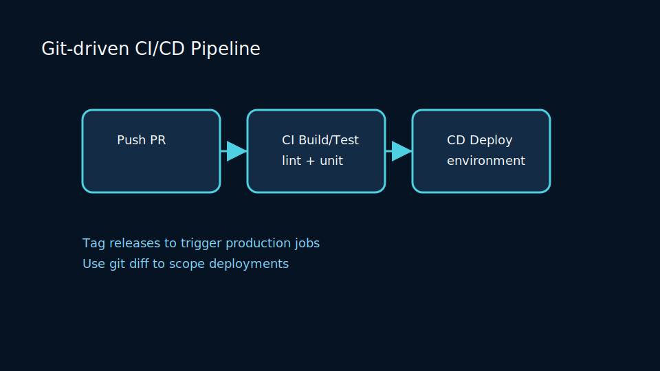
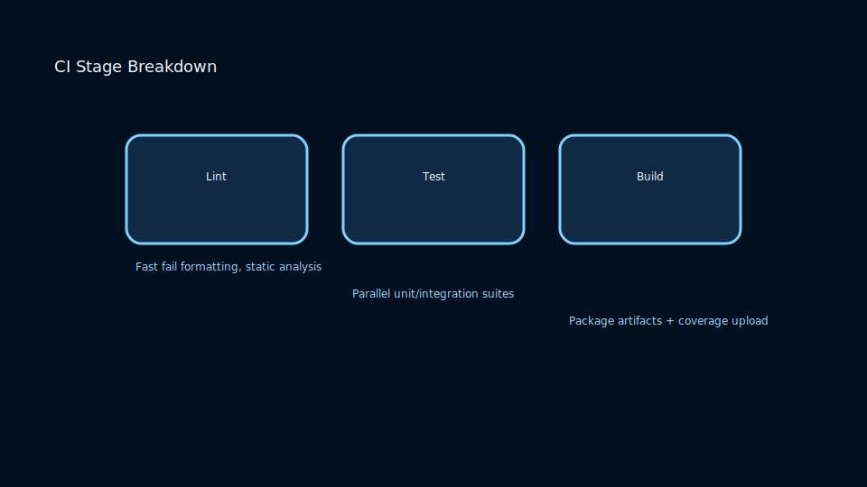
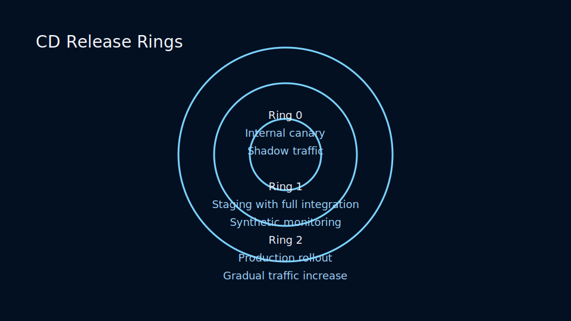

# Lesson 6.1: Automating Quality Gates with Git Hooks and CI

## Local Automation with Hooks

Git hooks trigger scripts at lifecycle events. Combine with linters, formatters, or security scanners to catch issues before pushing.



Common hooks:

- `pre-commit`: run linters, formatting, or unit tests.
- `pre-push`: run integration tests or block large binary pushes.
- `post-merge`: regenerate code or update dependencies automatically.

### Hook Vocabulary

- **Client-side hooks** run on developer machines and stop problematic commits before they leave laptops.
- **Server-side hooks** execute on the remote repository, ensuring every push meets compliance requirements.
- **Managed hook suites** install via package scripts (Husky, Lefthook) so new contributors have consistent tooling.
- **Telemetry-enabled hooks** log success and failure events to dashboards, exposing friction hot spots.

### Hook Implementation Patterns

1. Version-control hook scripts in a `/hooks` directory and bootstrap them during dependency installation.
2. Run independent checks in parallel (for example, lint plus unit tests) to maintain sub-five-second latency.
3. Cache lint results by hashing staged files; rerun only when contents change.
4. Provide a documented emergency bypass with audit logging to track when developers skip checks.

### Sample `pre-commit` Script

```bash
#!/usr/bin/env bash
set -euo pipefail

STAGED=$(git diff --cached --name-only --diff-filter=ACM | grep -E '\\.(js|ts|jsx|tsx)$' || true)

if [[ -z "${STAGED}" ]]; then
  echo "[hook] No JS/TS staged files detected. Skipping lint."
  exit 0
fi

echo "[hook] Running ESLint on staged files..."
yarn eslint ${STAGED}

echo "[hook] Running type checks..."
yarn tsc --noEmit

mkdir -p .git/hooks/logs
printf "%s\t%s\n" "$(date -Iseconds)" "lint-success" >> .git/hooks/logs/audit.log
```

### Hook Governance Table

<!-- markdownlint-disable MD033 MD010 -->
<table>
  <thead>
    <tr>
      <th>Hook</th>
      <th>Primary Goal</th>
      <th>Common Tools</th>
      <th>Failure Response</th>
    </tr>
  </thead>
  <tbody>
    <tr>
      <td>pre-commit</td>
      <td>Catch lint and formatting issues</td>
      <td>ESLint, Prettier, Black</td>
      <td>Abort commit with remediation tips</td>
    </tr>
    <tr>
      <td>commit-msg</td>
      <td>Enforce commit metadata</td>
      <td>Commitlint, custom regex validators</td>
      <td>Reject message and prompt rewrite</td>
    </tr>
    <tr>
      <td>pre-push</td>
      <td>Block unstable pushes</td>
      <td>pytest, Jest, integration shells</td>
      <td>Abort push; link to failing test logs</td>
    </tr>
    <tr>
      <td>post-merge</td>
      <td>Synchronize dependencies</td>
      <td>npm install, bundle install</td>
      <td>Warn developers with actionable next steps</td>
    </tr>
  </tbody>
</table>
<!-- markdownlint-enable MD033 MD010 -->

### CI Stage Breakdown



Structure pipelines into focused stages:

- Lint and test fast-moving codepaths first to catch failures early.
- Build artifacts and run integration suites in parallel to optimize runtimes.
- Publish coverage, SBOMs, and caches for downstream deploy workflows.

## Continuous Integration Pipelines

Connect Git to CI providers (GitHub Actions, GitLab CI, Jenkins, Azure DevOps) to automate builds and tests per push. Design pipelines as layered safety nets that balance speed with coverage.

### Pipeline Anatomy

1. Triggering events (push, pull request, schedule, manual).
2. Checkout and dependency hydration.
3. Static quality gates (lint, type check, code formatting).
4. Unit and component test suites.
5. Integration, contract, and end-to-end verifications.
6. Artifact packaging and security scanning.
7. Publication to registries and notifications.

### Polyglot Pipeline Example

```yaml
name: polyglot-ci

on:
  pull_request:
    branches: [main]
  push:
    branches: [main, release/*]

jobs:
  lint-and-test-js:
    runs-on: ubuntu-latest
    steps:
      - uses: actions/checkout@v4
      - uses: actions/setup-node@v4
        with:
          node-version: '22'
      - uses: actions/cache@v4
        with:
          path: ~/.npm
          key: npm-${{ hashFiles('package-lock.json') }}
      - run: npm ci
      - run: npm run lint
      - run: npm test -- --runInBand

  lint-and-test-python:
    runs-on: ubuntu-latest
    steps:
      - uses: actions/checkout@v4
      - uses: actions/setup-python@v5
        with:
          python-version: '3.12'
      - uses: actions/cache@v4
        with:
          path: ~/.cache/pip
          key: pip-${{ hashFiles('**/requirements*.txt') }}
      - run: pip install -r requirements.txt
      - run: ruff check .
      - run: pytest --maxfail=1 --disable-warnings

  build-container:
    needs: [lint-and-test-js, lint-and-test-python]
    runs-on: ubuntu-latest
    permissions:
      contents: read
      packages: write
    steps:
      - uses: actions/checkout@v4
      - name: Set up Buildx
        uses: docker/setup-buildx-action@v3
      - name: Build image
        uses: docker/build-push-action@v6
        with:
          context: .
          push: false
          tags: registry.example.com/app:${{ github.sha }}
      - name: Export SBOM
        run: syft registry.example.com/app:${{ github.sha }} -o json > sbom.json
      - name: Upload artifact
        uses: actions/upload-artifact@v4
        with:
          name: container-sbom
          path: sbom.json
```

### Optimization Checklist

- Cache dependencies and container layers to reduce rebuild time.
- Shard long-running tests across parallel executors with historical timing data.
- Skip irrelevant jobs for documentation-only changes.
- Track flake rate and quarantine unstable tests with clear ownership.

### Pipeline Governance Table

<!-- markdownlint-disable MD033 MD010 -->
<table>
    <thead>
        <tr>
            <th>Gate</th>
            <th>Owner</th>
            <th>Measurement</th>
            <th>Alert Threshold</th>
        </tr>
    </thead>
    <tbody>
        <tr>
            <td>Lint Duration</td>
            <td>Front-End Guild</td>
            <td>p95 under 90 seconds</td>
            <td>Alert if > 3 minutes</td>
        </tr>
        <tr>
            <td>Unit Test Flakes</td>
            <td>Quality Engineering</td>
            <td>< 0.5% reruns per week</td>
            <td>Alert if > 1.5%</td>
        </tr>
        <tr>
            <td>Integration Coverage</td>
            <td>Platform Team</td>
            <td>90% contract coverage</td>
            <td>Alert if < 85%</td>
        </tr>
        <tr>
            <td>Artifact Integrity</td>
            <td>Security</td>
            <td>Signed container digests</td>
            <td>Alert on unsigned artifacts</td>
        </tr>
    </tbody>
</table>
<!-- markdownlint-enable MD033 MD010 -->

## Gates and Policies

- **Status checks** ensure CI stays green before merges.
- **Approval matrices** mandate the right reviewers on protected branches.
- **Commit signing** keeps an immutable audit trail.
- **Secrets hygiene** blocks merges when scanners detect leaked credentials.
- **Change records** tie code changes to ticketing systems through commit trailers.

### Policy as Code Example

```yaml
policies:
  - id: required-checks
    description: CI must pass before merges
    type: status_checks
    targets:
      branches:
        - main
        - release/*
    requirements:
      checks:
        - name: polyglot-ci (lint-and-test-js)
        - name: polyglot-ci (lint-and-test-python)
        - name: polyglot-ci (build-container)
  - id: commit-signing
    description: Enforce signed commits on main
    type: gpg
    targets:
      branches: [main]
```

### Merge Queue Blueprint

- Serialize merges through an auto-rebasing queue capped at two active entries.
- Pause the queue automatically when a Sev1 incident triggers a freeze flag.
- Broadcast queue status to chat ops channels so engineers can plan deploy windows.

## Progressive Delivery Playbooks

Progressive delivery incrementally exposes changes to reduce risk.



### Canary Releases

1. Ship to a minimal slice of users (1–5%).
2. Monitor error rates, latency, and business KPIs for a defined soak period.
3. Promote automatically if metrics stay within thresholds.
4. Roll back instantly when leading indicators spike.

### Feature Flags

- Attach owners, expiry dates, and runbooks to every flag.
- Instrument flag impressions to measure impact and catch anomalies.
- Build kill switches that revert to safe defaults without redeploying.

### Blue/Green Deployments

- Maintain two production environments (blue and green).
- Deploy to the idle environment, run smoke tests, and route traffic via load balancer.
- Keep the previous environment available for immediate rollback.

### Ring-Based Rollout Table

<!-- markdownlint-disable MD033 MD010 -->
<table>
  <thead>
    <tr>
      <th>Ring</th>
      <th>Audience</th>
      <th>Entry Criteria</th>
      <th>Exit Criteria</th>
    </tr>
  </thead>
  <tbody>
    <tr>
      <td>0</td>
      <td>Developers and automated canaries</td>
      <td>CI green, security scan clean</td>
      <td>30 minutes stable metrics</td>
    </tr>
    <tr>
      <td>1</td>
      <td>Internal employees</td>
      <td>Ring 0 success</td>
      <td>24 hours zero Sev2 incidents</td>
    </tr>
    <tr>
      <td>2</td>
      <td>Regional production subset</td>
      <td>Ring 1 success</td>
      <td>Key KPIs within ±2%</td>
    </tr>
    <tr>
      <td>3</td>
      <td>Global production</td>
      <td>Ring 2 success</td>
      <td>Operational sign-off recorded</td>
    </tr>
  </tbody>
</table>
<!-- markdownlint-enable MD033 MD010 -->

### Progressive Delivery Guardrails

- Automate rollbacks with circuit breakers triggered by error budgets.
- Define communication plans for each ring transition.
- Tag telemetry with rollout ring labels for filtered dashboards.

## Observability for Pipelines

Treat CI/CD like production services with first-class telemetry.

### Key Signals

### Instrumentation Techniques

### Observability Dashboard YAML

```yaml
dashboard:
  title: "CI Health Overview"
  widgets:
    - type: timeseries
      title: "Workflow Duration (p95)"
      query: avg(last_1h):p95:ci.workflow.duration{pipeline:polyglot-ci}
    - type: heatmap
      title: "Failures by Job"
      query: count(last_24h):ci.job.failures{owner:*} by {owner, job}
    - type: toplist
      title: "Longest Queue Times"
      query: max(last_6h):ci.job.queue_time{branch:main}
```

### Alerting Playbook

1. Trigger alerts when pipeline failure rate exceeds 10% in 30 minutes.
2. Page on-call build engineer if queue latency crosses 15 minutes.
3. Auto-create incidents when security scans fail on `main` twice consecutively.
4. Suppress alerts during scheduled maintenance windows.

## Security and Compliance Automation

Security controls must run continuously across hooks and pipelines.

### Security Controls Checklist

- Run SAST (static analysis) on every push.
- Monitor dependencies with Software Composition Analysis (SCA).
- Execute secret scanning in hooks and CI jobs.
- Scan container images before promotion.
- Sign artifacts and verify signatures during deployment.

### Compliance Evidence Table

<!-- markdownlint-disable MD033 MD010 -->
<table>
    <thead>
        <tr>
            <th>Control</th>
            <th>Pipeline Stage</th>
            <th>Evidence Stored</th>
            <th>Owner</th>
        </tr>
    </thead>
    <tbody>
        <tr>
            <td>SAST</td>
            <td>Static analysis job</td>
            <td>SonarQube reports, code smells</td>
            <td>Security Engineering</td>
        </tr>
        <tr>
            <td>SCA</td>
            <td>Dependency check job</td>
            <td>OSV reports</td>
            <td>DevSecOps</td>
        </tr>
        <tr>
            <td>Secrets Scanning</td>
            <td>Hooks and CI</td>
            <td>Alert logs, remediation tickets</td>
            <td>SRE</td>
        </tr>
        <tr>
            <td>Approval Workflow</td>
            <td>Pre-deploy gate</td>
            <td>Change request IDs</td>
            <td>Release Management</td>
        </tr>
    </tbody>
</table>
<!-- markdownlint-enable MD033 MD010 -->

### Sample SCA Job

```yaml
sca:
  runs-on: ubuntu-latest
  steps:
    - uses: actions/checkout@v4
    - name: Install OSV-Scanner
      run: go install github.com/google/osv-scanner/cmd/osv-scanner@latest
    - name: Run OSV-Scanner
      run: |
        osv-scanner --lockfile=package-lock.json --lockfile=requirements.txt \
          --format=json > osv-report.json
    - name: Upload report
      uses: actions/upload-artifact@v4
      with:
        name: osv-report
        path: osv-report.json
```

## Disaster Recovery and Rollback

Practicing rollbacks ensures resilience when deployments misbehave.

### Rollback Strategies

- Automate rollbacks triggered by failing health checks.
- Version infrastructure configurations (Terraform, Pulumi) for reproducible environments.
- Preserve immutable artifacts per commit for quick redeploys.
- Pair schema migrations with backward-compatible toggles.

### Deployment Incident Runbook

```text
Deployment Incident Runbook
---------------------------
Train: 2025.10

1. Detect failure signal (alert ID, metric, log entry).
2. Freeze merge queue using `release-cli freeze`.
3. Trigger rollback job `deploy:rollback` referencing last known good artifact.
4. Validate restoration via smoke tests and synthetic monitors.
5. Communicate status to #release-ops and stakeholders.
6. Schedule post-incident review within 24 hours.
```

### Chaos Engineering for Pipelines

- Simulate runner outages to validate retry logic.
- Inject network latency to ensure caches and mirrors behave.
- Measure time-to-recover and feed results into CI SLOs.

## Case Studies

### SaaS Platform Scaling to Continuous Deployment

- Baseline: weekly releases with manual QA gates.
- Intervention: hook-managed linting, merge queue, feature flags.
- Outcome: eight deployments per day with a 35% reduction in incident duration.

### Financial Institution Under SOX Compliance

- Baseline: manual change tickets, high audit overhead.
- Intervention: policy-as-code approvals and evidence archiving.
- Outcome: audit preparation time decreased by 60%, release cadence doubled.

### Open Source Project Encouraging Contributions

- Baseline: inconsistent contributor tooling causing lint noise.
- Intervention: cross-platform hooks and clear CI instructions.
- Outcome: newcomer pull request acceptance rate increased by 25%.

## Hands-On Labs

### Lab 1: Build a Polyglot Hook Suite

1. Create language-specific hook runners for JS, Python, and Go files.
2. Write a bootstrap script that installs hooks via `npm run prepare`.
3. Track execution time and warn if latency exceeds two seconds.
4. Document the workflow in `docs/hooks.md` for onboarding.

### Lab 2: Author Policy as Code

1. Define required checks and approval rules in YAML.
2. Simulate a merge attempt without passing checks to observe rejection.
3. Add documentation referencing the policy file for future teams.

### Lab 3: Observability Deep Dive

1. Emit custom metrics using your CI provider's API.
2. Build a dashboard showing duration percentiles by job type.
3. Configure alerts for failure rate and queue time anomalies.

### Lab 4: Drill a Rollback

1. Deploy a deliberately faulty build to staging.
2. Trigger automated rollback playbooks and capture timeline metrics.
3. Identify missing signals and update runbooks.

## Frequently Asked Questions

**Q: How do hooks behave inside containerized development environments?**
A: Install hooks inside the container image or run them through wrapper scripts so every developer shares the same execution context.

**Q: Can hooks slow teams down?**
A: Yes, if misconfigured. Focus on caching, parallelization, and clear messaging to keep latency low.

**Q: How many CI jobs are too many?**
A: Monitor total feedback time. If pipelines exceed 10–12 minutes, invest in optimization and selective execution.

**Q: Do we still need manual QA when using progressive delivery?**
A: Manual testing shifts toward exploratory, high-risk scenarios while automation guards regressions.

## Practice Checklist

- [ ] Add Husky or Lefthook to run local hooks across languages.
- [ ] Ensure CI pipelines cover lint, unit, integration, and security scans.
- [ ] Document branch protection and policy-as-code requirements.
- [ ] Configure progressive rollout strategies with clear guardrails.
- [ ] Instrument pipeline observability dashboards and alerts.
- [ ] Rehearse rollback drills and keep runbooks current.
