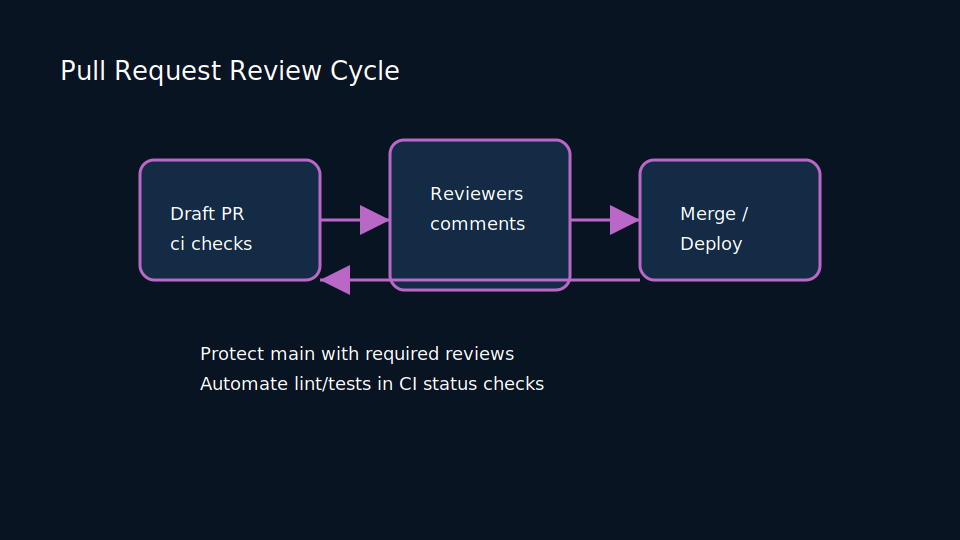
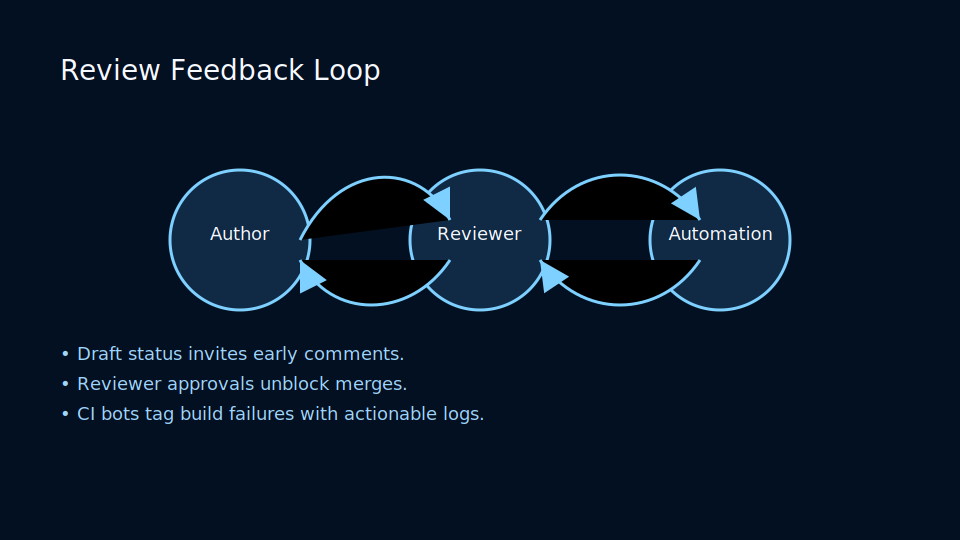
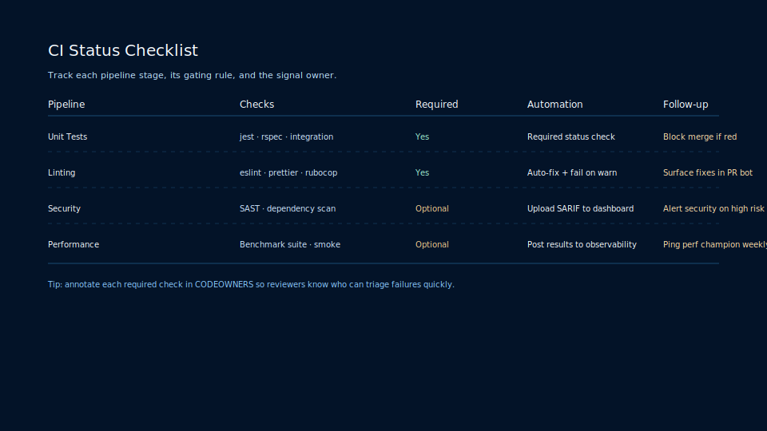

# Lesson 4.2: Pull Requests, Patches, and Collaborative Etiquette

## Learning Objectives

- Establish repeatable author and reviewer workflows that keep feedback timely and respectful.
- Design review automation that blends CI signals, bots, and ownership maps.
- Coach teams on constructive feedback, inclusive language, and accountability.
- Measure review health with data-informed metrics and dashboards.
- Integrate code review with security, compliance, and release engineering programs.

## Why Code Review Matters

Code review is more than a gatekeeper. It distributes architectural context, reinforces coding standards, and cultivates collective ownership. Effective review cultures reduce cycle time without sacrificing quality by aligning expectations across authors, reviewers, and stakeholders.

### Strategic Benefits

- **Risk mitigation**: Detect regressions, security issues, and design flaws before they ship.
- **Knowledge transfer**: Spread expertise beyond single maintainers and improve onboarding.
- **Process telemetry**: Expose bottlenecks and inspire tooling investments.
- **Culture building**: Reinforce psychological safety by rewarding learning and collaboration.

## Roles and Responsibilities

### Author Responsibilities

1. Scope work into reviewable slices (500 lines of change or less when possible).
2. Provide narrative context: problem statement, solution, validation steps, and rollback plan.
3. Tag relevant stakeholders (code owners, security champions, product owners).
4. Respond to feedback promptly and transparently, acknowledging outstanding action items.
5. Update documentation and tests that accompany the change.

### Reviewer Responsibilities

1. Evaluate correctness, maintainability, security, and performance impacts.
2. Ask clarifying questions without assuming intent; prefer curiosity over judgment.
3. Prioritize architectural risks over stylistic nits unless style impacts readability.
4. Block only when the issue would meaningfully harm users or team velocity.
5. Approve with confidence, providing positive reinforcement and summarizing what was great.

### Facilitator Responsibilities

- Maintain reviewer rotation schedules to balance load.
- Monitor SLAs for review response times and escalate blockers.
- Curate documentation, templates, and training for new contributors.

## Author Preparation Checklist

<!-- markdownlint-disable MD033 MD010 -->
<table>
    <thead>
        <tr>
            <th>Area</th>
            <th>Questions to Answer</th>
            <th>Evidence</th>
        </tr>
    </thead>
    <tbody>
        <tr>
            <td>Context</td>
            <td>Why is this change necessary? Which tickets or OKRs does it serve?</td>
            <td>Linked issues, design docs, ADR references</td>
        </tr>
        <tr>
            <td>Testing</td>
            <td>How was the change validated? Are there new or updated tests?</td>
            <td>Unit tests, integration tests, screenshots, metrics</td>
        </tr>
        <tr>
            <td>Risk</td>
            <td>What is the blast radius? How will we roll back if needed?</td>
            <td>Rollback commands, feature flags, migration strategy</td>
        </tr>
        <tr>
            <td>Dependencies</td>
            <td>Does the change affect other teams or services?</td>
            <td>Cross-team sign-offs, contract test results</td>
        </tr>
        <tr>
            <td>Documentation</td>
            <td>Did we update docs and runbooks?</td>
            <td>README diffs, runbook PRs, change logs</td>
        </tr>
    </tbody>
</table>
<!-- markdownlint-enable MD033 MD010 -->

## Preparing Reviewable Changes

- Break large efforts into orchestrated sequences of small pull requests.
- Provide high-level summaries plus inline context for complex sections.
- Attach visual aids (diagrams, screenshots) where the change impacts UI or architecture.
- Include before/after metrics when performance is affected.
- Stage refactors separately from feature behavior to simplify diffs.

## Review Channels Comparison

<!-- markdownlint-disable MD033 MD010 -->
<table>
    <thead>
        <tr>
            <th>Channel</th>
            <th>Use Case</th>
            <th>Strengths</th>
            <th>Limitations</th>
        </tr>
    </thead>
    <tbody>
        <tr>
            <td>Pull Requests</td>
            <td>Primary workflow for most hosted repositories</td>
            <td>Rich UI, inline comments, CI integration</td>
            <td>Can encourage large batches if not managed carefully</td>
        </tr>
        <tr>
            <td>Email Patches</td>
            <td>Kernel, embedded, or air-gapped environments</td>
            <td>Accessible via plain text, works offline, full history</td>
            <td>Less discoverable, requires discipline in threading</td>
        </tr>
        <tr>
            <td>Tool-based Async Review</td>
            <td>Large monorepos using Gerrit, Phabricator</td>
            <td>Powerful workflow automation, reviewer pools</td>
            <td>Steeper learning curve, needs custom tooling support</td>
        </tr>
        <tr>
            <td>Pair/Mob Review</td>
            <td>High-risk changes, onboarding, cross-team alignment</td>
            <td>Immediate feedback, shared context, teaching moments</td>
            <td>Requires synchronous time, may miss documentation trail</td>
        </tr>
    </tbody>
</table>
<!-- markdownlint-enable MD033 MD010 -->

## Review SLAs and Cadence

- **Small changes**: target first response within 4 business hours.
- **Medium changes**: respond within 1 business day; schedule synchronous walkthroughs when needed.
- **Large changes**: negotiate review plans in advance, including design reviews, pre-reads, and approved rollout windows.

### Managing Reviewer Load

- Rotate reviewers weekly using bot assignments to spread responsibility.
- Respect PTO calendars by maintaining coverage backups.
- Encourage reviewers to decline promptly if over capacity, suggesting alternates.

### Escalation Paths

- Use labels like `review-blocked`, `needs-product`, or `security-review` to signal escalation.
- Empower tech leads to facilitate decisions if discussions stall.
- Capture outcomes in ADR repositories or decision logs for traceability.

## Consuming Reviewer Feedback

- Acknowledge comments, even when you disagree; explain reasoning with evidence.
- Apply suggestions via commit patches to preserve authorship and expedite merges.
- Batch non-blocking feedback into follow-up tasks when the scope is substantial.
- Offer alternative solutions when direct requests conflict with design principles.

## Responding to Nits and Blocking Comments

- Label feedback as **blocking**, **optional**, or **suggestion**.
- Use GitHub comment templates or Gerrit labels to communicate severity.
- Encourage reviewers to provide reasoning and potential mitigation strategies.
- Keep the conversation asynchronous but schedule a synchronous call when resolution stalls.

## Review Feedback Loop

Accelerate reviews with explicit signals:

- Draft pull requests communicate work-in-progress while still enabling early feedback.
- Reviewer assignment, mention workflows, and ownership mapping keep load balanced.
- Reaction emojis, labels, and automation mark when changes are ready for final sign-off.

## Communication Patterns

### Inclusive Language

- Avoid sarcasm and personal critiques; focus on the code, not the coder.
- Use empathy statements: “Can you help me understand…”, “What do you think about…”.
- Normalize sharing positive feedback to celebrate expertise and growth.

### Negotiating Conflicts

1. Restate the concern to confirm understanding.
2. Identify constraints (performance requirements, release timelines, compliance).
3. Offer experiments (feature flags, dark launches) to validate assumptions.
4. Document the decision and notify stakeholders.

## Email Patch Review Workflows

`git format-patch` and `git send-email` remain popular in kernel and embedded communities.

```bash
git format-patch origin/main --cover-letter
git send-email --to maintainer@example.com 000*.patch
```

### Best Practices for Patch Series

- Keep patch subjects under 75 characters and include prefix tags (`[PATCH v2 1/4]`).
- Provide a cover letter summarizing motivation and testing.
- Reply inline to reviewer feedback using interleaved quoting.
- Maintain a change log between revisions (e.g., `v3 -> v4: addressed comments from Alice`).

### Managing Mailing List Reviews

<!-- markdownlint-disable MD033 MD010 -->
<table>
    <thead>
        <tr>
            <th>Step</th>
            <th>Owner</th>
            <th>Tooling</th>
        </tr>
    </thead>
    <tbody>
        <tr>
            <td>Prepare patches</td>
            <td>Author</td>
            <td>git format-patch, scripts/checkpatch.pl</td>
        </tr>
        <tr>
            <td>Send emails</td>
            <td>Author</td>
            <td>git send-email, mailing list aliases</td>
        </tr>
        <tr>
            <td>Review feedback</td>
            <td>Maintainers</td>
            <td>Email client with threading support</td>
        </tr>
        <tr>
            <td>Apply patches</td>
            <td>Maintainers</td>
            <td>git am, patchwork dashboards</td>
        </tr>
    </tbody>
</table>
<!-- markdownlint-enable MD033 MD010 -->

## Tooling and Automation

### Review CI Status Matrix

Use status checks to protect mainline quality:

- Required checks block merges until passing; optional checks provide advisory signals.
- Combine unit, integration, security, and linting pipelines for comprehensive coverage.
- Automatically rerun flaky jobs and surface failure context directly in the review UI.

### Bot Assistants

- **Labeling bots**: apply labels based on file paths, draft status, or reviewer workload.
- **Auto-merge bots**: merge once checks pass and approvals meet policy.
- **Reminder bots**: nudge reviewers after SLA breaches or highlight stale patches.
- **Changelog bots**: summarize change sets and prompt documentation updates.

### Suggestion Workflows

- Encourage reviewers to use inline code suggestions for minor tweaks.
- Adopt the “suggestion sandwich”: highlight what is good, suggest improvement, affirm collaboration.
- Leverage multi-line suggestions to refactor small blocks without new commits.

## Review Analytics and Metrics

### Core Metrics

- **Time to first review**: measures responsiveness and triage effectiveness.
- **Time to approval**: tracks cycle efficiency from submission to ready-to-merge.
- **Rework rate**: percentage of pull requests requiring multiple iterations.
- **Comment density**: comments per 100 lines changed, segmented by severity.
- **Bug escape rate**: number of post-merge defects per area of code.

### Building Dashboards

- Use data warehouses (BigQuery, Snowflake) to ingest Git events.
- Build Looker or PowerBI dashboards slicing by team, repository, and change type.
- Visualize queue depth, average review time, and pending approvals.
- Create weekly reports highlighting SLA breaches and celebrate responders hitting targets.

### Metrics Anti-Patterns

- Avoid weaponizing metrics; use them to discover systemic blockers, not assign blame.
- Contextualize numbers with qualitative feedback from retrospectives.
- Combine leading indicators (pending reviews) with lagging indicators (escaped defects).

## Security and Compliance Reviews

- Include security champions in review rotation for sensitive components.
- Require threat model updates when introducing new attack surfaces.
- Use commit trailers like `Security-Review: approved-by@example.com` for audit trails.
- Integrate static analysis, dependency scanning, and secret scanning into pre-merge checks.

### Privacy and Accessibility Considerations

- Confirm data handling changes comply with GDPR, CCPA, or regional policies.
- Evaluate logging diffs for potential PII leaks; scrub or redact as needed.
- Enforce accessibility testing (keyboard navigation, screen reader support) for UI changes.

## Review Playbooks by Change Type

### Refactor or Cleanup

- Ensure test coverage is equivalent before and after.
- Highlight unchanged behavior but improved structure.
- Use automated refactoring tools to minimize manual mistakes.

### Feature Development

- Provide acceptance criteria and user stories.
- Include feature flag strategy and rollback plan.
- Attach screenshots, videos, or demo links illustrating the user experience.

### Hotfix or Incident Response

- Prioritize speed while documenting root cause and mitigation steps.
- Secure approvals from on-call engineer and service owner.
- Schedule follow-up review to refactor or add permanent defenses.

## Pair and Mob Review Techniques

- Use shared coding sessions for high-risk or cross-functional changes.
- Rotate driver/navigator roles to distribute learning.
- Capture decisions in the pull request summary after the session.

## Async vs Sync Review Decision Guide

<!-- markdownlint-disable MD033 MD010 -->
<table>
    <thead>
        <tr>
            <th>Scenario</th>
            <th>Preferred Mode</th>
            <th>Rationale</th>
        </tr>
    </thead>
    <tbody>
        <tr>
            <td>Routine feature updates</td>
            <td>Asynchronous</td>
            <td>Leverages existing workflows and automation</td>
        </tr>
        <tr>
            <td>High-risk architectural change</td>
            <td>Synchronous walkthrough plus async follow-up</td>
            <td>Ensures shared understanding before approval</td>
        </tr>
        <tr>
            <td>Incident hotfix</td>
            <td>Pair review</td>
            <td>Accelerates validation while maintaining oversight</td>
        </tr>
        <tr>
            <td>Onboarding new teammate</td>
            <td>Mob review</td>
            <td>Pairs knowledge transfer with immediate feedback</td>
        </tr>
    </tbody>
</table>
<!-- markdownlint-enable MD033 MD010 -->

## Handling Large Pull Requests

1. Split into stacked pull requests or layered commits with clear commit messages.
2. Provide table-of-contents comments summarizing sections of the diff.
3. Record a five-minute walkthrough video to accelerate reviewer comprehension.
4. Invite domain experts for targeted sections rather than assigning everyone.

## Checklist for Reviewers

- [ ] Validate automated tests and CI results.
- [ ] Evaluate architectural alignment with system design.
- [ ] Confirm security, privacy, and accessibility considerations.
- [ ] Review documentation updates and changelog entries.
- [ ] Consider performance implications and resource usage.
- [ ] Ensure naming and structure maintain readability.

## Cognitive Load Management

- Limit review sessions to 60–90 minutes to avoid fatigue.
- Encourage reviewers to skim once, then dive deeper on second pass.
- Provide summary diffs (e.g., using Reviewable or Graphite) to cluster related changes.

## Review Etiquette Scenarios

### Scenario 1: Conflicting Opinions

A reviewer and author disagree on data structure choices.

- Encourage each party to present trade-offs with measurable criteria.
- If consensus is elusive, escalate to tech lead or architecture board.
- Document the final decision and rationale; update ADR repository.

### Scenario 2: Slow Feedback

A pull request waits multiple days with no responses.

- Use automation to ping reviewers after SLA thresholds.
- Invite additional reviewers or pair for a quick sync.
- Reflect in retro to adjust capacity planning or review rotations.

### Scenario 3: Low Signal Comments

Comments focus on personal style rather than correctness.

- Coach reviewers to connect suggestions to maintainability or guidelines.
- Link to style guides or explain repeated pain points.
- Use pair review to align on expectations and update documentation.

## Integrating Reviews with Release Trains

- Align branch policies with release calendars; freeze merges during release stabilization.
- Provide release managers with dashboards showing ready-to-merge pull requests.
- Create checklists verifying documentation, telemetry, and deployment readiness before tag creation.

## Documentation Patterns

- Include review templates in `.github/pull_request_template.md` or equivalently in other platforms.
- Maintain `CODEOWNERS` files to guide auto-assignment.
- Version onboarding guides with sample high-quality pull requests.

## Review Toolchain Ecosystem

- **GitHub**: Pull Requests, Code Owners, suggested changes, merge queues.
- **GitLab**: Merge requests, approval rules, merge trains.
- **Gerrit**: Patch sets, verified/Code-Review labels, submit rules.
- **Phabricator**: Differential revisions, Herald rules, lint and unit test integration.
- **Email-first**: Patchwork, lore.kernel.org, b4 tooling.

## Handling Non-Code Reviews

- Infrastructure as Code: evaluate plan outputs and drift detection reports.
- Documentation: check clarity, tone, and accessibility (reading grade level).
- Configuration changes: inspect feature flags, environment variable diffs, and secret handling.

## Dealing with Merge Conflicts During Review

- Use `git rerere` or `git merge --squash` to streamline conflict resolution.
- Encourage authors to rebase frequently, especially in high-churn areas.
- Communicate when conflicts require reviewer re-approval due to large structural changes.

## Review Debt and Cleanup Days

- Track pending reviews and schedule cleanup sprints to burn down backlog.
- Rotate "review captain" roles to coordinate efforts.
- Highlight success metrics after cleanup days to reinforce value.

## Mentoring Through Reviews

- Pair senior and junior developers intentionally for growth.
- Use reviews as teaching opportunities, providing links to resources or internal examples.
- Celebrate well-crafted reviews in demos or newsletters.

## Psychological Safety

- Establish team agreements emphasizing respect and patience.
- Offer private channels for sensitive feedback before posting publicly.
- Encourage vulnerability by thanking reviewers for catching issues early.

## Remote and Distributed Teams

- Provide clear timezone expectations and overlapping review windows.
- Use asynchronous video or Loom recordings for complex explanations.
- Schedule regular "review jams" where teams focus solely on clearing queues.

## Metrics Dashboard Example

```yaml
analytics_dashboard:
  dataset: git_reviews
  widgets:
    - type: line
      title: "Median Time to First Review"
      query: median(review_first_response_minutes)
    - type: stacked_bar
      title: "Review Outcomes"
      query: count(group by outcome)
    - type: table
      title: "Top Reviewers"
      columns:
        - reviewer
        - reviews_completed_last_7_days
        - average_response_minutes
```

## Review Retrospectives

- Conduct monthly retros to discuss what is working and what needs tuning.
- Bring data (metrics) and stories (qualitative feedback) to the session.
- Capture action items with owners and due dates.

## Continuous Improvement Experiments

- Trial shorter pull request size caps and observe review cadence impact.
- Experiment with auto-merge once two approvals and CI pass.
- Introduce review buddy systems for large refactors.

## Tooling Choices Decision Matrix

<!-- markdownlint-disable MD033 MD010 -->
<table>
    <thead>
        <tr>
            <th>Criteria</th>
            <th>GitHub</th>
            <th>GitLab</th>
            <th>Gerrit</th>
            <th>Phabricator</th>
        </tr>
    </thead>
    <tbody>
        <tr>
            <td>Ease of Onboarding</td>
            <td>High</td>
            <td>High</td>
            <td>Medium</td>
            <td>Medium</td>
        </tr>
        <tr>
            <td>Advanced Policy Controls</td>
            <td>Medium</td>
            <td>High</td>
            <td>High</td>
            <td>Medium</td>
        </tr>
        <tr>
            <td>Patch Set Workflow</td>
            <td>Medium</td>
            <td>High</td>
            <td>Very High</td>
            <td>High</td>
        </tr>
        <tr>
            <td>CI/CD Integration</td>
            <td>High</td>
            <td>High</td>
            <td>Medium</td>
            <td>Medium</td>
        </tr>
        <tr>
            <td>Extensibility</td>
            <td>High (apps/actions)</td>
            <td>Medium</td>
            <td>High (plugins)</td>
            <td>Medium</td>
        </tr>
    </tbody>
</table>
<!-- markdownlint-enable MD033 MD010 -->

## Advanced Topics

### Configurable Review Templates

- Use dynamic content based on file paths (e.g., backend vs frontend checklists).
- Include security prompts when secrets integrations change.
- Embed links to runbooks, observability dashboards, or threat models.

### AI Assistants in Review

- Summarize diffs to highlight suspicious sections.
- Draft responses proposing alternative implementations.
- Generate unit tests covering uncovered logic paths.
- Require human verification before applying AI-proposed changes.

### Accessibility in Code Review

- Provide accessible diff views for color-blind reviewers.
- Encourage alt text for images in documentation updates.
- Consider screen reader compatibility when reviewing web UI changes.

## Review Debt Reduction Playbook

1. Identify repositories with aging pull requests (>7 days).
2. Assign a tiger team to triage, merge, or close stale items.
3. Document root causes (capacity, unclear ownership, tooling gaps).
4. Invest in automation or training to prevent recurrence.

## Case Studies

### Distributed SaaS Team

- Implemented review buddy rotations and Slack reminders.
- Result: time to first review dropped from 18 hours to 5 hours.

### Hardware Firmware Organization

- Stayed with email patches but added Patchwork dashboards.
- Result: 30% reduction in lost feedback threads.

### Regulated FinTech Platform

- Added compliance checklists and auto-tagged security reviewers.
- Result: audit findings decreased while maintaining two-day lead time.

## Hands-On Labs

### Lab 1: Author Excellence

1. Use the author checklist to prepare a pull request on a sample repo.
2. Record a two-minute loom explaining the change context.
3. Collect reviewer feedback and synthesize action items.

### Lab 2: Reviewer Rotation Automation

1. Build a script or Action assigning reviewers based on CODEOWNERS.
2. Track review counts and expose a leaderboard dashboard.
3. Evaluate fairness and adjust algorithm parameters.

### Lab 3: Metric Instrumentation

1. Export review events to a data warehouse.
2. Create dashboards for time to first review and approval rate.
3. Present findings at engineering all-hands, proposing improvements.

### Lab 4: Conflict Resolution Roleplay

1. Simulate a disagreement on architecture choices.
2. Practice facilitation strategies and document resolutions.
3. Compare outcomes across asynchronous and synchronous negotiations.

## Frequently Asked Questions

**Q: How many reviewers should we require?**
A: Start with two (one code owner, one peer). Adjust based on risk profile and team size. Use data to confirm the policy supports flow efficiency.

**Q: Should we allow self-approval?**
A: Generally no, except for emergency hotfixes with follow-up retrospective. Encourage second pair of eyes to balance bias.

**Q: How do we prevent review burnout?**
A: Balance assignments, automate reminders, celebrate contributors, and dedicate focus time for deep work.

**Q: Is squashing commits mandatory?**
A: Choose based on repository history strategy. Squashing keeps history linear; preserving commits aids in bisecting. Document policy and apply consistently.

**Q: What about non-code artifacts like diagrams or notebooks?**
A: Treat them as first-class citizens. Review for clarity, version control hygiene, and reproducibility.

## Reflection Prompts

- Which review step slows your team down the most? Why?
- How inclusive is your review language, and what could improve it?
- Which automation would reduce manual toil for reviewers this quarter?
- How do you onboard new reviewers and communicate expectations?
- What metrics best illustrate review quality, not just speed?

## Practice Checklist

- [ ] Submit a pull request demonstrating the author preparation checklist.
- [ ] Review a teammate’s change and categorize feedback into blocking vs optional.
- [ ] Configure a bot to rotate reviewers based on CODEOWNERS.
- [ ] Instrument dashboards for review response time and queue depth.
- [ ] Facilitate a retrospective to refine your code review charter.

## Summary

Code review is a socio-technical system. Blend disciplined process, empathetic communication, automation, and metrics to deliver high-quality software while fostering trust. Iterate on your review charter as the team grows, technology evolves, and customer expectations rise.# Lesson 4.2: Pull Requests, Patches, and Collaborative Etiquette

## Code Review Channels

Distributed teams collaborate through pull requests, email patches, and code review platforms. Align on expectations for review scope, response time, and approval thresholds.



### Preparing a Reviewable Change

- Keep branches focused and small (1–3 logical commits).
- Include context in the pull request description (problem, solution, validation).
- Link to issue trackers or design docs.

### Consuming Feedback

- Address comments with follow-up commits rather than force pushes when history must remain stable.
- Use suggestions features to apply reviewer-provided patches quickly.
- Share status updates when delays occur to maintain trust.

### Feedback Loop



Accelerate reviews with explicit signals:

- Draft PRs communicate work-in-progress while still enabling early feedback.
- Reviewer assignment, mention workflows, and ownership mapping keep load balanced.
- Reaction emojis, labels, and automation mark when changes are ready for final sign-off.

## Email Patch Workflows

`git format-patch` and `git send-email` remain popular in kernel and embedded communities.

```bash
git format-patch origin/main --cover-letter
git send-email --to maintainer@example.com 000*.patch
```

### CI Status Matrix



Use status checks to protect mainline quality:

- Required checks block merges until passing; optional checks provide advisory signals.
- Combine unit, integration, security, and linting pipelines for comprehensive coverage.
- Automatically rerun flaky jobs and surface failure context directly in the review UI.

### Practice

- Submit a pull request and include CI status badges in the description.
- Review a teammate’s change focusing on architectural impact rather than nitpicks.
- Convert a pull request to an email patch series using `git format-patch`.
