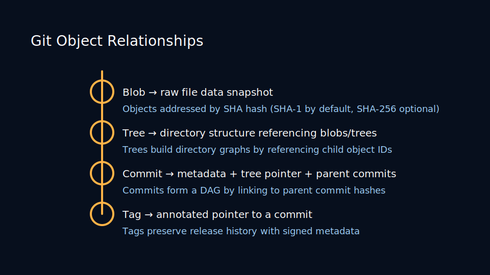
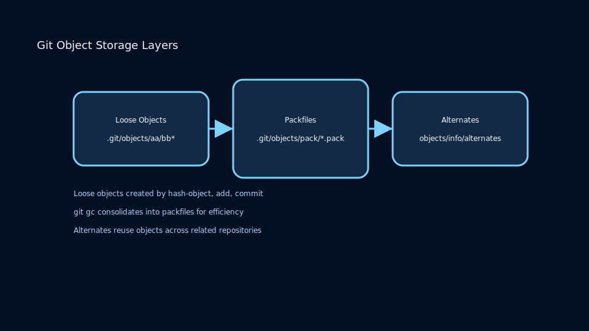
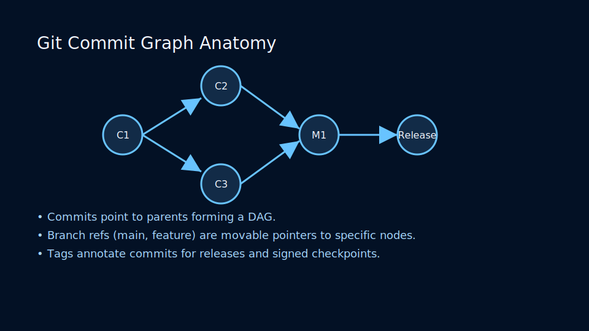

# Lesson 1.3: Snapshots, Objects, and the Three-Tree Architecture

## Git Objects Demystified

Git stores data as content-addressable objects. There are four types:

- **Blob** – file contents
- **Tree** – directory structure referencing blobs and other trees
- **Commit** – snapshot metadata pointing to a tree plus parents
- **Tag** – annotated names for commits or other objects



Each object is compressed and named by the SHA-1 (or SHA-256 when configured) of its content, ensuring deduplication and integrity.

### Object Storage Layers



Git stores objects as loose files before compacting them into packs:

- Loose objects reside under `.git/objects/aa/bb...` where `aa` is the first two hex digits.
- `git gc` consolidates loose objects into packfiles and generates a multi-pack index for large repos.
- Alternate object directories let monorepos share storage through `objects/info/alternates`.

### Commit Graph Anatomy



Commits form a directed acyclic graph:

- Parents point backward in time, enabling operations like `git log --graph` and `git merge-base`.
- Branch refs are movable pointers to specific commit IDs stored under `.git/refs/`.
- Reachability determines garbage-collection safety; orphaned commits eventually expire when reflogs age out.

## Exploring the Object Database

Use plumbing commands to inspect Git internals:

```bash
git hash-object README.md

# list loose objects
git cat-file -p <sha>
```

The `.git/objects` directory stores loose and packed objects. Packing optimizes storage by delta-compressing similar snapshots.

## The Three Trees Revisited

Git tracks three stages simultaneously:

1. **Head Tree** – `git show HEAD`
2. **Index Tree** – `git ls-files -s`
3. **Working Tree** – your filesystem

Commands move changes between these stages:

- `git add` copies from working tree → index
- `git commit` copies from index → new commit (head)
- `git checkout` copies from commit → working tree (and index)

## Visualizing States with Status

`git status` interprets diffs between HEAD, index, and working tree. Understanding its output ensures predictable commits.

### Hands-On

- Create a file, add content, and inspect the object store.
- Stage changes and use `git diff --staged` to preview commit snapshots.
- Inspect `.git/index` size as your repository grows.
