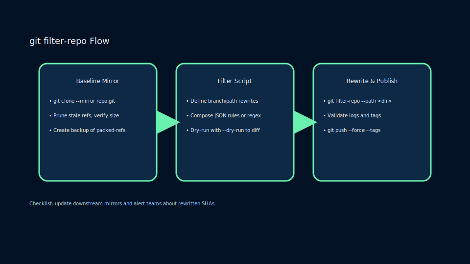
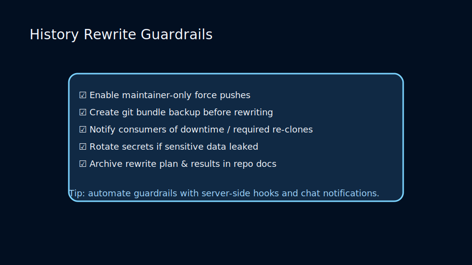
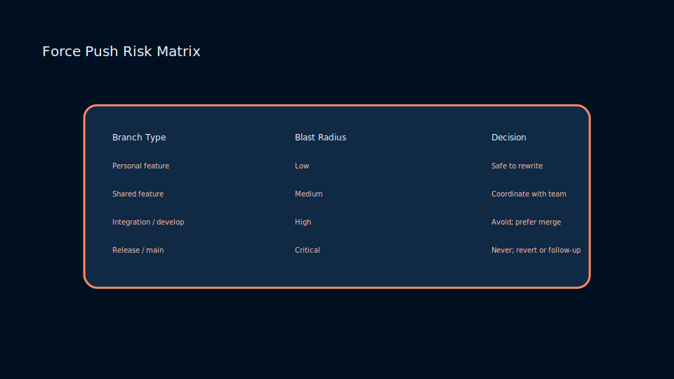

# Lesson 5.1: Rewriting History with Filter-Repo and Filter-Branch

## Why Rewrite History?

Removing sensitive data, restructuring repositories, or extracting components sometimes requires rewriting history. Git’s reflog and backups make it reversible when executed carefully.



## Tools of Choice

- `git filter-repo` (recommended) – performant, flexible, and actively maintained.
- `git filter-branch` – legacy tool; slower and more error-prone.
- `BFG Repo-Cleaner` – simplified interface for removing large files or secrets.

```bash
# Remove a directory from history
git filter-repo --path build/ --invert-paths
```

## Safety Checklist

1. Communicate with collaborators; force pushes impact everyone.
2. Backup by cloning or copying `.git` before rewriting.
3. Invalidate credentials if secrets were leaked.

### Guardrails for History Rewrites



Mitigate fallout by combining:

- Branch protection exceptions scoped to trusted maintainers.
- Bundles and offsite archives stored before destructive operations.
- Communication plans outlining impact, timelines, and rollback steps.

### Force Push Risk Matrix



Evaluate when a force push is acceptable:

- Low-risk personal branches can be rewritten freely.
- Shared integration branches require coordination and automated notifications.
- Release branches rarely accept rewrites; prefer follow-up commits and revert trees.

### Practice

- Use `git filter-repo` to remove a large binary from sample history.
- Rewrite author information across commits.
- Compare repository sizes before and after rewriting.
