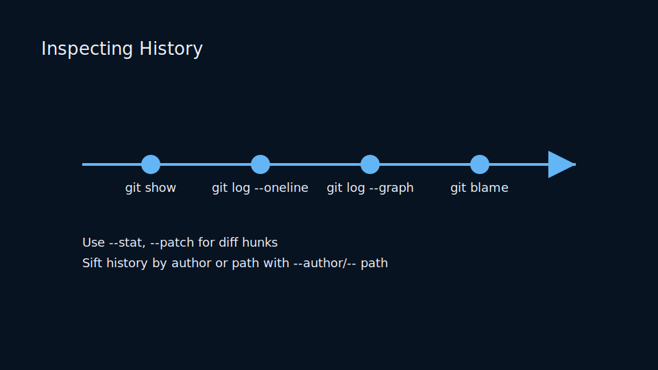
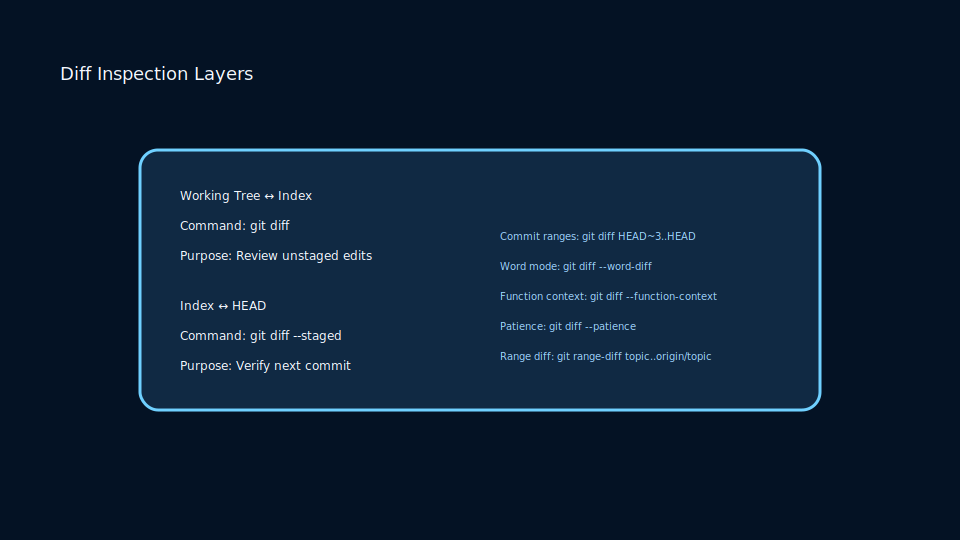
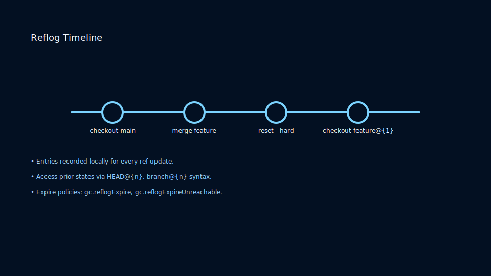

# Lesson 2.3: Exploring History with Log, Show, Diff, and Bisect

## Navigating History

`git log` is your window into project evolution. Customize views with pretty formats, graph visualizations, and filtering.

```bash
git log --oneline --graph --decorate --all
git log --author="Ada" --since="2 weeks"
```



Use `git show <commit>` to inspect individual snapshots, including diffs and metadata.

### Diff Inspection Layers



Select diff modes to answer specific questions:

- `git diff` compares working tree ↔ index; append `--staged` for index ↔ HEAD.
- `git diff HEAD~3..HEAD` surfaces multi-commit feature deltas before merge.
- Word (`--word-diff`) and function (`--function-context`) views highlight intent for reviewers.

## Understanding Diffs

`git diff` compares snapshots:

- Working tree ↔ index
- Index ↔ HEAD
- Commit ↔ commit

Colorization and word-level diffs enhance readability: `git diff --word-diff`.

## Binary Search with Bisect

When a regression sneaks in, `git bisect` narrows down the offending commit quickly:

```bash
git bisect start
git bisect bad HEAD
git bisect good v1.2.0
# run tests, mark commits as good/bad until culprit found
git bisect reset
```

Automate by providing a script to `git bisect run`.

### Reflog Timeline



Reflogs record every ref move locally:

- `git reflog` catalogs branch checkouts, merges, and resets for recovery.
- Entries expire after 90 days by default; tune via `gc.reflogExpire` settings.
- Recover shas with `git checkout HEAD@{n}` or `git branch rescue HEAD@{n}`.

### Practice

- Craft custom log aliases in your global config.
- Use `git range-diff` to compare patch series during reviews.
- Simulate a bug introduction and track it down with `git bisect`.
