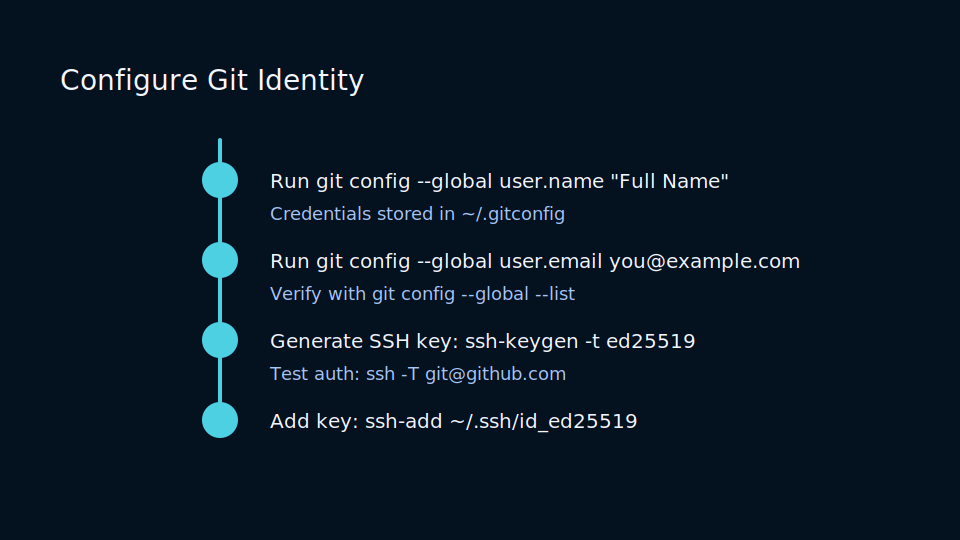
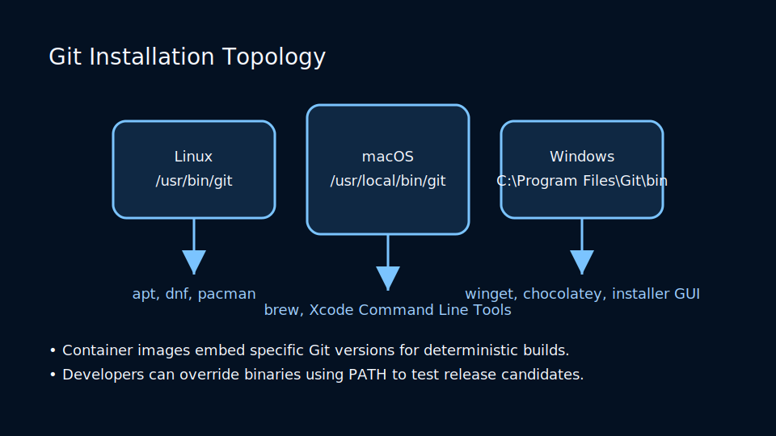
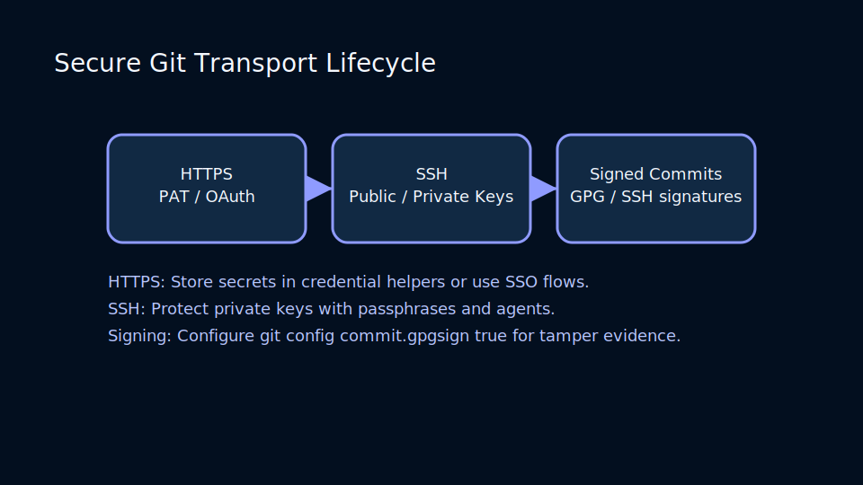

# Lesson 1.2: Installing Git and Establishing Identity

## Installation Checklist

Git ships for Linux, macOS, and Windows. Package managers keep versions fresh and reproducible:

- macOS: `brew install git`
- Ubuntu / Debian: `sudo apt install git`
- Windows: Use Git for Windows (includes Git Bash and credential helpers)



After installation, validate with `git --version` and inspect default configuration by running `git config --list --show-origin`.

### Installation Topology



Git binaries and settings surface across operating systems:

- Package managers (`apt`, `dnf`, `brew`, `winget`) install Git in system paths (`/usr/bin`, `/usr/local/bin`, or `C:\\Program Files\\Git`).
- Portable bundles for CI/CD runners pin versions and ship within Docker or VM images.
- Development containers rely on `devcontainer.json` provisioning to ensure shell integrations and editors use the same Git toolchain.

## Configuring Identity and Editors

Every commit records an author and committer. Configure them globally:

```bash
git config --global user.name "Ada Lovelace"
git config --global user.email "ada@example.com"
```

Editor and diff tools can be set per machine:

```bash
git config --global core.editor "code --wait"
git config --global diff.tool vscode
```

Use `git config --global -e` to open the global config file. Repository-specific overrides live in `.git/config`.

## Understanding Config Scopes

Git merges configuration from three scopes:

1. **System** (`/etc/gitconfig`): machine-wide defaults
2. **Global** (`~/.gitconfig`): user-level preferences
3. **Local** (`<repo>/.git/config`): project overrides

Priority flows from local → global → system. For sensitive credentials, use `git config --global credential.helper store` or integrate with the OS keychain.

### Secure Transport Lifecycle



Choose transports that match your organization’s security requirements:

- HTTPS provides ease of onboarding by leveraging PATs and OAuth credentials managed by `git-credential-manager`.
- SSH supports automation without passwords using `ssh-agent` forwarding and hardware-backed keys.
- Signing commits with GPG or SSH signatures enables “Verified” badges and defends against supply-chain spoofing.

## Credential Management

- HTTPS: Use credential helpers or personal access tokens.
- SSH: Generate keys with `ssh-keygen`, add to agents, and register with providers.
- Signing keys: `git config --global commit.gpgsign true` ensures tamper-evident history.

### Practice

- Configure an SSH key and test with `ssh -T git@github.com`.
- Set up credential caching and observe the difference when cloning over HTTPS.
- Review proxy and corporate network settings that may impact Git connectivity.
