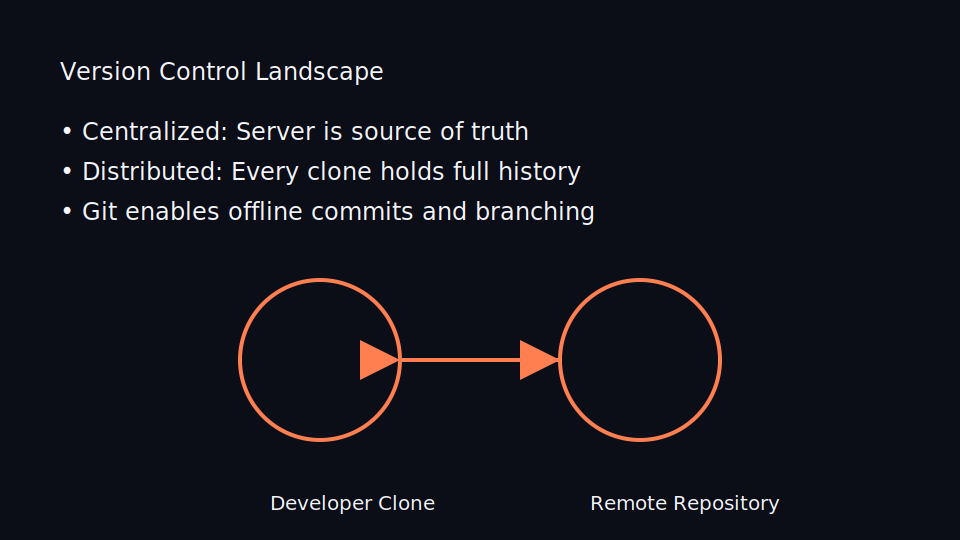
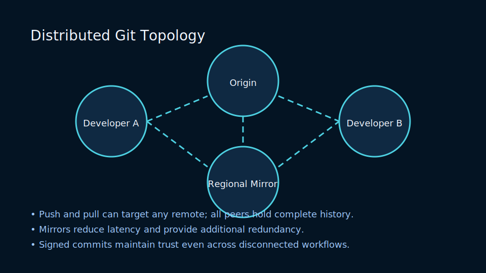
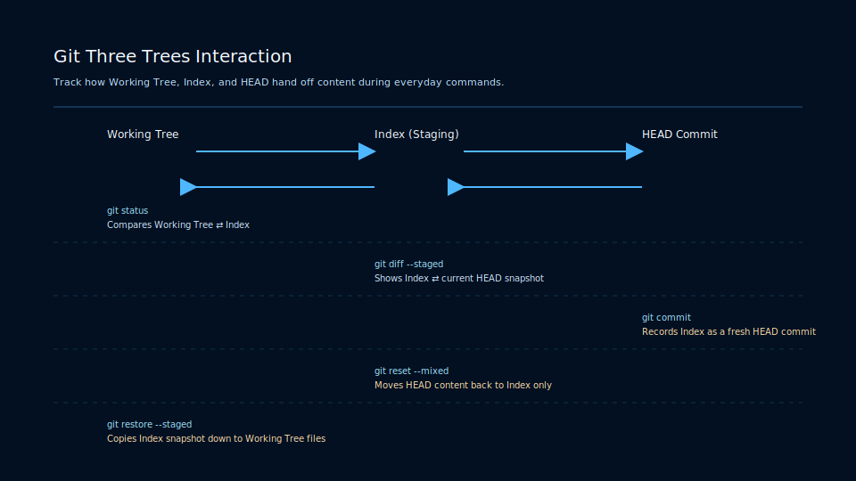

# Lesson 1.1: Git in the Software Delivery Lifecycle

## Why Version Control Matters

Git is a distributed version control system that captures the full evolution of your source code. Rather than managing files through a central server, Git empowers every developer to own a complete, cryptographically verifiable history. This enables offline development, fearless experimentation, and rapid disaster recovery.

Key takeaways:

- Distributed clones eliminate a single point of failure and allow high-velocity collaboration.
- Commits are immutable snapshots, making it easy to reason about when features shipped and how bugs emerged.
- Branching provides parallel universes of work that can later be reconciled through merges or rebases.

### Distributed Collaboration Topology

The Git network forms a mesh rather than a single hub, enabling:

- Multi-remote setups where teams sync with `origin`, `upstream`, and regional mirrors.
- Offline feature development followed by fast-forward synchronization on reconnect.
- Auditable histories because every participant retains the full commit graph.

### The Three Trees State Machine

Each command transfers changes between working tree, index, and HEAD:

- `git add` copies modified files into the index.
- `git commit` snapshots the index into a new commit referenced by HEAD.
- `git checkout` and `git restore` hydrate the working tree from specific commits or staged states.

## Comparing Centralized and Distributed Models

<!-- markdownlint-disable MD033 MD010 -->
<table>
	<thead>
		<tr>
			<th>Capability</th>
			<th>Centralized Systems</th>
			<th>Git</th>
		</tr>
	</thead>
	<tbody>
		<tr>
			<td>Offline Work</td>
			<td>Rarely supported</td>
			<td>Fully supported (entire history locally)</td>
		</tr>
		<tr>
			<td>Branching Model</td>
			<td>Expensive and often discouraged</td>
			<td>Lightweight and core to daily flow</td>
		</tr>
		<tr>
			<td>Integrity Guarantees</td>
			<td>Server-managed</td>
			<td>Cryptographically signed object IDs</td>
		</tr>
		<tr>
			<td>Collaboration</td>
			<td>File locking; optimistic merges</td>
			<td>Branches, pull requests, frequent sync</td>
		</tr>
	</tbody>
</table>
<!-- markdownlint-enable MD033 MD010 -->

### The Three Trees Constraint

Every Git operation interacts with three core trees:

1. **Working Tree** – the files on disk that you are actively editing.
2. **Index (Staging Area)** – a snapshot you are preparing for the next commit.
3. **HEAD Commit** – the most recent commit on the currently checked out branch.

Understanding how commands move changes between these states is foundational for effective Git usage.

## Exercises, Labs, and Practice

- Initialize a new repository and capture the first commit.
- Clone a public repository and inspect its commit graph locally.
- Identify scenarios in your current workflow where branching could reduce merge conflicts.

Next up: establishing your identity so teammates can trace authorship reliably.
