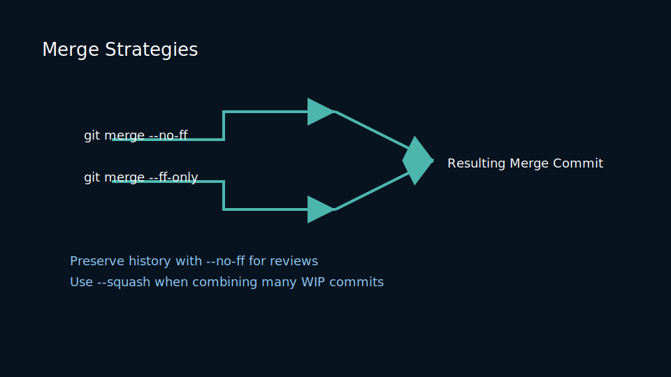
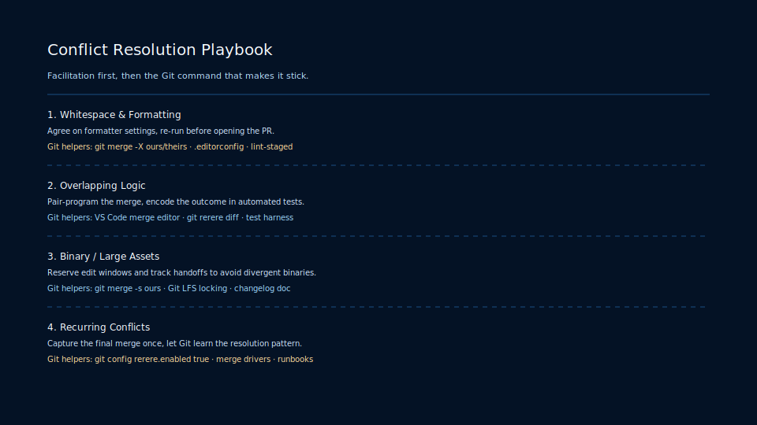
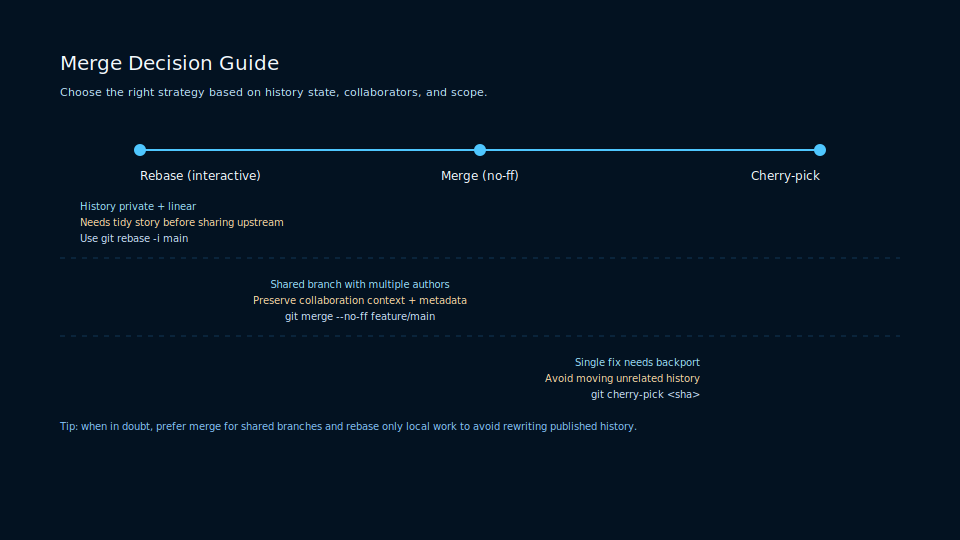

# Lesson 3.2: Fast-Forward, Three-Way Merges, and Conflict Strategy

## Merge Mechanics

Git merges create a new commit that ties divergent histories back together. There are two primary flavors:

- **Fast-Forward Merge** – no divergent commits; branch pointer simply advances.
- **Three-Way Merge** – merge commit records both parents and resolves combined changes.



## Conflict Resolution Workflow

1. Identify conflict markers in files (`<<<<<<<`, `=======`, `>>>>>>>`).
2. Use tooling (`git mergetool`, IDE diff tools) to resolve.
3. Stage resolved files and run verification tests.
4. Complete merge with `git commit` (or `git merge --continue`).

### Strategic Choices

- Prefer fast-forward merges for linear history when branch feature scope is small.
- Use merge commits when you need to preserve context or merge multiple feature branches.
- Enable `git config --global pull.rebase false` when merges are default, or `true` when you want rebase-first pulls.

### Conflict Resolution Matrix



Choose remediation tactics based on the scenario:

- Trivial whitespace conflicts resolve automatically via `git merge -X ours/theirs` options.
- Semantic conflicts benefit from running targeted unit tests before committing.
- Repeated conflicts can be automated with `git rerere` to cache resolutions.

### Merge Decision Tree



Decide between merge, rebase, or cherry-pick:

- Rebasing maintains linear history for short-lived branches with clean commits.
- Merging preserves the true chronology of collaborative efforts.
- Cherry-picking isolates hotfixes when you need to move a single change between branches.

### Practice

- Create conflicting branches and resolve using both CLI and GUI tools.
- Configure a merge driver for a custom file type (e.g., lockfiles).
- Explore `git rerere` to reuse conflict resolutions across repeated merges.

## Extended Conflict Resolution Playbook

Conflicts are inevitabilities in team development. A clear playbook reduces toil and speeds integration.

### Conflict Resolution Decision Matrix

<table>
 <thead>
  <tr>
   <th>Conflict Type</th>
   <th>Preferred Action</th>
   <th>Tooling</th>
  </tr>
 </thead>
 <tbody>
  <tr>
   <td>Whitespace or formatting conflicts</td>
   <td>Auto-resolve with `--ignore-space-change` or run formatter</td>
   <td>Prettier, clang-format, git merge -X ours/theirs</td>
  </tr>
  <tr>
   <td>Semantic code conflicts</td>
   <td>Reproduce locally, run targeted tests, resolve logically</td>
   <td>IDE diff, `git mergetool`, unit test harness</td>
  </tr>
  <tr>
   <td>Binary or generated files</td>
   <td>Use merge drivers or prefer artifact rebuilds</td>
   <td>Custom merge driver, regenerate on CI</td>
  </tr>
 </tbody>
</table>

### Step-by-step: Resolve a Conflicting Merge

1. Run `git merge feature` and observe conflict markers in files.
2. Use `git status` to list files with conflicts.
3. Open conflicts in IDE, resolve manually, and run unit tests.
4. Stage resolved files `git add <file>` and continue `git merge --continue` or `git commit`.
5. If conflicts recur regularly, enable `git rerere` to remember resolution patterns: `git config --global rerere.enabled true`.

### Automated Strategies

- Use formatters as a pre-commit check to minimize whitespace conflicts.
- Add an integration branch and run a merge queue to serialize merges and reduce parallel conflict friction.
- For frequently conflicting files (e.g., changelogs), consider architectural changes (split into per-module files).

### Lab

- Simulate merge conflicts from three contributors and time the resolution process using different tooling (CLI vs IDE).
- Implement a simple merge driver for JSON files that merges keys instead of raw text.

### Conflict Playbook — Tactical Recipes and Automation

This playbook captures repeatable steps, sample commands, and automation patterns for teams to reduce conflict toil.

#### Quick Recovery Commands

- Abort a failing merge: `git merge --abort` (when merge state is cleanly abortable).
- If half-completed, create a temporary branch to preserve work: `git checkout -b rescue-branch`.
- Use `git rerere` to capture resolution patterns:

```bash
git config --global rerere.enabled true
 # after resolving a conflict once, future identical conflicts will be auto-resolved
```

---

#### Merge Queue vs Rebase Queue Decision Table

<table>
  <thead>
    <tr>
      <th>Approach</th>
      <th>When to Use</th>
      <th>Pros</th>
      <th>Cons</th>
    </tr>
  </thead>
  <tbody>
    <tr>
      <td>Merge Queue (serializes merges)</td>
      <td>High-concurrency teams with long tests</td>
      <td>Preserves merge context, reduces rework</td>
      <td>Merge commits can clutter history</td>
    </tr>
    <tr>
      <td>Rebase Queue (rebase + fast-forward)</td>
      <td>Teams valuing linear history and small PRs</td>
      <td>Cleaner history, simpler bisects</td>
      <td>More rewrite/force push operations, conflict risk</td>
    </tr>
  </tbody>
</table>

---

#### Merge Driver Example: JSON Merge

Create `.gitattributes` entry and a simple merge driver to combine JSON keys instead of raw text conflicts.

```text
*.json merge=json-merge
```

```bash
# in .git/config
 [merge "json-merge"]
   name = JSON merge driver
   driver = python3 .githooks/json_merge_driver.py %O %A %B
```

`json_merge_driver.py` is a small script that reads three JSON files and writes a merged JSON to %A handling key-level merges.

---

#### Exercises

1. Implement `git rerere` on your machine and reproduce an identical conflict to observe auto-resolution.
2. Set up a simple merge queue using GitHub Actions or a small bot that serializes merges for a repo.
3. Implement and test the JSON merge driver on sample conflicting changes.

---

## Merge Automation & Large-Scale Strategies

This appendix describes merge queues, rerere automation, and approaches to minimize repeated conflict work.

### Merge Queue Implementation Patterns

- Use a merge queue service or bot to serialize merges and run CI on the merge preview commit.
- Apply pre-merge checks on the merge preview to prevent expensive cross-PR failures.

Example: conceptual steps for a merge queue bot

1. When PR approved, create a preview merge commit into `main` and run CI.
2. If CI passes, the bot merges the PR into `main` and advances the queue.
3. If CI fails, the bot reports back and does not merge; authors must update their branch.

---

### Automated Conflict Resolution with `git rerere`

Enable `git rerere` on developer machines and CI where acceptable. For repeated conflicts in stable files, `rerere` can reduce repeated human work.

```bash
git config --global rerere.enabled true
```

---

### Exercises

1. Implement a small queue simulation using GitHub Actions that creates a temporary merge commit and runs a test matrix.
2. Practice enabling `git rerere` and reproducing an identical conflict to confirm auto-resolution.

---

<!-- markdownlint-disable MD033 MD010 -->

## Metrics and Observability for Merge Queues

To operate merge queues effectively, collect these metrics and track them over time.

<table>
  <thead>
    <tr>
      <th>Metric</th>
      <th>Description</th>
      <th>Alert Condition</th>
    </tr>
  </thead>
  <tbody>
    <tr>
      <td>Queue length</td>
      <td>Number of PRs waiting in the merge queue</td>
      <td>Queue length > 50 for > 10 minutes</td>
    </tr>
    <tr>
      <td>Merge attempt failure rate</td>
      <td>Percentage of preview commits that fail CI</td>
      <td>Failure rate > 10% over last 1 hour</td>
    </tr>
    <tr>
      <td>Average merge latency</td>
      <td>Time from approval to merged state</td>
      <td>Median > 30 minutes</td>
    </tr>
  </tbody>
</table>

---

### Observability Tips

- Expose per-PR preview artifacts (logs, build artifacts) linked from the queue item to speed triage.
- Annotate the time-series with config changes (e.g., changed CI caching) so regressions are traceable.

### Exercises

1. Add a Prometheus exporter that emits merge-queue length and failure rate from a small simulated queue.
2. Create a dashboard that shows queue health and annotates job run-times for the last 24 hours.

<!-- markdownlint-enable MD033 MD010 -->

## Merge orchestration: queues, drivers, and observability

Large projects often use merge queues or merge trains to serialize merges and reduce integration conflicts. This section explains patterns and gives practical recipes for building resilient merge pipelines.

### Merge queue pattern (concept)

- Enqueue PRs that pass initial CI.
- The queue rebases/merges each PR onto the latest base and runs integration tests in a private ephemeral merge commit.
- If integration passes, the queue merges or fast-forwards the PR; on failure, the PR is removed and the author is notified.

### Example merge-queue orchestration (pseudo)

```bash
#!/usr/bin/env bash
# Simple merge-queue pseudo flow
PR_IDS=(123 124 126)
for pr in "${PR_IDS[@]}"; do
  git fetch origin refs/pull/$pr/head:pr/$pr
  git checkout pr/$pr
  git rebase origin/main || { echo "Rebase conflict for $pr"; notify_author $pr; continue; }
  # create ephemeral test merge commit
  git merge --no-ff -m "[merge-queue] merge PR $pr" origin/main
  if run_integration_tests; then
    git push origin HEAD:main
  else
    notify_author $pr
  fi
done
```

### Merge driver example: three-way content merge for generated files

In some cases, generated files should always be regenerated rather than merged. You can configure a custom merge driver to prefer regenerated content.

In `.gitattributes`:

```
*.generated.json merge=regen
```

In `.git/config` or global config:

```
[merge "regen"]
  name = regenerate generated file
  driver = /usr/local/bin/regen-merge %O %A %B
```

`regen-merge` should exit with status 0 and write the resolved file to stdout.

### Observability and metrics

Track the following for merge queue health:

- Queue wait time
- Merge attempt failure rate
- Average time to green (CI time from PR ready to merge)

<!-- markdownlint-disable MD033 MD010 -->
<table>
  <thead>
    <tr><th>Metric</th><th>Why</th><th>Alert</th></tr>
  </thead>
  <tbody>
    <tr><td>Queue wait time</td><td>Developer latency</td><td>> 30min</td></tr>
    <tr><td>Failure rate</td><td>Integration instability</td><td>> 10% over 24h</td></tr>
    <tr><td>Time to green</td><td>CI capacity bottlenecks</td><td>> 60min</td></tr>
  </tbody>
</table>
<!-- markdownlint-enable MD033 MD010 -->

### Conflict-resolution playbook

1. Identify the conflict scope (`git status`, `git diff --name-only`).
2. Attempt minimal rebase/merge locally to reproduce.
3. If mechanical, resolve and push with `--force-with-lease` if it's a feature branch.
4. If risky or touches release code, open a rollback plan and coordinate with release engineers.

## Exercises: Merge Practice

1. Implement `git rerere` on your machine and reproduce an identical conflict to observe auto-resolution.
2. Set up a simple merge queue using GitHub Actions or a small bot that serializes merges for a repo.
3. Implement and test the JSON merge driver on sample conflicting changes.

- Implement a simple merge-queue simulator using the pseudo flow above.
- Create a merge driver for a generated file format used in your project and validate it with test cases.

---

## Merge postmortem template and RCA steps

When merge-related incidents occur (e.g., mass failures after a merge or a bad merge commit), run a focused postmortem to understand root cause and remediation.

### Postmortem template

- Title: Merge incident — short description
- Date/time: when merge landed and when failures observed
- Summary: brief description of the impact
- Trigger: which PR/merge commit caused the incident (SHA)
- Scope: affected services, builds, and users
- Immediate action taken: revert, rollback, or feature-flag
- Root cause analysis: technical and process causes
- Action items: owners, due dates, verification steps

### Example: merge-induced regression RCA steps

1. Identify the merge commit using `git log` and preview merge commit artifacts (diffs, tests run on preview merge commit).
2. Collect CI logs and test artifacts for the preview and post-merge runs.
3. Reproduce failure on a local merge preview to isolate the failing component.
4. Restore service via rollback or revert while preparing a fix.

## Merge-queue scaling tips

- Shard queues by area (e.g., frontend, backend, infra) so CI work is parallelized and queues remain short.
- Use a pool of ephemeral runners to process merge previews concurrently; scale pool based on queue length and average runtime.
- Apply optimistic merges for low-risk PRs with short tests and reserve full integration merges for high-risk changes.

### Backoff & retry strategies

- If merge preview fails due to transient infra issues, implement exponential backoff retries before aborting the PR and notifying the author.
- Track flaky jobs and move them out of the merge preview gating until their flakiness is addressed.

## Bot safety and auditability

- Bots should act with least privilege. Provide clear audit trails showing bot actions, who approved them, and timestamps.
- Annotate bot-generated commits with a recognizable signature (e.g., `[bot/merge-queue]`) and include a link to the preview artifacts in the commit message.

<!-- markdownlint-disable MD033 MD010 -->
<table>
  <thead>
    <tr><th>Safety check</th><th>Description</th><th>Action</th></tr>
  </thead>
  <tbody>
    <tr><td>Least privilege</td><td>Bot tokens limited to only the necessary scopes</td><td>Rotate tokens regularly and audit usage</td></tr>
    <tr><td>Audit logs</td><td>Record bot decisions and preview commit links</td><td>Store in central logging system</td></tr>
    <tr><td>Human-in-the-loop</td><td>Manual approval for high-risk merges</td><td>Require an approver for flagged PRs</td></tr>
  </tbody>
</table>
<!-- markdownlint-enable MD033 MD010 -->

## Exercises: Merge Ops

1. Create a merge postmortem document for a simulated bad merge and track action items.
2. Implement a backoff retry for a flaky job in your merge queue and measure reduced false-abort rate.

---

## Appendix: Merge Postmortems, Telemetry, and Queue Scaling

This appendix provides templates and telemetry recipes to operate merge queues safely and execute postmortems when merges cause regressions.

### Merge postmortem template (copyable)

- Title: Merge incident — `short summary`
- Time: `merge time and incident detection`
- Merge commit: `sha`
- Impact: list services/tests affected
- Immediate mitigation: revert/rollback/feature-flag
- Root cause: technical and process causes
- Action items: owners, due dates, verification

### Telemetry to collect for merges

- Preview CI pass/fail status per PR
- Merge latency (approval -> merged)
- Merge attempt failure rate (preview CI)
- Queue depth by area and median wait time

<!-- markdownlint-disable MD033 MD010 -->
<table>
  <thead>
    <tr><th>Metric</th><th>Why</th><th>Alert</th></tr>
  </thead>
  <tbody>
    <tr><td>Preview CI failure rate</td><td>Signals integration issues</td><td>> 10% over 1h</td></tr>
    <tr><td>Queue depth</td><td>Developer latency</td><td>> 50 pending PRs</td></tr>
    <tr><td>Time to merge</td><td>CI throughput</td><td>Median > 45min</td></tr>
  </tbody>
</table>
<!-- markdownlint-enable MD033 MD010 -->

### Merge queue scaling recipes

- Shard queues by component to parallelize CI.
- Use ephemeral runner pools and autoscale on queue length.
- Prioritize low-risk quick PRs via feature flags and optimistic merges.

### Postmortem automation (example)

- When a merge introduces a regression, automatically create a postmortem issue with:
  - Merge commit SHA
  - Preview & post-merge CI logs
  - List of failing tests and stack traces

Example pseudo-automation:

```bash
# on regression detection
gh issue create --title "Merge regression: $MERGE_SHA" --body "Merged PR $PR into main; preview CI: $PREVIEW_URL; post-merge logs: $POST_URL"
```
