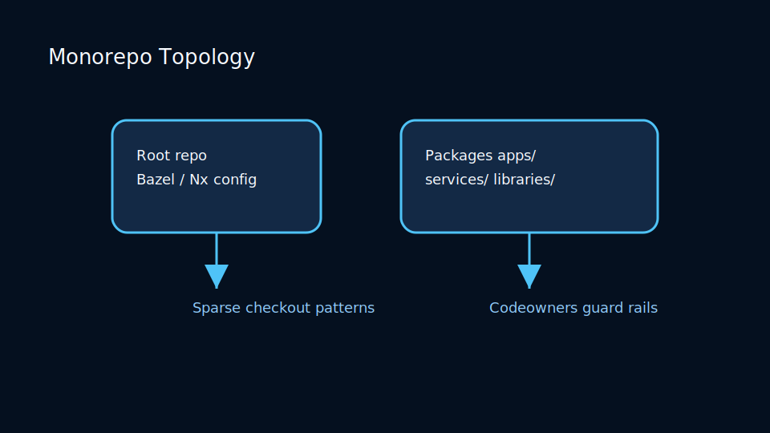
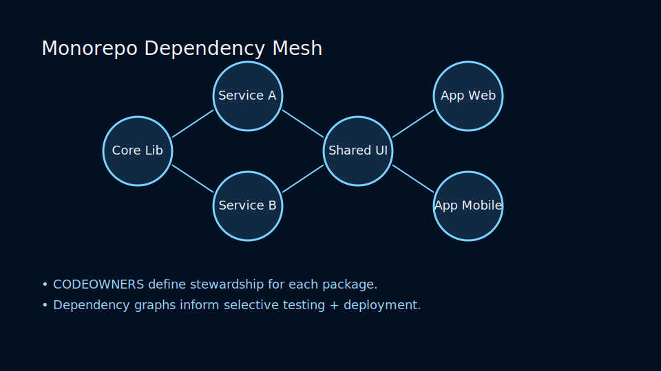
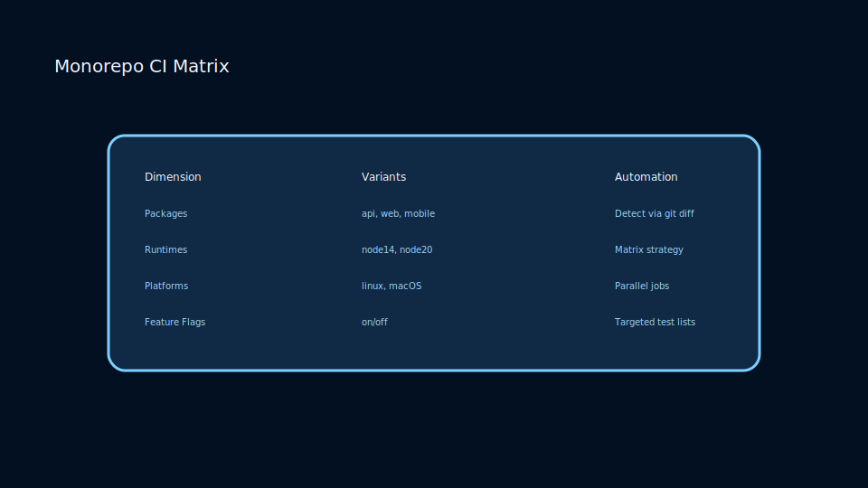

# Lesson 6.2: Monorepo Strategies, Submodules, and Subtrees

## The Monorepo Landscape

Large organizations often centralize code into a single repository with shared tooling, CI, and dependency management. Git supports this with sparse checkouts, partial clones, and architectural conventions.



## Techniques for Repository Composition

- **Submodules** – embed another repository, tracking exact commits.
- **Subtrees** – vendor code into subdirectories without extra metadata.
- **Partial Clone** – download commits on demand (`git clone --filter=blob:none`).

### Sparse Checkouts

Limit working directory footprint:

```bash
git sparse-checkout init --cone
git sparse-checkout set services/api services/web
```

### Dependency Mesh



Visualizing dependencies reduces coupling surprises:

- Ownership files (`CODEOWNERS`) clarify which teams steward directories.
- Package managers (Yarn workspaces, pnpm, Cargo) map library-to-service relationships.
- Build graphs (Bazel query, Nx dep-graph) inform impact analysis before merging.

## Trade-Offs

<!-- markdownlint-disable MD033 MD010 -->
<table>
	<thead>
		<tr>
			<th>Strategy</th>
			<th>Pros</th>
			<th>Cons</th>
		</tr>
	</thead>
	<tbody>
		<tr>
			<td>Submodules</td>
			<td>Precise dependencies</td>
			<td>Extra commands, CI complexity</td>
		</tr>
		<tr>
			<td>Subtrees</td>
			<td>Single repository</td>
			<td>History duplication</td>
		</tr>
		<tr>
			<td>Monorepo</td>
			<td>Unified tooling</td>
			<td>Requires disciplined ownership</td>
		</tr>
	</tbody>
</table>
<!-- markdownlint-enable MD033 MD010 -->

### CI Matrix Strategy



Scale automation by sharding workloads:

- Change detection pipelines run only affected packages per commit.
- Matrix builds test combinations of runtimes, platforms, and feature gates.
- Caching strategies (remote execution, shared caches) keep large builds under control.

### Practice

- Convert a multi-repo project into a monorepo trial using subtrees.
- Experiment with sparse checkout to limit clones to a single service.
- Evaluate tooling (Bazel, Nx, Pants) that thrives in monorepo environments.
