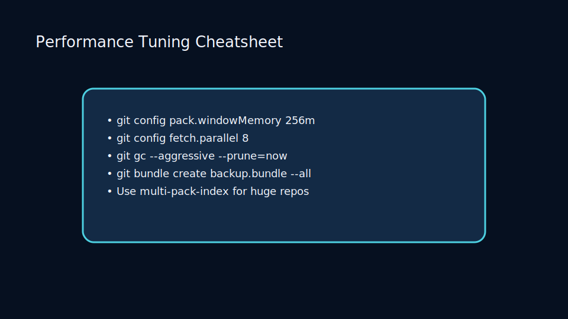
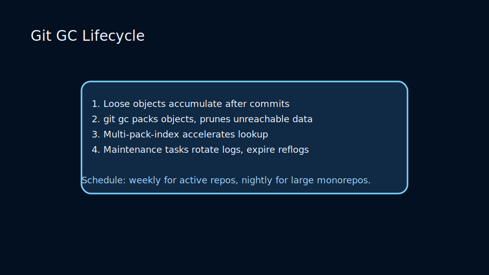
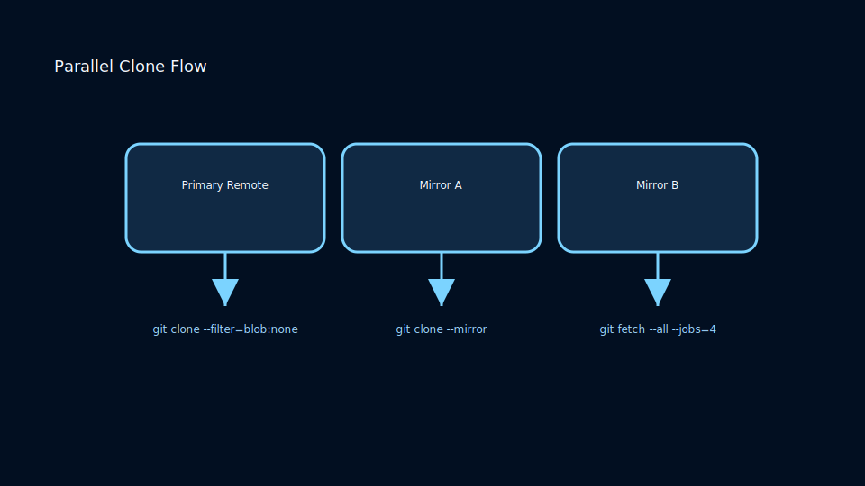

# Lesson 6.3: Scaling Git for Large Repositories and Distributed Teams

## Performance Challenges

As repositories grow, operations like clone, fetch, and status can slow down. Mitigate with smart workflows and server optimizations.

## Client Techniques

- Enable partial clones and commit graphs (`git config --global core.commitGraph true`).
- Use `git gc --aggressive` periodically to optimize object storage.
- Monitor file status using `git status --short --branch` to reduce noise.

## Server-Side Optimizations

- Run `git gc --aggressive` on bare repositories.
- Enable pack-based protocols and CDN caching for large binaries.
- Use Git alternates and mirrors to reduce network round-trips.

### Garbage Collection Lifecycle

Keep object databases lean:

- Schedule background `git gc` runs on servers after large merges or imports.
- Use `git multi-pack-index` to accelerate object lookup across packfiles.
- Monitor pack sizes and repack thresholds to avoid repository bloat.

## Distributed Team Considerations

- Mirror repositories closer to regional teams.
- Encourage shallow clones for CI (`git clone --depth=1`).
- Adopt large file storage (Git LFS) for assets that don’t delta compress well.

### Parallel Clone Flow

Accelerate onboarding and CI setup:

- Deploy Git servers with protocol v2, enabling partial fetches.
- Serve clones via multiple mirrors with geolocation routing.
- Cache dependencies and submodules to avoid repetitive downloads.

### Practice

- Benchmark clone times before and after enabling partial clones.
- Run `git count-objects -vH` to inspect repository health.
- Configure LFS for large media files and observe repository size improvements.
