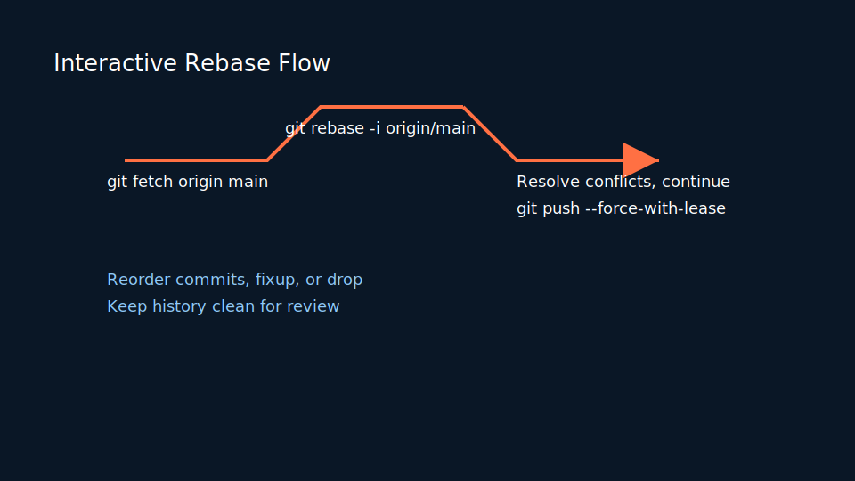
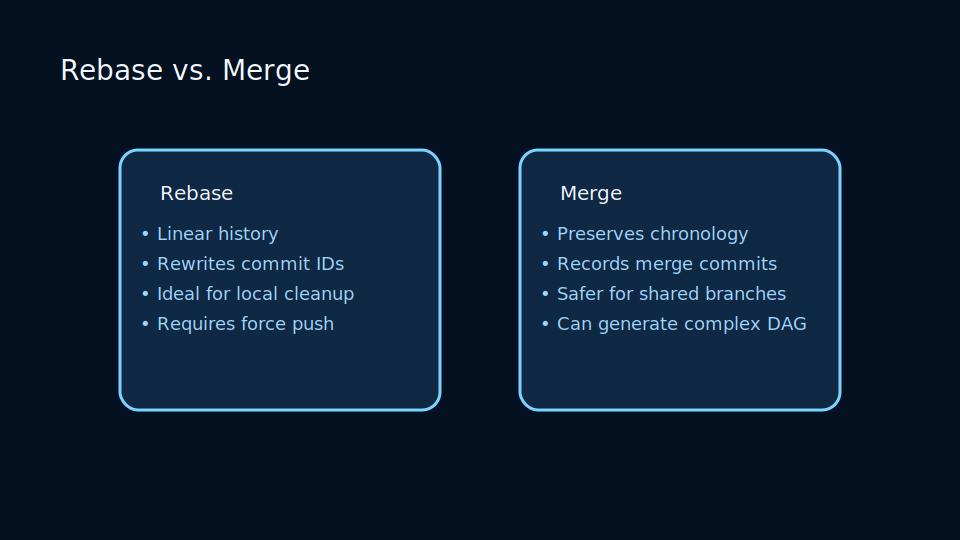
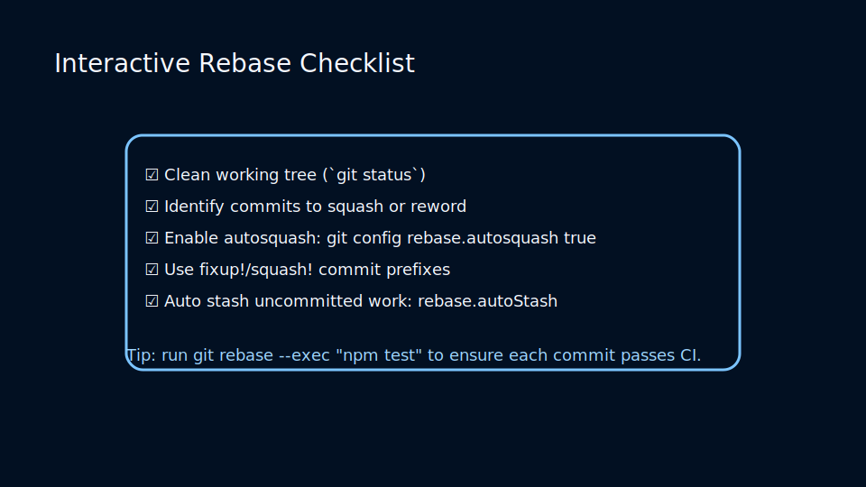

# Lesson 3.3: Interactive Rebases, Autosquashing, and Rewrite Policies

## Why Rebase?

Rebasing rewrites commit history so your work sits atop the latest upstream changes. It keeps history linear and easier to review.



### Common Rebase Flows

```bash
# Update feature branch with latest main
git fetch origin
git rebase origin/main

# Interactive rebase for clean history
git rebase -i HEAD~5
```

During an interactive rebase you can reorder commits, squash fixups, or edit messages. Use `fixup!` and `squash!` prefixes alongside `git commit --fixup` to pre-arrange autosquashing.

### Rebase vs. Merge Comparison



Understand trade-offs before rewriting history:

- Rebasing yields linear history but rewrites commit IDs; coordinate before pushing.
- Merging preserves branch context and is safer for shared integration branches.
- Hybrid flows rebase locally, then merge protected branches for auditability.

### Interactive Rebase Checklist



Prepare before running `git rebase -i`:

- Confirm branch cleanliness with `git status` and stash uncommitted work.
- Decide which commits to squash, reword, or drop ahead of time.
- Configure `rebase.autosquash` and `rebase.autoStash` to streamline workflows.

### Diagram Quick Reference

Use the accompanying visuals to reinforce each workflow before practicing:

- [Interactive Rebase Checklist](../../../../resources/git/git_interactive_rebase.svg) — revisit the staged command flow after each rehearsal.
- [Rebase vs Merge Comparison](../../../../resources/git/git_rebase_vs_merge.svg) — contrast key trade-offs when choosing strategies.
- [Rebase Flow](../../../../resources/git/git_rebase_flow.svg) — review the linearized history that results from a clean rebase.

## Policies for Safe Rewrites

- Never rebase commits that have been pushed to shared branches without coordination.
- Prefer `git pull --rebase` to avoid merge commits during daily sync if your team agrees on linear history.
- Protect long-lived branches with server-side settings that reject non-fast-forward updates.

### Practice

- Use interactive rebase to consolidate noisy commits into a narrative change set.
- Experiment with `git rebase --exec "npm test"` to run tests after each commit replay.
- Observe how reflog retains your original branch state, enabling rollback if needed.

## Advanced Patterns and Policies

Rebasing is powerful but must be governed by team policy. Use the following guidelines when setting team expectations.

### Policy Examples (HTML Table)

<!-- markdownlint-disable MD033 MD010 -->
<table>
 <thead>
  <tr>
   <th>Branch Type</th>
   <th>Allowed Rebase?</th>
   <th>Notes</th>
  </tr>
 </thead>
 <tbody>
  <tr>
   <td>Personal feature branches</td>
   <td>Yes</td>
   <td>Encourage interactive rebase for a clean PR</td>
  </tr>
  <tr>
   <td>Shared integration branches</td>
   <td>No</td>
   <td>Prefer merge commits to avoid rewriting others' work</td>
  </tr>
  <tr>
   <td>Main/release branches</td>
   <td>No</td>
   <td>Disallow force-push via server-side protections</td>
  </tr>
 </tbody>
</table>
<!-- markdownlint-enable MD033 MD010 -->

### Lab: Safe Rebase Workflow

1. Create a feature branch and make 5 commits.
2. Run `git rebase -i HEAD~5` and reorder, squash, and reword commits.
3. Push the branch to origin with `git push --force-with-lease` and inspect CI.
4. Recreate a failing scenario by attempting to rebase a branch with remote collaborators and practice `git pull --rebase` and `git rebase --abort` recovery.

### Safe Rewrite Governance Appendix

This appendix provides governance patterns, push-safe commands, and automation hooks to reduce accidental rewrite breakage.

#### Push Policies and `--force-with-lease`

Use `--force-with-lease` instead of `--force` to avoid stomping others' updates. It ensures your local view of the upstream ref is still current before allowing a force push.

```bash
# safer force push
git push --force-with-lease origin feature/my-work
```

Server-side protections:

- Configure branch protection rules to reject force pushes on `main`/`release/*`.
- Allow `--force-with-lease` for personal branches only through a bot or scoped permission.

---

#### Coordination Patterns

- Announce large history rewrites in a team channel and schedule a short freeze window for affected branches.
- Provide a fallback mirror or tag of the pre-rewrite state so users can recover easily.
- Update CI hooks to detect rewritten commit ranges and block merges until resolved.

---

#### Governance Table: Rewriting Policy Examples

<!-- markdownlint-disable MD033 MD010 -->
<table>
  <thead>
    <tr>
      <th>Context</th>
      <th>Allowed?</th>
      <th>Controls</th>
    </tr>
  </thead>
  <tbody>
    <tr>
      <td>Small personal cleanup</td>
      <td>Yes</td>
      <td>Use `--force-with-lease`; communicate on PR</td>
    </tr>
    <tr>
      <td>Large-scale history rewrite</td>
      <td>Only with approval</td>
      <td>Plan, tag pre-rewrite mirror, and notify all teams</td>
    </tr>
    <tr>
      <td>Release branch</td>
      <td>No</td>
      <td>Server-side protection; use revert commits</td>
    </tr>
  </tbody>
</table>
<!-- markdownlint-enable MD033 MD010 -->

---

#### Exercises

1. Practice `--force-with-lease` and simulate a race condition where someone pushes another commit between your fetch and push.
2. Plan and document a hypothetical large-scale history rewrite and the roll-forward/rollback plan.
3. Implement a CI hook that warns on force pushes to `main` and creates an incident ticket for manual review.

---

## Rebase Automation & Governance Patterns

This appendix discusses rebase automation, safe lease workflows, and coordination tooling.

### Automating Safe Rebases

- Use `--force-with-lease` with an explicit lease ref to avoid stomping: `git push --force-with-lease=origin/main:refs/heads/main`.
- Provide a bot-driven rebase that rebases a PR onto the latest main, runs CI, and reports back rather than forcing author pushes.

---

### Example: Rebase Bot Flow (conceptual)

1. Bot fetches PR branch and rebases onto `origin/main` locally.
2. Bot runs a test matrix on the rebased preview commit.
3. If CI passes, bot pushes the rebased branch back with `--force-with-lease` or opens a fresh PR for human merge depending on policy.

---

### Exercises

1. Simulate a rebase bot by writing a small script that rebases a branch and runs unit tests.
2. Create a failure scenario and practice recovery via `git rebase --abort` and `git reflog`.

<!-- markdownlint-disable MD033 MD010 -->

## Rebase Case Studies & Templates

This appendix collects real-world case studies and template communications to coordinate rewrites and rebases with minimal disruption.

### Case Study: Cleaning a Long-Lived Feature Branch

Scenario: a long-running feature branch accumulated 120 small WIP commits. The team wants a clean PR.

Steps:

1. Create a clone and run an interactive rebase in small batches (e.g., `git rebase -i HEAD~30` repeatedly) to avoid massive replays.
2. Use `git commit --fixup=<sha>` and `git rebase -i --autosquash` to automatically fold trivial fixes into original commits.
3. Run full test matrix on the cleaned branch before pushing.
4. Push using `--force-with-lease` and inform reviewers and integrators via the PR comment template.

### PR Communication Template (for rebase)

```text
We performed an interactive rebase to tidy the commit history for this PR.
Summary of actions:
- Squashed trivial WIP commits
- Reworded messages for clarity
- Verified tests locally and in CI
If you had a local checkout of this branch, run:
  git fetch origin
  git checkout feature/branch
  git reset --hard origin/feature/branch
```

---

### Workshop Exercise: Safe, Large-Scale Rebase

1. Simulate a 50-commit feature branch in a sandbox and practice iterative `rebase -i` runs.
2. Use `git reflog` to demonstrate rollback paths and recovery.
3. Evaluate the effect on code review diffs and discuss tradeoffs.

<!-- markdownlint-enable MD033 MD010 -->

## Rebase governance and conflict-resolution playbook

Rebasing keeps history linear and tidy, but it rewrites commits which impacts shared branches. Define when rebases are allowed and provide clear conflict-resolution guidance.

### Governance: when to rebase

- Allowed on feature branches before merge if the team agrees and contributors are informed.
- Discouraged on release branches or `main` unless part of a coordinated rewrite with a migration plan.
- Use `--force-with-lease` for allowed force-pushes to avoid clobbering unrelated updates.

### Rebase conflict resolution steps

1. Run `git rebase --interactive` and follow the plan to squash or reorder commits.
2. When a conflict occurs, inspect changed files and run `git status` to see conflict markers.
3. Resolve the conflict locally, run unit tests if applicable, then `git add <file>` and `git rebase --continue`.
4. If rebase becomes complex, abort with `git rebase --abort` and consider an alternate strategy such as a merge commit or breaking the rebase into smaller steps.

### Example: rebase onto a new base branch

```bash
# move a feature branch onto the tip of main
git fetch origin
git checkout feature/awesome
git rebase --onto origin/main base-commit feature/awesome
```

### Rebase bot: automated rebase for active PRs (concept)

A rebase bot can keep PRs up-to-date with the base branch by periodically rebasing and pushing with `--force-with-lease` when the rebase is fast-forwardable or with minimal conflicts.

Pseudo-implementation:

```bash
#!/usr/bin/env bash
set -euo pipefail
PR_BRANCH="$1"
BASE="origin/main"

git fetch origin
git checkout "$PR_BRANCH"
if git rebase "$BASE"; then
  git push --force-with-lease origin "$PR_BRANCH"
else
  echo "Rebase produced conflicts; creating a comment on PR for manual intervention"
  # post to GitHub API to notify author
fi
```

### Merge vs Rebase decision matrix (HTML table)

<!-- markdownlint-disable MD033 MD010 -->
<table>
  <thead>
    <tr><th>Scenario</th><th>Prefer</th><th>Rationale</th></tr>
  </thead>
  <tbody>
    <tr><td>Open-source contributions</td><td>Merge (preserve history)</td><td>Preserve contributor identity and easier backtracking</td></tr>
    <tr><td>Internal feature branches</td><td>Rebase (clean history)</td><td>Linear history is easier to read and bisect</td></tr>
    <tr><td>Large refactor touching many files</td><td>Merge</td><td>Avoid repeated conflicts for other branches</td></tr>
    <tr><td>Small feature updates</td><td>Rebase and squash</td><td>Keeps main history concise</td></tr>
  </tbody>
</table>
<!-- markdownlint-enable MD033 MD010 -->

## Exercises: Rebase Practice

1. Simulate a rebase conflict, resolve it, and document the steps you used to reach a clean state.
2. Implement the `safe-rebase` helper and test it across several simple feature branches.
3. Practice creating `fixup!` commits and run an autosquash interactive rebase to observe the results.

---

## Operational Playbooks and Scripts (continued)

This section contains compact, copy-paste-ready playbooks and scripts you can adapt. They're intentionally short and actionable.

### Playbook: coordinated large rewrite

1. Announce the window and request authors to freeze relevant branches.
2. Create a backup bundle and tag: `git bundle create before-rewrite.bundle --all` and `git tag before-rewrite-$(date +%F)`.
3. Run rewrite in a staging mirror and run your full CI against the mirror.
4. Produce a mapping file for tags/branch names and publish consumer instructions.
5. Cutover during the window, validate mirrors, and monitor telemetry for client errors.

### Script: create a migration mapping file (example)

```bash
#!/usr/bin/env bash
set -euo pipefail
OUT=tag-map.csv
echo "old-tag,new-tag" > "$OUT"
for t in $(git tag --list); do
  # example mapping: append -migrated
  echo "$t,${t}-migrated" >> "$OUT"
done
echo "Wrote $OUT"
```

### Playbook: secret removal outline (safe)

+- Identify commits with secrets using `git log --pretty=oneline | xargs -n1 git grep --line-number --break --heading 'secretpattern'` in a mirror.
+- Use `git filter-repo` with a tested rule to remove blobs.
+- Verify no secrets remain with a fresh clone and the scanning tool.
+- Publish migration steps and rotate any credentials that may have leaked.

### Lightweight monitoring snippet (bash)

This snippet shows how to detect force-push events from server hooks and write a simple log entry.

```bash
#!/usr/bin/env bash
while read old new ref; do
  if [[ "$ref" =~ refs/heads/ ]]; then
    branch=$(basename "$ref")
    if ! git merge-base --is-ancestor "$old" "$new"; then
      echo "$(date --iso-8601=seconds) FORCE_PUSH repo=$GIT_DIR branch=$branch old=$old new=$new actor=$GIT_PUSHER_NAME" >> /var/log/git-force-push.log
    fi
  fi
done
```


## Appendix: Rebase Automation & Recovery (Operational)

This operational appendix provides ready-to-use scripts, monitoring snippets, governance matrices, and exercises to make rebasing safe at team scale.

### Safe-rebase helper (full example)

A safe wrapper that fetches the base, tries a rebase, runs quick checks, and pushes a preview if there are conflicts.

```bash
#!/usr/bin/env bash
set -euo pipefail
BASE=${1:-origin/main}
BRANCH=${2:-$(git rev-parse --abbrev-ref HEAD)}
PREVIEW="preview/${BRANCH}"

echo "Fetching $BASE..."
git fetch origin --quiet

echo "Creating preview branch $PREVIEW from $BRANCH"
git checkout -B "$PREVIEW" "origin/$BRANCH"

echo "Attempting rebase onto $BASE"
if git rebase "$BASE"; then
  echo "Rebase succeeded; running quick tests"
  # run a small fast test suite if available
  if command -v npm >/dev/null; then
    (npm test --silent || true)
  fi
  echo "Pushing preview branch"
  git push --force-with-lease origin "$PREVIEW"
  echo "Preview pushed: preview/$BRANCH"
else
  echo "Rebase failed; aborting and notifying maintainer"
  git rebase --abort || true
  # fail but leave the preview for manual inspection
  exit 2
fi
```

### Autosquash & fixup workflow (cheat sheet)

1. Make an original commit: `git commit -m "feat: add X"`
2. Later, create a fixup: `git commit --fixup=<sha>` or `git commit --fixup=HEAD~1`
3. Run interactive rebase with autosquash: `git rebase -i --autosquash <base>`

Example:

```bash
# create fixup commits
git commit --fixup=HEAD~2
# then
git rebase -i --autosquash origin/main
```

### Rebase conflict resolution recipe

- When a conflict occurs during rebase:
  1. Inspect conflict markers in files: `git status` and open files.
  2. Resolve the conflict locally and `git add <file>`.
  3. Continue the rebase: `git rebase --continue`.
  4. If overwhelmed, abort: `git rebase --abort` and consider an alternate plan (merge or smaller rebase chunks).

### Reflog-based recovery (quick commands)

If you force-pushed and need to recover a prior tip, use the reflog or a safety tag.

```bash
# find recent updates
git reflog show --date=iso | head -n 200
# create safety tag
git tag safety/before-rewrite <old-sha>
# restore branch to old tip locally
git checkout -B recovered <old-sha>
```

### Monitoring & auditing forced updates

Use a server-side pre-receive hook or an audit hook to log forced updates and optionally trigger alerts.

```bash
#!/usr/bin/env bash
# pre-receive hook snippet: log forced updates
while read old new ref; do
  if [[ "$ref" =~ refs/heads/ ]]; then
    branch=$(basename "$ref")
    if ! git merge-base --is-ancestor "$old" "$new"; then
      echo "$(date --iso-8601=seconds) FORCE_PUSH repo=$GIT_DIR branch=$branch old=$old new=$new pusher=$GIT_PUSHER_NAME" >> /var/log/git-force-push.log
    fi
  fi
done
```

### Rebase Bot: preview PR flow (full example)

This flow rebases the PR branch into a preview namespace and leaves authors' branches untouched. It's safe for CI and review.

```bash
#!/usr/bin/env bash
set -euo pipefail
PR_NUMBER=$1
REPO_SLUG=${2:-$(git remote get-url origin | sed -E 's#.*/(.*)\.git#\1#')}
PR_BRANCH=$(gh pr view "$PR_NUMBER" --json headRefName -q .headRefName)
PREVIEW="preview/${PR_BRANCH}"
UPSTREAM=origin

git fetch origin --quiet
if git show-ref --quiet refs/heads/$PR_BRANCH; then
  git checkout -B "$PREVIEW" origin/$PR_BRANCH
else
  git checkout -b "$PREVIEW" origin/$PR_BRANCH
fi

if git rebase $UPSTREAM/main; then
  git push --force-with-lease origin "$PREVIEW"
  gh pr comment "$PR_NUMBER" --body "Preview branch created: https://github.com/${REPO_SLUG}/tree/$PREVIEW"
else
  git rebase --abort
  gh pr comment "$PR_NUMBER" --body "Preview generation failed due to conflicts. Please rebase or resolve locally."
  exit 1
fi
```

### Governance matrix (HTML)

<!-- markdownlint-disable MD033 MD010 -->
<table>
  <thead>
    <tr><th>Action</th><th>Allowed?</th><th>Controls / Notes</th></tr>
  </thead>
  <tbody>
    <tr><td>Interactive rebase on personal branch</td><td>Yes</td><td>Encourage, use `--force-with-lease`, advise preview flow for complex changes</td></tr>
    <tr><td>Force push to `main` or `release/*`</td><td>No</td><td>Server-side reject; require documented approval and migration plan</td></tr>
    <tr><td>Filter-repo / large rewrite</td><td>Only with approval</td><td>Perform in staging, provide tag mapping, preserve backups</td></tr>
  </tbody>
</table>
<!-- markdownlint-enable MD033 MD010 -->

### Migration & filter-repo checklist

1. Create a mirror: `git clone --mirror git@host:org/repo.git mirror.git`.
2. Run `git filter-repo` with tested rules (path whitelist or blob purging).
3. Verify rewrites in staging and generate a tag mapping CSV.
4. Publish migration instructions and schedule a consumer update window.

### Exercises (advanced)

1. Implement the preview rebase bot as an Action or scheduled job. Test on a sandbox PR and ensure it posts preview links.
2. Create a monitoring dashboard from the forced-push audit log and alert if protected branches receive force updates.
3. Run a simulated filter-repo rewrite in a mirror and produce a tag map and consumer migration document.

---

End of Rebase Automation & Recovery Appendix.
