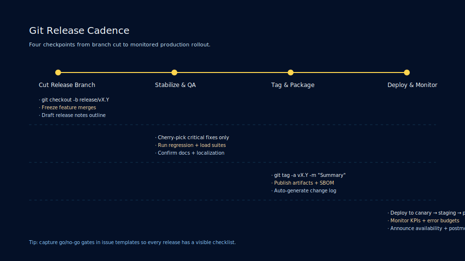
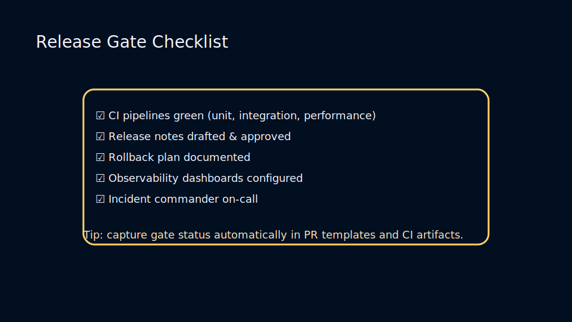
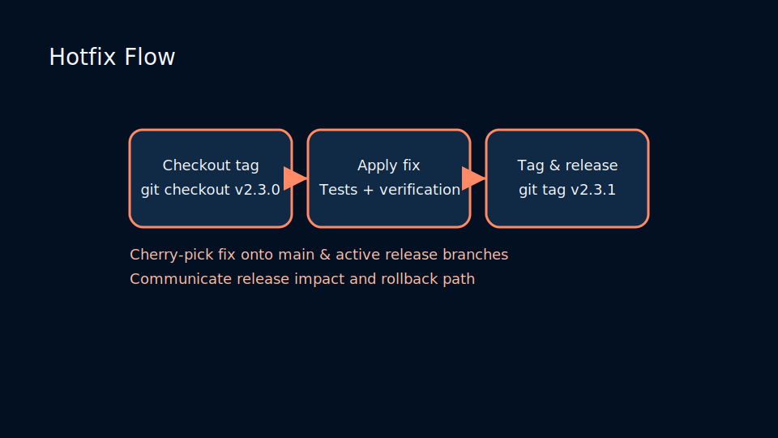

# Lesson 4.3: Tags, Release Branches, and Backporting

## Release Tagging Strategy

Tags mark immutable points in history. Annotated tags capture release notes, authors, and signatures.

```bash
git tag -a v2.3.0 -m "Release 2.3.0"
git push origin v2.3.0
```



## Managing Release Branches

- Create stabilization branches for regression fixes while mainline work continues.
- Backport bug fixes with `git cherry-pick`.
- Document version policies (semantic versioning, calendar releases) in `CONTRIBUTING.md`.

## Hotfix Workflow

1. Branch from the latest release tag.
2. Apply urgent fixes.
3. Tag and ship.
4. Merge hotfix back into main and other active release branches.

### Release Gate Checklist



Before shipping, ensure:

- Test suites (unit, integration, smoke) pass consistently.
- Release notes summarize changes, risks, and rollback steps.
- Observability dashboards and incident response owners are on-call.

### Hotfix Flow



Coordinate urgent patches without losing track:

- Branch from the released tag to isolate the fix.
- Cherry-pick into active release and mainline branches after verification.
- Tag patched versions with suffixes (`v2.3.0-hotfix.1`) for traceability.

### Practice

- Create annotated and lightweight tags, inspect metadata with `git show`.
- Simulate backporting a fix to multiple release branches.
- Generate release notes by combining `git log` with commit message conventions.
