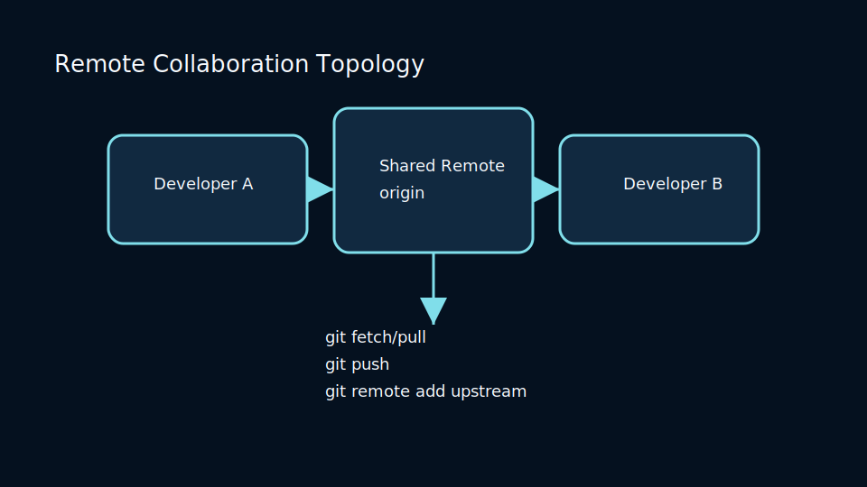
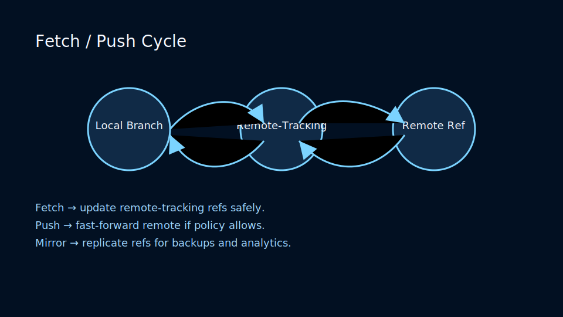
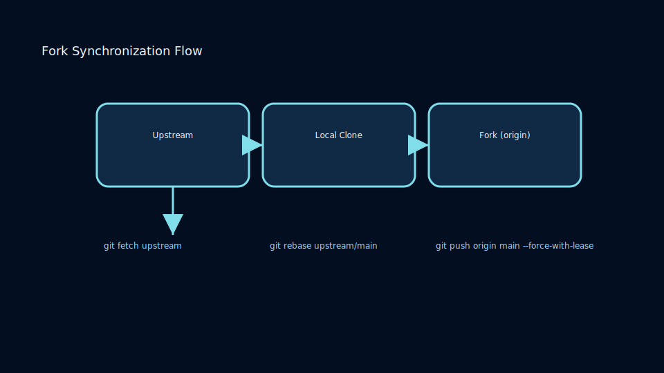

# Lesson 4.1: Remotes, Fetching, Pulling, and Upstream Hygiene

## Remote Fundamentals

Remotes define where you exchange commits. Each remote is a shortcut to a URL plus tracked branches.

```bash
git remote -v
origin  git@github.com:org/app.git (fetch)
origin  git@github.com:org/app.git (push)
```



Add upstream remotes to stay aligned with canonical repositories:

```bash
git remote add upstream git@github.com:parent/app.git
```

## Fetch vs Pull

- `git fetch` downloads new objects without touching your working tree.
- `git pull` combines fetch + merge (or rebase) into your current branch.

Always fetch before complex merges to inspect remote changes.

### Fetch and Push Cycle



Clarify how refs travel between clones:

- Fetch updates `refs/remotes/origin/*` without touching local branches.
- Push attempts to fast-forward remote refs; policies may reject force pushes.
- Mirror repositories replicate refs for read-only CI or analytics mirrors.

## Keeping Remotes Clean

- Use `git remote prune origin` to delete stale remote-tracking branches.
- Configure `fetch.prune` to true for automatic cleanup.
- Leverage `git remote set-url` when rotating credentials or migrating hosting providers.

### Fork Synchronization Flow



Maintain forks without drift:

- Track both `origin` (your fork) and `upstream` (canonical repository).
- Use `git fetch upstream` and `git rebase upstream/main` to stay current.
- Push rebased branches to `origin` before opening pull requests.

### Practice

- Configure push URLs for read-only upstream fetch, write-only fork pushes.
- Compare `git fetch --all` vs targeted fetches to large repositories.
- Visualize remote tracking branches with `git branch -r` and `git branch -vv`.
