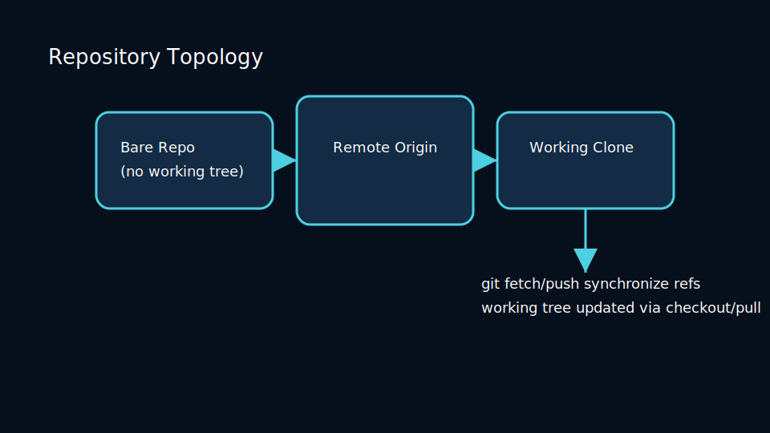
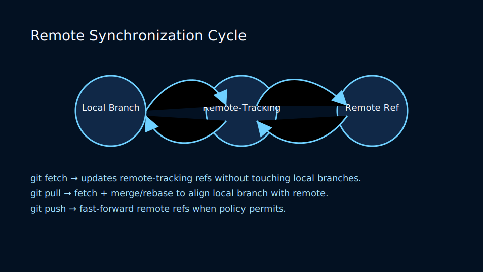
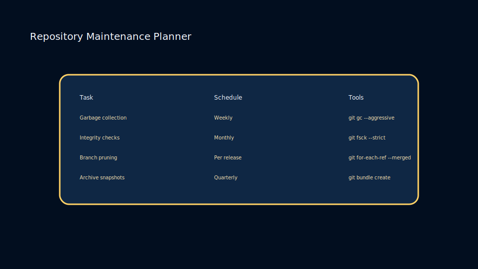

# Lesson 2.1: Initializing, Cloning, and Structuring Repositories

## Choosing the Right Start

Git workflows usually begin with either `git init` or `git clone`.

- `git init` bootstraps an empty repository with a new `.git` directory.
- `git clone <url>` copies an existing history, including branches and tags.



When initializing, consider `.gitignore` templates, default branches (`git symbolic-ref HEAD refs/heads/main`), and repository scaffolding.

## Repository Layout Best Practices

## Managing Remotes

Each clone begins with an `origin` remote. Additional remotes facilitate upstream contributions.

```bash

### Remote Synchronization Cycle



Synchronization hinges on references and fetch specs:

- `git fetch` updates remote-tracking branches without altering local work.
- `git push` advances destination refs, subject to fast-forward policies.
- Mirror remotes (`--mirror`) replicate both refs and tags for disaster recovery.

### Maintenance Planner



Healthy repositories follow recurring tasks:

- Run `git fsck` and `git gc` in scheduled jobs to detect corruption early.
- Prune stale branches using policies tied to review tools and deployment cadence.
- Archive long-lived refs into bundles to keep active repositories lean.
git remote add upstream git@github.com:org/project.git
git fetch upstream
```

Use `git remote set-url` to swap protocols (HTTPS ↔ SSH) and `git remote prune` to delete stale references.

## Practice

- Initialize a repository with a starter README, `.gitignore`, and license file.
- Clone a remote repository using both SSH and HTTPS to compare credential flows.
- Add a secondary remote and examine how `git remote -v` reflects it.
