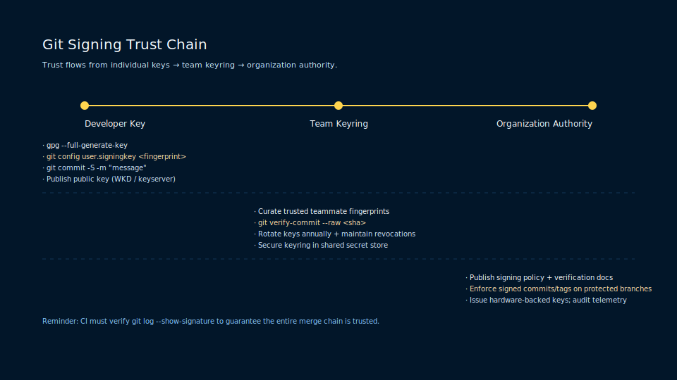
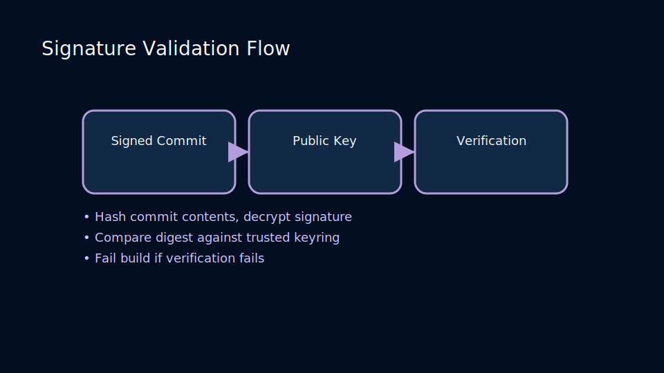
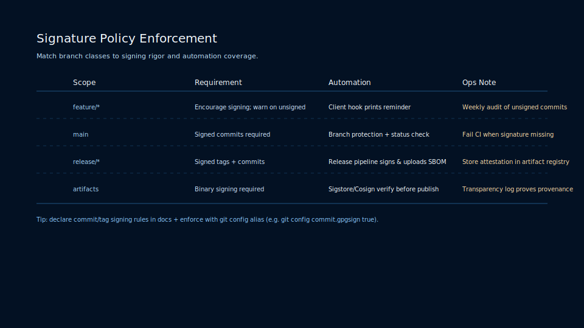

# Lesson 5.3: Commit Signing, Verified Releases, and Supply Chain Trust

## Why Signing Matters

Signed commits and tags provide a verifiable trust chain, ensuring releases originate from authorized maintainers.



### Generating Keys

- GPG: `gpg --full-generate-key`
- SSH signing (Git 2.34+): `ssh-keygen -t ed25519 -C "signing key"`

Configure Git to sign automatically:

```bash
git config --global user.signingkey <key-id>
git config --global commit.gpgsign true
git config --global tag.gpgsign true
```

## Verifying Signatures

- `git log --show-signature`
- Hosting platforms display verified badges when signatures match uploaded keys.

### Signature Validation Flow



Understand verification end-to-end:

- Git computes commit hashes, decrypts signatures, and compares against trusted public keys.
- GPG or SSH agents manage private keys; store them securely with passphrases or hardware tokens.
- CI pipelines can fail builds when commits or tags lack valid signatures.

## Protecting the Supply Chain

- Enforce signed commits via branch protection rules.
- Rotate keys periodically and maintain revocation lists.
- Combine signing with release artifact checksums and SBOMs.

### Policy Enforcement Matrix



Balance velocity and assurance:

- Development branches may allow unsigned commits with daily audits.
- Main and release branches should require signatures and verified statuses.
- Artifact signing extends trust to binaries using tools like Sigstore or Cosign.

### Practice

- Generate a signing key and configure Git to use it.
- Sign a commit and verify on a remote hosting platform.
- Audit repository settings to enforce signed tags for releases.
