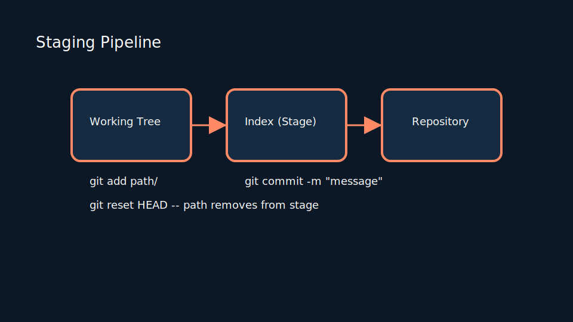
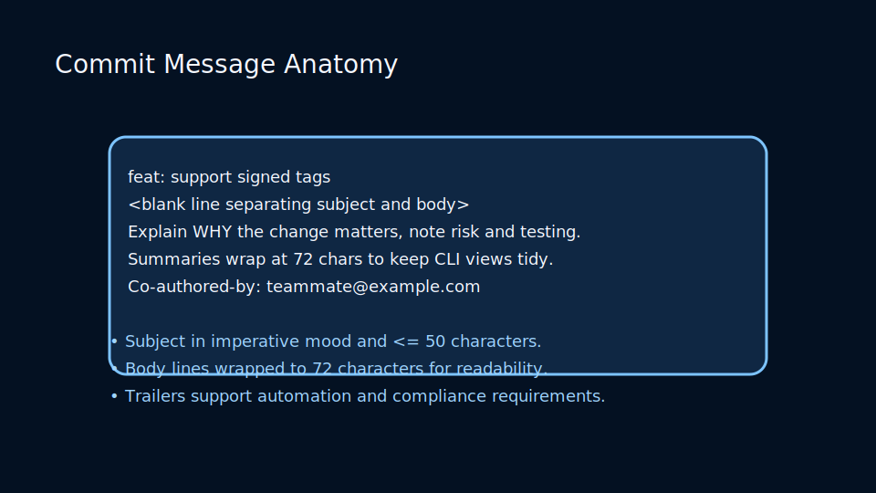
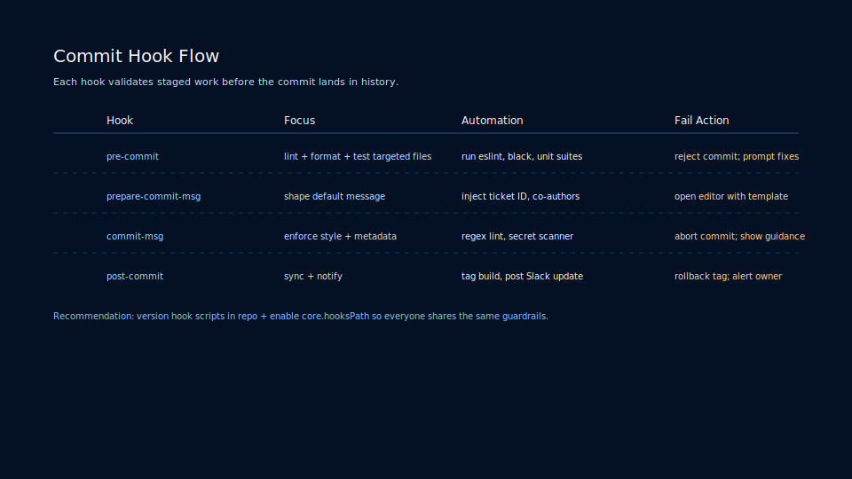

# Lesson 2.2: Staging Strategies, Clean Commits, and Hooks

## The Purpose of the Staging Area

The staging area (index) lets you curate exactly what enters the next commit. It supports selective staging via `git add --patch`, partial files, and commit granularity that tells a coherent story.

### Common Staging Commands

<!-- markdownlint-disable MD033 MD010 -->
<table>
	<thead>
		<tr>
			<th>Command</th>
			<th>Description</th>
		</tr>
	</thead>
	<tbody>
		<tr>
			<td><code>git add &lt;file&gt;</code></td>
			<td>Stage entire file</td>
		</tr>
		<tr>
			<td><code>git add -p</code></td>
			<td>Interactively stage hunks</td>
		</tr>
		<tr>
			<td><code>git restore --staged &lt;file&gt;</code></td>
			<td>Unstage changes</td>
		</tr>
		<tr>
			<td><code>git commit --amend</code></td>
			<td>Amend last commit (careful on shared branches)</td>
		</tr>
	</tbody>
</table>
<!-- markdownlint-enable MD033 MD010 -->

### Commit Message Anatomy

Craft clear history by structuring commits:

- Subjects summarize intent in the imperative mood and stay under 50 characters.
- Bodies explain motivation, context, and follow-up steps wrapped to 72 characters.
- Trailers (`Co-authored-by`, `Refs`) automate attribution and workflow hooks.

### Hook Execution Flow

Client-side hooks execute in sequence before a commit succeeds:

- `pre-commit` validates staged content (lint, type-check, secret scan).
- `prepare-commit-msg` seeds templates or ensures ticket references.
- `commit-msg` enforces final message shape before the commit is recorded.

## Writing Excellent Commit Messages

Follow the seven rules from Chris Beams:

1. Separate subject from body with a blank line.
2. Limit subject to 50 characters.
3. Capitalize subject line.
4. Do not end subject with a period.
5. Use imperative mood.
6. Wrap body at 72 characters.
7. Explain what and why, not how.

## Client-Side Hooks

Git runs hooks during lifecycle events. Popular ones:

- `pre-commit`: lint or format code.
- `prepare-commit-msg`: inject templates or metadata.
- `commit-msg`: enforce message standards.

Install using tools like Husky or Lefthook for polyglot teams.

### Lab

- Stage partial changes with `git add -p` and confirm using `git diff --staged`.
- Configure a `pre-commit` hook that blocks commits when tests fail.
- Practice amending commits before pushing to shared remotes.
