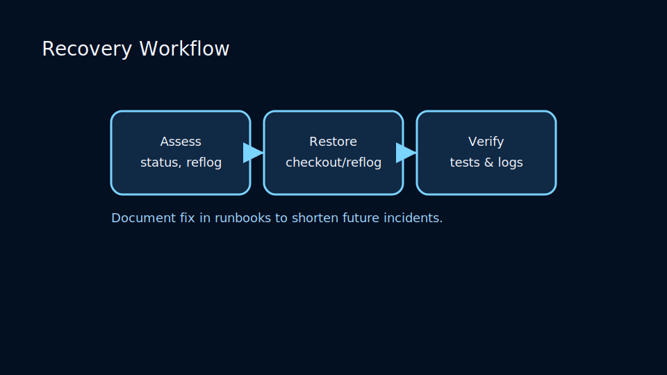
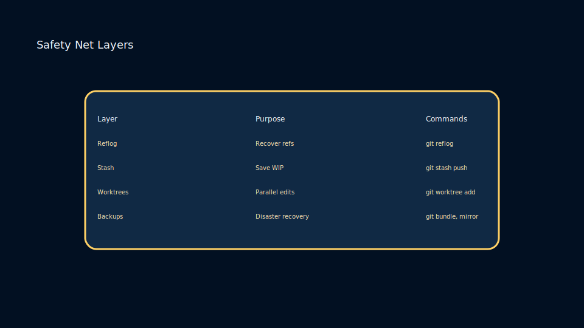

# Lesson 5.2: Reflog, Stash, and Disaster Recovery Playbooks

## Reflog – Your Safety Net

Reflog records movements of HEAD and branch tips even when commits are orphaned. Use it to recover lost work:

```bash
git reflog
git checkout HEAD@{3}
```


## Stashing Work in Progress

`git stash` saves unfinished changes without committing:

```bash
git stash push -m "WIP: refactor auth"
git stash list
git stash apply stash@{0}
```

Use `git stash --keep-index` to stage subset changes while stashing the rest.

### Recovery Workflow



Respond methodically when something breaks:

- Audit the situation with `git status`, reflog entries, and remote state.
- Determine if the fix is a checkout, merge, or cherry-pick from historical commits.
- Record remediation steps in runbooks to shorten future recovery times.

## Disaster Scenarios

- **Accidental Reset** – restore with `git reflog`.
- **Force Push Overwrite** – fetch remote reflogs or coordinate with teammates.
- **Corrupted Repository** – verify with `git fsck`, recover from backups.

### Safety Net Layers



Layer safeguards to minimize data loss:

- Reflogs capture local history movements for 90+ days.
- Stashes and worktrees isolate experiments without polluting main branches.
- Remote backups and bundles ensure bare clones can be restored quickly.

### Practice

- Simulate losing commits with `git reset --hard` and recover via reflog.
- Stash multiple contexts and apply them selectively.
- Use `git fsck` to detect dangling commits and bring them back with `git show <sha>`.
